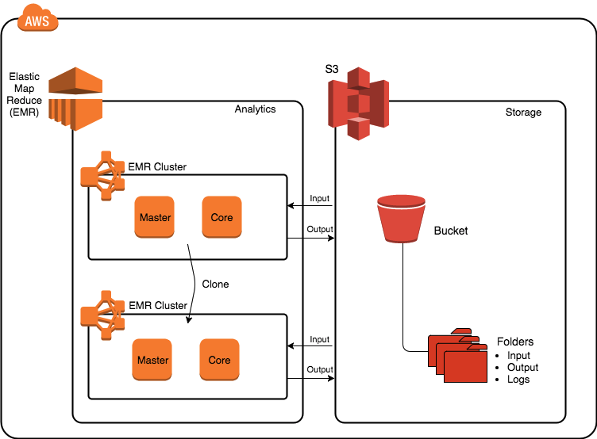
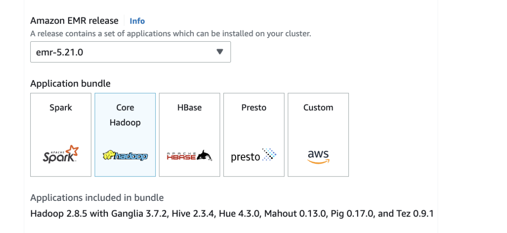

## Links

Architecture

# Steps

Create bucker

Create EMR Cluster

Add Step

Name: Enter AWS Hive example to process CF logs

Script S3 location: s3://us-west-2.elasticmapreduce.samples/cloudfront/code/Hive_CloudFront.q

Input S3 location: s3://us-west-2.elasticmapreduce.samples

Output S3 location: s3://mybucketemr-xxxx/output/ (Don't forget to include the number that makes your S3 bucket unique, and the trailing "output/" folder of the bucket.)

Arguments: -hiveconf hive.support.sql11.reserved.keywords=false

Action on failure: Select Continue (If the processing fails continuing will allow basic debugging, reconfiguration, and additional attempts.)

View Results

