# LAB - Despliegue de una aplicación con ASG y ALB

En este laboratorio crearemos una web con contenedores con un balanceador de carga y un grupo de autoescalado.

## Creación del Launch Template

* Desde EC2 lanza un Launch Template y dale nombre

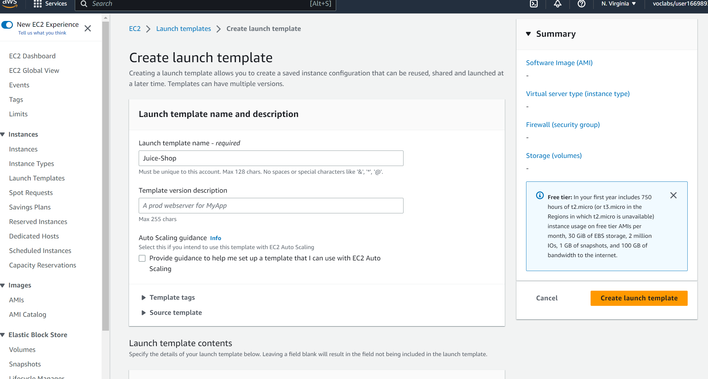

* Elige una AMI Linux 2023

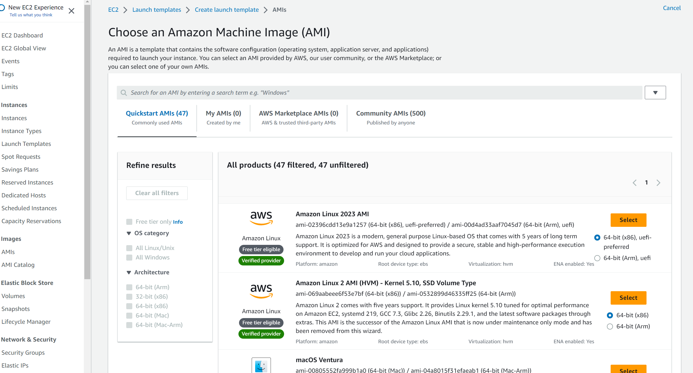

* Elige un tipo de instancia t2.micro que es capa gratuita

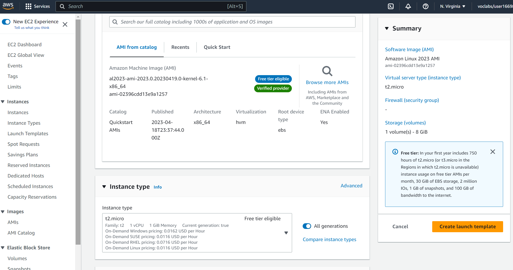

* Elige SGALB para las máquinas que lance el Launch Template, no elegimos red, lo haremos en las opciones del ASG

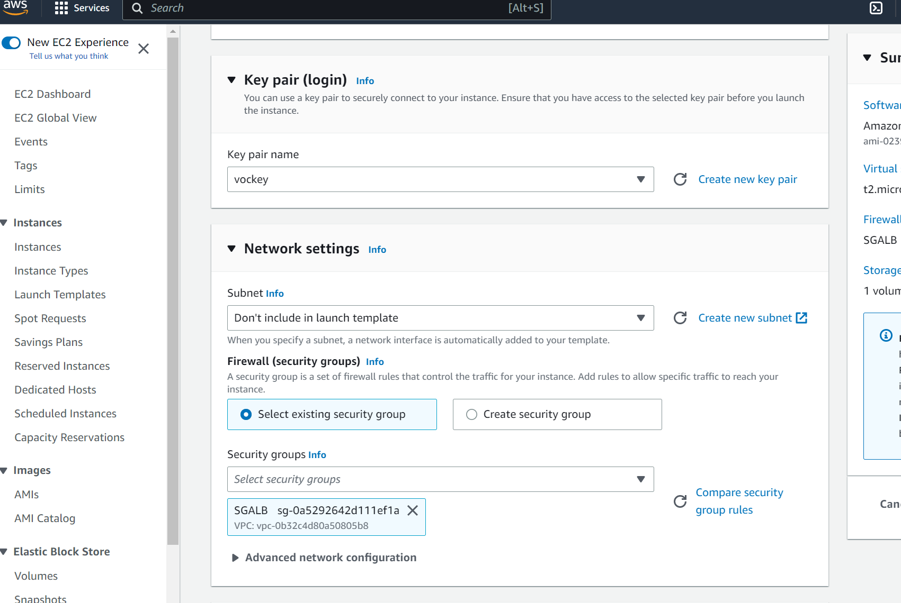

* En opciones avanzadas edita el user data y agrega el siguiente código.

```bash
#!/bin/bash 
sudo dnf update -y 
sudo dnf install -y docker 
service docker start 
systemctl enable docker.service
docker pull santospardos/upc:juiceshop
docker run -d -p 80:3000 santospardos/upc:juiceshop
```


## Crea el balanceador ASG

* Desde el menú EC2 en la parte inferior elegimos ASG y creamos uno

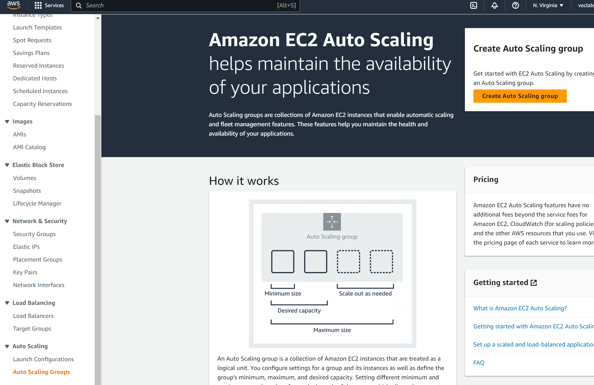


* Le damos nombre y elegimos la Launch Template que hemos creado antes

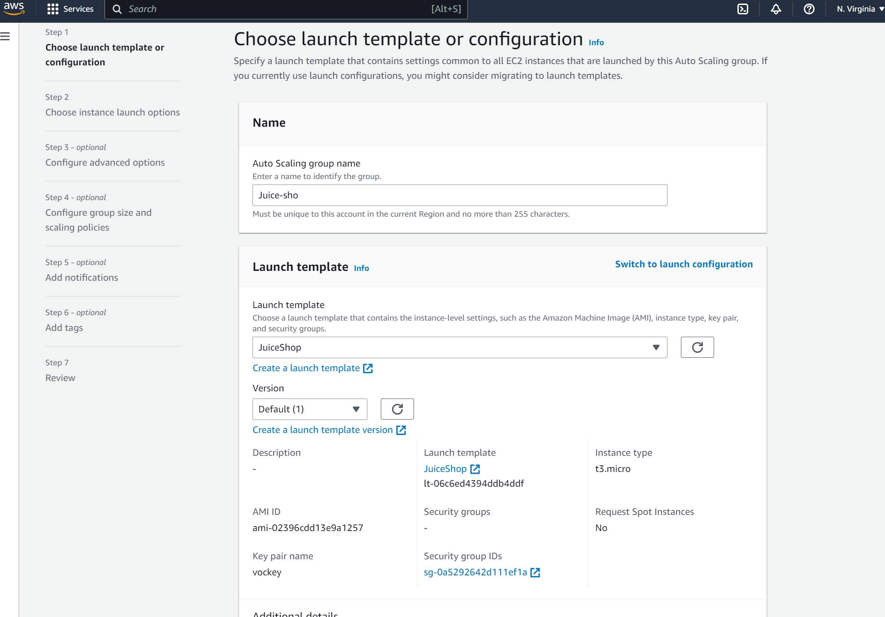


* Elegimos el VPC y las redes en donde se podrán lanzar EC2, en este caso todas AZ.

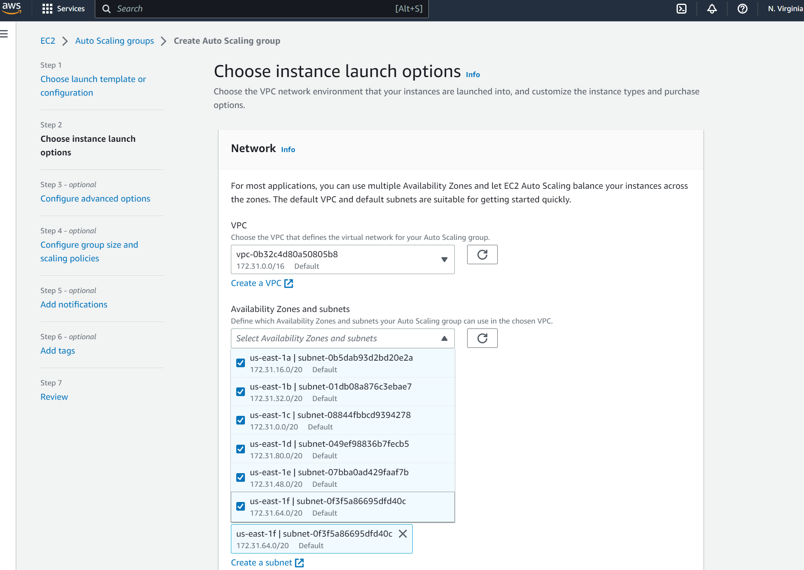


* Elegimos crear un ALB nuevo y que tenga salida a internet (internet-facing)

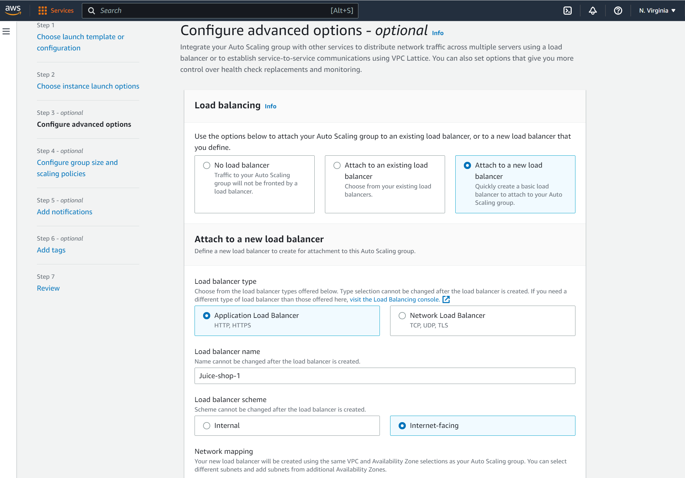


* Eligimos crear un Target Group, lo renombrará utomáticamente, y meterá todas las instancias que cree el ASG en este TG

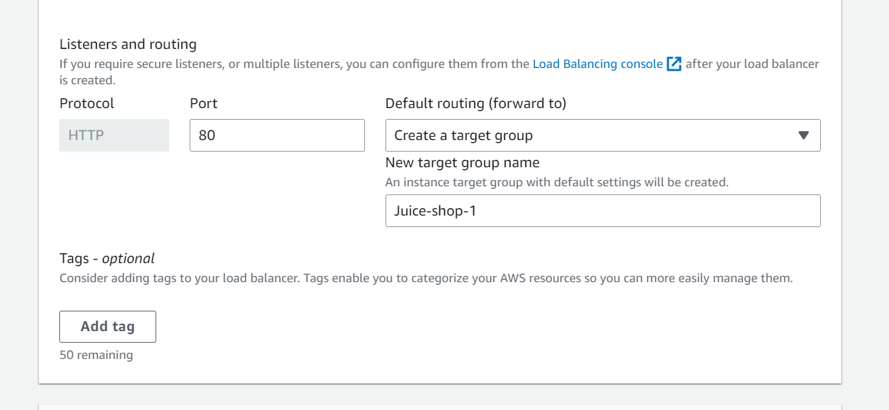


* Configuramos las opciones de tamaño de grupo

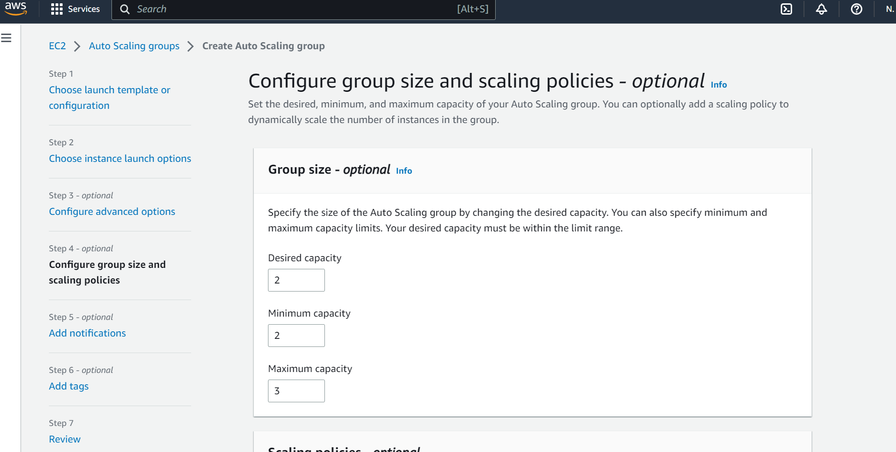


* Elegimos una politica de autoescalado. En este caso promedio de CPU y lo dejamos en 50%

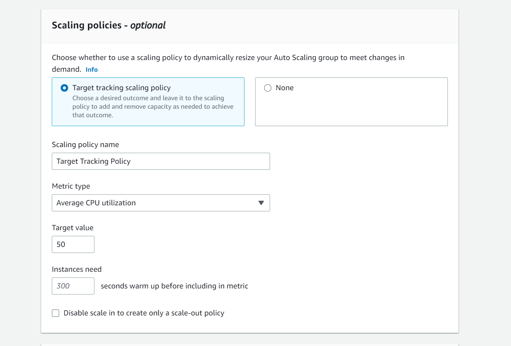


* No añadimos notificación por SNS


* Agregamos una etiqueta para facturación

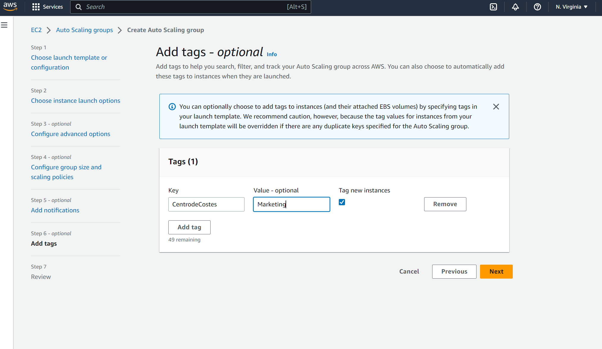


* Revisamos la configuraicón y le damos crear el ASG

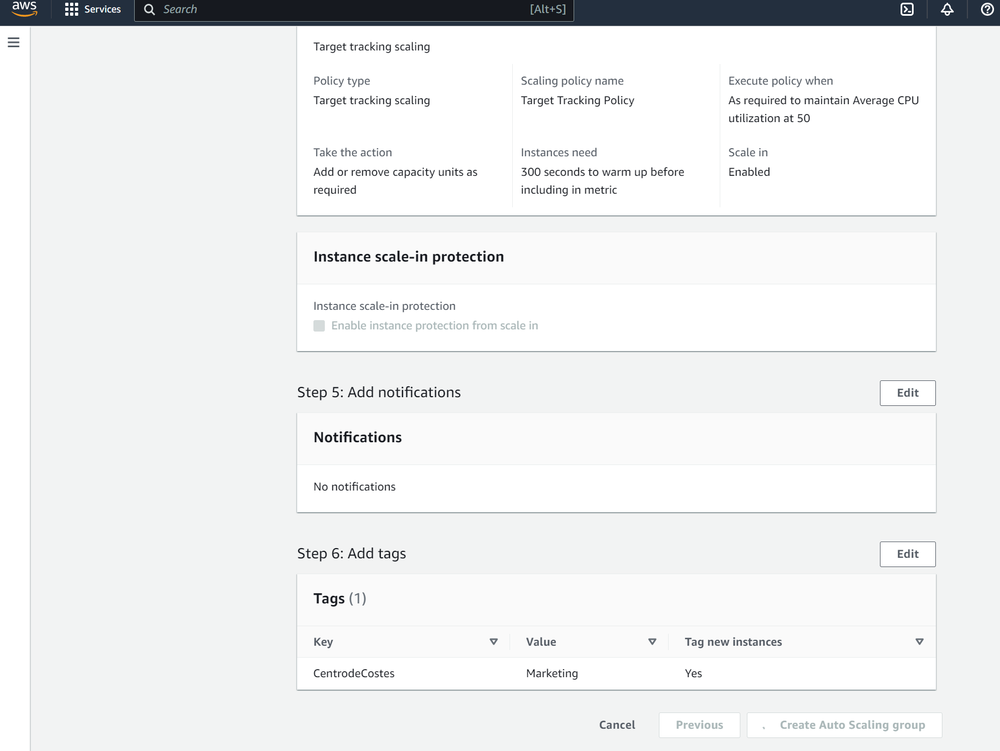


* Comprobamos la creación del ASG


* Revisamos las EC2 creadas


## RETO

Instalar la aplicación stress en ambas EC2, lanzamos 10 procesos de cpu y comprobamos que cuando lleguen a 50% ambas máquinas se lanza una tercera EC2 al aplicarse la politica de autoescalado