# LAB - Despliegue de un ALB en red publica

En este laboratorio crearemos un balanceador de aplicaciones en el vpc por defecto

## Creación de dos EC2

* Crea un SG llamado SGALB con el puerto 22 y 80 abierto. Para usar en EC2 y ALB

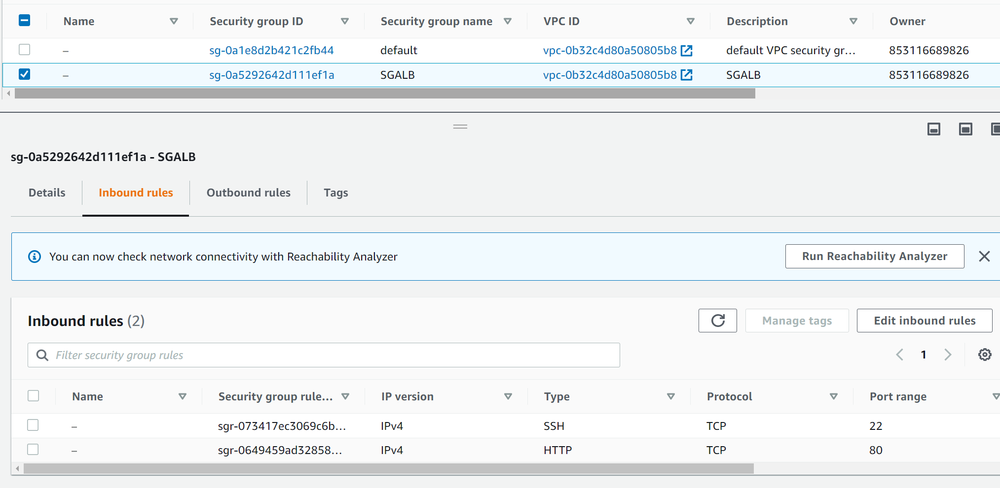

* Lanza la instancia


* Aplica el SGALB

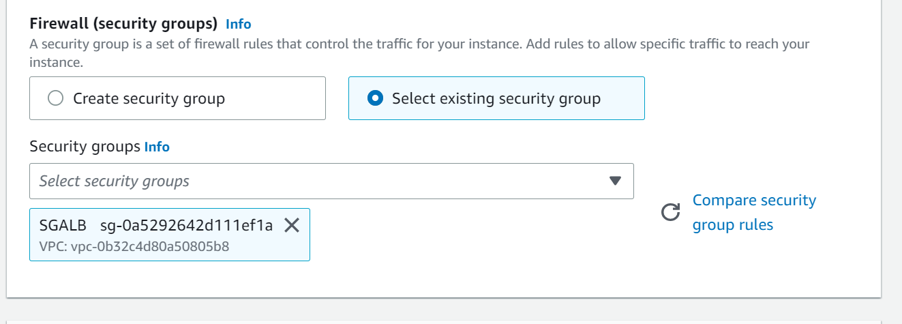

* Lanza 2 instancias con este user data

```bash
#!/bin/bash
sudo dnf update -y
sudo dnf install -y docker
service docker start
systemctl enable docker.service
docker pull santospardos/upc:netflix
docker run -d -p 80:80 santospardos/upc:netflix
```

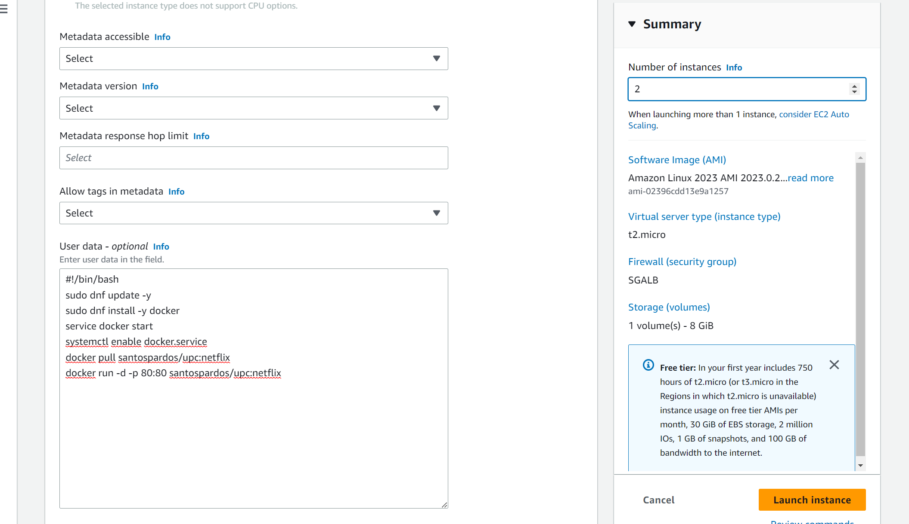


## Crea el balanceador ALB

* Elige ALB

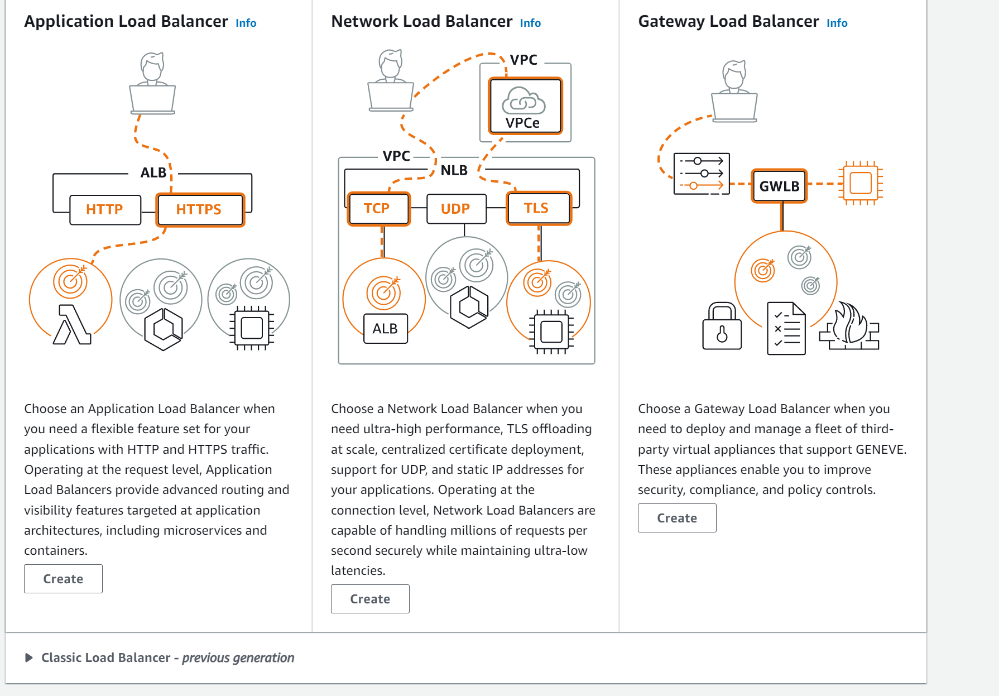


* Rellenael nombre y tipo internet-facing

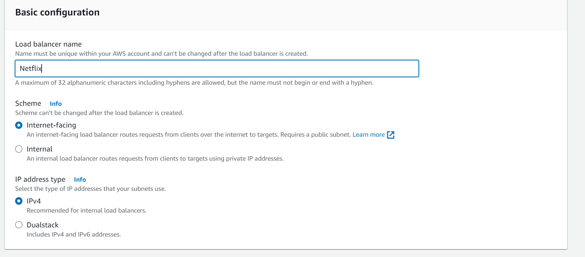

* Elige el VPC por defecto y selecciona las 6 zonas de disponibilidad

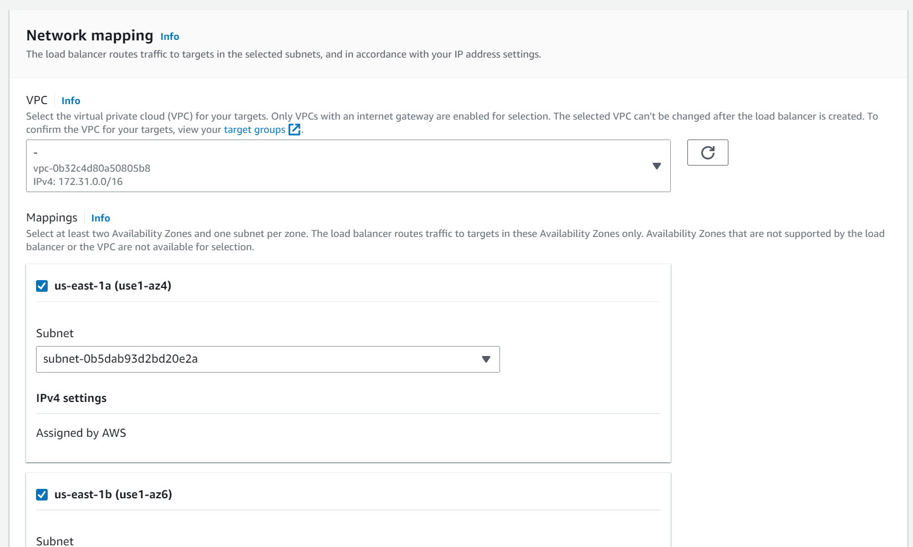

* Elige el SGALB y pulsa crear un Target Group

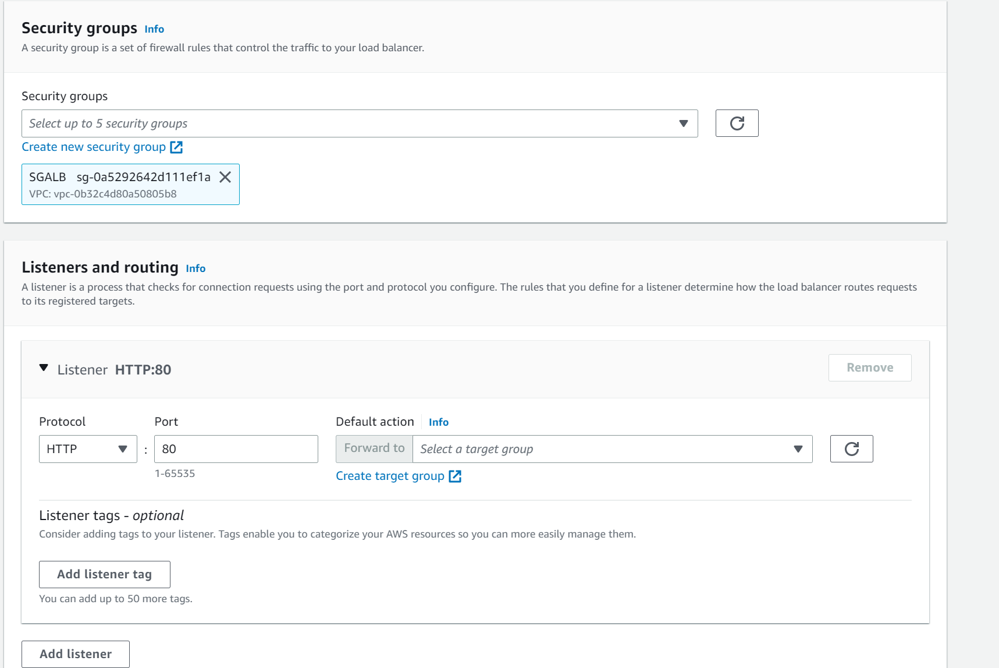

* Elige el nombre del TargeGroup

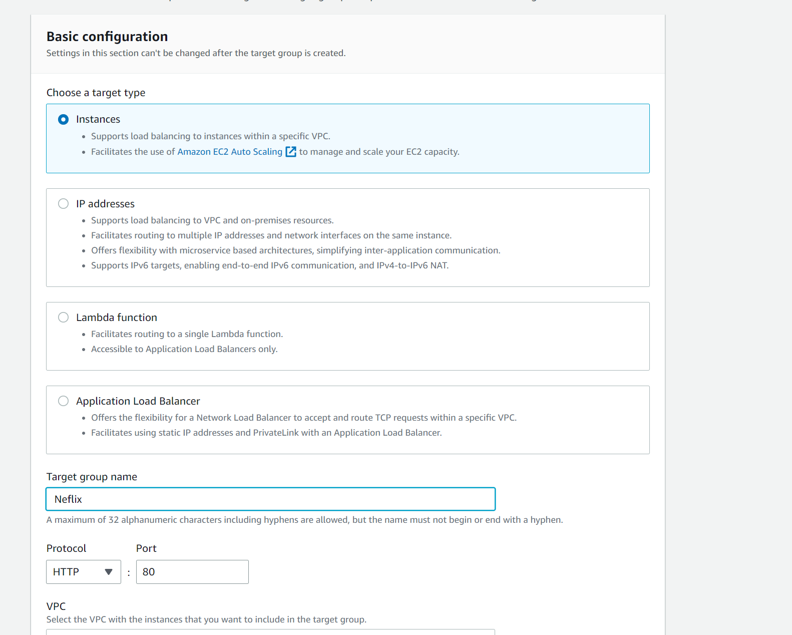

* Pulsa siguiente, marca las dos EC2 de Netflix y pulsa "Include as pending" y se agregarán a la parte inferior.


* Refresca los TG y elige el creado en el paso anterior

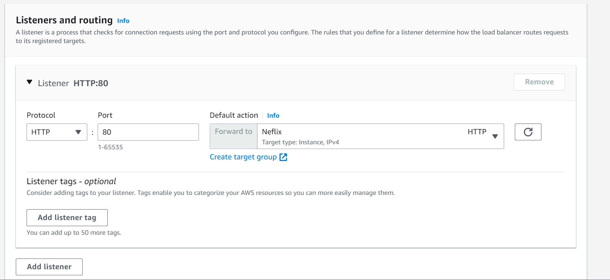

* Comprueba el resumen del ALB y pulsa el botón crear

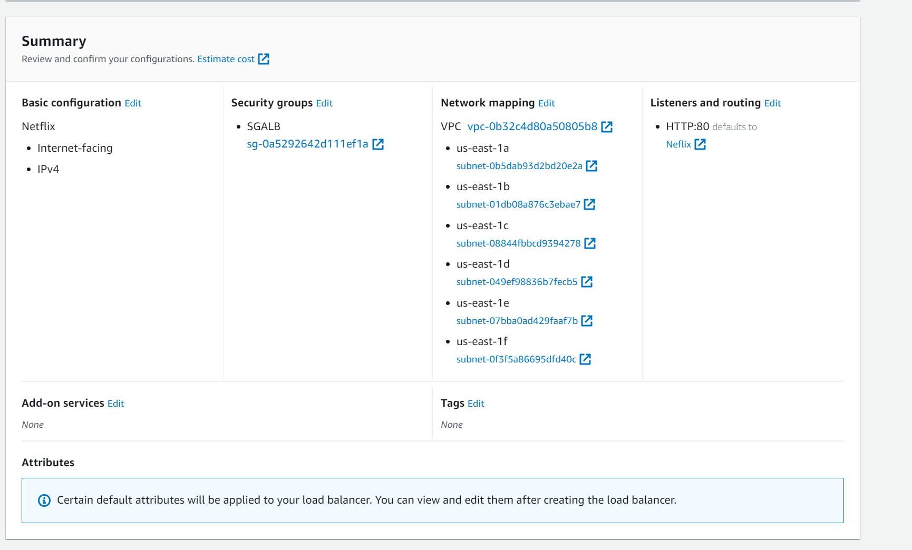

* Una vez aprovisionado el ALB, le cuesta unos 4-5 minutos, abre en un navegador el nombre DNS del ALB.

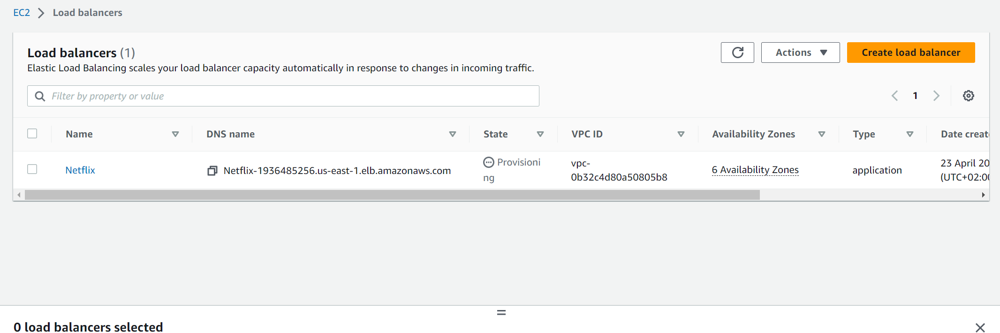
