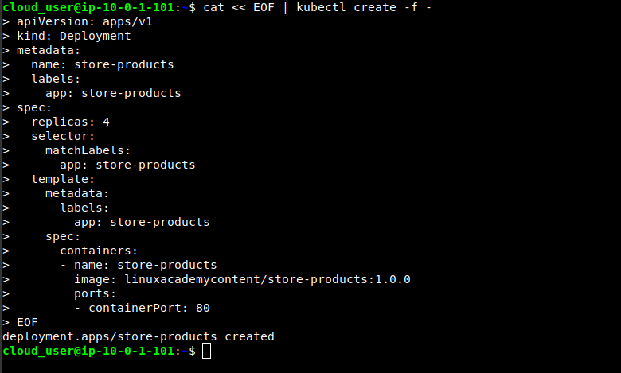
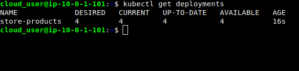
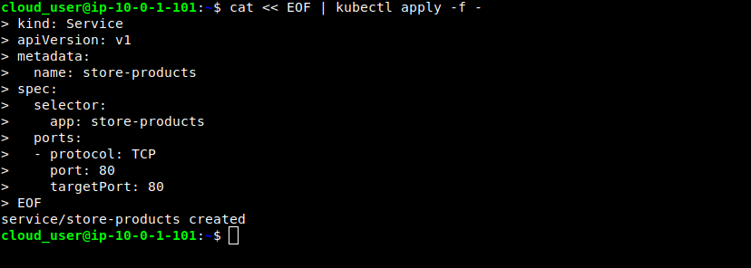
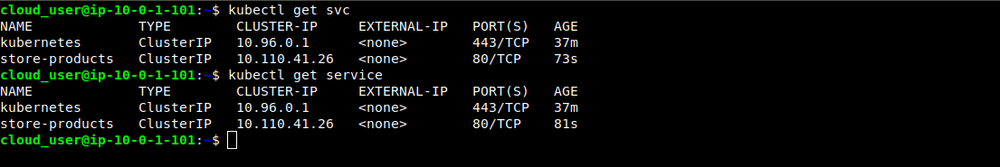
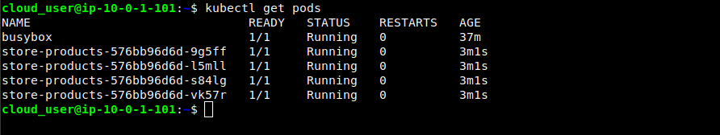
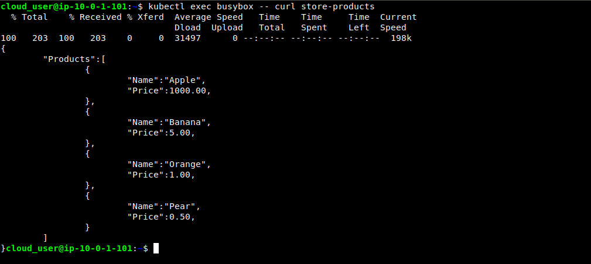
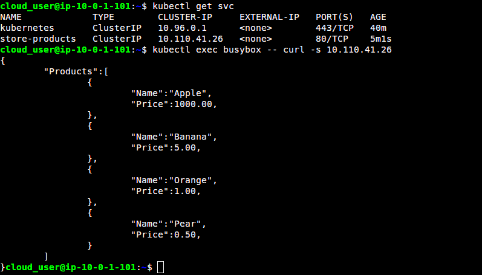
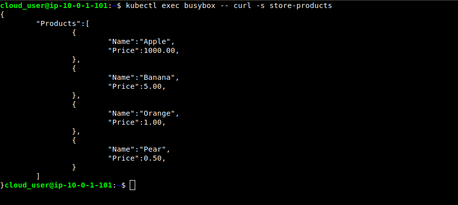

# Deploying a simple service to Kubernetes

<h2> Attribution </h2>

Hello everyone, you are welcome to make use of this repository and learn from it but please do not copy without giving attribution to the author.

<h3>Task:</h3>

Suppose a team manages an online storefront. They want a simple service in their kubernetes cluster that is able to provide a list of products. One pod will use this service to access the service's pods. Deploy the service's pods to the cluster and create a k8s service to provide access to all the service's pods. Deploy 4 replicas of the service pod.

We already have a public Docker image for the store-product app provided by LinuxAcademy- <b>linuxacademycontent/store-products:1.0.0</b>

<p align="center">
  
</p>

<h3> Solution: </h3>

<h4> 1. Creating the deployment for the store-product service with four replicas.</h4>

On the master node, creating the deployment with four replicas

```javascript
cat << EOF | kubectl apply -f -
apiVersion: apps/v1
kind: Deployment
metadata:
  name: store-products
  labels:
    app: store-products
spec:
  replicas: 4
  selector:
    matchLabels:
      app: store-products
  template:
    metadata:
      labels:
        app: store-products
    spec:
      containers:
      - name: store-products
        image: linuxacademycontent/store-products:1.0.0
        ports:
        - containerPort: 80
EOF
```


<h4> 2. Checking out the deployment I created on the master node </h4>

```javascript
kubectl get deployments
```


<h4> 3. Creating the service for the store-products pods </h4>

```javascript
cat << EOF | kubectl apply -f -
kind: Service
apiVersion: v1
metadata:
  name: store-products
spec:
  selector:
    app: store-products
  ports:
  - protocol: TCP
    port: 80
    targetPort: 80
EOF
```


<h4> 4. Making sure the service is up in the cluster </h4>

```javascipt
kubectl get svc store-products
```
<p align="center"><b> OR </b></p>

```javascript
kubectl get service store-products
```

They both give the same result.
  


<h4> 5. Verifying all the service's pods are up and running along with one testing pod i.e.busybox that I created </h4>



<h4> 6. Using kubectl exec to query the store-products service from the busybox testing pod </h4>

```javascript
kubectl exec busybox -- curl service_name
```


<p align="center"><b> OR </b></p>

```javascript
kubectl exec busybox -- curl -s service_ip
```


When using kubectl exec command, some extra information is being displayed. <b> -s </b> is to suppress some extraneous information that I don't need.

```javascript
kubectl exec busybox -- curl -s service_name
```




This is the data I am getting from one of the four replicas. Therefore I am able to successfully get the data from our store-products service.
