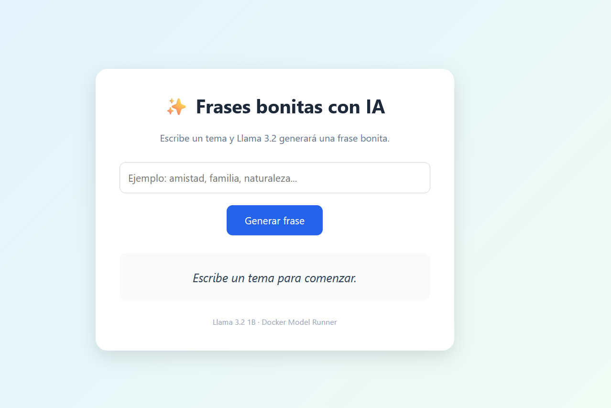

# Docker Model Runner + Llama 3.2 + Nginx + HTML en Ubuntu



Este laboratorio deja funcionando una página web accesible por HTTP que pide a un modelo Llama local una frase bonita sobre un tema.

Arquitectura final:

```text
Navegador
   |
   | HTTP :80
   v
Nginx
   |-- /                -> /var/www/frases/index.html
   |
   `-- /model-api/      -> 127.0.0.1:12434
                                |
                                v
                      Docker Model Runner
                                |
                                v
                      llama3.2:1B-Q4_0
```

## 1. Requisitos

- Una máquina Ubuntu limpia.
- Acceso con un usuario con permisos `sudo`.
- Si está en AWS EC2:
  - IP pública.
  - Subnet con acceso a Internet.
  - Security Group con TCP/80 abierto.
- No es necesario abrir el puerto `12434` al exterior.

Security Group recomendado:

```text
Type: HTTP
Protocol: TCP
Port: 80
Source: 0.0.0.0/0
```

---

## 2. Actualizar Ubuntu

```bash
sudo apt update
sudo apt upgrade -y
```

---

## 3. Instalar Docker

Instalar las dependencias:

```bash
sudo apt install -y ca-certificates curl
```

Crear el directorio para las claves:

```bash
sudo install -m 0755 -d /etc/apt/keyrings
```

Añadir la clave oficial de Docker:

```bash
sudo curl -fsSL https://download.docker.com/linux/ubuntu/gpg \
  -o /etc/apt/keyrings/docker.asc
```

Dar permisos de lectura:

```bash
sudo chmod a+r /etc/apt/keyrings/docker.asc
```

Añadir el repositorio oficial:

```bash
sudo tee /etc/apt/sources.list.d/docker.sources <<EOF_DOCKER
Types: deb
URIs: https://download.docker.com/linux/ubuntu
Suites: \$(. /etc/os-release && echo "\${UBUNTU_CODENAME:-\$VERSION_CODENAME}")
Components: stable
Architectures: \$(dpkg --print-architecture)
Signed-By: /etc/apt/keyrings/docker.asc
EOF_DOCKER
```

Actualizar repositorios:

```bash
sudo apt update
```

Instalar Docker Engine:

```bash
sudo apt install -y \
  docker-ce \
  docker-ce-cli \
  containerd.io \
  docker-buildx-plugin \
  docker-compose-plugin
```

Añadir el usuario actual al grupo Docker:

```bash
sudo usermod -aG docker $USER
```

Aplicar el nuevo grupo en la sesión actual:

```bash
newgrp docker
```

Comprobar Docker:

```bash
docker version
```

---

## 4. Instalar Docker Model Runner

Instalar el plugin:

```bash
sudo apt-get install -y docker-model-plugin
```

Comprobarlo:

```bash
docker model version
```

---

## 5. Descargar Llama 3.2

```bash
docker model pull ai/llama3.2:1B-Q4_0
```

Comprobar los modelos instalados:

```bash
docker model list
```

En este laboratorio el modelo aparece como:

```text
llama3.2:1B-Q4_0
```

> Importante: para las peticiones API se usa el nombre que devuelve `docker model list`.
> En este caso: `llama3.2:1B-Q4_0`.

---

## 6. Probar el modelo

Prueba sencilla:

```bash
docker model run ai/llama3.2:1B-Q4_0 \
  "Dime una frase bonita sobre la amistad"
```

También se puede comprobar la API de Docker Model Runner:

```bash
curl -s http://127.0.0.1:12434/engines/v1/chat/completions \
  -H "Content-Type: application/json" \
  -d '{
    "model": "llama3.2:1B-Q4_0",
    "messages": [
      {
        "role": "user",
        "content": "Dime una frase bonita sobre la amistad"
      }
    ]
  }'
```

Debe devolver un JSON con una estructura similar a:

```json
{
  "choices": [
    {
      "message": {
        "role": "assistant",
        "content": "..."
      }
    }
  ]
}
```

---

## 7. Instalar Nginx

```bash
sudo apt install -y nginx
```

Activarlo:

```bash
sudo systemctl enable --now nginx
```

---

## 8. Crear el directorio de la web

```bash
sudo mkdir -p /var/www/frases
```

El fichero HTML se guardará exactamente aquí:

```text
/var/www/frases/index.html
```

Puedes crearlo con:

```bash
sudo nano /var/www/frases/index.html
```

Pega el contenido del fichero `index.html` incluido con este laboratorio.

Después asigna permisos:

```bash
sudo chown -R www-data:www-data /var/www/frases
```

---

## 9. Crear la configuración de Nginx

Crear:

```bash
sudo nano /etc/nginx/sites-available/frases
```

Pega el contenido del fichero `frases-nginx.conf` incluido con este laboratorio.

La configuración hace dos cosas:

```text
/             -> sirve index.html
/model-api/   -> proxy hacia 127.0.0.1:12434
```

La línea:

```nginx
proxy_set_header Origin "";
```

es importante.

Los navegadores envían la cabecera `Origin`. Docker Model Runner puede responder:

```text
HTTP 403 - Origin not allowed
```

Por eso Nginx elimina esa cabecera antes de reenviar la petición al modelo.

---

## 10. Desactivar la web por defecto de Nginx

```bash
sudo rm -f /etc/nginx/sites-enabled/default
```

---

## 11. Activar la nueva web

```bash
sudo ln -sf \
  /etc/nginx/sites-available/frases \
  /etc/nginx/sites-enabled/frases
```

---

## 12. Comprobar Nginx

```bash
sudo nginx -t
```

El resultado esperado es:

```text
syntax is ok
test is successful
```

Recargar Nginx:

```bash
sudo systemctl reload nginx
```

---

## 13. Probar la página desde Ubuntu

```bash
curl http://localhost
```

Debe devolver el HTML de la aplicación.

---

## 14. Probar Nginx contra Docker Model Runner

Esta prueba verifica todo el backend:

```bash
curl -s http://localhost/model-api/engines/v1/chat/completions \
  -H "Content-Type: application/json" \
  -d '{
    "model": "llama3.2:1B-Q4_0",
    "messages": [
      {
        "role": "user",
        "content": "Dime una frase bonita sobre la amistad"
      }
    ]
  }'
```

Si devuelve una respuesta de Llama, funcionan correctamente:

```text
Nginx
   |
   v
Docker Model Runner
   |
   v
Llama 3.2
```

---

## 15. Abrir la aplicación desde el navegador

Si la máquina está en AWS EC2:

```text
http://IP_PUBLICA
```

Por ejemplo:

```text
http://54.210.10.25
```

No es necesario indicar el puerto porque Nginx escucha en el puerto 80.

---

## 16. Funcionamiento de la aplicación

El HTML hace una petición:

```javascript
fetch("/model-api/engines/v1/chat/completions", ...)
```

El navegador no se conecta directamente al puerto `12434`.

La petición sigue este recorrido:

```text
Browser
   |
   | POST /model-api/engines/v1/chat/completions
   v
Nginx :80
   |
   | proxy_pass
   v
127.0.0.1:12434
   |
   v
Docker Model Runner
   |
   v
llama3.2:1B-Q4_0
```

Ventajas:

- El puerto `12434` no se expone a Internet.
- No hay problemas de CORS en el navegador.
- Toda la aplicación se publica por el puerto `80`.
- No se utilizan APIs externas.
- La inferencia se realiza localmente en la propia máquina Ubuntu.

---

## 17. Ficheros finales

HTML:

```text
/var/www/frases/index.html
```

Configuración Nginx:

```text
/etc/nginx/sites-available/frases
```

Enlace habilitado:

```text
/etc/nginx/sites-enabled/frases
```

---

## 18. Comandos útiles

Ver modelos:

```bash
docker model list
```

Ver estado de Docker Model Runner:

```bash
docker model status
```

Probar Llama:

```bash
docker model run ai/llama3.2:1B-Q4_0 "Hola"
```

Comprobar Nginx:

```bash
sudo systemctl status nginx
```

Ver los puertos abiertos localmente:

```bash
sudo ss -lntp
```

Comprobar la configuración de Nginx:

```bash
sudo nginx -t
```

Recargar Nginx:

```bash
sudo systemctl reload nginx
```
