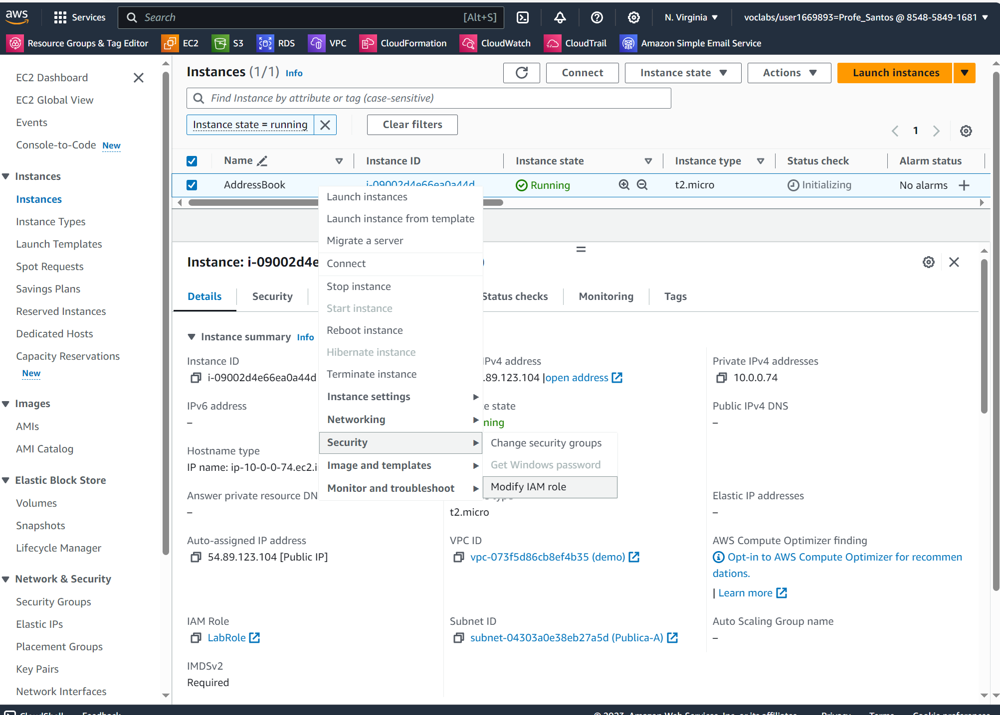
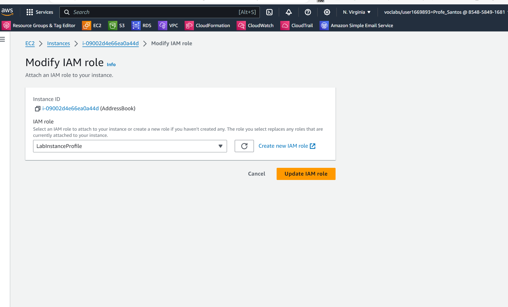
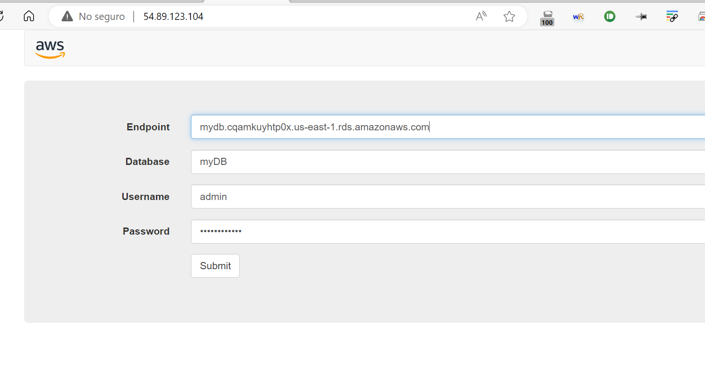
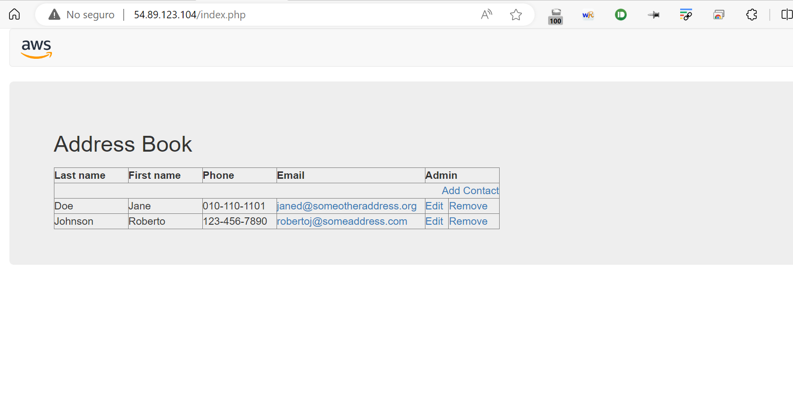

# RETO - Despliegue de una aplicacion de libreta de direcciones (AddressBook)

En este laboratorio vamos a realizar la instalación de una aplicación de inventario en un VPC propio , en una EC2 Linux AMI 2 y una BBDD RDS Mysql 5.7.X en cluster.

## VPC

* Crear un VPC propio con redes privadas y públicas

* Crear VPC 10.0.0.0/16

* Crear subredes publicas 10.0.1.0/24 10.0.2.0/24 y privadas 10.0.3.0/24 10.0.4.0/24

* Crear Internet Gateway y NAT gateway.

* Modificar las tablas de enrutamiento


## EC2

* Crear un grupo de seguridad SBWeb con el puerto 22 y 80 abierto para acceso por SSH y consultar la web

* Lanzar la EC2 Linux AMI 2 (no usar este código en Linux AMI 2023) con este User Data

```
#!/bin/bash -ex
yum -y update
yum -y install httpd php mysql php-mysql
chkconfig httpd on
service httpd start
cd /var/www/html
wget https://us-west-2-aws-training.s3.amazonaws.com/courses/spl-13/v4.2.27.prod-f0f1d0c2/scripts/app.tgz
tar xvfz app.tgz
chown apache:root /var/www/html/rds.conf.php
```

* Comprobar el acceso con la IP pública. En este momento te da el siguiente error por ser cuentas de AWS academy. 



* Lo solucionamos cambiando el Role de la EC2 or el role utilizado en AWS Academy. Elegimos LabInstanceProfile




## BBDD

* Crear un Subnet Group con las redes privadas

* Crear un Security Group, SWbbdd con el puerto 3306 para acceso desde la EC2

* Lanzar un Mysql en free-tier o multi-az (a elegir) con el grupo de subredes creado
```
DB instance identifier: myDB
Master username: admin
Master password: lab-password
Confirm password:lab-password
Initial database name: myDB
```

* Le diremos que cree una base de datos llamada myDB a la hora de lanzar la instancia RDS




## Comprobacíón final

* Vamos a la IP pública  y lo rellenamos con los datos de nuestro proyecto



