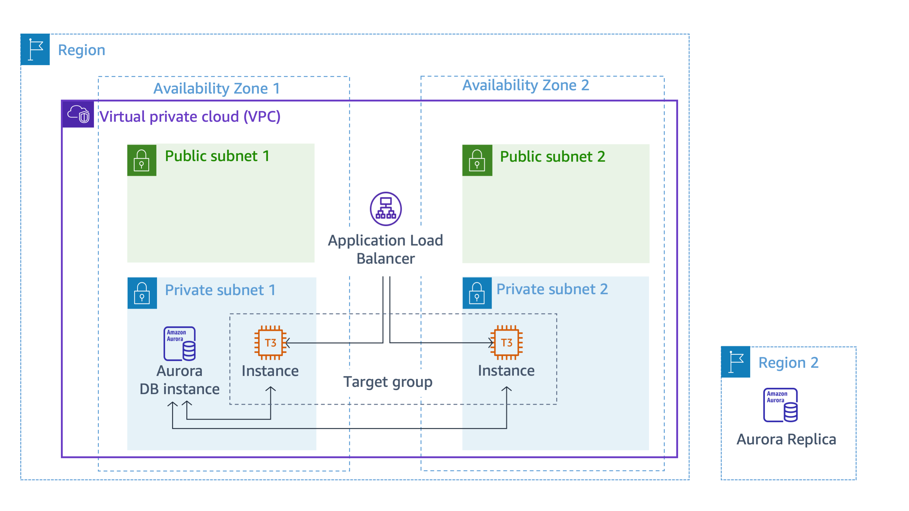

# RETO - Despliegue de una aplicacion de inventario

En este laboratorio vamos a realizar la instalación de una aplicación de inventario en un VPC propio , en una EC2 Linux AMI 2023 y una BBDD RDS Mysql 8.0.32



## EC2
```
#!/bin/bash

# Install Apache Web Server and PHP
# Installs for AL2023
dnf update -y
dnf install -y httpd wget php-fpm php-mysqli php-json php php-devel

# Download Lab files
wget https://us-west-2-tcprod.s3.us-west-2.amazonaws.com/courses/ILT-TF-200-ARCHIT/v7.8.0.prod-4c57a67d/lab-3-RDS/scripts/inventory-app.zip
unzip inventory-app.zip -d /var/www/html/

# Download and install the AWS SDK for PHP
wget https://github.com/aws/aws-sdk-php/releases/download/3.295.2/aws.zip
unzip aws -d /var/www/html
unzip /var/www/html/aws.zip -d /var/www/html/

# Turn on web server
systemctl enable httpd
systemctl start httpd
```

## RDS
```
Mysql (version 8.0.32)
User: dbadmin
Password: LabPassword
database initial: inventory
```
