# LAB - Despliegue de una base de datos MySQL y conexión con HeidiSQL

En este laboratorio crearemos una base de datos única en red pública y nos conectaremos con un cliente SQL

## Inicio

* Accede al [AWS Academy](https://awsacademy.instructure.com/)
* Utiliza el botón de *Courses* para abrir el *Learner's lab*

## RDS

* En este paso, utilizaremos Amazon RDS para crear una instancia de base de datos MySQL con la clase de instancia de base de datos db.t2.micro, 20 GB de almacenamiento y copias de seguridad automatizadas habilitadas con un período de retención de un día. Como recordatorio, todo esto es elegible para el nivel gratuito.

a. Abra la consola de administración de AWS en una nueva ventana del navegador para poder mantener abierta esta guía paso a paso. Cuando se abra la consola, seleccione Database (Base de datos) en el panel de navegación izquierdo y elija RDS para abrir la consola de Amazon RDS.

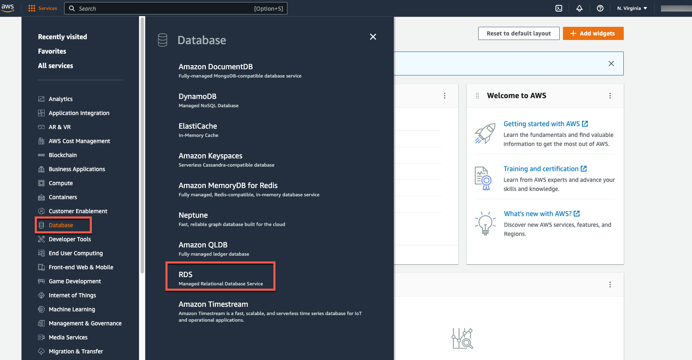

* b. En la esquina superior derecha de la consola de Amazon RDS, seleccione la región en la que desea crear la instancia de base de datos.

Nota: Los recursos de la nube de AWS se alojan en instalaciones de centros de datos de alta disponibilidad en diferentes áreas del mundo. Cada región contiene varias ubicaciones distintas denominadas zonas de disponibilidad. Puede elegir en qué región alojar su actividad de Amazon RDS.

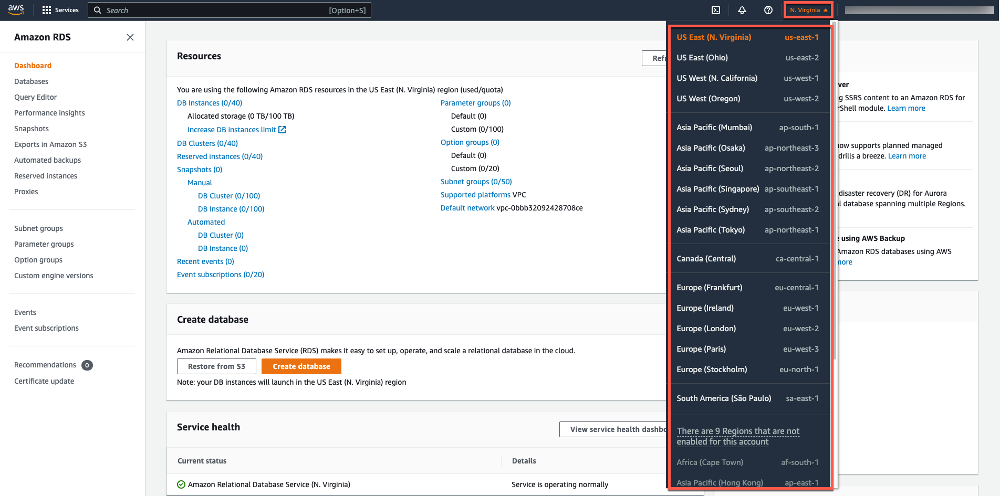

* c. En la sección Crear base de datos, elija Crear base de datos.

* d. Ahora tiene opciones para seleccionar su motor. Para este tutorial, elija el icono MySQL, deje el valor predeterminado de edición y versión del motor, y seleccione la plantilla Capa gratuita.

Implementación Multi-AZ: Tenga en cuenta que tendrá que pagar por la implementación Multi-AZ. El uso de una implementación Multi-AZ aprovisionará y mantendrá automáticamente una réplica en espera sincrónica en una zona de disponibilidad diferente. Para obtener más información, consulte Implementación de alta disponibilidad.

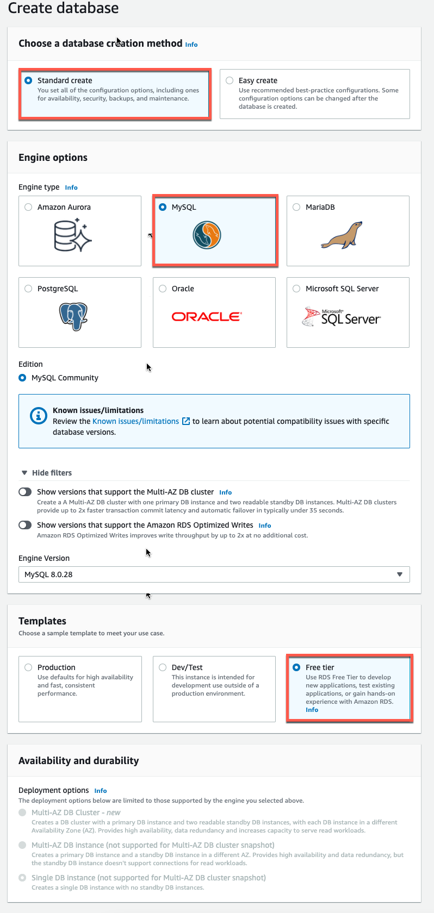

* e. Ahora configurará la instancia de base de datos. La siguiente lista muestra la configuración de ejemplo que puede usar para este tutorial:

Configuración:

DB Instanace identifier: escriba un nombre para la instancia de base de datos que sea único para su cuenta en la región seleccionada. Para este tutorial, lo llamaremos rds-mysql-10minTutorial.

Master username: escriba un nombre de usuario que utilizará para iniciar sesión en la instancia de base de datos. Usaremos masterUsername en este ejemplo.

Master Password: escriba una contraseña que contenga de 8 a 41 caracteres ASCII imprimibles (excluyendo /," y @) para su contraseña de usuario maestra.

Confirm password: vuelve a escribir la contraseña

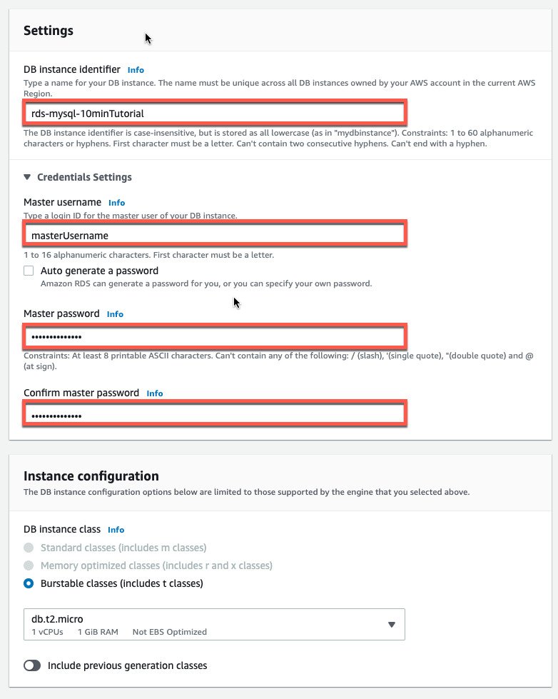

* Instance specifications:

DB Instance class: seleccione db.t2.micro — 1vCPU, 1 GiB RAM. Esto equivale a 1 GB de memoria y 1 vCPU. Para ver una lista de las clases de instancia admitidas, consulte Precios de Amazon RDS.

Storage type: Seleccione General Purpose (SSD). Para obtener más información acerca del almacenamiento, consulte Almacenamiento para Amazon RDS.

Allocated storage: seleccione el valor predeterminado de 20 para asignar 20 GB de almacenamiento a la base de datos. Puede escalar hasta un máximo de 64 TB con Amazon RDS for MySQL.

Enable Storage autoscaling: si la carga de trabajo es cíclica o impredecible, debe habilitar el escalado automático del almacenamiento para permitir que Amazon RDS amplíe automáticamente el almacenamiento cuando sea necesario. Esta opción no se aplica a este tutorial.

Multi-AZ deployment: Tenga en cuenta que tendrá que pagar por la implementación Multi-AZ. El uso de una implementación Multi-AZ aprovisionará y mantendrá automáticamente una réplica en espera sincrónica en una zona de disponibilidad diferente. Para obtener más información, consulte Implementación de alta disponibilidad.

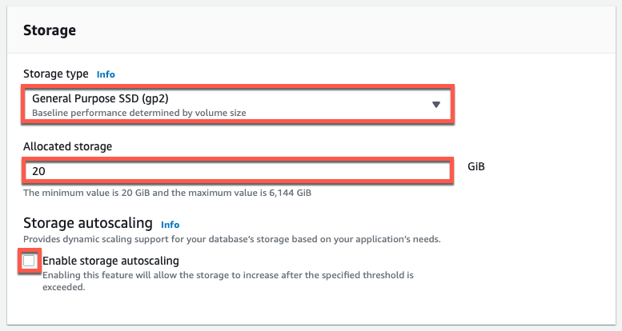

* f. Ahora se encuentra en la sección Connectivity (Conectividad), donde puede proporcionar información que Amazon RDS necesita para lanzar la instancia de base de datos MySQL. La siguiente lista muestra la configuración de nuestra instancia de base de datos de ejemplo.

Conectividad

Recurso informático: elija No conectarse a un recurso informático de EC2. Puede configurar manualmente una conexión a un recurso informático más adelante.
Virtual Private Cloud (VPC): seleccione Default VPC (VPC predeterminada). Para obtener más información acerca de VPC, consulte Amazon RDS y Amazon Virtual Private Cloud (VPC).

Additional coneectivity configurations:

Subnet group: elija el grupo de subredes predeterminado. Para obtener más información acerca de los grupos de subredes, consulte Trabajo con grupos de subredes de base de datos.

Public accessibitilty: elija Sí. Esto asignará una dirección IP para su instancia de base de datos para que pueda conectarse directamente a la base de datos desde su propio dispositivo.

VPC security groups: seleccione Create new VPC security group (Crear nuevo grupo de seguridad de VPC). Esto creará un grupo de seguridad que permitirá la conexión desde la dirección IP del dispositivo que está utilizando actualmente a la base de datos creada.

Availability zone: elija Sin preferencia. Consulte Regiones y zonas de disponibilidad para obtener más información.

RDS Proxy: mediante el proxy de Amazon RDS, puede permitir que sus aplicaciones agrupen y compartan conexiones de bases de datos para mejorar su capacidad de escalado. Deje el proxy RDS sin marcar.

Port: deje el valor predeterminado de 3306.

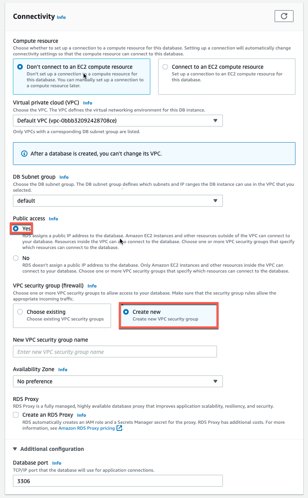

* g.  Amazon RDS admite varias formas de autenticar usuarios de bases de datos. Elija Autenticación de contraseña en la lista de opciones

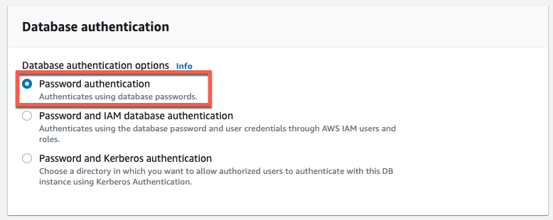

* Monitoring

Enhanced monitoring: deje Habilitar supervisión mejorada sin marcar para permanecer dentro del nivel gratuito. Habilitar la supervisión mejorada le proporcionará métricas en tiempo real para el sistema operativo (SO) en el que se ejecuta la instancia de base de datos. Para obtener más información, consulte Visualización de métricas de instancia de base de datos.

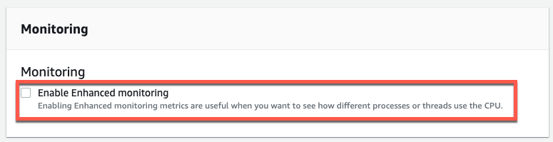

* En la sección Additional configurations:

Database Options

Database name: escriba un nombre de base de datos de 1 a 64 caracteres alfanuméricos. Si no proporciona un nombre, Amazon RDS no creará automáticamente una base de datos en la instancia de base de datos que está creando.

DB parameter group: deje el valor predeterminado. Para obtener más información, consulte Trabajo con grupos de parámetros de base de datos.

Option group: deje el valor predeterminado. Amazon RDS utiliza grupos de opciones para habilitar y configurar características adicionales. Para obtener más información, consulte Trabajar con grupos de opciones.

Encryptation: esta opción no está disponible en el nivel gratuito. Para obtener más información, consulte Cifrado de recursos de Amazon RDS.

Backp

Backup retention period: puede elegir el número de días que desea conservar la copia de seguridad que realiza. Para este tutorial, establezca este valor en 1 día.

Backup window: utilice el valor predeterminado de Sin preferencia.

Maintenance

Auto minor version upgrade: Seleccione Habilitar actualización automática de versiones secundarias para recibir actualizaciones automáticas cuando estén disponibles.

Maintenance Window: Seleccione Sin preferencia.

Deletion protection: desactive Habilitar protección contra eliminación para este tutorial. Cuando esta opción está habilitada, no se puede eliminar accidentalmente la base de datos.

Elija Create Database (Crear base de datos).

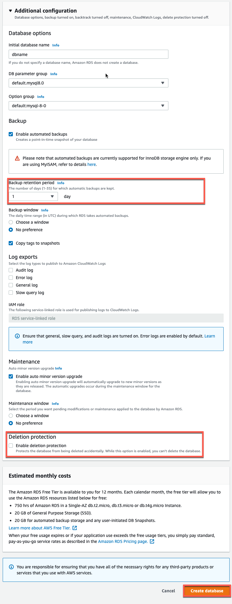

* h. La instancia de base de datos se está creando.

Nota: En función de la clase de instancia de base de datos y del almacenamiento asignado, la nueva instancia de base de datos podría tardar varios minutos en estar disponible.

La nueva instancia de base de datos aparece en la lista de instancias de base de datos de la consola de RDS. La instancia de base de datos tendrá el estado de creación hasta que la instancia de base de datos esté creada y lista para su uso. Cuando el estado cambia a disponible, puede conectarse a una base de datos en la instancia de base de datos. 

Siéntase libre de pasar al siguiente paso mientras espera a que la instancia de base de datos esté disponible.

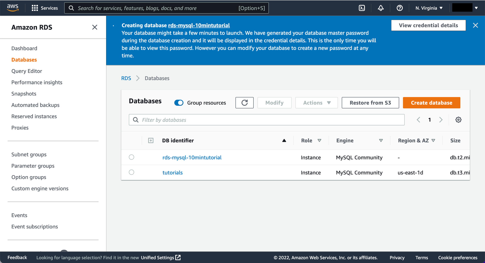

* Utiliza un cliente SQL como pueda ser HeidiSQL para conectar a la base de datos

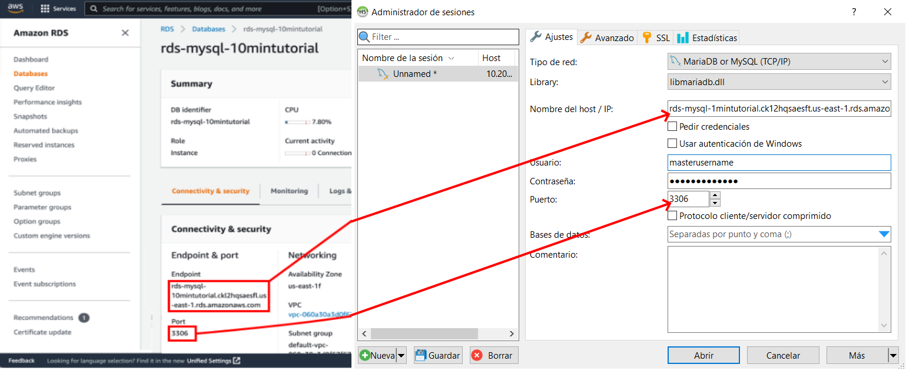
