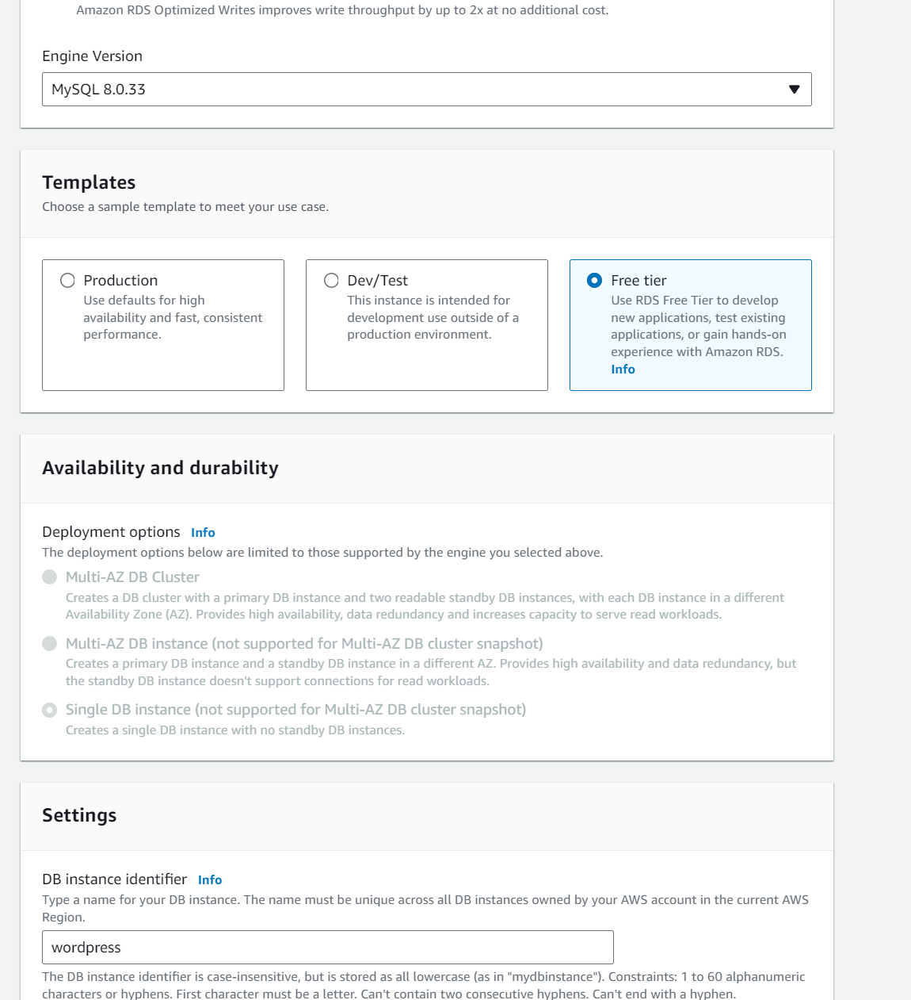
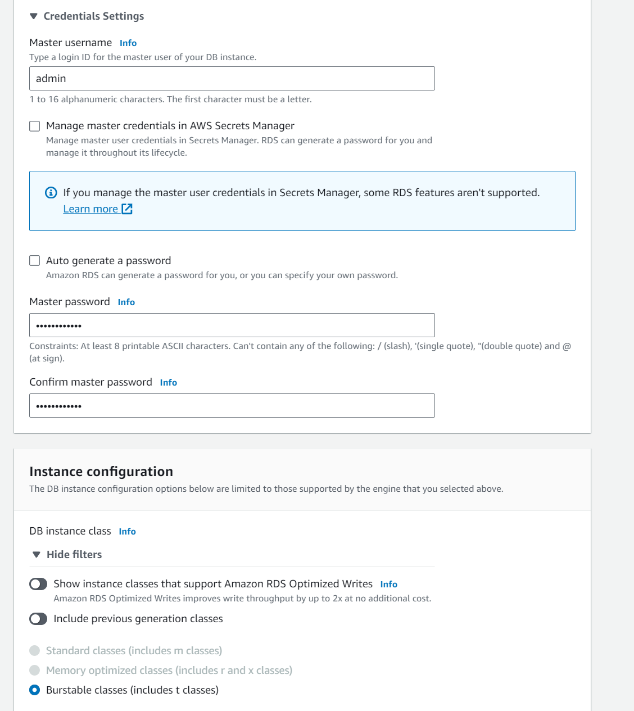
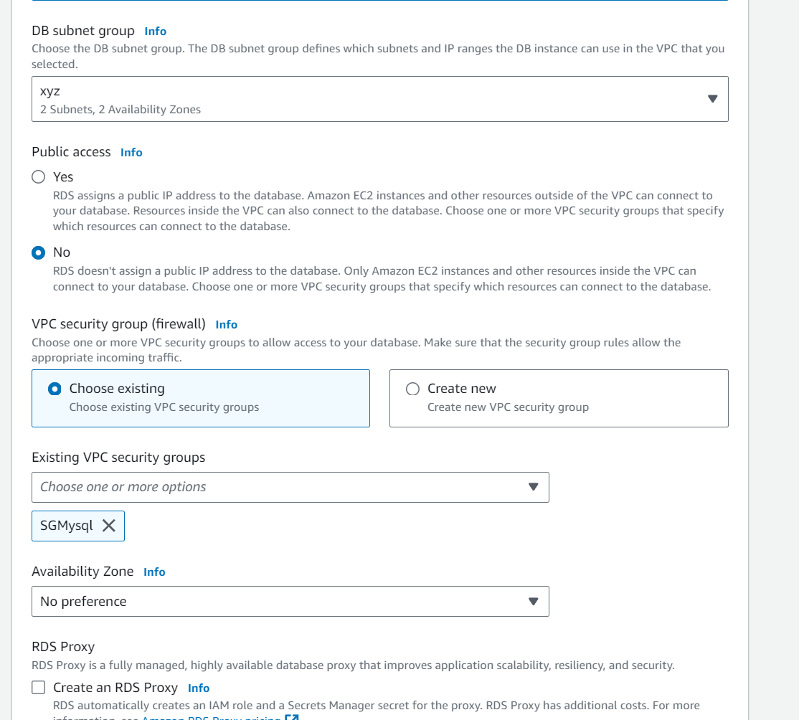
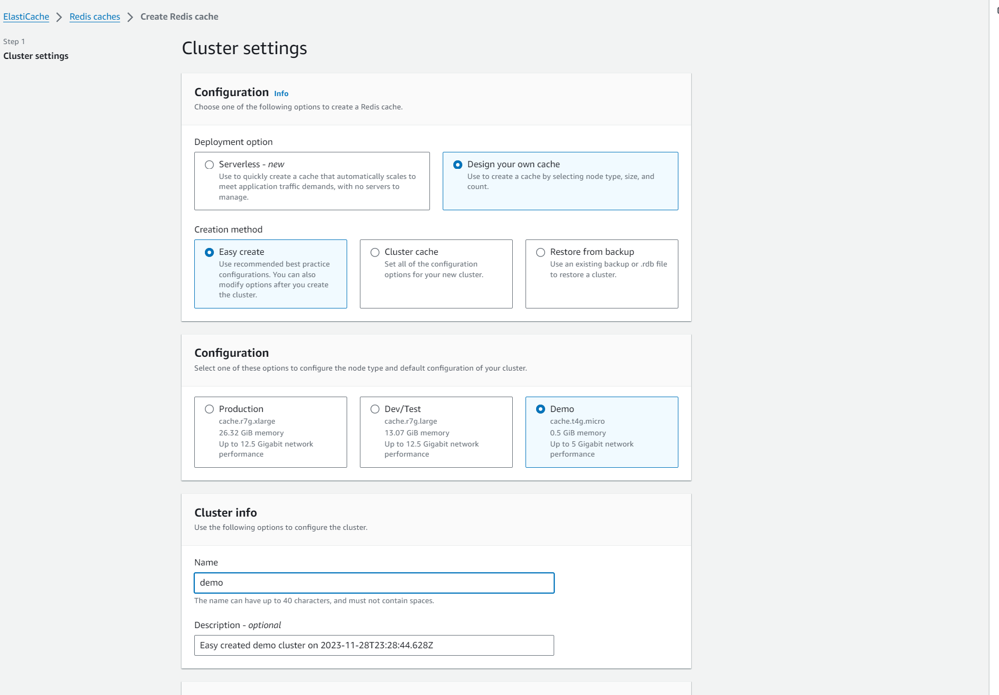

# RETO - Despliegue de un Wordpress

En este laboratorio vamos a realizar la instalación de un wordpress , en una EC2 Ubuntu y una BBDD RDS Mysql en cluster.

## VPC

* Crear un VPC propio con redes privadas y públicas

* Crear VPC 10.0.0.0/16

* Crear subredes publicas 10.0.1.0/24 10.0.2.0/24 y privadas 10.0.3.0/24 10.0.4.0/24

* Crear Internet Gateway y NAT gateway

* Modificar las tablas de enrutamiento


## EC2
* Crear un grupo de seguridad SBWeb con el puerto 22 y 80 abierto para acceso por SSH y consultar la web
  
* Instalación Ubuntu. 


* IP Pública


* Instalación de Apache, PHP, Mysql y Wordpress

```
sudo apt update
sudo apt install apache2 -y
sudo apt install mysql-server -y
sudo apt install php libapache2-mod-php php-mysql -y
php -v
sudo wget https://wordpress.org/latest.tar.gz
sudo tar xzf latest.tar.gz
cd wordpress
sudo cp -r . /var/www/html
cd /var/www/html
sudo rm index.html
```


* Pantalla inicial Wordpress


## BBDD

* Crear un Subnet Group con las redes privadas

* Crear un Security Group, SWbbdd con el puerto 3306 para acceso desde la EC2

* Lanzar un Mysql en multi-AZ o free-tier (a elegir),  con el grupo de subredes creado

* RDS para Wordpress








* Configuración inicial con el endpoint de la BBDD usuario y contraseña


## Creación wp-config.php
Crear un fichero wp-config.php con la configuración que te da wordpress al intentar conectar por primera vez.
```
sudo nano wp-config.php
```


* Configuración inicial Wordpress
  


## Redis
Instalación Elasticache - Redis - Demo




Instalación cambiando el wp-config.php


```
define('WP_REDIS_HOST', 'demo-0001-001.lamigo.0001.use1.cache.amazonaws.com:6379');
define('WP_REDIS_PORT', '6379');
sudo systemctl restart apache2
```


## Problemas
Si no instala Plug-in. Añadir en wp-config-php
```
define('FS_METHOD', 'direct');
sudo systemctl restart apache2
```

Cambiar permisos para poder instalar plugins
```
sudo chown -R www-data:www-data /var/www/html
sudo systemctl restart apache2
```

URL Wordpress Admin
```
http://54.166.217.206/wp-login.php?
```

Si no tienes IP fija, al cambiar la IP pública tienes que añadir en wp-config.php estas lineas y cambiar la URL por la IP publica que te de en cada momentos AWS
```
define( 'WP_HOME', 'http://example.com' );
define( 'WP_SITEURL', 'http://example.com' );
```

## Links
```
https://stackoverflow.com/questions/17922644/wordpress-asking-for-my-ftp-credentials-to-install-plugins
https://dev.to/pixeline/how-to-use-redis-with-wordpress-docker-compose-55fk
https://bobcares.com/blog/installation-failed-could-not-create-directory-error-in-wordpress/
```

