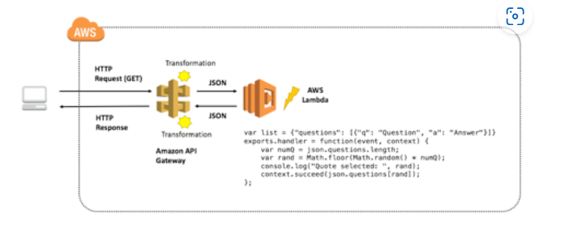

Información general
En este laboratorio, creará un microservicio de preguntas frecuentes simples. El microservicio devolverá un objeto JSON que contiene un par de pregunta y respuesta aleatorio que utiliza un punto de enlace de Amazon API Gateway que invoca una función de AWS Lambda. Este es el patrón de arquitectura de este microservicio:

TEMAS
Al final de este laboratorio, podrá hacer lo siguiente:

Crear una función de AWS Lambda
Crear puntos de enlace de Amazon API Gateway
Depurar la API Gateway y Lambda con Amazon CloudWatch
REQUISITOS PREVIOS
Será útil tener experiencia en programación y estar familiarizado con el desarrollo de las aplicaciones, aunque no es necesario para ejecutar el laboratorio. Sin embargo, debe haber completado el laboratorio autoguiado Introducción a AWS Lambda antes de completar este laboratorio.

OTROS SERVICIOS DE AWS
Una política de IAM desactiva los servicios de AWS que no son necesarios para este laboratorio durante su tiempo de acceso a este laboratorio. Además, las capacidades de los servicios utilizados para este laboratorio están limitadas según los requisitos de este e incluso, en algunos casos, de forma deliberada como parte del diseño del laboratorio. Espere recibir mensajes de error cuando acceda a otros servicios o cuando lleve a cabo acciones que no consten en la guía de este laboratorio.

Conceptos técnicos
ARQUITECTURA DE MICROSERVICIOS
“El estilo arquitectónico de microservicios es un enfoque del desarrollo de una sola aplicación como un conjunto de pequeños servicios, en que cada uno de ellos se ejecuta en su propio proceso y se comunica con los mecanismos ligeros, a menudo una API de recursos HTTP. Estos servicios se crean de acuerdo con las capacidades empresariales y se implementan de forma independiente por medio de maquinaria de implementación totalmente automatizada. Hay un requisito mínimo de gestión centralizada de estos servicios, que se pueden escribir en lenguajes de programación diferentes y utilizar tecnologías de almacenamiento de datos diversas”.James Lewis y Martin Fowler

La idea de una arquitectura de microservicios es tomar un sistema grande y complejo, y desglosarlo en servicios independientes y desacoplados fáciles de administrar y ampliar. De este modo, los desarrolladores pueden lograr los objetivos de diseño clave, como la extensibilidad, la disponibilidad y el mantenimiento.

Amazon API Gateway y AWS Lambda proporcionan la combinación perfecta de servicios web para crear, proveer y mantener sin esfuerzo un conjunto de microservicios que pueden ser la base de los sistemas de software complejos.

En este laboratorio, aprenderá a desarrollar, implementar y depurar un microservicio simple que representa una parte de un sistema mucho más grande. Dicha parte constará de dos componentes: la API RESTful y la función que se ejecuta cuando un usuario alcanza el punto de enlace.

INTERFAZ DE PROGRAMACIÓN DE APLICACIONES (API)
Una interfaz de programación de aplicaciones es un conjunto de instrucciones que define el modo en que los desarrolladores interactúan con una aplicación. La idea de una API es crear un enfoque estandarizado para la interacción entre varios de los servicios que proporciona una aplicación. Una API está diseñada para utilizarla con un Kit de desarrollo de software (SDK), un conjunto de herramientas que permite a los desarrolladores crear con facilidad aplicaciones descendentes basadas en la API.

ESTRATEGIA QUE PRIORIZA LA API
Muchas organizaciones de software están adoptando una estrategia que prioriza la API, en la cual cada servicio de la pila está primero y siempre se lanza como una API. Cuando se diseña un servicio, es difícil conocer todas las aplicaciones diversas que posiblemente quieran utilizar el servicio. Por ejemplo, el servicio de preguntas frecuentes de este laboratorio sería ideal para propagar las páginas de preguntas frecuentes en un sitio web externo. Sin embargo, es viable pensar que una empresa de educación en la nube también querría incorporar las preguntas frecuentes en sus materiales de capacitación para las tarjetas rápidas o los documentos de capacitación. Si fuera simplemente un sitio web estático, el proceso de incorporación para la empresa de educación sería muy difícil. Al proporcionar una API que se pueda consumir en un formato estandarizado, el microservicio habilita el desarrollo de un ecosistema alrededor del servicio, así como los casos de uso que no se consideraron inicialmente.

API RESTFUL
La transferencia de estado representacional (REST) se refiere a las arquitecturas que muestran seis restricciones:

Una de ellas es la separación de áreas a través de un modelo cliente-servidor.
El estado se almacena por completo en el cliente, y la comunicación entre el cliente y el servidor es sin estado.
El cliente almacenará los datos en caché para mejorar la eficacia de la red.
Hay una interfaz uniforme (en forma de una API) entre el servidor y el cliente.
A medida que se agrega complejidad en el sistema, se incorporan las capas. Puede haber varias capas de componentes RESTful.
La arquitectura presenta un patrón de código en diferido, en el cual el código puede descargarse sobre la marcha (en este caso, se implementa en Lambda) y cambiarse sin tener que actualizar los clientes.
En este laboratorio, se adopta un modelo RESTful. Los clientes envían las solicitudes a las funciones de Lambda de backend (servidor). La lógica del servicio se encapsula en la función de Lambda y proporciona una interfaz uniforme para que la utilicen los clientes.

PRÁCTICAS RECOMENDADAS PARA CREAR UNA API RESTFUL
Un objetivo clave de crear una API es ayudar a establecer un ecosistema de innovación en torno a su conjunto de servicios. Por consiguiente, es importante que su API sea intuitiva y fácil de utilizar. Puede seguir un esquema de método y nomenclatura común, como se indica a continuación:

Operación	URL	Función
GET	/questions	Devuelve todas las preguntas
GET	/questions/17	Devuelve la pregunta número 17
POST	/questions	Crea una nueva pregunta
PUT	/questions/17	Actualiza la pregunta número 17
PATCH	/questions/17	Actualiza parcialmente la pregunta número 17
DELETE	/questions/17	Elimina la pregunta número 17
Tenga en cuenta cómo se obtiene una pregunta específica. El punto de enlace de la API NO es /question/name, sino /questions/identifier. De este modo, el diseñador de la API puede ofrecer funcionalidad para que se devuelvan los grupos de preguntas (podrían ser todas preguntas) que incluyan el punto de enlace /questions, así como las respuestas de registro único que contengan /questions/identifier. Para obtener más información, consulte la sección de recursos adicionales al final de esta guía de laboratorio.

Estos son algunos buenos ejemplos de API RESTful que se pueden tener en cuenta:

AWS Elemental MediaConvert
Spotify
Twitch
Netflix Genie
Slack
AMAZON API GATEWAY Y AWS LAMBDA
Un microservicio que utiliza Amazon API Gateway consta de un recurso definido y métodos asociados (GET, POST, PUT, etc.) en API Gateway y el destino del backend. En este laboratorio, el destino del backend será una función de Lambda. No obstante, el destino del backend podría ser otro punto de enlace HTTP (una API de terceros o un servidor web de escucha), un proxy de servicio de AWS o una integración simulada que se puede utilizar como marcador de posición.

AMAZON API GATEWAY
API Gateway es un servicio administrado proporcionado por AWS que facilita la creación, la implementación y el mantenimiento de las API. La API Gateway incluye características para realizar lo siguiente:

Transformar el cuerpo y los encabezados de las solicitudes de API entrantes para que concuerden con los sistemas de backend
Transformar el cuerpo y los encabezados de las respuestas de API salientes para que concuerden con los requisitos de la API
Controlar el acceso de la API a través de AWS Identity and Access Management
Crear y aplicar claves de API para el desarrollo de terceros
Habilitar la integración de Amazon CloudWatch para monitorear la API
Almacenar en caché las respuestas de la API a través de Amazon CloudFront para obtener tiempos de respuesta más rápidos
Implementar una API en varias etapas, lo que permite la diferenciación sencilla entre el desarrollo, la prueba, la producción y el control de versiones
Conectar los dominios personalizados con una API
Definir los modelos para ayudar a estandarizar la solicitud API y las transformaciones de las respuestas
TERMINOLOGÍA DE AMAZON API GATEWAY Y AWS LAMBDA
Recurso: se lo representa como una ruta y un punto de enlace de URL. Por ejemplo, api.mysite.com/questions. Puede asociar los métodos HTTP con los recursos y establecer distintos destinos de backend para cada método. En una arquitectura de microservicios, un recurso representaría un único microservicio en el sistema.
Método: en API Gateway, se identifica a un método mediante la combinación de una ruta de recursos y un verbo HTTP, como GET, POST y DELETE.
Solicitud de método: los ajustes de la solicitud del método en la API Gateway almacenan los ajustes de autorización de los métodos y definen los parámetros de la cadena de consulta de la URL y los encabezados de la solicitud HTTP que se reciben del cliente.
Solicitud de integración: mediante los ajustes de la solicitud de integración, se define el destino del backend utilizado con el método. También es donde se pueden definir las plantillas de mapeo a fin de transformar la solicitud entrante para que concuerde con lo que espera el destino del backend.
Respuesta de integración: los ajustes de la respuesta de integración permiten definir los mapeos entre la respuesta del destino del backend y la respuesta del método en la API Gateway. También puede transformar los datos que se devuelven del destino del backend para que se ajusten a lo que esperan los usuarios finales y las aplicaciones.
Respuesta del método: los ajustes de respuesta del método definen los tipos de respuestas del método, los encabezados y los tipos de contenido.
Modelo: en API Gateway, el modelo define el formato, también conocido como el esquema o la forma, de algunos datos. Puede crear y utilizar los modelos para facilitar la creación de plantillas de mapeo. Debido a que la API Gateway está diseñada para trabajar principalmente con los datos de formato de notación de objetos JavaScript (JSON), la API Gateway utiliza un esquema JSON para definir el esquema esperado de los datos.
Etapa: en la API Gateway, una etapa define la ruta a través de la cual se puede tener acceso a la implementación de una API. Por lo general, una etapa se utiliza para variar entre versiones, así como entre los puntos de enlace de desarrollo y de producción, etc.
Proyecto: un proyecto de Lambda es un ejemplo de una función de Lambda que se puede utilizar como base para crear nuevas funciones de Lambda.
