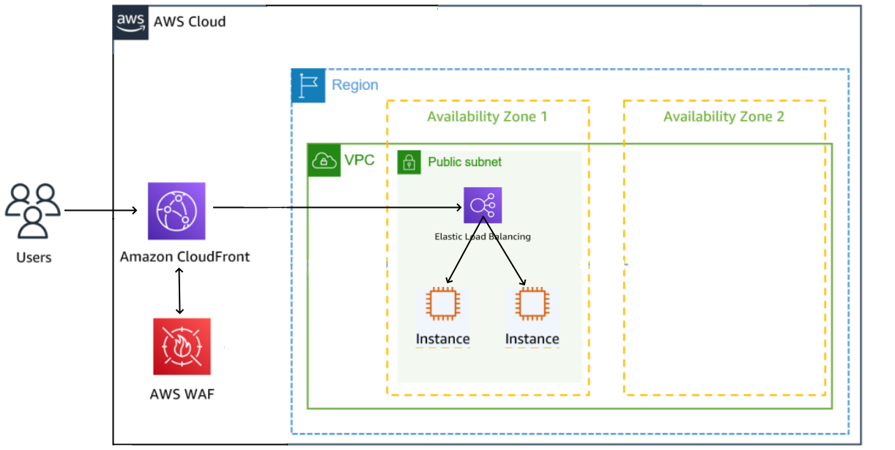

# USJ Workshop Architecture



## EC2 Ami Linux 2023 (user-data)
```
#!/bin/bash 
dnf update -y 
dnf install -y docker 
service docker start 
systemctl enable docker.service
docker pull santospardos/usj:juiceshop
docker run -d -p 80:3000 santospardos/usj:juiceshop
```

## ELB
```
TG 
ALB
(default options)
```
## CloudFront - WAF 
```
Setup a distribution with ALB like origin.
```
## SQL Inyection and Cross-site scripting attacks
```
export JUICESHOP_URL=xxxxxxxALB-DNSxxxxxxxx
curl -X POST  $JUICESHOP_URL -F "user='<script><alert>Hello></alert></script>'"
curl -X POST $JUICESHOP_URL -F "user='AND 1=1;"
```


