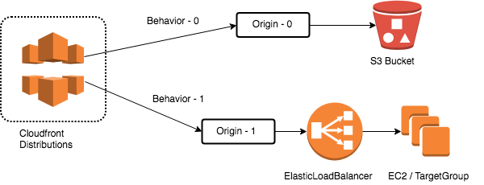

# Challenge: Full Stack - Car Repair Website - (Route 53 - Cloudfont - ACM - S3 - ALB - EC2)
## Frontend - Static  - Html JS CSS
## Backend  - Dynamic - NodeJs
(It is not a step-by-step lab)





# Frontend 

## S3
```
wget https://s3.eu-west-1.amazonaws.com/www.profesantos.cloud/car-repair.zip

{
    "Version": "2008-10-17",
    "Id": "Policy",
    "Statement": [
        {
            "Effect": "Allow",
            "Principal": {
                "AWS": "*"
            },
            "Action": "s3:GetObject",
            "Resource": "arn:aws:s3:::your-bucket/*"
        }
    ]
}
```
```
Install a Static Website with S3
You can follow this video: 
https://youtu.be/xXCnaMxWUDk
```

## Cloudfront (2 origns - 2 behaviors)

Change the xxxx for the right value
```
{
    "Version": "2008-10-17",
    "Id": "PolicyForCloudFrontPrivateContent",
    "Statement": [
        {
            "Sid": "AllowCloudFrontServicePrincipal",
            "Effect": "Allow",
            "Principal": {
                "Service": "cloudfront.amazonaws.com"
            },
            "Action": "s3:GetObject",
            "Resource": "arn:aws:s3:::xxxxxxxxxxxx/*",
            "Condition": {
                "StringEquals": {
                    "AWS:SourceArn": "arn:aws:cloudfront::xxxxxxxxx:distribution/xxxxxxxxxxx"
                }
            }
        }
    ]
}
```
```
Cloudfront Example following the next video:
https://youtu.be/_3OSA2tvwk4
```

# Backend  (Nodejs port 18000)

## EC2
SG with 18000 port open inbound rule.

```
#!/bin/bash
apt update -y
apt upgrade -y
apt install nodejs -y
apt install npm -y
apt install git -y
npm install express -y
npm install -g pm2 -y
```
Download and install Nodejs API
```
git clone https://github.com/santos-pardos/dealcar-node-api
npm install
pm2 start npm -- start
curl localhost:18000
http://public-ip:18000/accounts/
http://public-ip:18000/accounts/1
http://public-ip:18000/accounts/1/cars/
```

## ALB
TG : Port 18000. Health Check Overrride 18000.

ALB: Port: 80

# Links
```
https://awstip.com/deploying-a-nodejs-application-with-aws-ec2-ssl-and-a-load-balancer-38885230fc6f
https://github.com/santos-pardos/dealcar-node-api
https://s3.eu-west-1.amazonaws.com/www.profesantos.cloud/car-repair.zip
```
# Video
https://youtu.be/YD-XqH_2HF8

# Links
https://www.appsloveworld.com//amazon-ec2/2/using-same-domain-name-for-frontend-and-backend-deployment-in-aws


