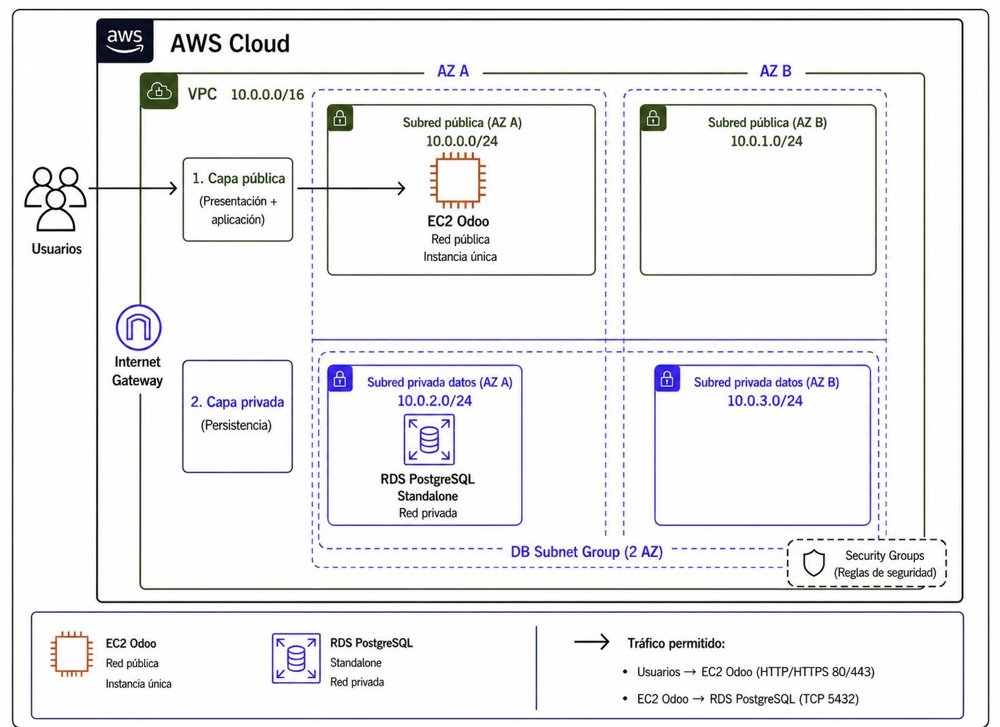

# Architecture


# Odoo - 2 Tier - EC2 - RDS

# VPC
```
* Crear VPC 10.0.0.0/16
* Crear subredes publicas 10.0.1.0/24 10.0.2.0/24 y privadas 10.0.3.0/24 10.0.4.0/24
```
# RDS Postgres
```
bbdd: odoo
user: odoo
password: A123456b
DB subnet group: 2 subredes privadas
```
# EC2   (Odoo User: admin   / Password: admin)
```
#!/bin/bash
set -eux

# =========================
# Variables
# =========================
DB_HOST="odoo-server-4k5k6ñ7.rds.amazonaws.com"
DB_PORT="5432"
DB_NAME="odoo"
DB_USER="odoo"
DB_PASSWORD="A123456b"

ODOO_VERSION="19.0"

# =========================
# Instalar Docker en Ubuntu
# =========================
apt-get update -y
apt-get install -y docker.io

systemctl enable docker
systemctl start docker

usermod -aG docker ubuntu || true

# =========================
# Preparar carpetas persistentes
# =========================
mkdir -p /opt/odoo/data
mkdir -p /opt/odoo/addons

chmod -R 777 /opt/odoo

# =========================
# Descargar imagen Odoo
# =========================
docker pull odoo:${ODOO_VERSION}

# =========================
# Inicializar base de datos Odoo
# Crea las tablas necesarias en la BBDD "odoo"
# =========================
docker run --rm \
  --name odoo19-init \
  -e HOST="${DB_HOST}" \
  -e PORT="${DB_PORT}" \
  -e USER="${DB_USER}" \
  -e PASSWORD="${DB_PASSWORD}" \
  -v /opt/odoo/data:/var/lib/odoo \
  -v /opt/odoo/addons:/mnt/extra-addons \
  odoo:${ODOO_VERSION} \
  odoo \
    -d "${DB_NAME}" \
    -i base \
    --without-demo=all \
    --stop-after-init

# =========================
# Arrancar Odoo 19
# =========================
docker run -d \
  --name odoo19 \
  --restart unless-stopped \
  -p 80:8069 \
  -p 8072:8072 \
  -e HOST="${DB_HOST}" \
  -e PORT="${DB_PORT}" \
  -e USER="${DB_USER}" \
  -e PASSWORD="${DB_PASSWORD}" \
  -v /opt/odoo/data:/var/lib/odoo \
  -v /opt/odoo/addons:/mnt/extra-addons \
  odoo:${ODOO_VERSION} \
  odoo \
    -d "${DB_NAME}" \
    --db-filter="^${DB_NAME}$" \
    --proxy-mode \
    --workers=2 \
    --gevent-port=8072
```


