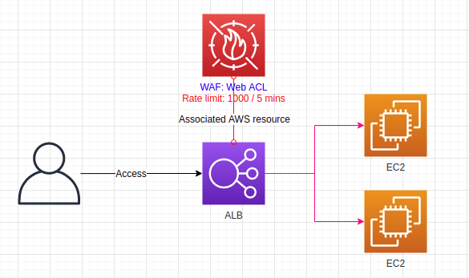

# USJ Workshop Architecture



## 2 x EC2 user-data
```
#!/bin/bash 
dnf update -y 
dnf install -y docker 
service docker start 
systemctl enable docker.service
docker pull santospardos/upc:juiceshop
docker run -d -p 80:3000 santospardos/upc:juiceshop
```

## EC2 user-data
```
TG
ALB
```

## WAF - SQL Inyection and Cross-site scripting attacks
```
export JUICESHOP_URL=xxxxxxxALB-DNSxxxxxxxx
curl -X POST  $JUICESHOP_URL -F "user='<script><alert>Hello></alert></script>'"
curl -X POST $JUICESHOP_URL -F "user='AND 1=1;"
```


