# AWS Solutions Architect Associate - Laboratorio 01

<br>

### Objetivo: 
* Construcción de una VPC usando subnet públicas (ruteando a través de un Internet Gateway) y subnets privadas (ruteando a través de un NAT Instances)
* Configuración de un NAT Instances

### Tópico:
* Networking

<br>

---

<br>

### A - Actividades Técnicas

<br>

1. Acceder al servicio VPC, luego al features "Your VPCs". Dar clic en "Create VPC".

<br>

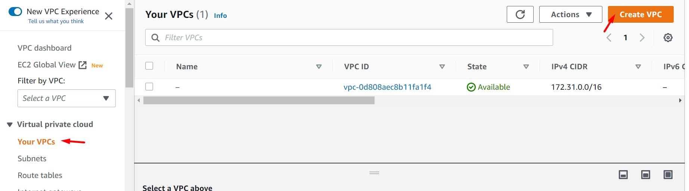

<br>

2. Ingresar los siguientes valores. Dejar los otros valores por defecto.
  * **Name Tag:** VPC PROD
  * **IPv4 CIDR:** 192.168.0.0/16

<br>

3. Analizar los siguientes valores. Luego, seleccionar el registro creado > "Actions" > "Edit DNS Hostnames". Dar clic en el checkbox "Enable". Guardar cambios.

  * Default VPC
  * DHCP Option set
  * IPv4 CIDR
  * DNS Hostnames
  * Main route table
  * DNS Resolution
  * Main network ACL

<br>

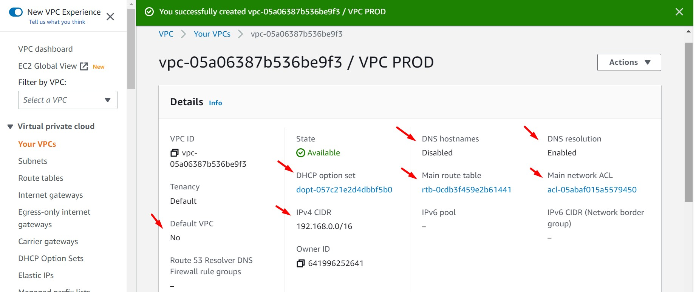

<br>

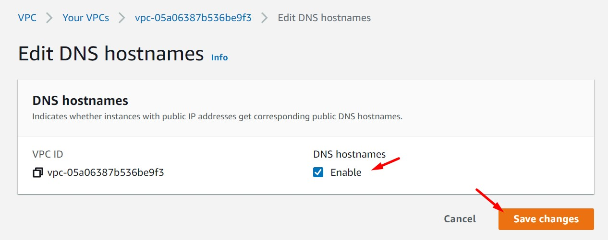

<br>

4. Ir a la opción "Subnets". Se visualizarán las subnets de la VPC por defecto. Dar clic en el botón "Create subnet".

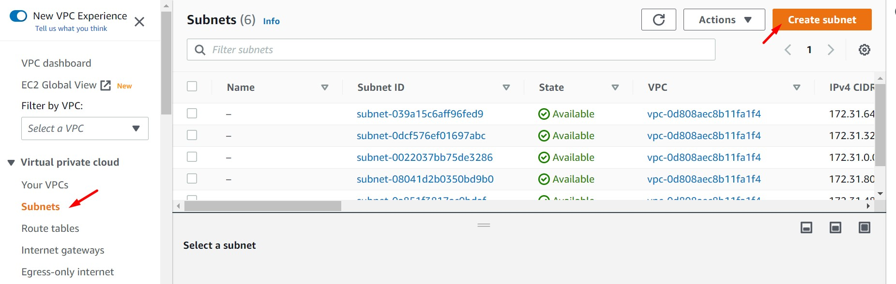

<br>

5. Seleccionar la VPC creada anteriormente. Guiarse por el Tag "VPC PROD". Generaremos las siguientes 4 subnets (dos subnets públicas y dos subnets privada. De estas una subnet pública y una subnet privada en la zona de disponibilidad "A" y la otra subnet pública y subnet privada en la zona de disponibilidad "B"). 

<br>

 * Subnet Name: SUBNET PUBLICA PROD AZ A
 * Availability Zone: us-east-1a
 * IPv4 CIDR block: 192.168.1.0/24

<br>

 * Subnet Name: SUBNET PUBLICA PROD AZ B
 * Availability Zone:us-east-1b
 * IPv4 CIDR block: 192.168.2.0/24

<br>

 * Subnet Name: SUBNET PRIVADA PROD AZ A
 * Availability Zone: us-east-1a
 * IPv4 CIDR block: 192.168.3.0/24

<br>

 * Subnet Name: SUBNET PRIVADA PROD AZ B
 * Availability Zone: us-east-1b
 * IPv4 CIDR block: 192.168.4.0/24

<br>

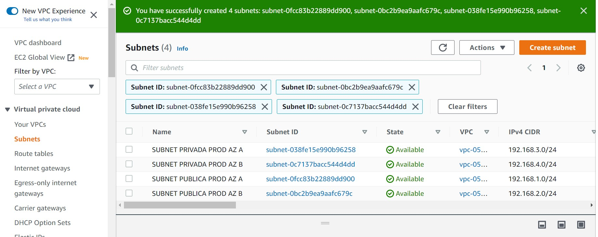

<br>

6. Por cada subnet pública generada (SUBNET PUBLICA PROD AZ A y SUBNET PUBLICA PROD AZ B), dar clic en el botón "Actions", luego dar clic en la opción "Edit subnet settings". Luego dar clic en el checkbox "Enable auto-assign public IPv4 address".

<br>

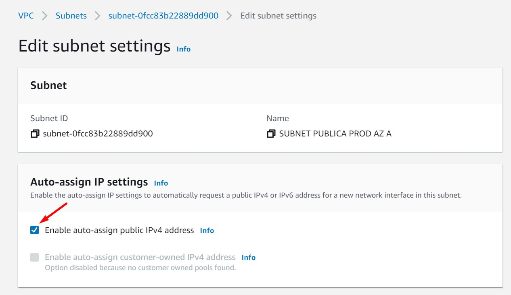

<br>

7. Ir a la sección "Internet Gateway". Dar clic en el botón "Create internet gateway". Luego ingresar el nombre "IG PROD" y dar clic en el botón "Create Internet Gateway"

<br>

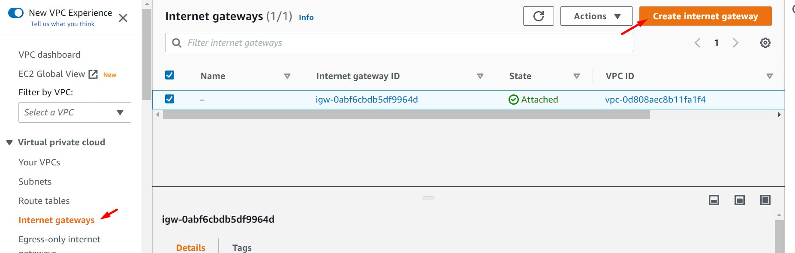

<br>

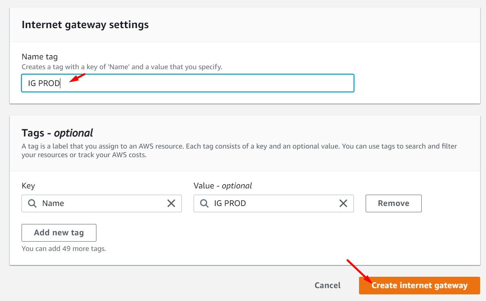

<br>

8. Se validará que el "Internet Gateway" se encuentra en estado "Detached". Seleccionar el registro, luego dar clic en "Actions" y luego en "Attach to VPC". Seleccionar la VPC creada anteriormente y dar guardar cambios. El nuevo estado del "Internet Gateway" será "Attached"

<br>

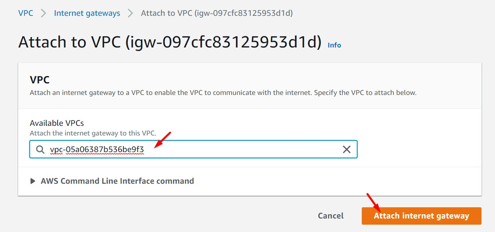

<br>

9. Ir a la sección "Route Tables". Identificar el route table correspondiente a nuestra VPC, en la tabla visualizar la columna "VPC" y realizar la identificación del recurso. Seleccionar el "Route Table" correcto y en la parte inferior dar clic en el tab Routes. Se visualizará un sólo registro ingresado por defecto.

<br>

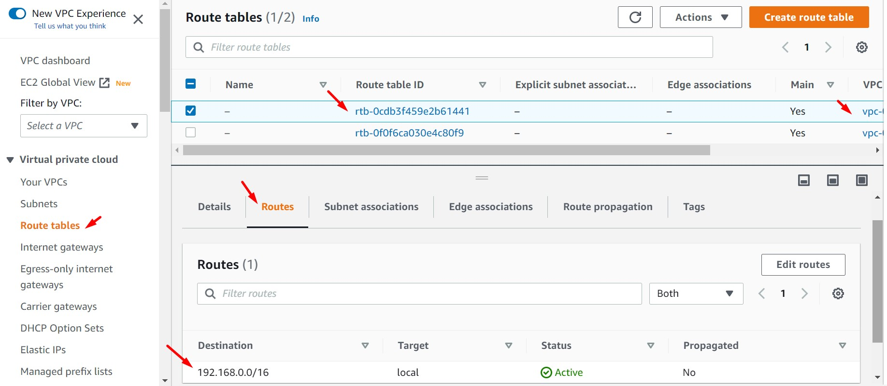

<br>

10. Dar clic en el botón "Edit Routes", agregar un nuevo registro con los siguientes valores. Una vez realizada esta configuración el "Route Table" tendrá dos registros. 

  * Destination: 0.0.0.0/0
  * Target: Internet Gateway 

<br>


<br>

11. Nos dirigimos al servicio EC2 y generamos una instancia NAT con las siguientes características. Valores no detallados a continuación dejarlos por defecto. Luego dar clic en el botón "Launch Instance"

  * AMI ID: ami-0cc6fa590dc4d36eb (Community AMI, ID Válido sólo para la región N. Virginia)
  * Instance Type: t2.micro
  * Key Pair: Generar un par de llaves ("Key Pair Type": RSA y "Private key file format:" .pem). Se recomienda usar el nombre "aws-solutionsarchitectassociate"
  * Network Settings:
    * VPC: Seleccionar la VPC creada anteriormente - VPC PROD
    * Subnet: Seleccionar la subnet creada anteeriormente - SUBNET PUBLICA PROD AZ B
    * Auto-assing public IP: Enable
    * Firewall (security groups): Create security group
      * Security Group Name: sg_nat
      * Description: sg_nat
      * Inbound security groups rules:
        * Type: All Traffic
        * Source Type: Anywhere

<br>

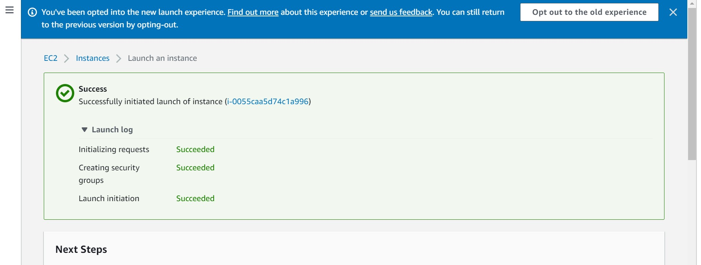

<br>

12. Desde la consola de EC2, seleccionar la instancia NAT previamente creada, dar clic en la opción "Actions", luego seleccionar "Networking" y seguidamente "Chage source/destination check". Desde la nueva ventana, habilitar el checkbox "Source/ destination checking" - Stop. Dar clic en "Save".

<br>

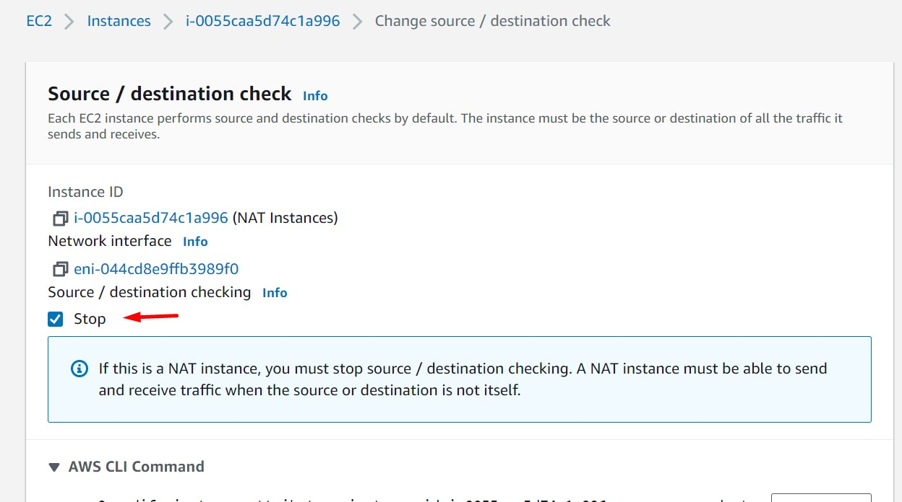

<br>

13. Hasta el momento tenemos:
  * Una VPC correctamente configurada
  * 02 Subnet Públicas correctamente configuradas que usan el Internet Gateway para salir a internet
  * El depliegue de una NAT Instances un la subnet "SUBNET PUBLICA PROD AZ B"

<br>

14. Regresamos al servicio "VPC" vamos la opción "Route Table" y damos clic en el botón "Create Route Table". Ingresamos por nombre "RT PRIVADA PROD" y seleccionamos la VPC creada anteriormente. Damos clic en "Create Route Table"

<br>

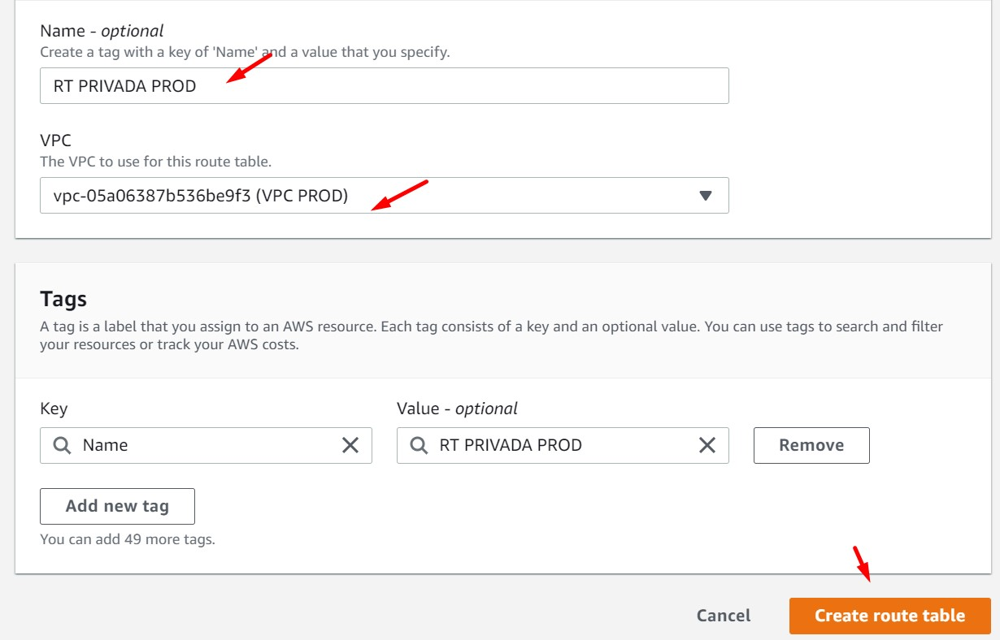

<br>

15. Renombramos a nuestra primera "Route Table" (Route Table donde ejecutamos los pasos 9 y 10) como "RT PUBLICA PROD". 

16. Accedemos a la "Route Table" "RT PUBLICA PROD". Nos dirigimos a la pestaña "Subnet associations" y damos clic en el botón "Edit subnet associations". Seleccionamos las dos subnets **públicas** respectivas. Damos clic en "Save associations"

<br>

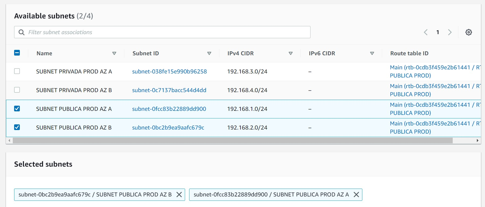

<br>

17. Accedemos a la "Route Table" "RT PRIVADA PROD". Nos dirigimos a la pestaña "Subnet associations" y damos clic en el botón "Edit subnet associations". Seleccionamos las dos subnets **privadas** respectivas. Damos clic en "Save associations"

<br>

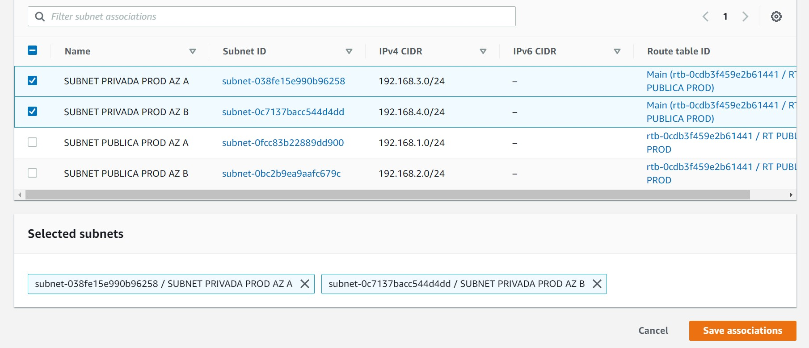

<br>

18. Accedemos nuevamente a la "Route Table" "RT PRIVADA PROD". Nos dirigimos a la pestaña "Routes" y damos clic en el botón "Edit routes". Agregamos una ruta a través del botón "Add route" según se detalla a continuación. Guardamos los cambios.

  * Destination: 0.0.0.0/0
  * Target: Instances (Seleccionar la NAT Instances aprovisionada en pasos anteriores)

<br>

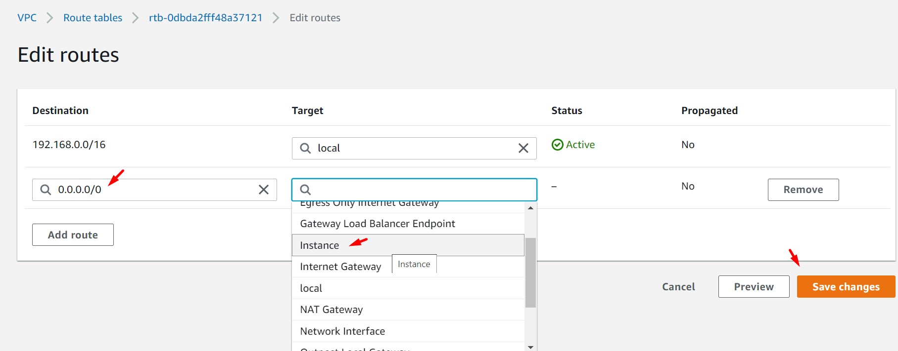

<br>

19. Como resultado de la configuración anterior visualizamos el ID de la tarjet de red de la NAT Instancia. Según imagen: "eni-044cd8e9ffb3989f0".

<br>

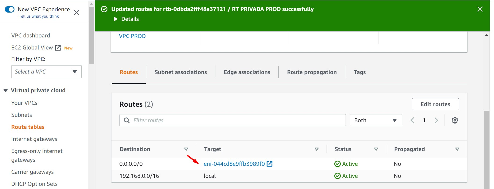

<br>

20. Hasta el momento tenemos aprovisionado los siguientes features:
  * Una VPC correctamente configurada
  * 02 Subnet Públicas correctamente configuradas que usan el Internet Gateway para salir a internet
  * El depliegue de una NAT Instances un la subnet "SUBNET
  * 02 Subnet Privadas correctamente configuradas que usan un NAT Instances para salir a internet

<br>


---
<br>

### B - Validaciones

<br>

21. Generaremos dos instancias EC2 (PROD BACKEND y PROD DB). La primera ubicada en la subnet pública "SUBNET PUBLICA PROD AZ A" y la segunda instancia ubicada en la subnet privada "SUBNET PRIVADA PROD AZ A". Ambas instancias tendrán las siguientes configuraciones:

  * AMI ID: Ubuntu 18.04 LTS (HVM), SSD Volume Type
  * Instance Type: t2.micro
  * Key Pair: "aws-solutionsarchitectassociate"
  * Network Settings:
    * VPC: Seleccionar la VPC creada anteriormente - VPC PROD
    * Subnet: Seleccionar la subnet respectiva
    * Firewall (security groups): Create security group
      * Security Group Name: sg_app
      * Description: sg_app
      * Inbound security groups rules:
        * Type: All Traffic
        * Source Type: Anywhere

<br>

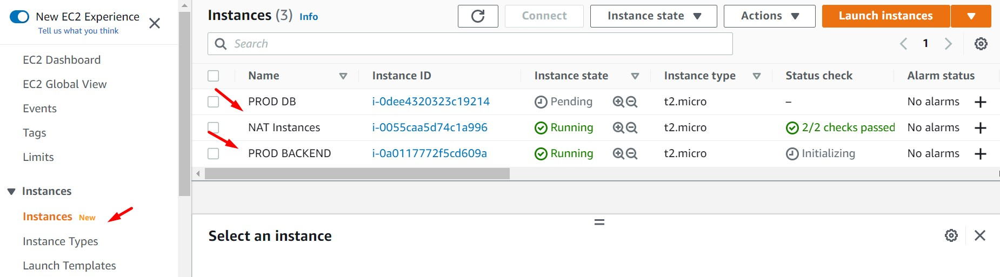

<br>

22. Desde el servicio EC2, nos dirigimos a la opción "Network & Security - Network Interfaces". Identificamos el registro al cual pertenece la Instancia NAT (filtrar por el nombre del grupo de seguridad sg_nat). Identificamos el valor "Private IPv4 address". Para este ejemplo el valor es 192.168.2.182.

<br>

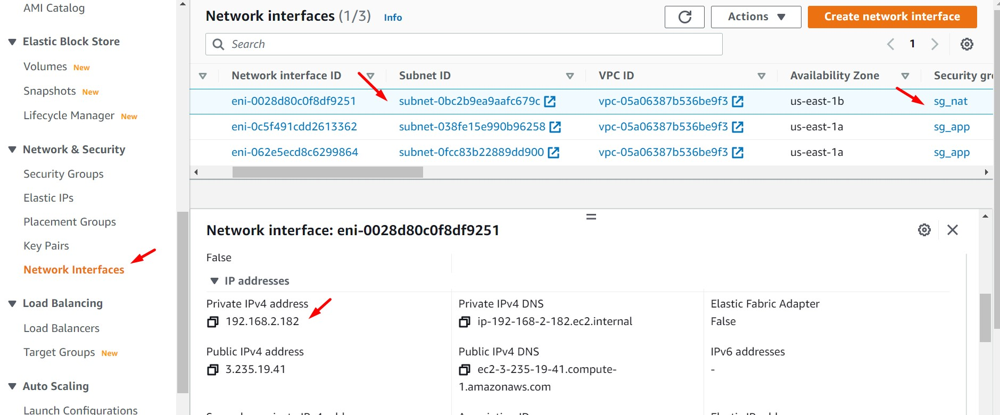

<br>

23. Accedemos a ambas instancias EC2 y ejecutamos los siguientes comandos:

  * PROD BACKEND: Identificamos el valor de la IP Pública de la instancia y ejecutamos el siguiente comando. Reemplazar la IP Pública y el nombre del Key Pair respectivo.

  ```bash
  #Acceso a la instancia EC2 PROD BACKEND
  ssh -i .\aws-solutionsarchitectassociate.pem ubuntu@54.83.149.156 

  #Comandos a ejecutar
  sudo su
  sudo apt-get update
  sudo apt-get install traceroute
  traceroute google.com

  ```

<br>

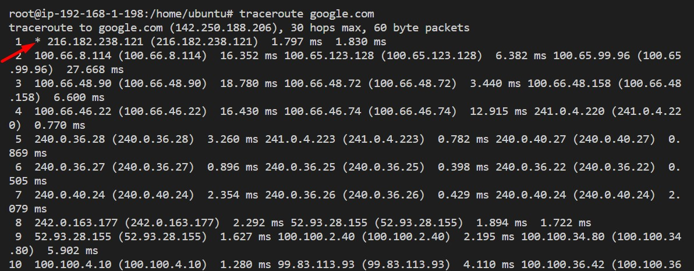

<br>


  * PROD DB: Accedemos a la instancia PROD BACKEND, copiamos el contenido del Key Pair en esta instancia y desde aquí nos conectamos a la instancia PROD DB. Reemplazar la IP Privada y el nombre del Key Pair respectivo.

  ```bash
  #Acceso a la instancia EC2 PROD BACKEND
  cd /home/ubuntu
  touch aws-solutionsarchitectassociate.pem
  chmod 400 aws-solutionsarchitectassociate.pem
  nano aws-solutionsarchitectassociate.pem
  [Copiar el contenido de la llave a este archivo]
  ssh -i aws-solutionsarchitectassociate.pem ubuntu@192.168.3.120

  #Comandos a ejecutar
  sudo su
  sudo apt-get update
  sudo apt-get install traceroute
  traceroute google.com

  ```

<br>

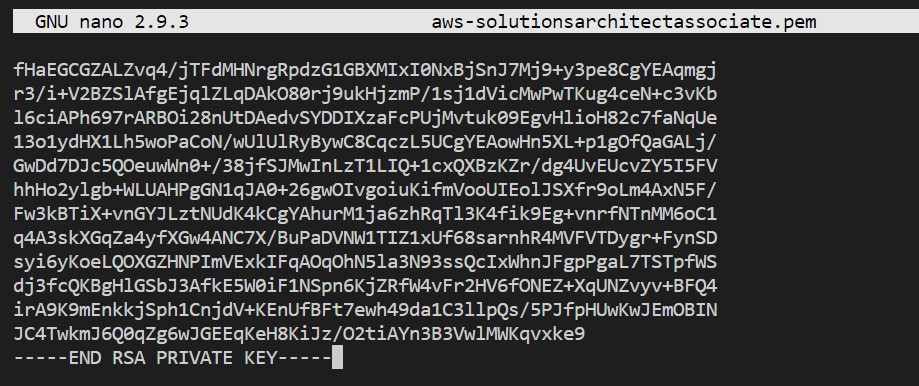

<br>

<br>

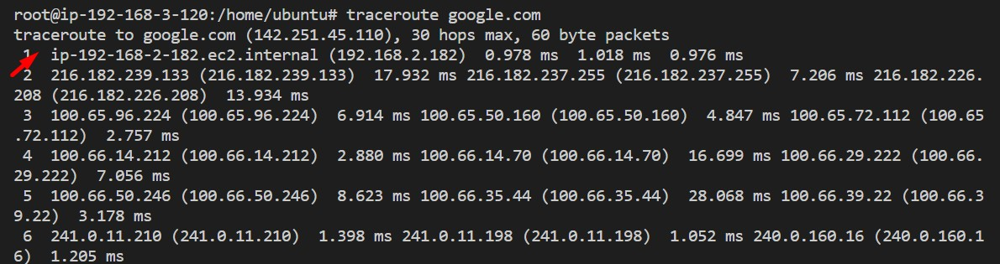

<br>


24. Según nuestra última imagen, podemos visualizar que la instancia "PROD DB" sale hace internet a través de la IP 192.168.2.182. Esta IP corresponde a la instancia "NAT Instances". Este comportamiento no se visualiza en la instancia "PROD BACKEND".

