# AWS Solutions Architect Associate - Laboratorio 02

<br>

### Objetivo: 
* Asociar volumen EBS
* Aumentar tamaño del volumen EBS
* Reconocimiento del servicio KMS (Key Management Service)

### Tópico:
* Storage
* Security

### Dependencias:
* Implementación del Laboratorio 01
* Si queremos continuar con este laboratorio sin tener que implementar manualmente el "Laboratorio 01", ejecutar la plantilla de CloudFormation "lab02_cloudformation_ec2_db.yaml" ubicado en la carpeta "code".

<br>

---

<br>

### A - Asociar volumen EBS

<br>

1. Accedemos a la instancia PROD BACKEND y ejecutamos los siguientes comandos:

```bash
sudo su
sudo apt-get update
```

2. Ingresar al servicio EC2 y al features "Elastic Block Store - Volumes". Dar clic en el botón "Create volume".

<br>

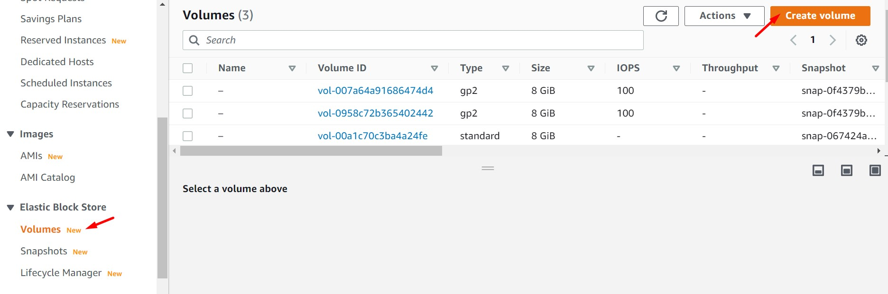

<br>

3. Crear un nuevo volumen con las siguientes  características:

  * Volume type: SSD (gp2)
  * Size (GiB): 8
  * Availability Zone: us-east-1a. (La zona de disponibilidad debe corresponde con la zona de disponibilidad donde se encuentra la instancia PROD BACKEND)
  * Encryption: Encrypt this volume
  * KMS Key: (default) aws/ebs


4. Se valida la creación del volumen EBS. El nuevo volumen presenta el estado "Available". Adjuntamos este volumen a la instancia PROD BACKEND. Modificamos el valor de "Device name" por "/dev/sdf"

<br>

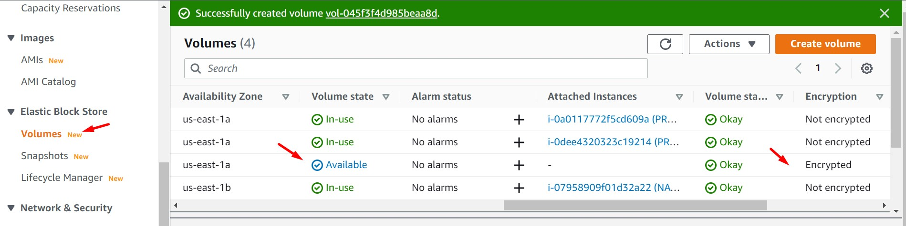

<br>

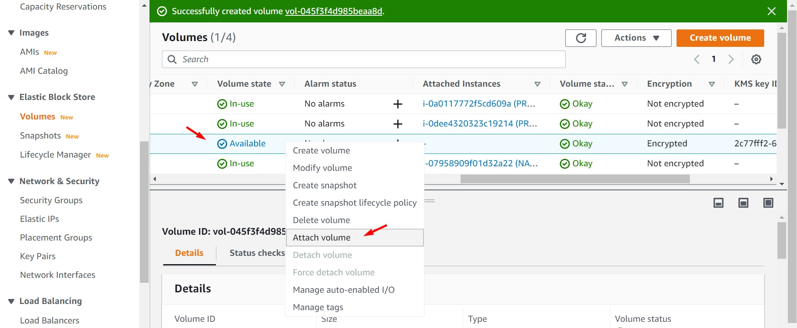

<br>

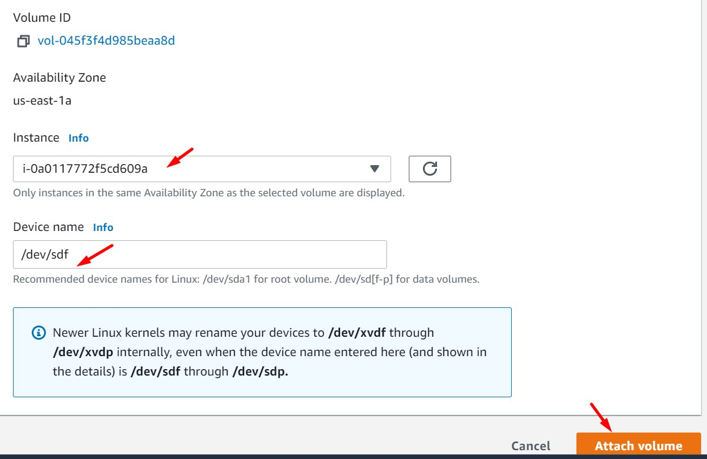

<br>


5. Accedemos nuevamente a la instancia EC2. El volumen EBS ha sido montado a nivel cloud, está pendiente montarlo a nivel de Sistema Operativo. Ejecutar los siguientes comandos.


```bash
#Mount disk (EBS)
lsblk -fm
sudo mkfs -t ext4 /dev/xvdf
sudo mount /dev/xvdf /opt
export UUID=$(lsblk -fm | grep xvdf | awk '{print $3}')
echo "UUID=$UUID  /opt  ext4  defaults,nofail  0  2" >> /etc/fstab
sudo mount -a
lsblk -fm
```
<br>

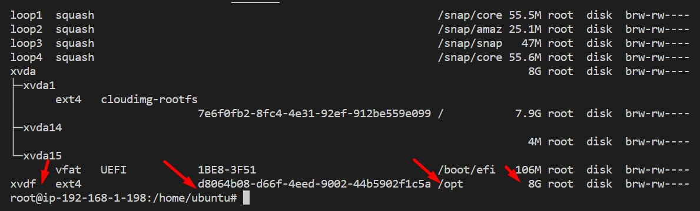

<br>

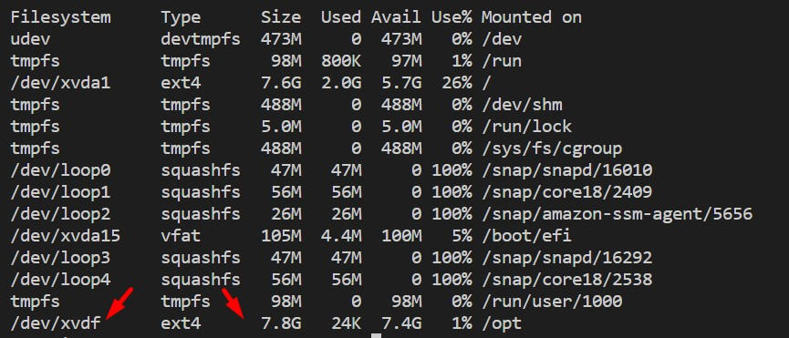

<br>

6. Accedemos al servicio KMS (Key Management Service) y luego accedemos a la opción "AWS managed keys". Buscamos el alias "aws/ebs" y accedemos al mismo. Analizar el contenido.

<br>

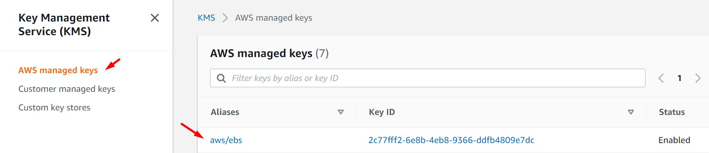

<br>

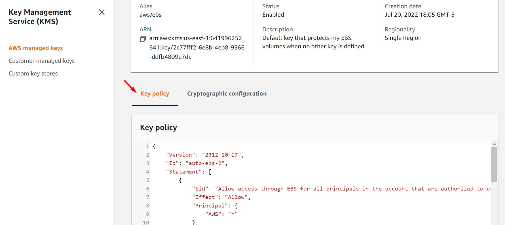

<br>

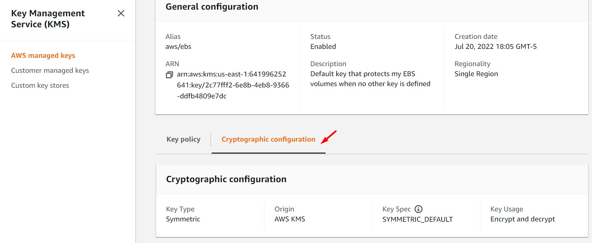

<br>

---

<br>

### B - Aumentar tamaño del volumen EBS

<br>

7. Accedemos al servicio EC2, opción "Volumes" y seleccionamos el volumen EBS con el que hemos estado interactuando. Luego, dar clic en "Actions" y "Modify volume". Modificar el valor del disco a 10 GiB. Aceptar cambios. El proceso demora unos minutos en completarse.

<br>

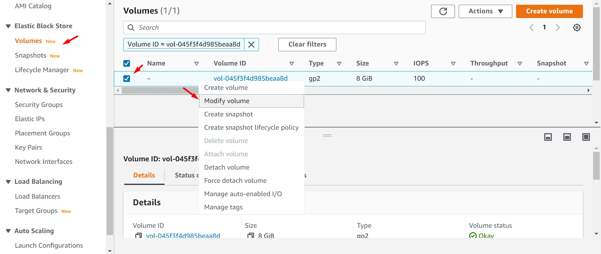

<br>

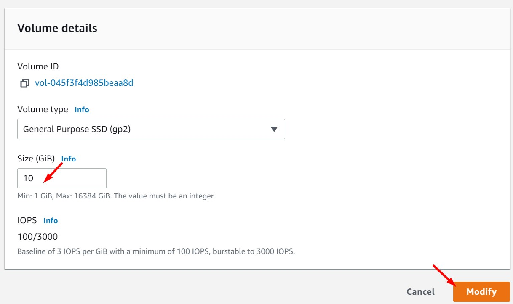

<br>


8. Finalizado los cambios a nivel de volumen EBS (Volume state en "In-use") accedemos a la instancia EC2 y ejecutamos los siguientes comandos para asignar el nuevo espacio a nivel de Sistema Operativo.

```bash
#Mount disk (EBS)
df -hT
lsblk -fm
sudo resize2fs /dev/xvdf
df -hT
```

<br>


<br>


<br>

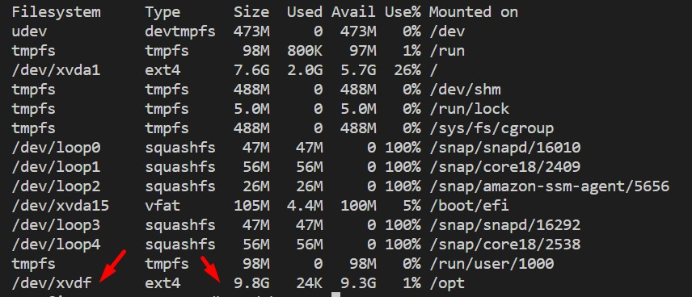

