# AWS Solutions Architect Associate - Laboratorio 03

<br>

### Objetivo: 
* Instalación y configuración del Backend en la instancia EC2. Uso de AWSCLI y la metadata en la instancia EC2
* Configuración de "Static website hosting" en S3 (Front) 
* Instalación y configuración de la base de datos en la instancia EC2. 

### Tópico:
* Compute
* Storage

### Dependencias:
* Implementación del Laboratorio 01
* Implementación del Laboratorio 02

<br>

---

<br>

### A - Instalación y configuración del Backend en la instancia EC2

<br>

1. Accedemos a la instancia PROD BACKEND y ejecutamos los siguientes comandos:

```bash
sudo su
sudo apt-get update
sudo apt-get install awscli -y
aws --version

#Descarga del proyecto e Instalación Nodejs
cd /opt
git clone https://github.com/jbarreto7991/aws-solutionsarchitectassociate.git
curl -sL https://deb.nodesource.com/setup_12.x | sudo -E bash -
sudo apt install nodejs -y
node --version
npm --version

#Obteniendo IP Pública de la instancia EC2 y almacenarla como variable
PUBLIC_IP=$(curl http://169.254.169.254/latest/meta-data/public-ipv4)
echo $PUBLIC_IP

#Reemplazando parámetro en archivo de configuración de la carpeta frontend del proyecto
sed 's+http://$PUBLIC_IP/v1+http://'"$PUBLIC_IP"'/v1+g' /opt/aws-solutionsarchitectassociate/App/frontend/src/config/axios.js >> /opt/aws-solutionsarchitectassociate/App/frontend/src/config/bk_axios.js
rm /opt/aws-solutionsarchitectassociate/App/frontend/src/config/axios.js
mv /opt/aws-solutionsarchitectassociate/App/frontend/src/config/bk_axios.js /opt/aws-solutionsarchitectassociate/App/frontend/src/config/axios.js
cat /opt/aws-solutionsarchitectassociate/App/frontend/src/config/axios.js

#Compilar Frontend
cd /opt/aws-solutionsarchitectassociate/App/frontend
npm install
npm run build

```

---

<br>

### B - Configuración de "Static website hosting" en S3

<br>

2. Accedemos al servicio S3 y creamos un bucket a través del botón "Create Bucket"

<br>

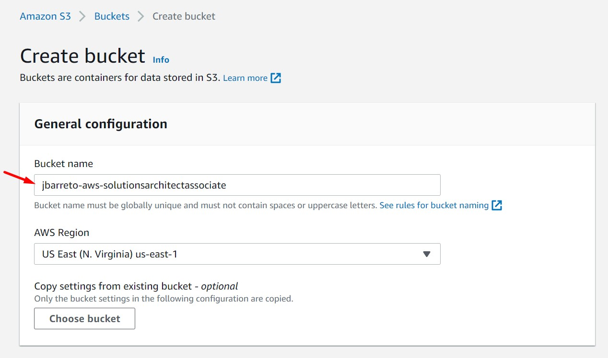

<br>

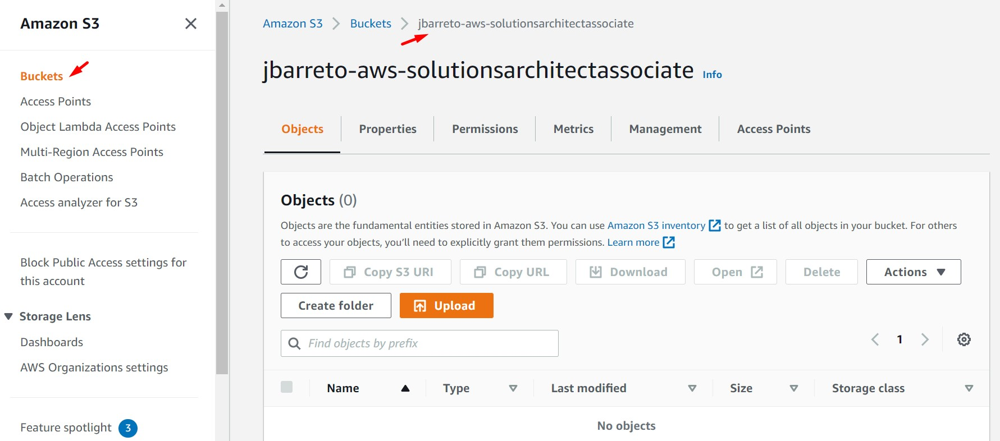

<br>

3.  Habilitamos las propiedades de "Static website hosting" a través de 3 pasos.

4. Paso 01 - Ir a la sección "Properties", luego a la sección "Static website hosting". Dar clic en el botón "Edit" y luego seleccionar la opción "Enable". Ingresar los siguientes valores y dar clic en "Save changes"

  * Hosting type: Host a static website
  * Index document: index.html
  * Error document: index.html

<br>

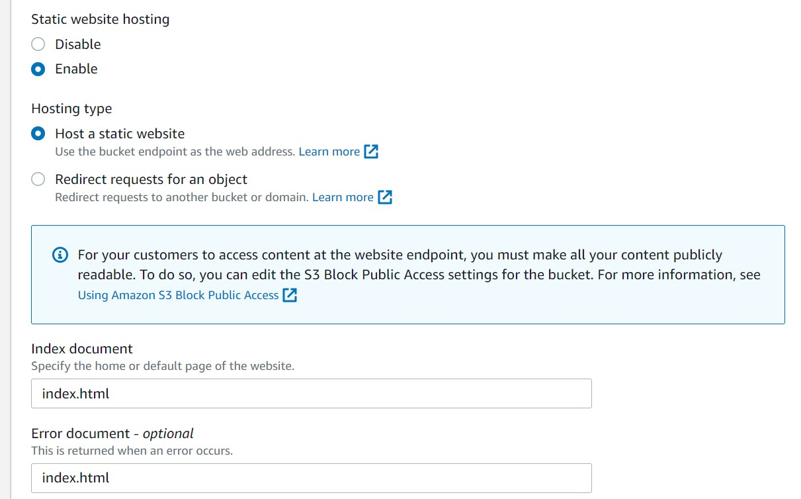

<br>

5. La configuración de "Static website hosting" expondrá un endpoint, para este ejemplo el endpoint será "http://jbarreto-aws-solutionsarchitectassociate.s3-website-us-east-1.amazonaws.com "

<br>

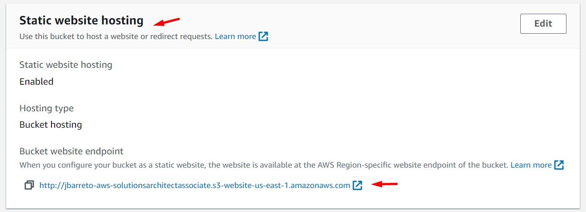

<br>

6. Paso 02 - Ir a la sección "Permissions", luego ir a la sección "Block public access (bucket settings)" y dar clic en "Edit". Luego, dar clic en "Block all public access" y guardar los cambios.

<br>

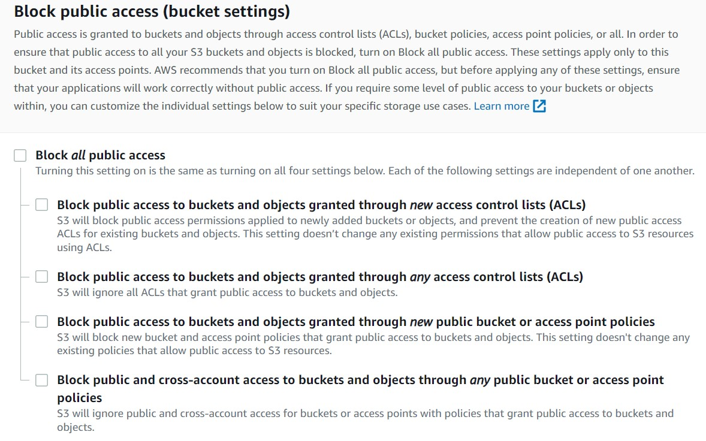

<br>

7. Paso 03 - Ir a la sección "Permissions", luego ir a la sección "Bucket policy" y agregar la siguiente política. Reemplazar la variable "BUCKET NAME" por el nombre del Bucket creado en el paso 2. 

<br>

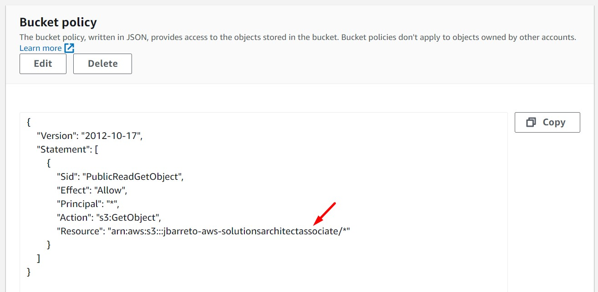

<br>

```bash
{
    "Version": "2012-10-17",
    "Statement": [
        {
            "Sid": "PublicReadGetObject",
            "Effect": "Allow",
            "Principal": "*",
            "Action": [
                "s3:GetObject"
            ],
            "Resource": [
                "arn:aws:s3:::BUCKET-NAME/*"
            ]
        }
    ]
}
```

<br>

8. Crear un usuario IAM desde la opción "Users".

    * User name: aws-solutionsarchitectassociate
    * Policy: AmazonS3FullAccess 

<br>

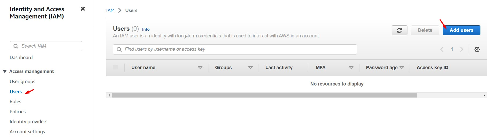

<br>

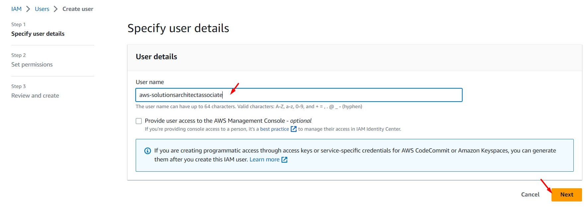

<br>

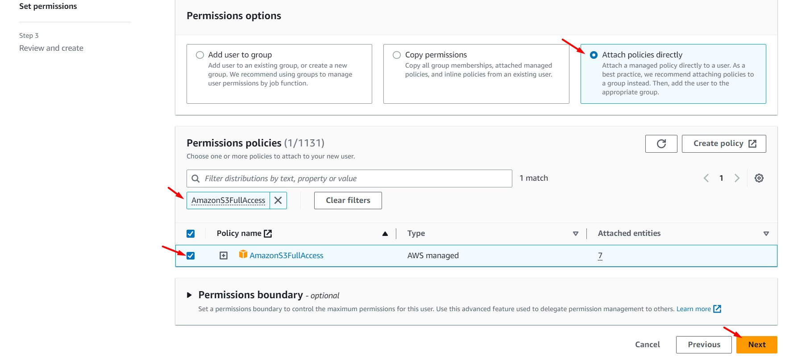

<br>

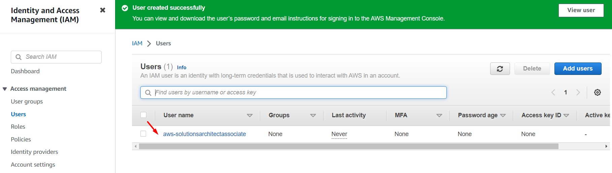

<br>

9. Accedemos a las propiedades del usuario IAM creado y procedemos a generar "Access Keys". Guardaremos el "Access Key" y el "Secret access key" de forma segura. Estos accesos serán usados vía AWSCLI en la instancia EC2.

<br>

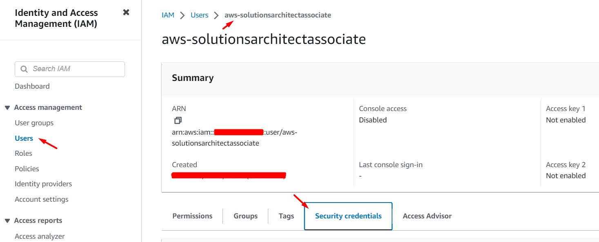

<br>

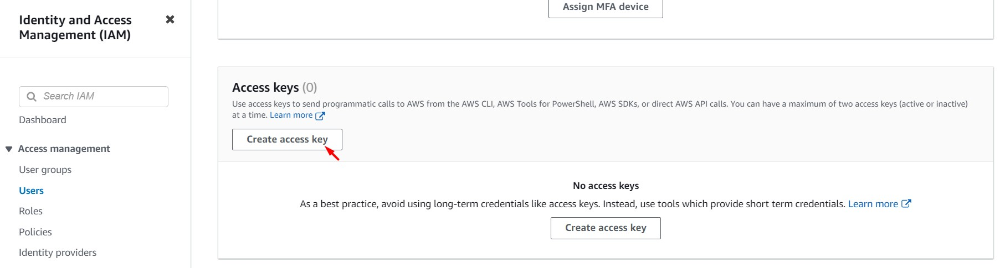

<br>

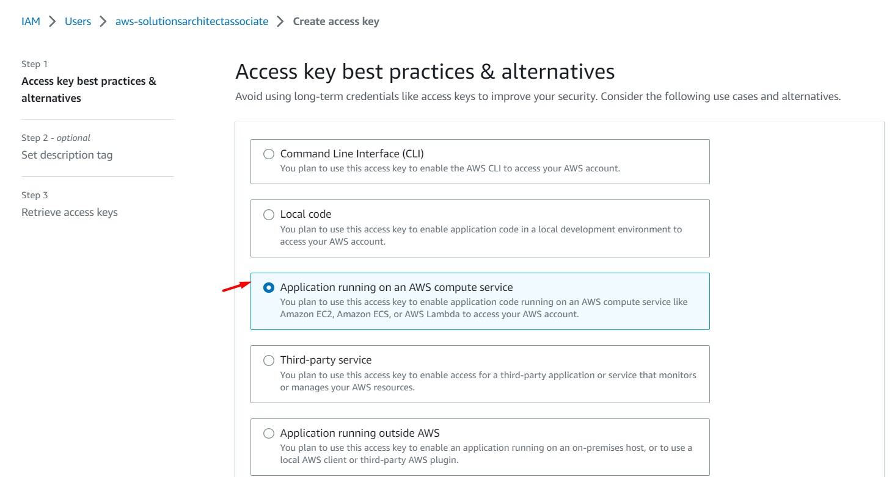

<br>

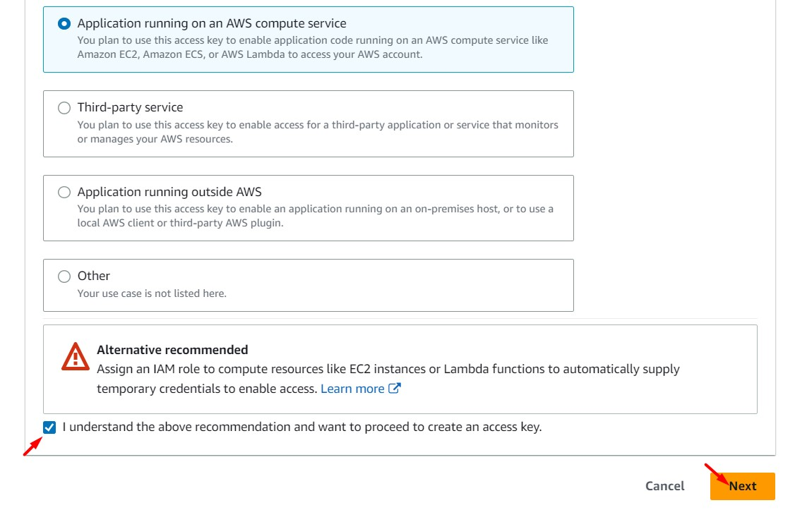

<br>

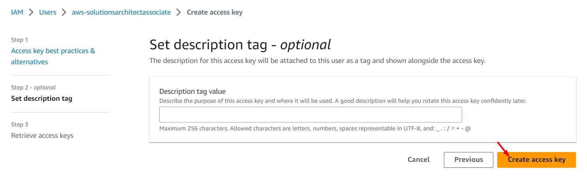

<br>

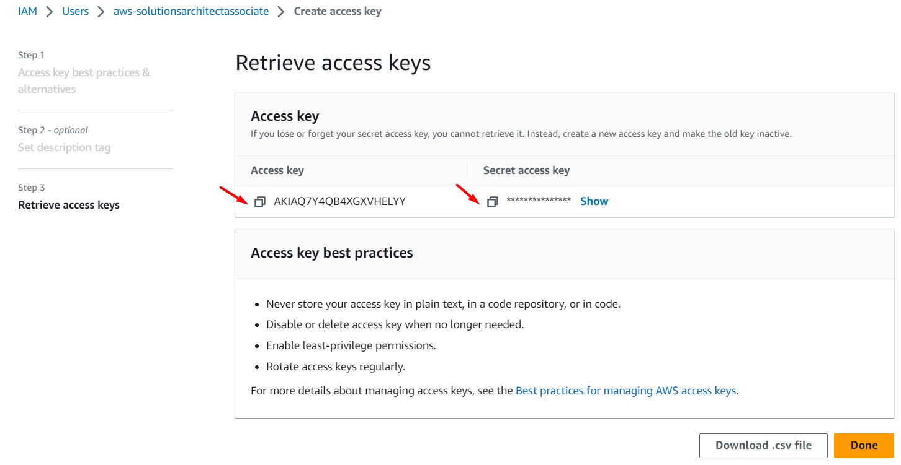

<br>

10. Ingresar nuevamente a la instancia EC2 y ejecutar los siguientes comandos

```bash

aws configure
#AWS Access Key ID: Ingresar valor previamente generado
#AWS Secret Access Key: Ingresar valor previamente generado
#Default region name: Por defecto
#Default output format: Por defecto

#Carga de archivos al Bucket S3
cd /opt/aws-solutionsarchitectassociate/App/frontend/build/
BUCKET=$(aws s3 ls | sort -r | awk 'NR ==1 { print $3 }')
echo $BUCKET
aws s3 sync . s3://$BUCKET
```

11. Ingresar al bucket generado. Desde la pestaña "Objects" se observará los objetos cargados al bucket desde la instancia EC2. Desde la pestaña "Properties" y la sección "Static website hosting" accederemos al endpoint de nuestra aplicación 

<br>

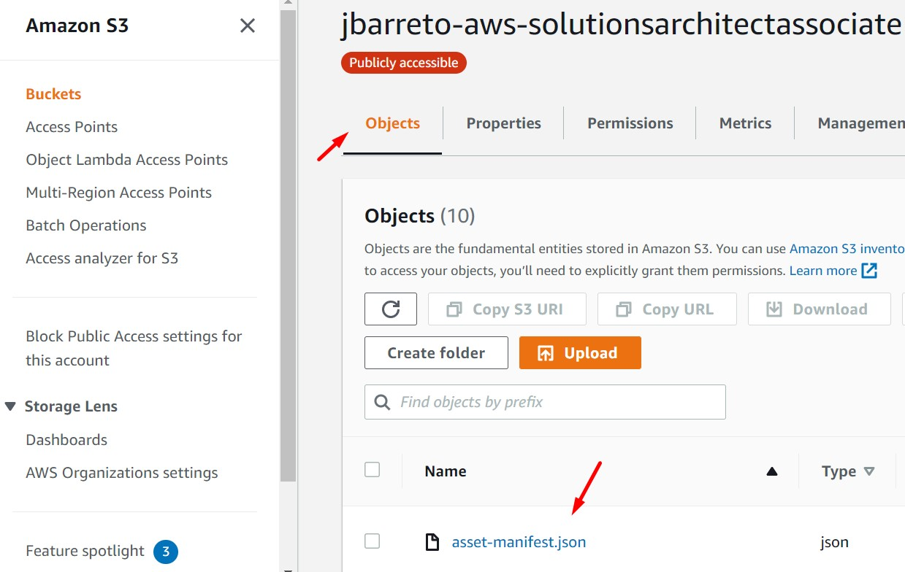

<br>

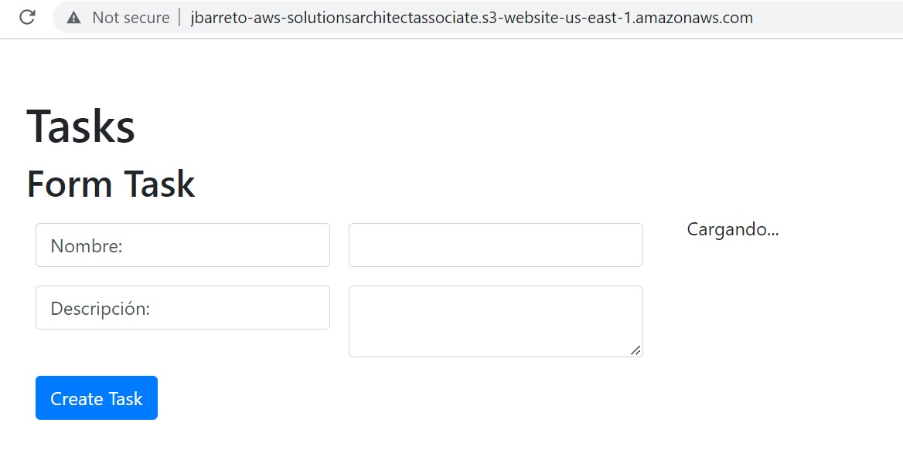

<br>

---

<br>

### C - Instalación y configuración de la base de datos en la instancia EC2

<br>

12. Los siguientes pasos se realizarán sobre la instancia EC2 "PROD DB". Para acceder a esta instancia deberemos ingresar primero a la instancia "PROD BACKEND" y desde aquí damos el salto a "PROD DB". Este procedimiento fue detallado en el Laboratorio 1. Identificar la IP Privado de la instancia "PROD DB" y reemplazarlo en el siguiente comando

```bash
#Cargar KeyPair .pem en instancia EC2 BACKEND
#Asignar permisos "chmod 400 en KeyPair
#Ejecución de comando de conexión SSH
ssh -i aws-solutionsarchitectassociate.pem ubuntu@$IP_PRIVADA_PROD_DB
```

13. Dentro de la instancia "PROD DB" ejecutamos los siguientes pasos. El objetivo es instalar la base de datos MySQL y realizar la creación de una tabla.

```bash
#Instalación Servidor MySQL
sudo su
sudo apt-get update
sudo apt-get install mysql-server -y
sudo service mysql status
sed -i -e '43s/^/# /' /etc/mysql/mysql.conf.d/mysqld.cnf
echo "bind-address            = 0.0.0.0" >> /etc/mysql/mysql.conf.d/mysqld.cnf
sudo service mysql restart

#Creación de usuario "admin"
cat << EOF | mysql
CREATE USER 'admin'@'%' IDENTIFIED BY 'admin'; 
GRANT ALL PRIVILEGES ON * . * TO 'admin'@'%' IDENTIFIED BY 'admin';
FLUSH PRIVILEGES;
SELECT User, Host FROM mysql.user;
quit
EOF

#Crear archivo que contiene usuario y contraseña de la base de datos
touch /opt/mysql_access
chmod 400 /opt/mysql_access
echo "[client]" >> /opt/mysql_access
echo "user=admin" >> /opt/mysql_access
echo "password=admin" >> /opt/mysql_access

#Crear de tabla "task" para la aplicación
mysql --defaults-extra-file=/opt/mysql_access --batch << "EOF"
create database test;
use test;
CREATE TABLE tasks
(
    id MEDIUMINT NOT NULL AUTO_INCREMENT,
    `name` VARCHAR(255),
    description VARCHAR(255),
    PRIMARY KEY (id)
);
quit
EOF
```

14. Una vez configurada nuestra instancia "PROD DB", regresamos a nuestra instancia "PROD BACKEND" y realizamos cambios en el archivo de configuración ".env" ubicado en "/opt/aws-solutionsarchitectassociate/App/backend/". En este archivo indicaremos (ubicado en la instancia "PROD DB") la ip privada de la instancia "PROD DB".

```bash
#Instalación del Backend
cd /opt/aws-solutionsarchitectassociate/App/backend/
nano .env
#Modificación del parámetro "DB_URI". Guardar cambios
npm install
npm start &
```

<br>

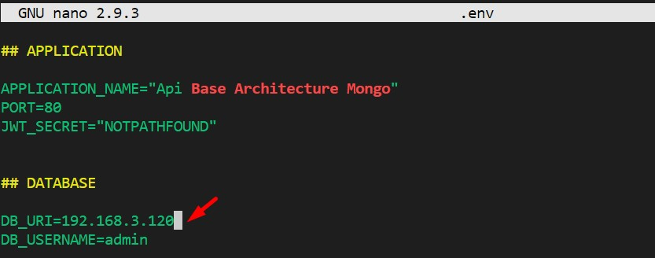

<br>


<br>

15. Accedemos nuevamente a nuestro endpoint web generado desde S3, podemos visualizar que la web se encuentra disponible para su uso. Procedemos a crear un registro (Task). Ingresamos a la instancia "PROD DB" (desde "PROD BACKEND") luego a MySQL con el usuario "admin" y validamos que la información creada desde el frontend se encuentre almacenada en la base de datos. Dentro de la instancia "PROD DB" ejecutar los siguientes comandos.

<br>

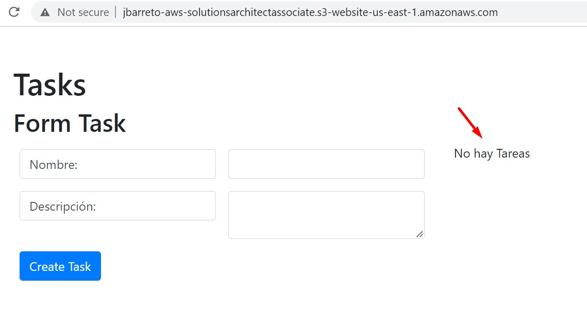

<br>


<br>

```bash
mysql -u admin -p
[admin]
use test;
select * from tasks;
quit
```

<br>

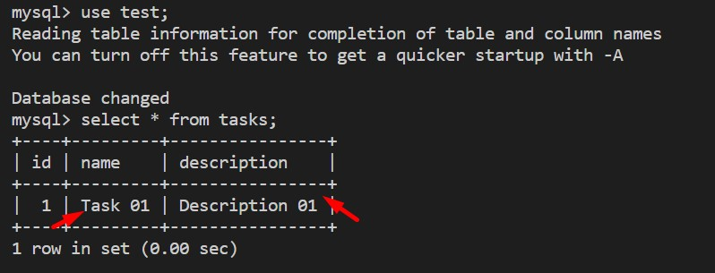

<br>

