# AWS Solutions Architect Associate - Laboratorio 05

<br>

### Objetivo: 
* Análisis y configuración de una Elastic IP

### Tópico:
* Networking

### Dependencias:
* Implementación del Laboratorio 01
* Implementación del Laboratorio 02
* Implementación del Laboratorio 03

<br>

---

### A - Análisis y configuración de Elastic IP

<br>

1. Apagamos (Stop) y encendemos (Start) nuestra instancia PROD BACKEND. Esta acción podría simular una degradación de hardware de la instancia EC2 o un apagado automático. 

<br>

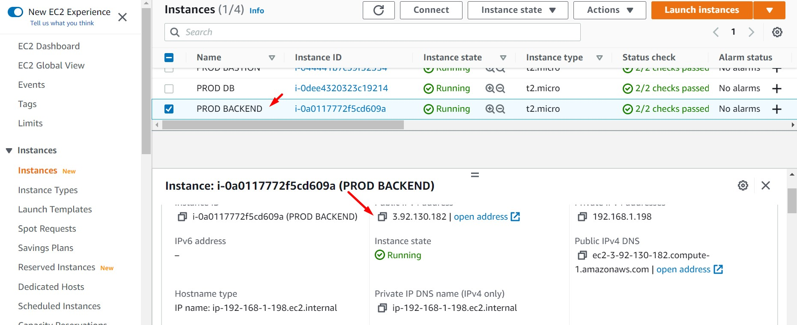

<br>

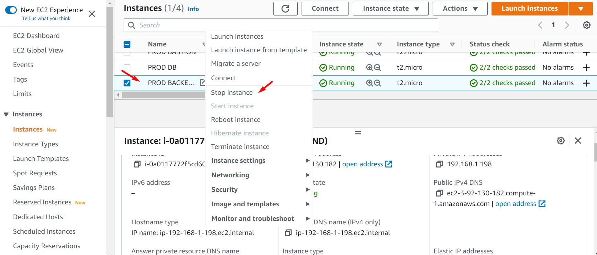

<br>

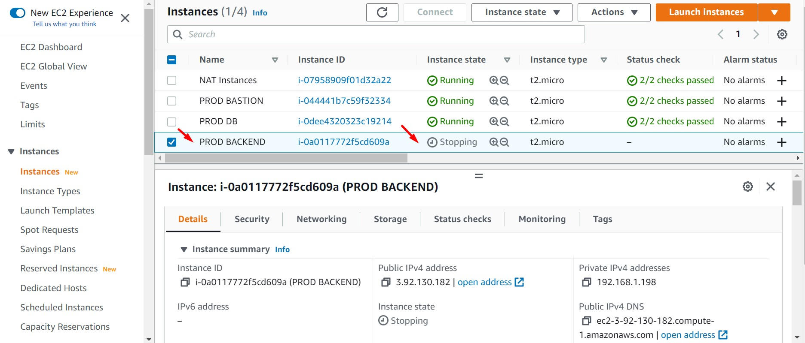

<br>

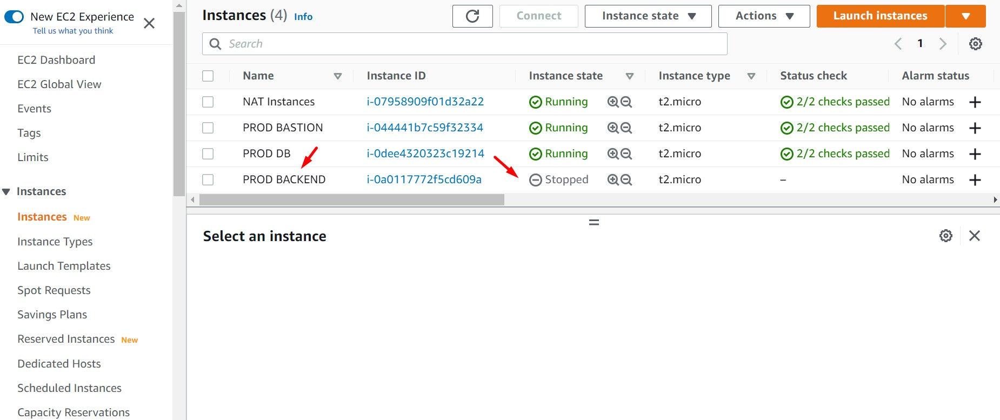

<br>

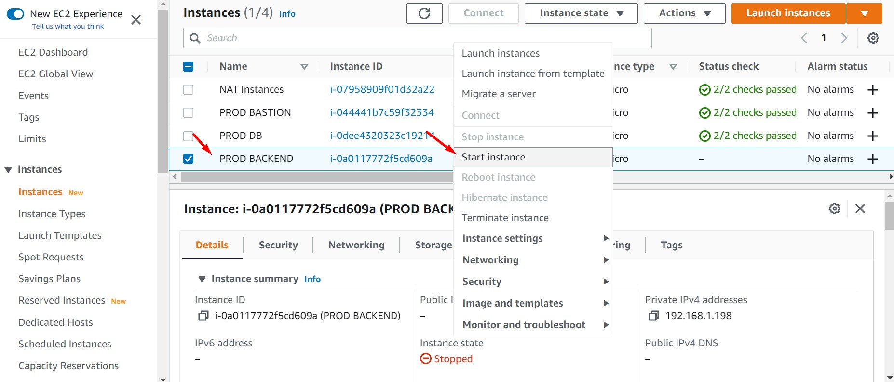

<br>

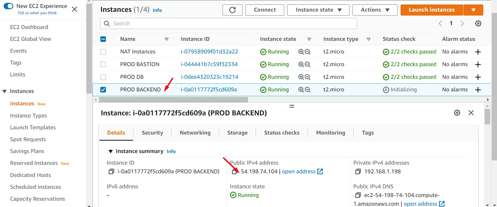

<br>

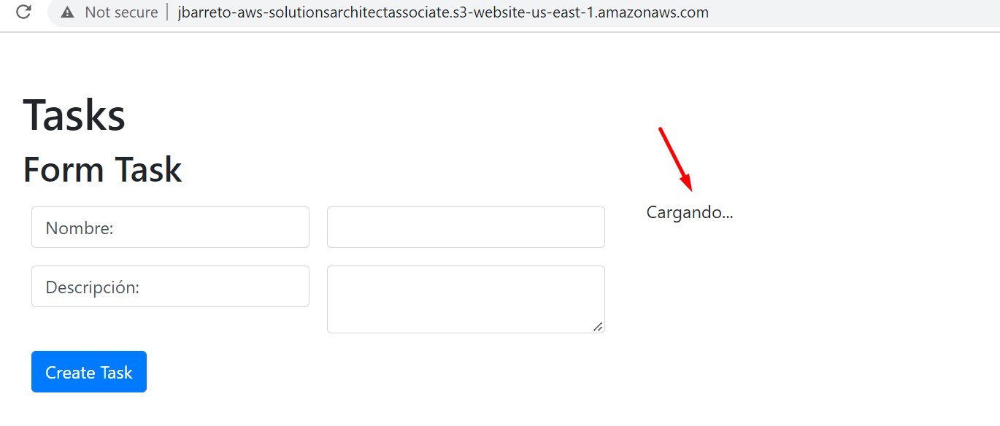

<br>

2. Podemos verificar que la IP Pública antes del apagado es diferente a la IP Pública de la instancia PROD BACKEND, después del apagado. Procedemos a crear una "IP Elástica" y asignarsela a la instancia PROD BACKEND.

<br>

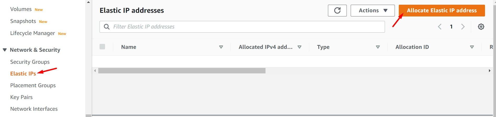

<br>

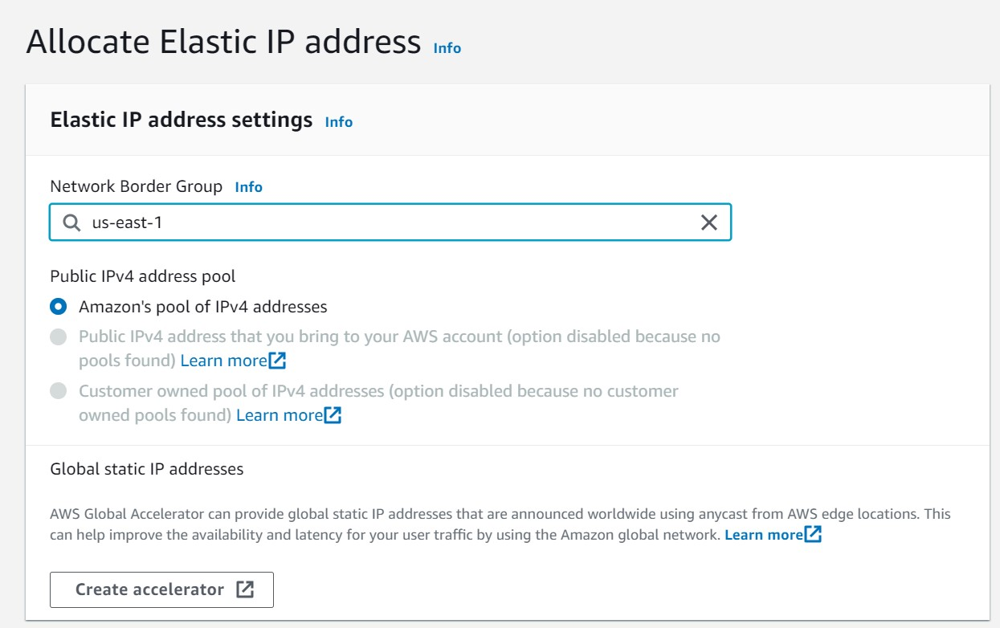

<br>

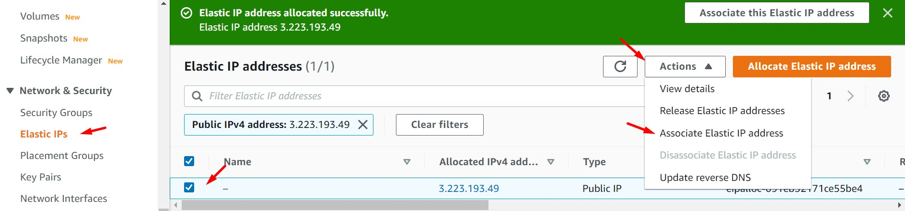

<br>

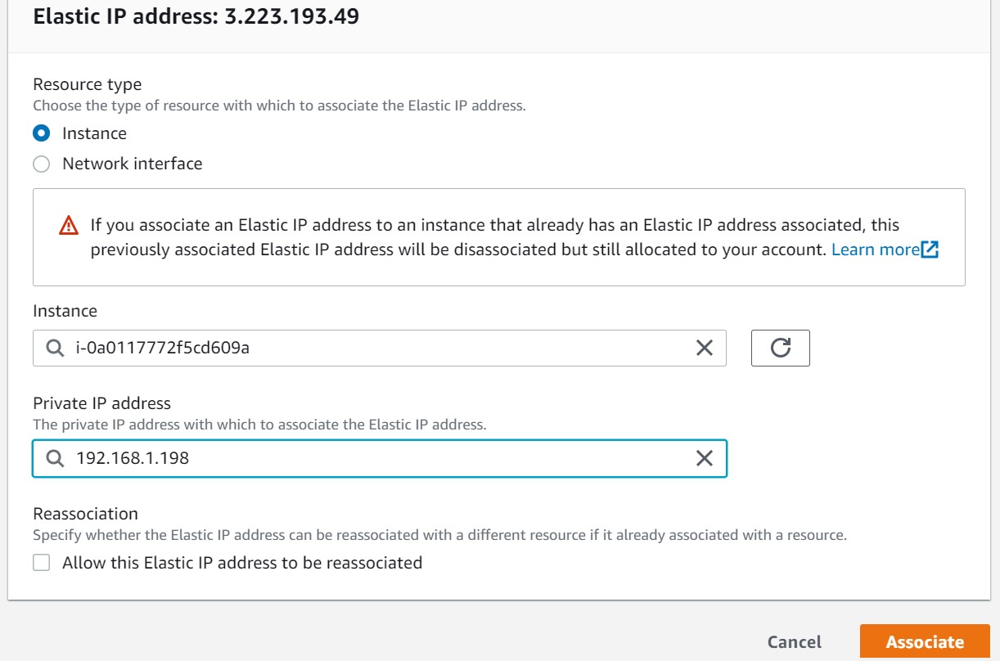

<br>

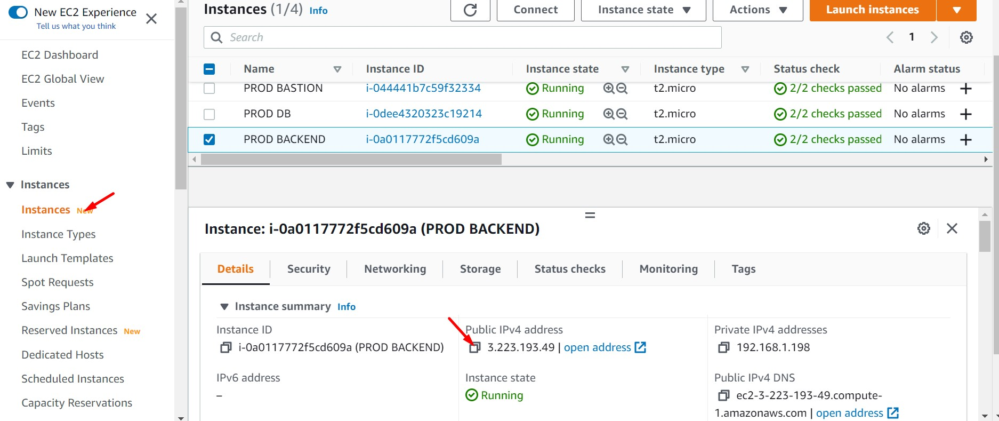

<br>


3. Accedemos a la instancia PROD BACKEND y modificamos el valor de la nueva IP en los archivos del frontend. Luego, procedemos a subir la actualización de los archivos al bucket S3 respectivo. Para que PROD BACKEND usando AWSCLI pueda comunicarse con S3 deberemos agregar la regla de salida (outbound) HTTPS al Security Group sg_app.

<br>

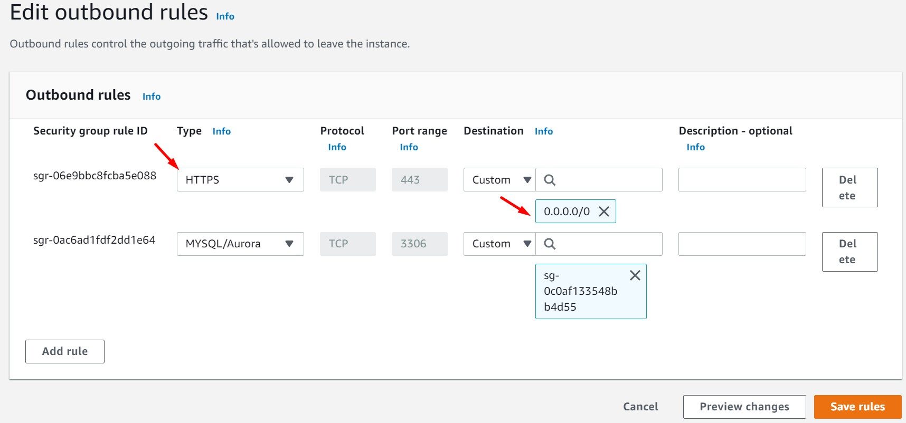

<br>

```bash

#Obteniendo IP Pública de la instancia EC2 y almacenarla como variable
PUBLIC_IP=$(curl http://169.254.169.254/latest/meta-data/public-ipv4)
echo $PUBLIC_IP

#Reemplazando parámetro en archivo de configuración de la carpeta frontend del proyecto
nano /opt/aws-solutionsarchitectassociate/App/frontend/src/config/axios.js 

#Compilar Frontend
cd /opt/aws-solutionsarchitectassociate/App/frontend
npm install
npm run build

#Carga de archivos al Bucket S3
cd /opt/aws-solutionsarchitectassociate/App/frontend/build/
BUCKET=$(aws s3 ls | sort -r | awk 'NR ==1 { print $3 }')
echo $BUCKET
aws s3 sync . s3://$BUCKET

#Levantar el servicio Backend
cd /opt/aws-solutionsarchitectassociate/App/backend/
#npm install
npm start &

#Automatizar el encendido del servicio
crontab -e
#Si accedemos por primera vez, seleccionar el editar de texto preferido, por defecto se usa nano - valor 1. Luego, agregar la siguiente línea al final del archivo abierto.
@reboot sleep 10 && cd /opt/aws-solutionsarchitectassociate/App/backend/ && /usr/bin/node index.js & >/dev/null 2>&1

```

<br>

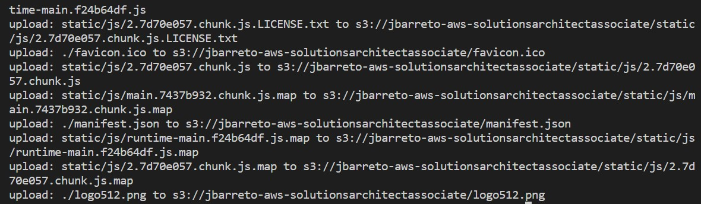

<br>

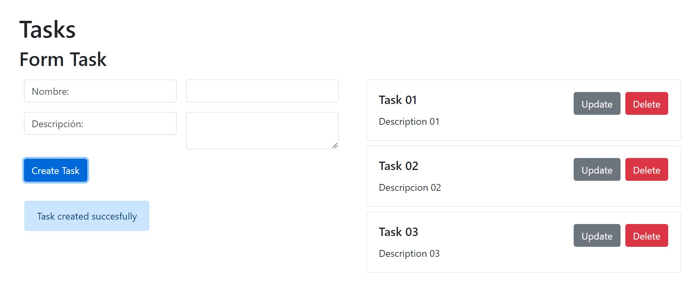

<br>

4. Desde la consola de AWS, reiniciamos la instancia "PROD BACKEND" y validamos nuestra aplicación.

<br>

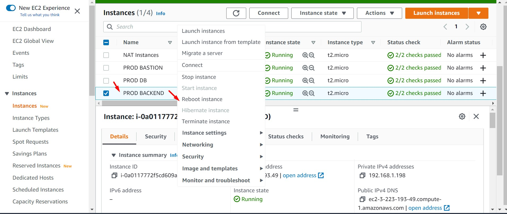

<br>


<br>
