# AWS Solutions Architect Associate - Laboratorio 06

<br>

### Objetivo: 
* Configuración de System Manager - Session Manager en instancias Linux/Ubuntu
* Eliminación del security group sg_ssh de las instancias EC2
* Eliminación de la instancia PROD BASTION

### Tópico:
* Management & Governance

### Dependencias:
* Implementación del Laboratorio 01
* Implementación del Laboratorio 02
* Implementación del Laboratorio 03

<br>

---

### A - Configuración de System Manager (Session Manager) en instancias Linux/Ubuntu


<br>

1. En un inicio era posible conectarnos directamente a nuestras instancias EC2 usando SSH. Luego en el desarrollo de otros laboratorios, hemos agregado una instancia bastion (PROD BASTION) la cual centraliza y gobierna los accesos a las demás instancias de la VPC. Tener aperturado el puerto SSH en nuestras instancias no es una buena práctica. "System Manager - Session Manager" usa el protocolo "HTTPS" como método de conexión remota a las instancias, así mismo ya no es necesario usar el protocolo "SSH"

<br>

2. Para hacer uso del servicio "System Manager" y el features "Session Manager" debemos configurar 3 pre-requisitos (detallados en los puntos 3, 4 y 5):

    * Instalación del agente System Manager (SSM Agent)
    * Asociación de un rol a la instancia y asignación de la política necesaria
    * Modificación de puertos en el Security Group

<br>

3. **Instalación del agente System Manager (SSM Agent)**. Dependiendo del tipo de distribución de Linux, el agente de System Manager podrá o no venir instalado. En el caso de Ubuntu 18.04 LTS, el agente viene instalado, podremos comprobar esto ejecutando en la instancia "PROD BACKEND" el siguiente comando. Se adjunta enlace con el detalle de cada distribución. 

    https://docs.aws.amazon.com/systems-manager/latest/userguide/sysman-manual-agent-install.html

```bash
sudo systemctl status snap.amazon-ssm-agent.amazon-ssm-agent.service
```

<br>

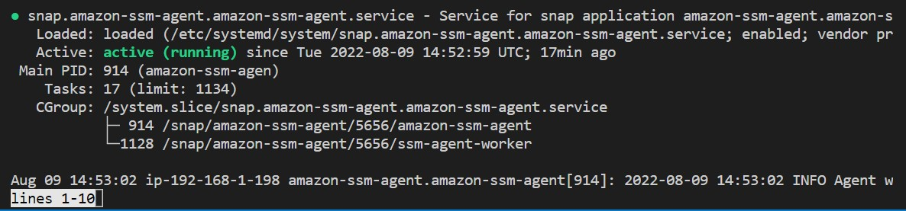

<br>


4. **Asociación de un rol a la instancia y asignación de la política necesaria.** Actualmente nuestra instancia "PROD BACKEND" fue configurada con el comando "aws configure" y hemos asociado un usuario IAM programático. Esto no es una buena práctica. Si alguien tiene acceso a nuestra instancia EC2 podrá dirigirse a los archivos "~/.aws/credentials" y "~/.aws/config" y acceder a nuestras llaves. Se recomienda el uso de roles (a través de un Instance Profile)

```bash
cat ~/.aws/credentials
cat ~/.aws/config
```

<br>

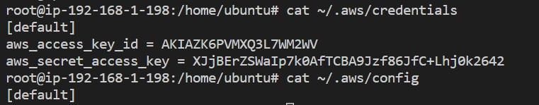

<br>

5. **Modificación de puertos en el Security Group**. Actualmente el security group "sg_app" de la instancia "PROD BACKEND" cuenta con la regla HTTPS abierta a 0.0.0.0 en Outbound rules. No será necesario realizar modificación alguna a esta configuración. 

<br>

6. Ejecutaremos el siguiente comando awscli. Luego, eliminaremos los archivos "credentials" y "config" y trataremos de ejecutar nuevamente el comando de awscli para listar buckets. Obtendremos como resultado el mensaje "Unable to locate credentials. You can configure credentials by running "aws configure". Eliminamos las llaves generadas desde el servicio IAM.

```bash
aws s3 ls
rm ~/.aws/config
rm ~/.aws/credentials
aws s3 ls
#"Unable to locate credentials. You can configure credentials by running "aws configure"
```
<br>

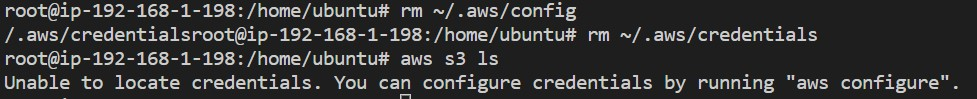

<br>

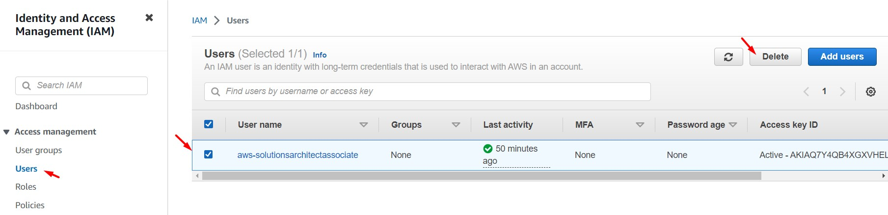

<br>

7. Desde el servicio IAM, accedemos a la opción "Policies". Damos clic en el botón "Create policy". Damos clic en la opcion "JSON" y agregamos la siguiente política. Luego damos clic en "Next: Review". Agregamos el nombre **"prod_ec2_ssm_policy"** y damos clic en "Create Policy". Analizar el tipo de política generada.

```bash
{
    "Version": "2012-10-17",
    "Statement": [
        {
            "Sid": "VisualEditor0",
            "Effect": "Allow",
            "Action": [
                "ssm:ResumeSession",
                "ssm:UpdateInstanceInformation",
                "ssm:DescribeSessions",
                "ssm:TerminateSession",
                "ssm:StartSession"
            ],
            "Resource": "*"
        },
        {
            "Effect": "Allow",
            "Action": [
                "ssmmessages:CreateControlChannel",
                "ssmmessages:CreateDataChannel",
                "ssmmessages:OpenControlChannel",
                "ssmmessages:OpenDataChannel"
            ],
            "Resource": "*"
        },
        {
            "Effect": "Allow",
            "Action": [
                "cloudwatch:PutMetricData",
                "cloudwatch:GetMetricStatistics",
                "cloudwatch:ListMetrics",
                "ec2:DescribeTags"
            ],
            "Resource": "*"
        }
    ]
}
```

<br>

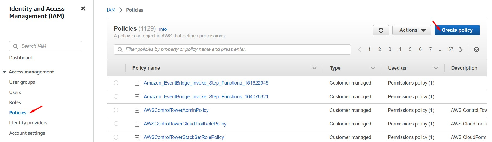

<br>

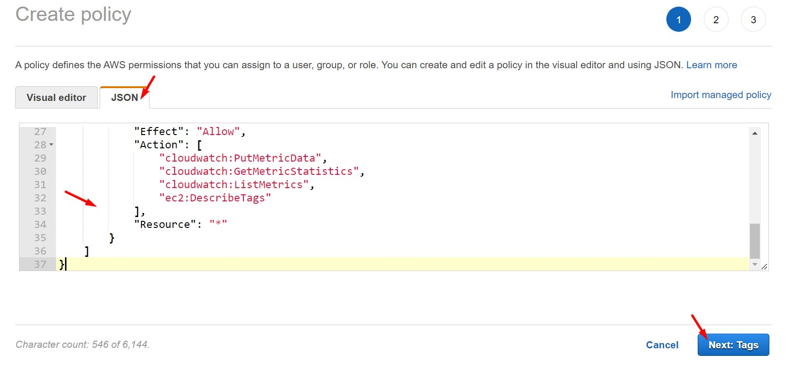

<br>

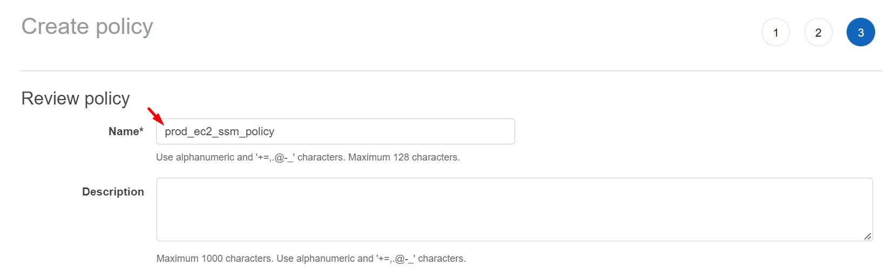

<br>


<br>


8. Desde el servicio IAM, accedemos a la opción "Roles". Damos clic en "Creare Role". Seleccionamos "Trusted entity type: AWS Service", luego "Common use cases: EC2" y damos clic en el botón "Next". Seleccionamos la política generada en un paso anterior **"prod_ec2_ssm_policy"** y damos clic en "Next". Luego, agregamos el nombre **"prod_ec2_ssm_role"** y damos clic en "Create role"

    * Role name: prod_ec2_ssm_role

<br>

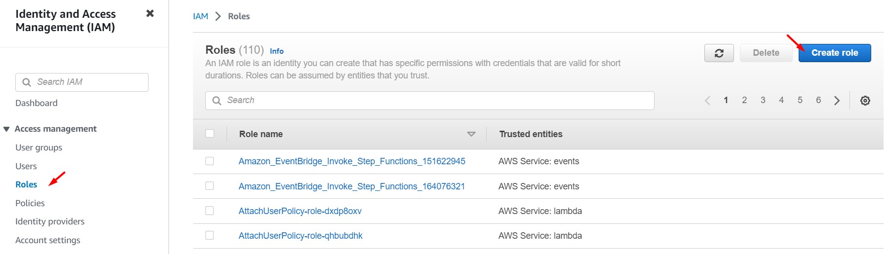

<br>

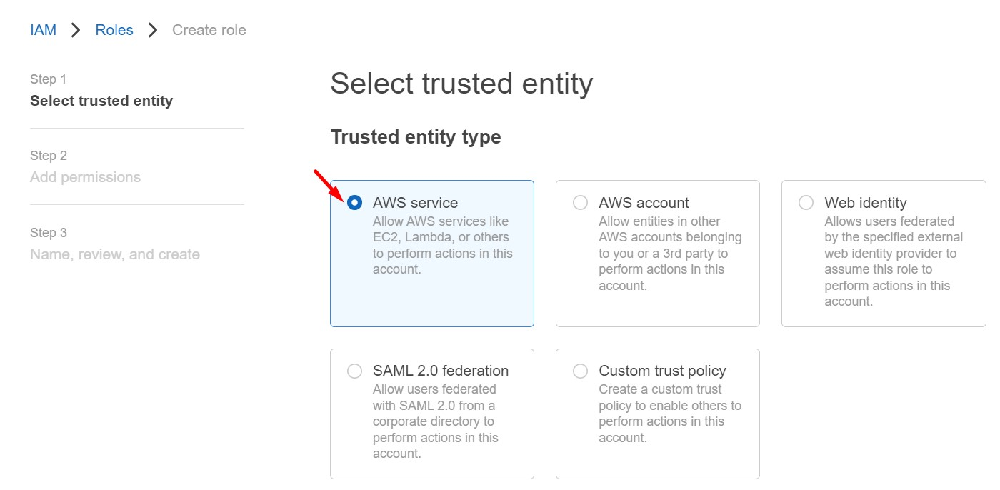

<br>

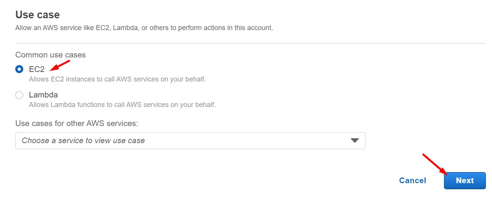

<br>

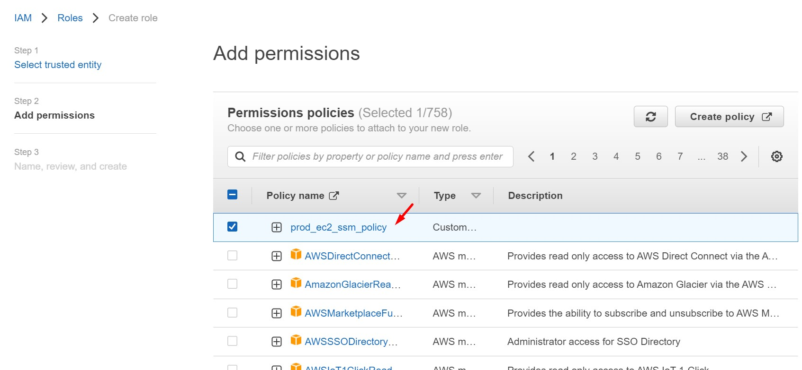

<br>

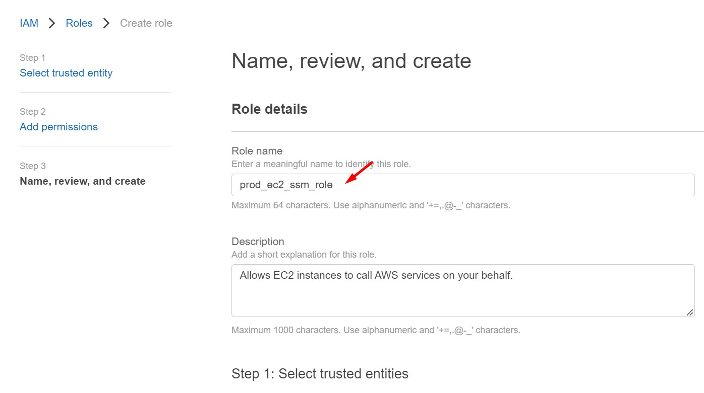

<br>

9. Desde el servicio IAM y la opción "Roles", buscamos el rol previamente generado. Analizamos el contenido del mismo, especialmente las pestañas "Permissions" y "True relationships".

<br>

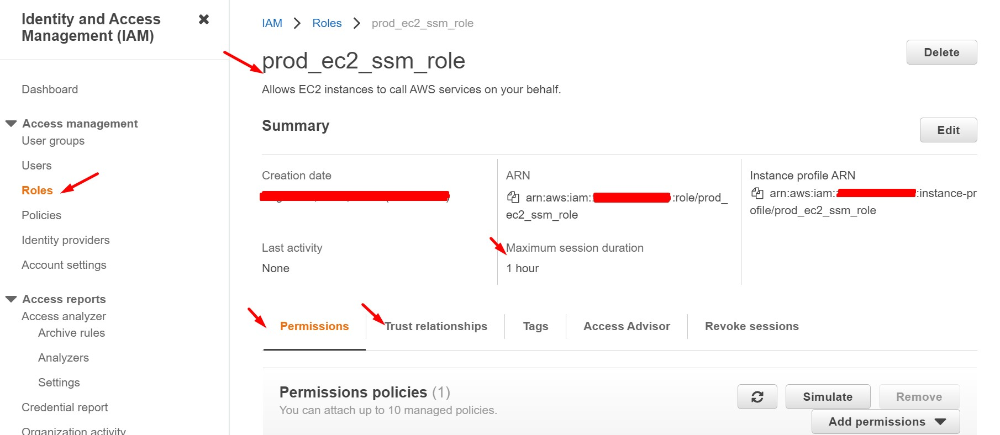

<br>

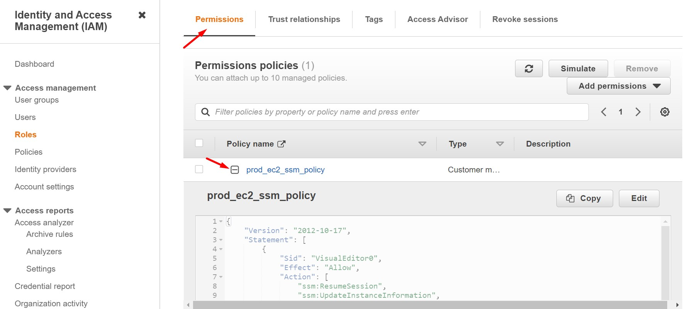

<br>

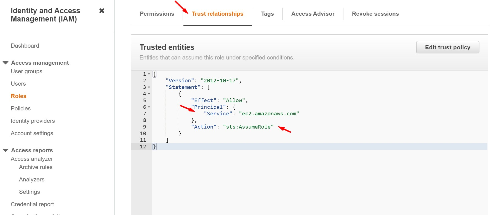

<br>

10. Nos dirigimos al servicio EC2, a la instancia "PROD BACKEND" y agregamos el rol previamente creado a través de la opción "Security > Modify IAM role". Procedemos a hacer un reboot a la instancia "PROD BACKEND".

<br>

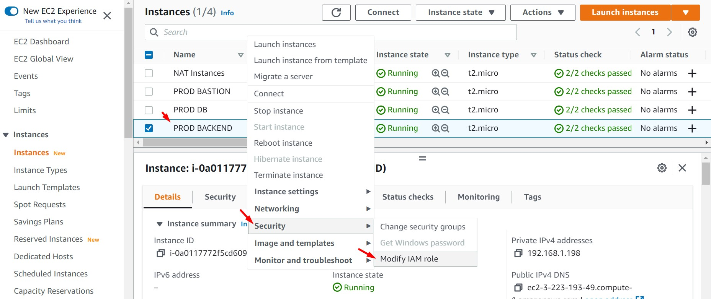

<br>

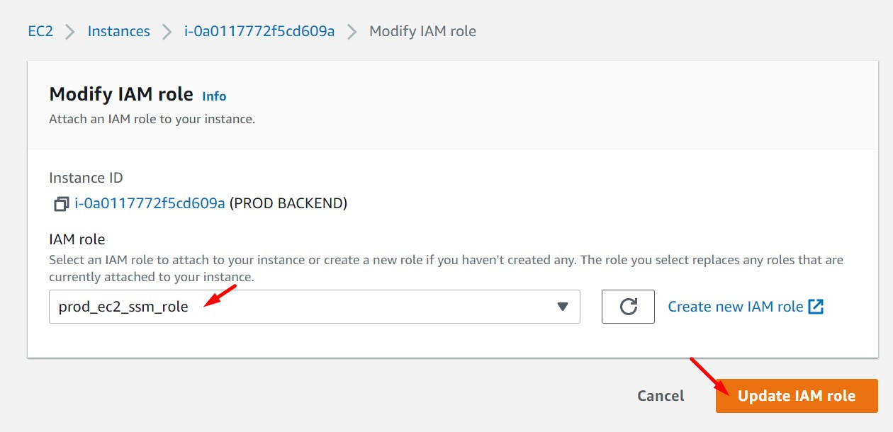

<br>

11. Seleccionamos la instancia "PROD BACKEND", damos clic en "Actions" y luego en "Connect". Nos dirigimos a la sección "Session Manager" y damos clic en el botón "Connect". Luego tendremos acceso a la instancia Ubuntu a través de la consola. Podremos ejecutar los comandos que deseemos. 

<br>

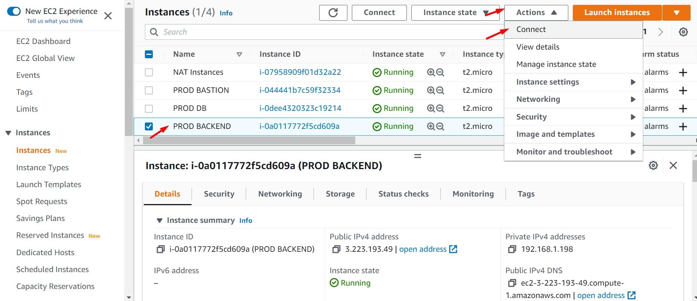

<br>

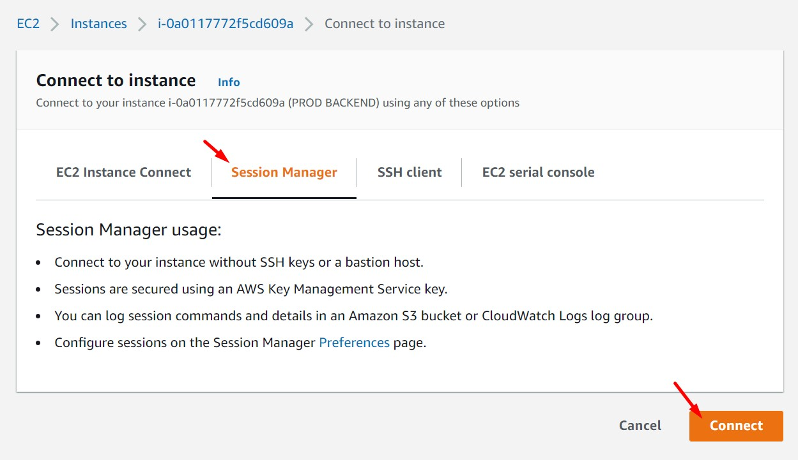

<br>

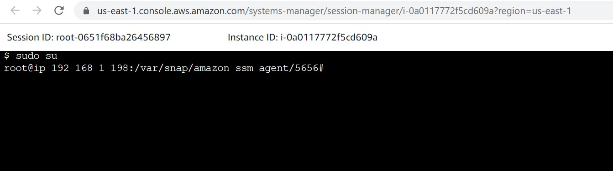

<br>

12. Retiramos el segurity group sg_ssh de la instancia "PROD BACKEND". Así mismo eliminamos la instancia "PROD BASTION". Probamos nuevamente el acceso por "System Manager - Session Manager".

<br>

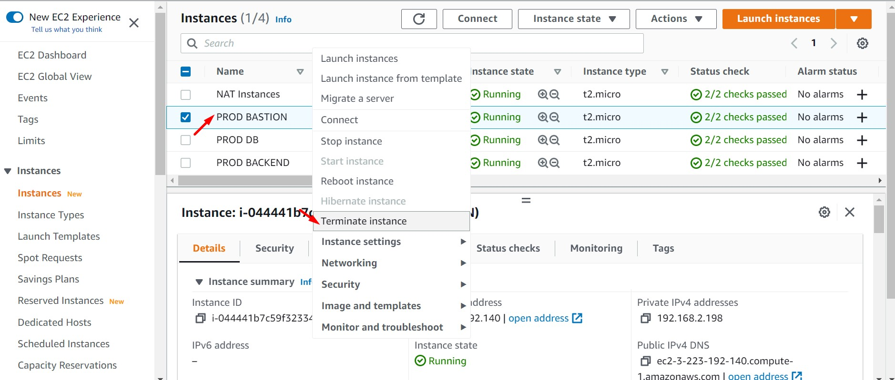

<br>

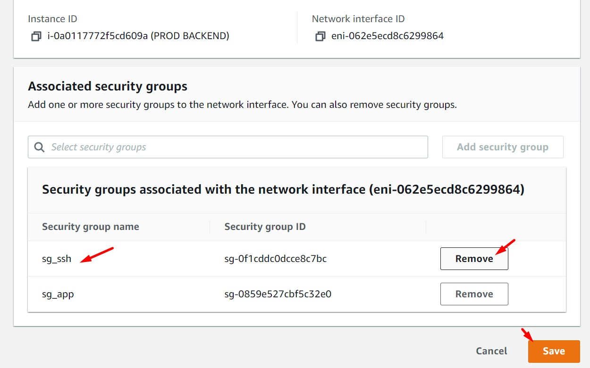

<br>

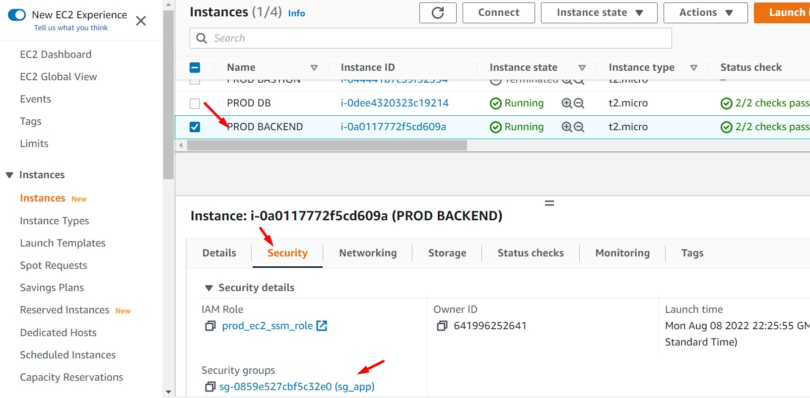

<br>

13. Accedemos a la configuración de Security Group desde la metadata de la instancia con el siguiente comando y validamos que sólo existe el sg_app asociado. Los cambios no han impactado en nuestro acceso remoto a la instancia.

```bash
curl http://169.254.169.254/latest/meta-data/security-groups/
```

<br>

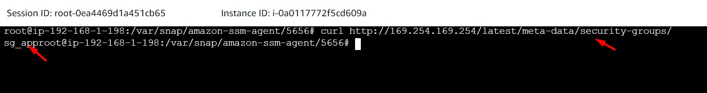

<br>


14. Habilitar "System Manager - Session Manager" en la instancia "PROD DB" según los pasos detallados anteriormente.

    * Instalación del agente System Manager (SSM Agent)
    * Asociación de un rol a la instancia y asignación de la política necesaria
    * Modificación de puertos en el Security Group

