# AWS Solutions Architect Associate - Laboratorio 07

<br>

### Objetivo: 
* Habilitación de VPC Flow Logs
* Uso de Amazon Athena para la lectura de VPC Flow Logs

### Tópico:
* Networking
* Analytics

### Dependencias:
* Implementación del Laboratorio 01
* Implementación del Laboratorio 02
* Implementación del Laboratorio 03

<br>

---

### A - Habilitación de los VPC Flow Logs


<br>

1. Tenemos la opción de habilitar "VPC Flow Logs" a nivel de VPC (VPC Services), a nivel de subnet (VPC Services) o a nivel de ENI (EC2 Services). Estaremos habilitando el "VPC Flow Logs" a nivel de VPC en este laboratorio.

<br>

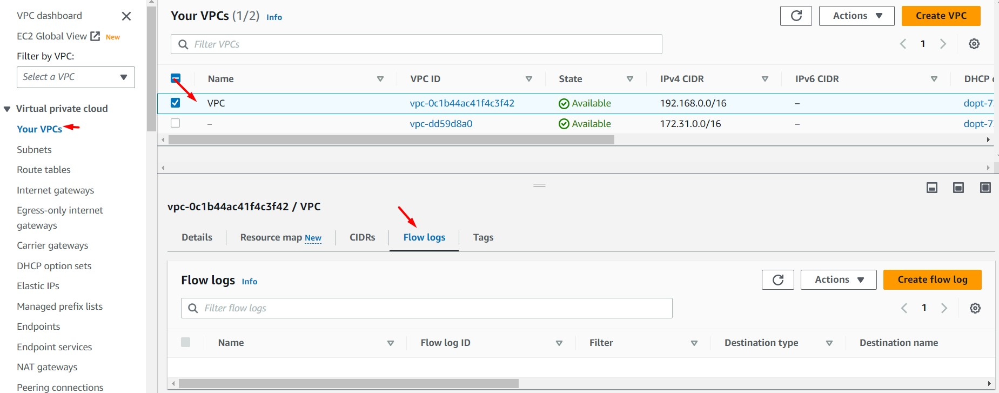

<br>

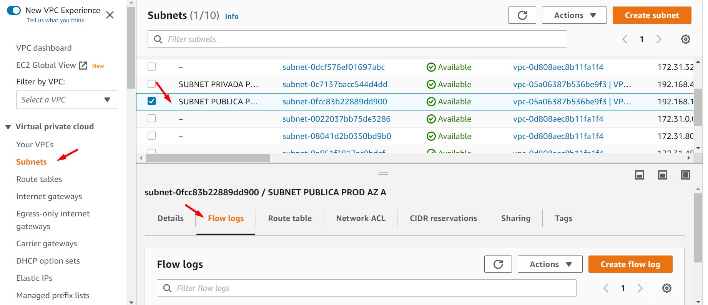

<br>


<br>


2. "VPC Flow Logs" tiene tres formas de configuración (respecto al destino de los Logs de la VPC), bien a través de un bucket S3, CloudWatch Logs o Kinesis Firehose (misma o distinta cuenta). Antes de crear propiamente un "VPC Flow Logs", crearemos un bucket desde el servicioS3. Obtenemos el ARN del bucket creado. Por ejemplo: "arn:aws:s3:::vpcflowlogs-aws-solutionsarchitectassociate" (Recordar que el nombre de un bucket tiene que ser único a nivel global)

  * Bucket name: vpcflowlogs-aws-solutionsarchitectassociate

<br>

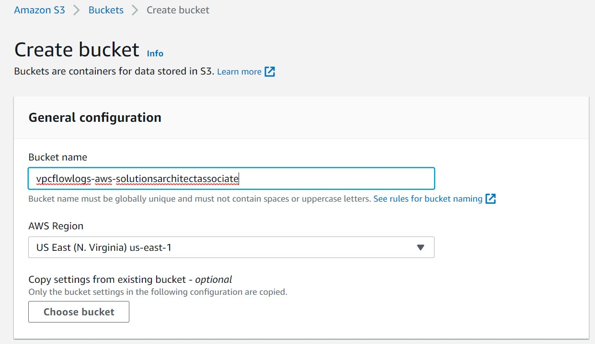

<br>

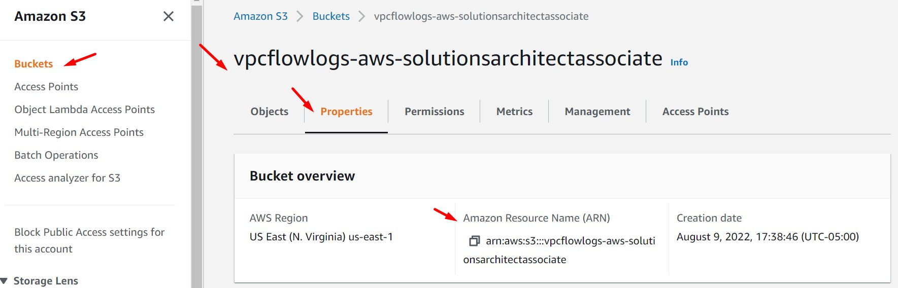

<br>

3. Ingresamos al servicio VPC, luego seleccionamos la opción "Your VPCs". Seleccionamos la VPC creada anteriormente (en el Lab-01) y luego nos dirigimos a la opción "Flow Logs". Damos clic en el botón "Create Flow Logs".

<br>

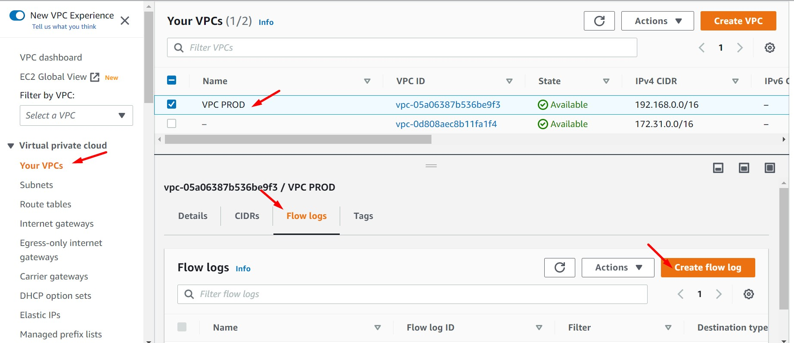

<br>

4. Seleccionamos o ingresamos los siguientes valores. Reemplazar el valor "S3 bucket ARN" con el valor personalizado. Ingresamos a nuestra app y generamos tráfico.

    * Name: vpcflowlogs-aws-solutionsarchitectassociate
    * Filter: All
    * Maximum aggregation interval: 1 minute
    * Destination: Send to an Amazon S3 bucket
    * S3 bucket ARN: arn:aws:s3:::vpcflowlogs-aws-solutionsarchitectassociate (Reemplazar por ARN propio)
    * Log record format: AWS default format
    * Log file format: Text (default)
    * Partition logs by time: Every 24 hours (default)


<br>

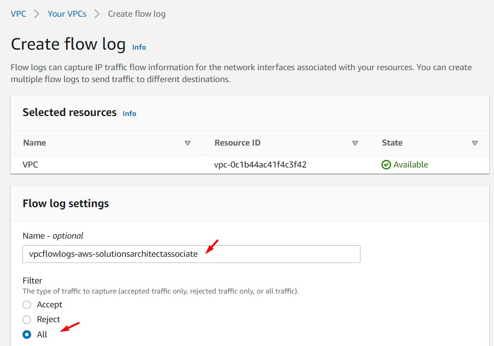

<br>

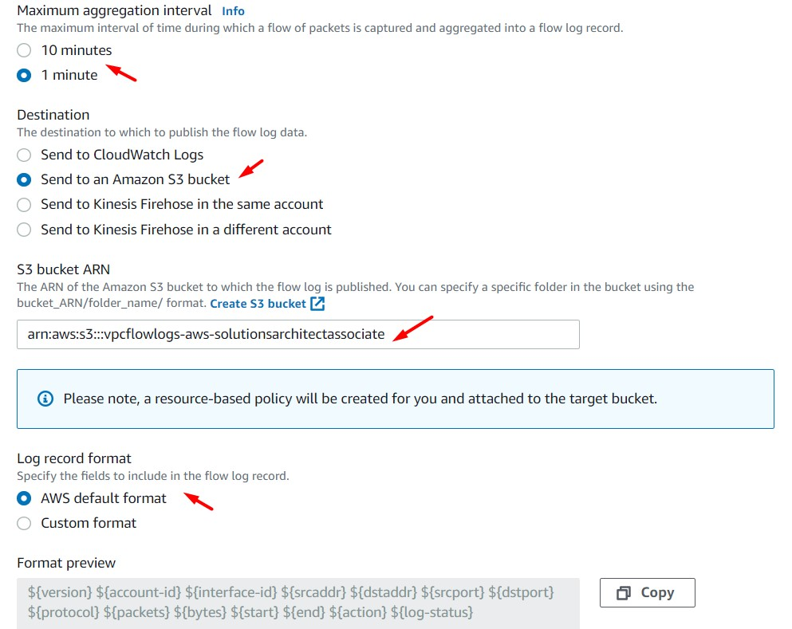

<br>

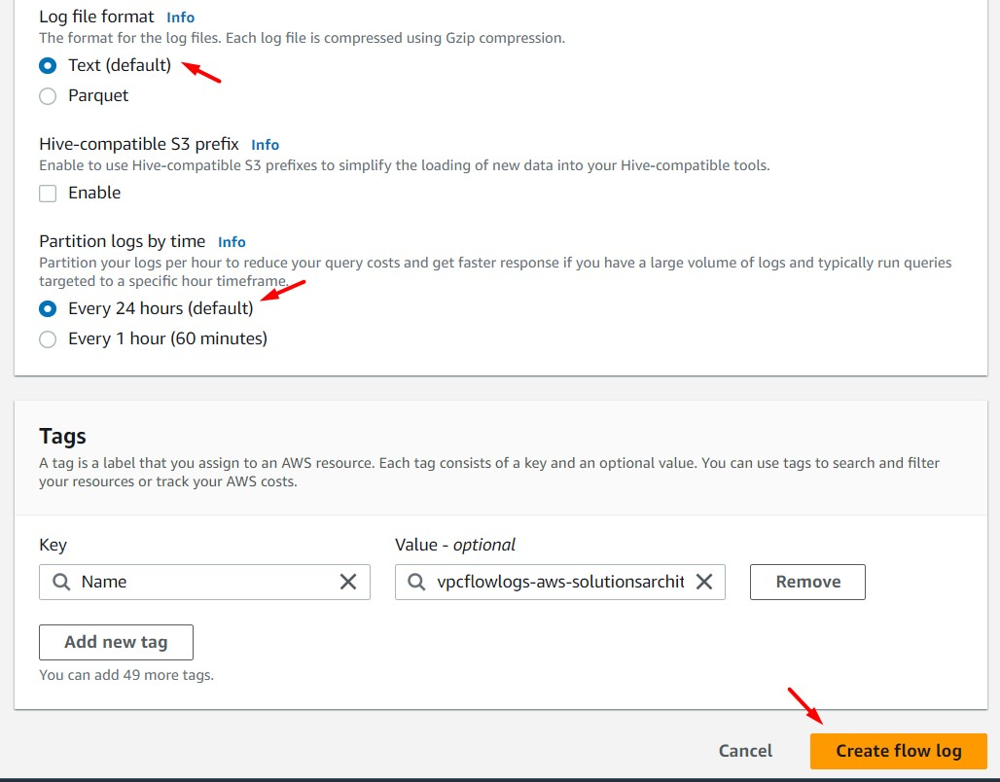

<br>

5. Después de unos minutos podremos validar que existe información en nuestro bucket S3. Usaremos "Query with S3 Select" para visualizar el contenido del archivo. También es válido descargar el archivo y analizar su contenido.


<br>


<br>

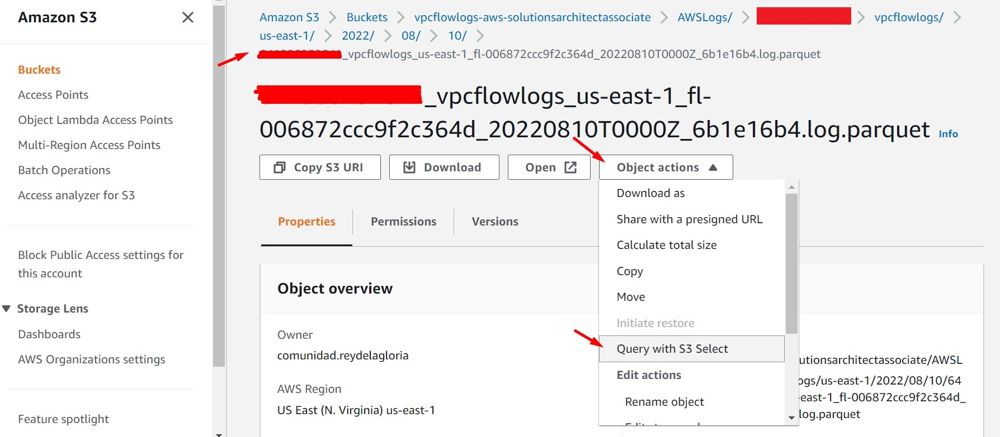

<br>

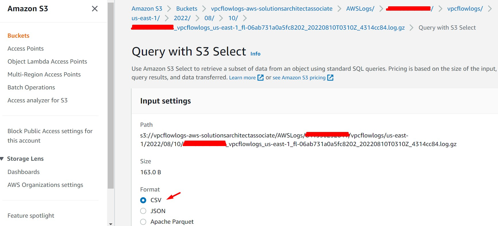

<br>

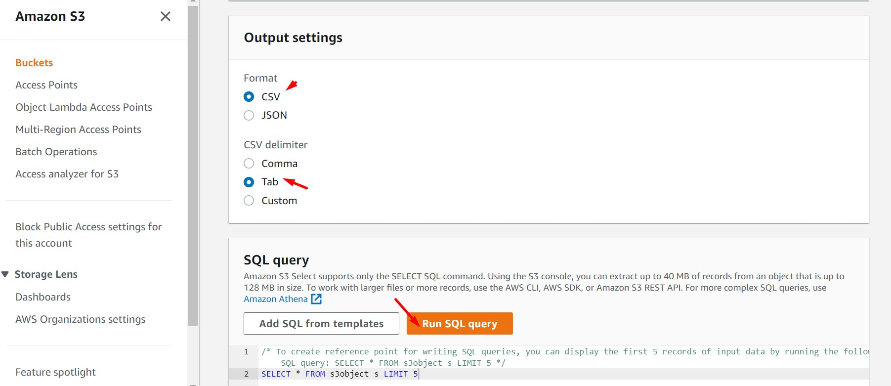

<br>

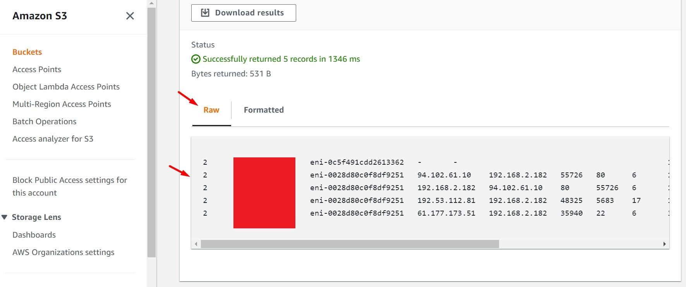

<br>

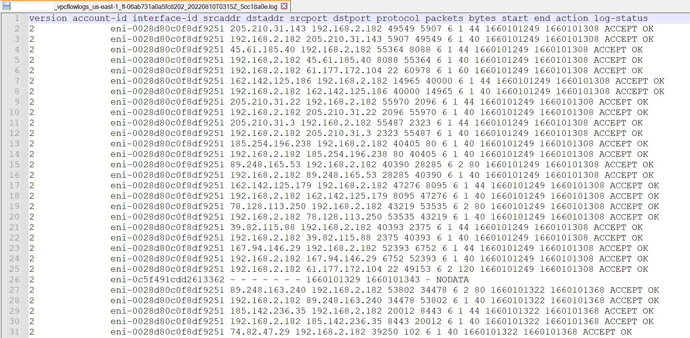

<br>

---

### B - Uso de Amazon Athena para la lectura de los VPC Flow Logs

<br>

6. Crearemos otro bucket S3 con el objetivo que sea el destino de nuestro servicio "Amazon Athena". Amazon Athena nos permitirá acceder a los datos de todos los archivos del bucket, sin importar en que folder dentro del bucket se encuentren estos  (Recordar que el nombre de un bucket tiene que ser único a nivel global)

  * Bucket name: athena-aws-solutionsarchitectassociate

<br>

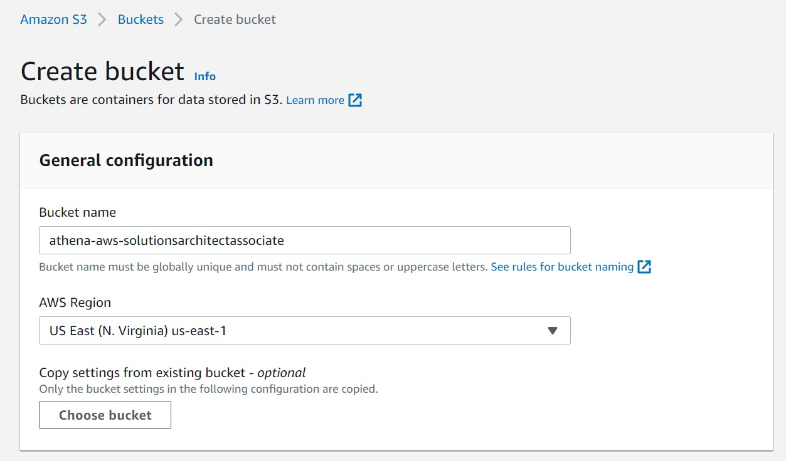

<br>

7. Accedemos al servicio "Amazon Athena" y realizamos la configuración base respectiva. Esto se hace por única vez.

<br>

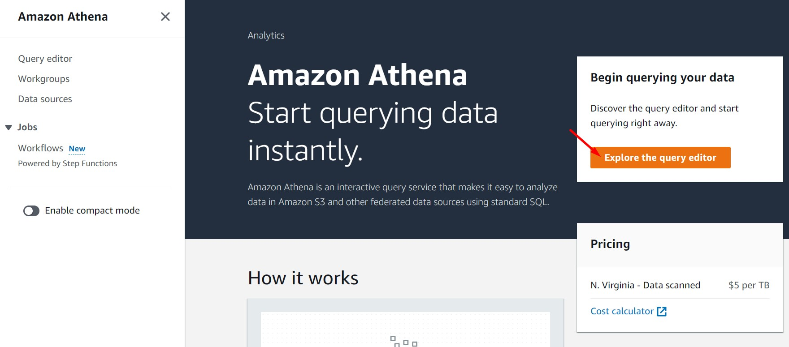

<br>


<br>

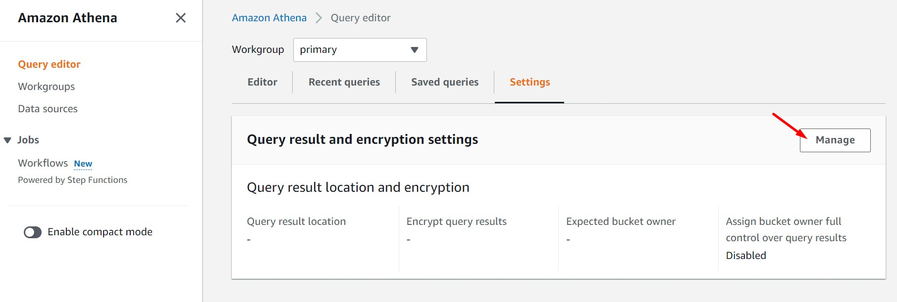

<br>

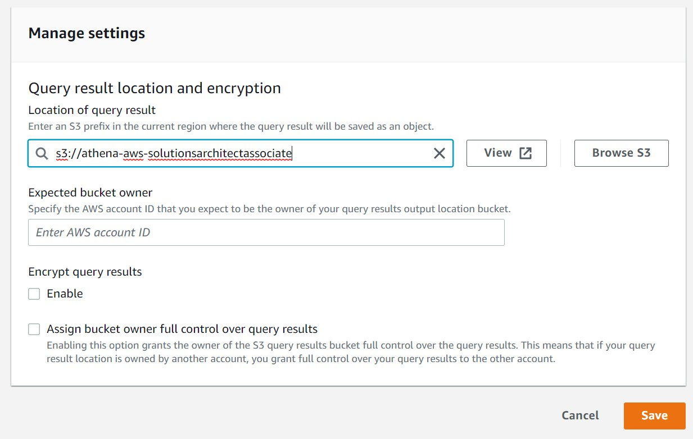

<br>

8. Ejecutamos el siguiente query en Amazon Athena. Reemplazar la sección "LOCATION" con el nombre de nuestro bucket S3. Este query tiene por objetivo la creación de una tabla lógica en Amazon Athena. Esta tabla tiene por nombre "vpcflowlog" y esta a su vez contiene los siguientes parámetros: version, account_id, interface_id, entre otros. Estos parámetros fueron los seleccionados al momento de crear el "VPC Flow Logs" desde el servicio VPC. De forma transparente se ha generado una tabla en el servicio "AWS Glue"


```bash
CREATE EXTERNAL TABLE IF NOT EXISTS vpcflowlog (
version string, 
account_id string, 
interface_id string, 
srcaddr string, 
dstaddr string, 
srcport int,
dstport int,
protocol int,
packets int,
bytes int,
start_time string,
end_time string,
action string,
log_status string 
  ) 
ROW FORMAT SERDE 'org.apache.hadoop.hive.serde2.lazy.LazySimpleSerDe'
WITH SERDEPROPERTIES (
'serialization.format' = ' ',
'field.delim' = ' '
)
LOCATION 's3://vpcflowlogs-aws-solutionsarchitectassociate/AWSLogs/';

```

<br>

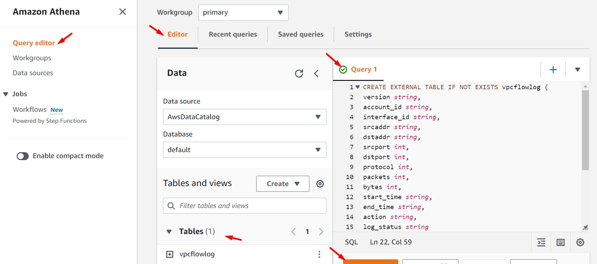

<br>

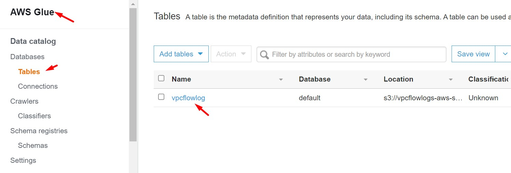

<br>

9. Ejecutamos el siguiente query en Amazon Athena. Este query tiene por objetivo consultar todo el contenido de nuestro bucket S3. Visualizamos el contenido y analizamos la data resultante.

```bash
select
interface_id,srcaddr,dstaddr,srcport,dstport,protocol,action,log_status
from vpcflowlog 
where version not in ('version') 
order by interface_id,action,log_status;
```

<br>

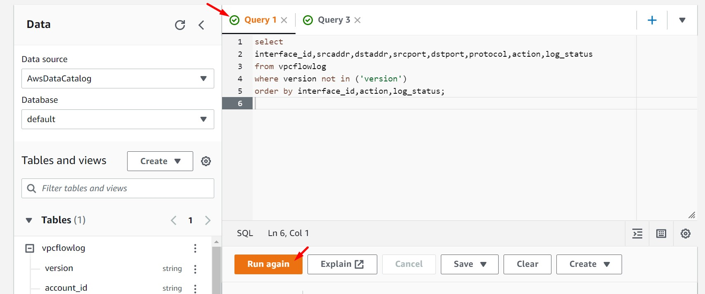

<br>

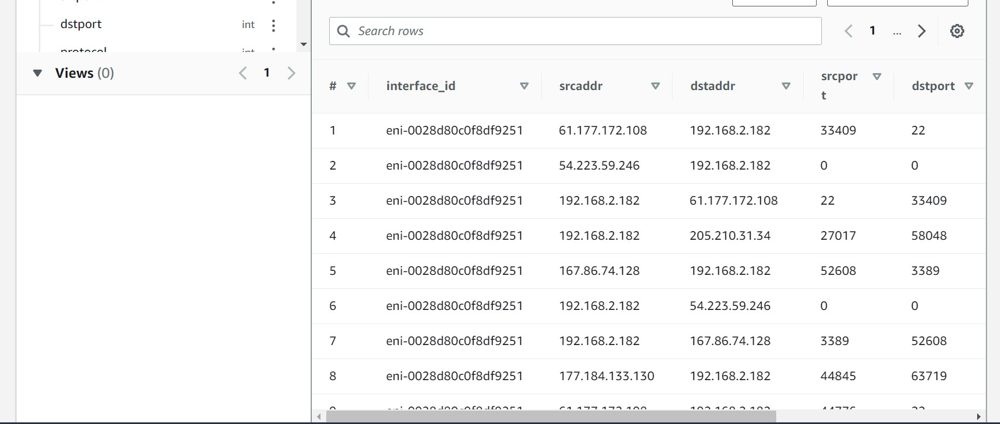

<br>