# AWS Solutions Architect Associate - Laboratorio 08

<br>

### Objetivo: 
* Configuración de NACL (Network Access Control List)

### Tópico:
* Networking

### Dependencias:
* Implementación del Laboratorio 01
* Implementación del Laboratorio 02
* Implementación del Laboratorio 03
* Implementación del Laboratorio 04
* Implementación del Laboratorio 07

<br>

---

### A - Configuración de NACL (Network Access Control List)


<br>

1. La aplicación desplegada está conformada por los siguientes componentes:

    * Frontend, desplegado en un bucket S3. El frontend actualmente apunta al puerto 80 de la IP Pública de la instancia "PROD BACKEND"
    * Backend, desplegado en la instancia "PROD BACKEND", escucha en el puerto 80 las solicitudes del bucket S3. Asimismo, se conecta a la instancia "PROD DB" a través del puerto 3306 usando el usuario "admin"
    * Base de datos, desplegado en la instancia "PROD DB", escucha en el puerto 3306 (MySQL) las solicitudes de la instancia "PROD BACKEND".

```bash
Usuario --(80)--> Bucket S3 --(80)--> PROD BACKEND --(3306)--> PROD DB MySQL
```

2. En laboratorios anteriores se reconfiguraron los security groups, además de habilitar "System Manager - Session Manager" en las instancias EC2. Este features ha permitido eliminar la instancia "PROD BASTION" y retirar permisos sobre el puerto 22 (SSH).

    * PROD BACKEND (sg_app)
      * Inbound: 80 - 0.0.0.0/0
      * Outbound: 443 - 0.0.0.0/0, 3306 - sg_db  
    * PROD DB (sg_app)
      * Inbound: 3306 - sg_app
      * Outbound: Sin reglas


3. Accedemos al servicio "VPC", luego ingresamos a la opción "Network ACL (Security)". Visualizamos que existe una NACL asociada a la VPC PROD.

<br>

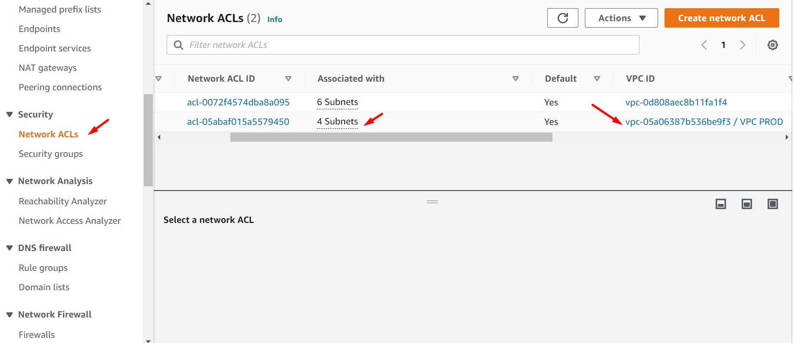

<br>


4. Renombraremos a la NACL creada como "NACL BACKEND". Crearemos la NACL "NACL DB". Estas NACL tendrán las siguientes configuraciones. Seguidamente analizar la razón de estas configuraciones.

  * NACL BACKEND
    * Subnet Associations:
        * SUBNET PUBLICA PROD AZ A
        * SUBNET PUBLICA PROD AZ B
    * Inbound Rules:
      <br>
      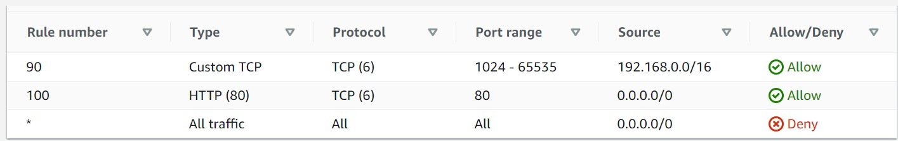
      <br>
    * Outbound Rules:
      <br>
      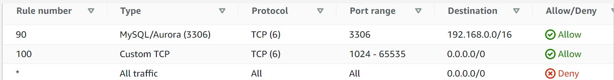
      <br>
 
  * NACL DB
    * Subnet Associations:
        * SUBNET PRIVADA PROD AZ A
        * SUBNET PRIVADA PROD AZ B
    * Inbound Rules:
      <br>
      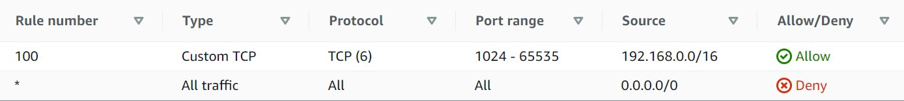
      <br>
    * Outbound Rules:
      <br>
      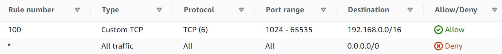
      <br>

5. Validamos que nuestra aplicación siga funcionando. Generamos un nuevo registro.

      <br>
      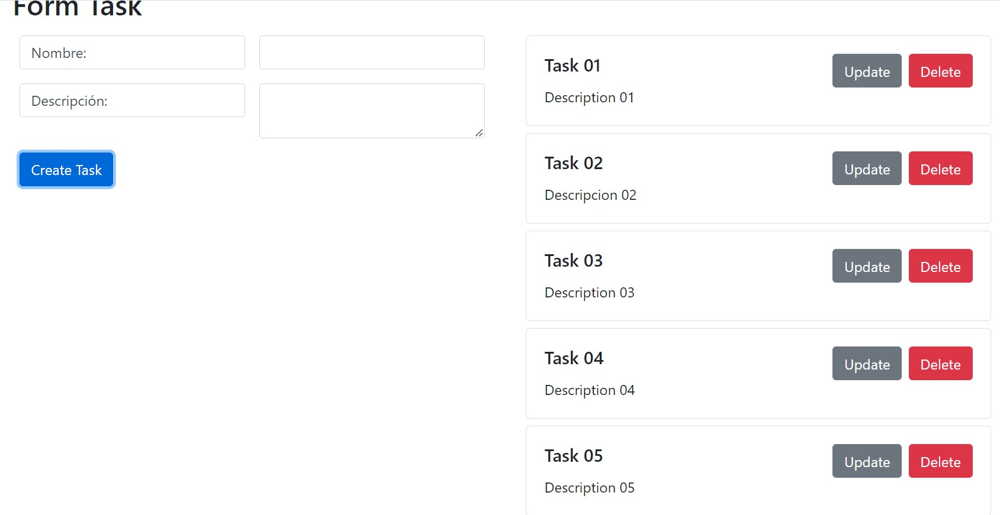
      <br>

6. Tratamos de acceder por "System Manager - Session Manager" a la instancia "PROD BACKEND". Visualizamos que tenemos problemas. Deberemos modificar los NACLs para dar el acceso necesario. Analizar los siguientes querys en Athena, modificar 192.168.1.198 por la IP privada de la instancia PROD BACKEND.

      <br>
      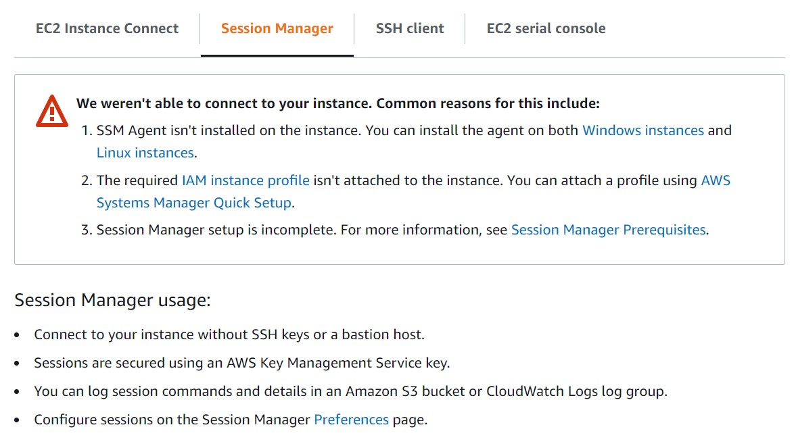
      <br>

```bash
select * from vpcflowlog where end_time not in ('end') AND dstport = 443 and srcaddr='192.168.1.198' order by end_time desc

select * from vpcflowlog where end_time not in ('end') AND dstport = 443 and dstaddr='192.168.1.198' order by end_time desc
```

7. Realizamos los siguientes cambios en el NACL BACKEND.

    * Inbound Rules:
      <br>
      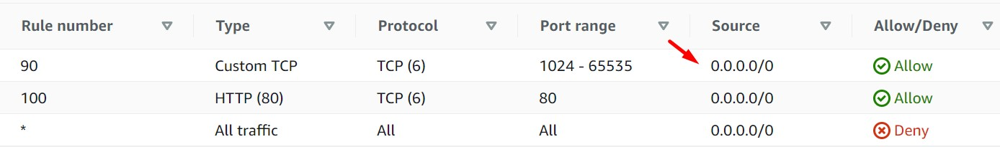
      <br>
    * Outbound Rules:
      <br>
      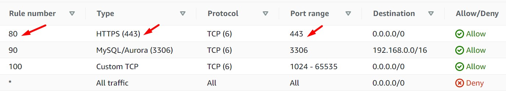
      <br>

8. Esperamos unos minutos y validaremos el acceso de "PROD BACKEND" a través de System Manager - Session Manager.

      <br>
      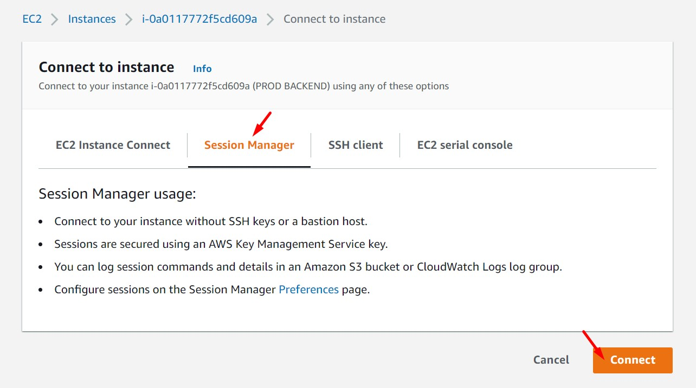
      <br>
      <br>
      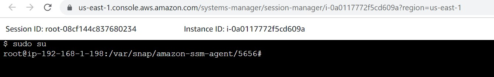
      <br>


---
<br>

### Enlaces

 * https://docs.aws.amazon.com/athena/latest/ug/vpc-flow-logs.html 