# AWS Solutions Architect Associate - Laboratorio 09

<br>

### Objetivo: 
* Configuración de VPC Endpoint Gateway
* Configuración de VPC Endpoint Interface

### Tópico:
* Networking

### Dependencias:
* Implementación del Laboratorio 01
* Implementación del Laboratorio 02
* Implementación del Laboratorio 03

### Costo:
* El uso de la característica "VPC Endpoint Interface" tiene un costo asociado (Sección "B")

<br>

---

### A - Configuración de VPC Endpoint Gateway 


<br>

1. Con el objetivo de no tener problemas a nivel de permisos, aperturamos permisos a nivel de NACL y Security Group (sg_app, sg_db, sg_ssh).

  * **NACL**
    * Rule number: 100
    * Type: All Traffic
    * Protocol: All
    * Port range: All
    * Source: 0.0.0.0/0
    * Allow/Deny: Allow
  * **Security Group**
    * Type: All Traffic
    * Port range: All
    * Source/ Destination: 0.0.0.0/0

2. Accedemos a nuestra instancia PROD DB. Al ser una instancia privada, la consulta a otros servicios de AWS usando AWSCLI pasan por el NAT Instances. Ejecutar los siguientes comandos:

```bash
sudo apt-get update
sudo apt-get install awscli -y
```

3. Generamos un IAM Role con nombre "prod_ec2_s3_role" y lo asignamos a la instancia "PROD DB". Este IAM Role tendrá asignado las siguientes políticas:
  * AmazonS3FullAccess
  * AmazonEC2FullAccess

<br>

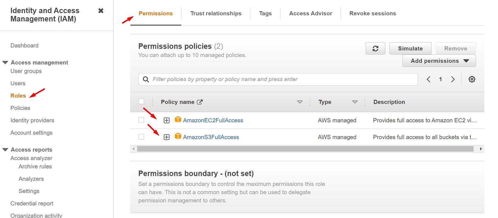

<br>


<br>

4. Ingresamos nuevamente a la instancia "PROD DB". Como resultado de los siguientes comandos ejecutados tendremos data de los buckets S3 en nuestra cuenta AWS e instancias EC2. Más allá del resultado validar que hay respuesta al ejecutar esos comandos.

```bash
aws s3 ls
aws ec2 describe-instances --region us-east-1
```

5. Procederemos a apagar la instancia "NAT Instances" y volvemos a ejecutar los comandos descritos anteriormente. Para que este paso se ejecute satisfactoriamente deberemos ingresar primero en la instancia "PROD BACKEND" y desde aquí ingresamos a "PROD DB". Si ingresamos directamente a "PROD DB", al apagar la instancia "NAT Instances" nuestra sesión se cerrará. No tendremos resultados inmediatos en la ejecución de los comandos AWSCLI. 

```bash
aws s3 ls
aws ec2 describe-instances --region us-east-1
```

<br>

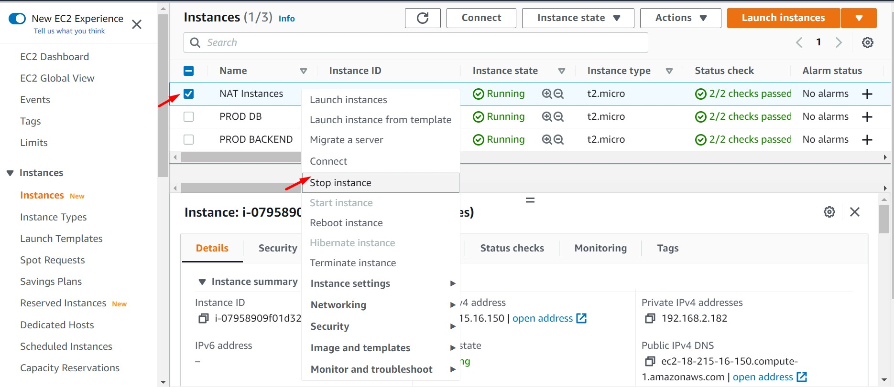

<br>

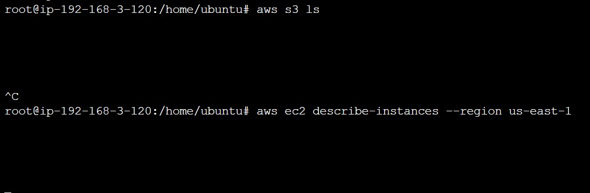

<br>

6. Para restablecer la comunicación con las APIs públicas EC2 y S3 generaremos dos VPC Endpoint (conexiones internas hacia las mismas APIs). Un VPC Endpoint hacía el servicio S3 (Tipo Gateway) y un VPC Endpoint hacía el servicio EC2 (Tipo Interface). Accedemos al servicio "VPC", luego accedemos al feature "Endpoints". Dar clic en el botón "Create endpoint". Ingresamos los siguientes valores. Considerar lo siguiente:

  * Name tag - optional: vpcendpoint-s3
  * Service Name: com.amazonaws.us-east-1.s3	
  * Type: Gateway
  * VPC: Seleccionar VPC
  * Route Table: Seleccionar Route Table donde se encuentra la instancia PROD DB (PROD RT PRIVATE)
  * Policy: Full access

<br>

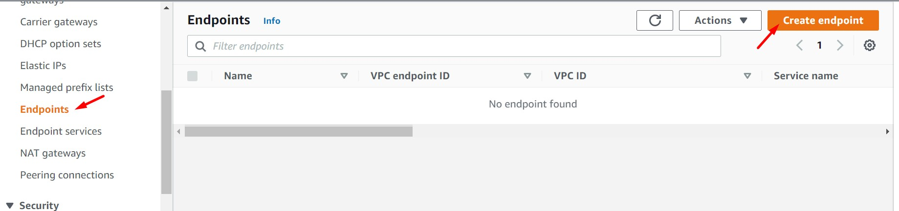

<br>

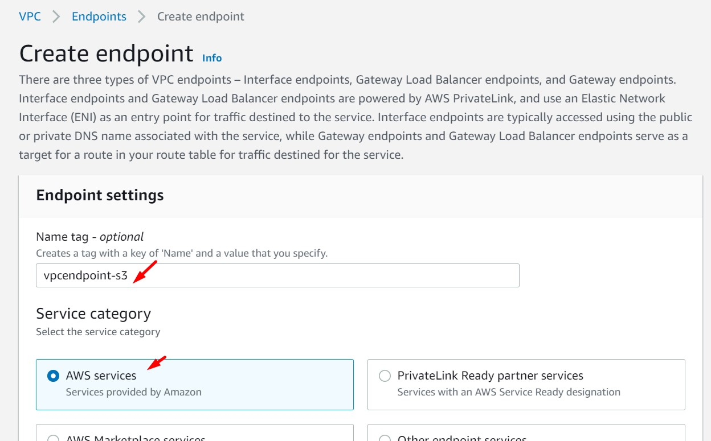

<br>

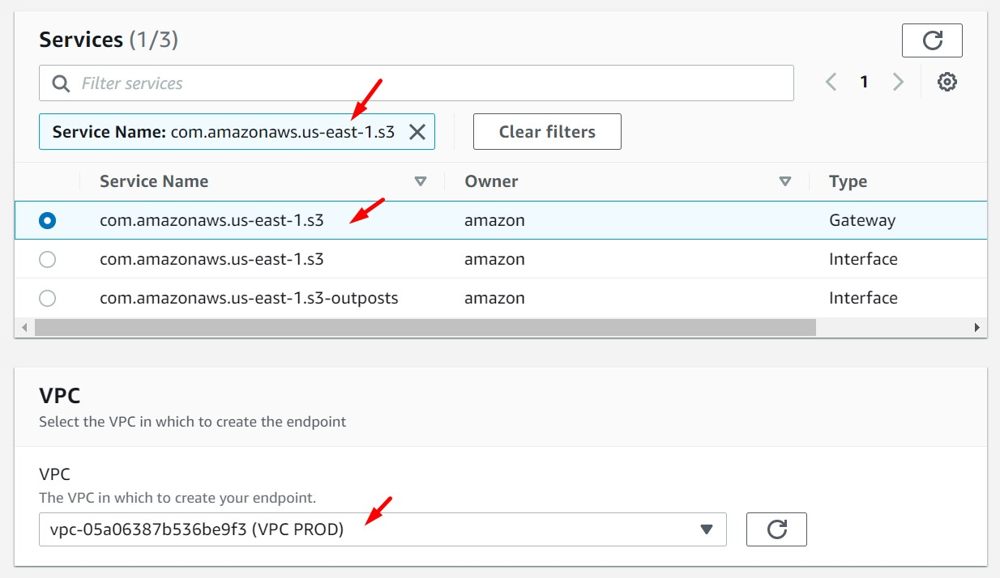

<br>

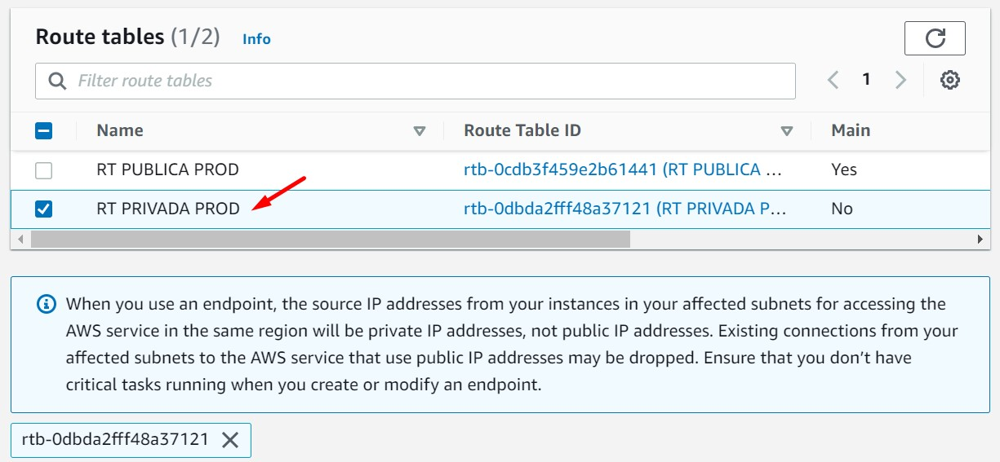

<br>

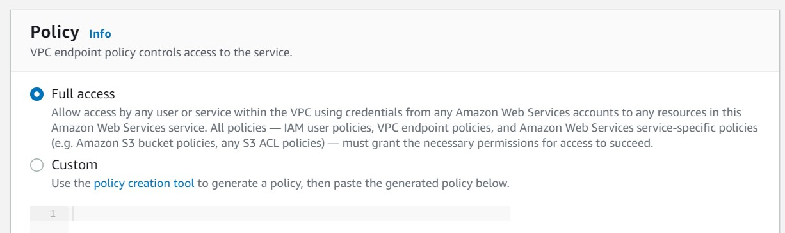

<br>

7. Accedemos nuevamente a la instancia PROD DB y ejecutamos los comandos AWSCLI. Tendremos respuesta para el comando relacionado a S3, pero no tendremos respuesta para el comando relacionado a EC2. Esto se debe a que la VPC Endpoint Gateway desplegado está relacionada al servicio S3 unicamente. No es necesario usar un NAT Instances para acceder a la API, VPC Endpoint genera una nueva ruta privada hacia la API. Deberemos desplegar un VPC Endpoint relacionado a EC2 para poder acceder a la API respectiva.

```bash
aws s3 ls
aws ec2 describe-instances --region us-east-1
```

### B - Configuración de VPC Endpoint Interface (Costo asociado)

8. Accedemos nuevamente al servicio VPC y luego al features "Endpoints". Damos clic en el botón "Create endpoint". Ingresamos los siguientes valores.

  * Name tag - optional: vpcendpoint-ec2
  * Service Name: com.amazonaws.us-east-1.ec2 
  * Type: Interface
  * Subnets: 
    * SUBNET PRIVADA PROD AZ A
    * SUBNET PRIVADA PROD AZ B
  * Security Group: sg_app
  * Policy: Full access

<br>

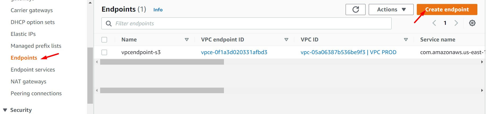

<br>

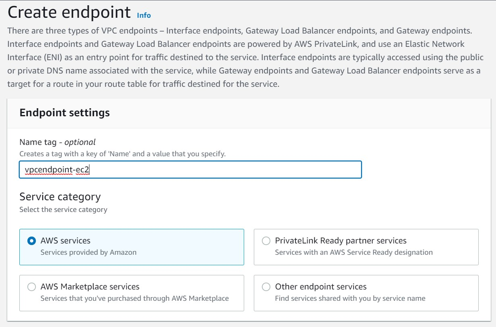

<br>

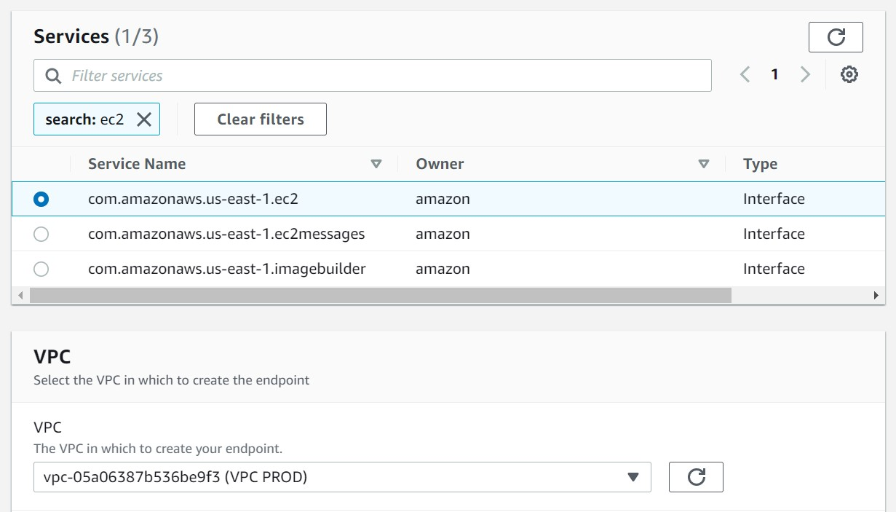

<br>

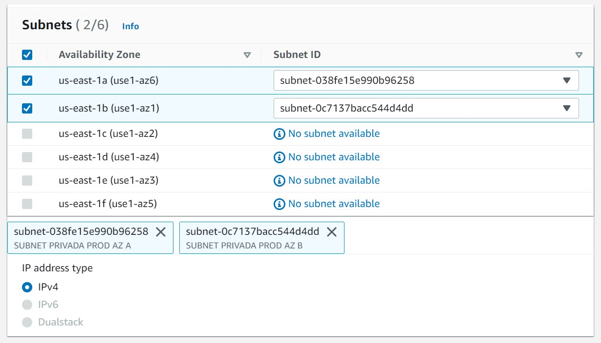

<br>

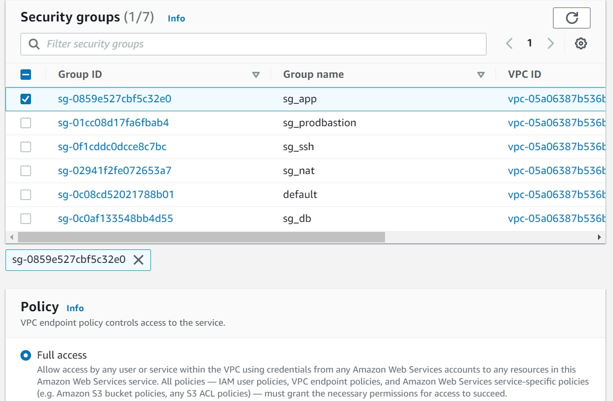

<br>

9. Accedemos nuevamente a la instancia PROD DB y ejecutamos los comandos AWSCLI. Tendremos respuesta para el comando relacionado a S3 y para el comando relacionado a EC2. Esperar a que el "Status" del VPC Endpoint sea "Available" para realizar las pruebas respectivas.

```bash
aws s3 ls
aws ec2 describe-instances --region us-east-1
```

<br>

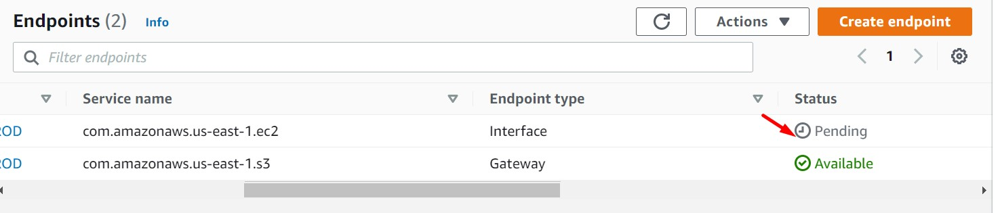

<br>

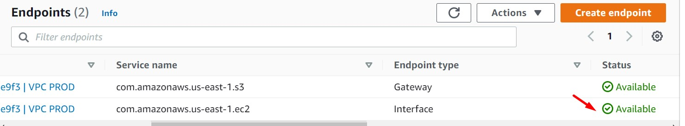

<br>

10. Desde la sección de VPC Endpoint analizar las similitudes y diferencias entre un VPC Endpoint Gateway y un VPC Endpoint Interface.

  * **VPC Endpoint Gateway**
    * Usado en S3 y DynamoDB. S3 también cuenta con VPC Endpoint Interface
    * Asociado a un Route Table
    * No está asociado a un Security Group
    * Tiene una Policy asociada
    * No tiene costo asociado
    * Primera tecnología usada, no usa AWS Private Link
  * **VPC Endpoint Interface**
    * Usado en casi todos los servicios de AWS
    * No está asociado a un Route Table
    * Asociado a un Security Group
    * Tiene una Policy asociada
    * Tiene costo asociado. $0.01 pricing per VPC endpoint per AZ ($/hour)
    * Usa tecnología AWS Private Link

<br>

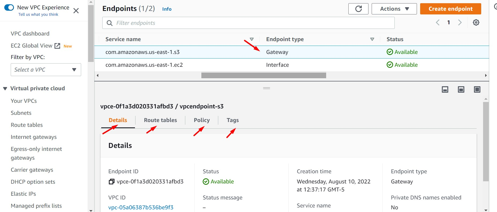

<br>

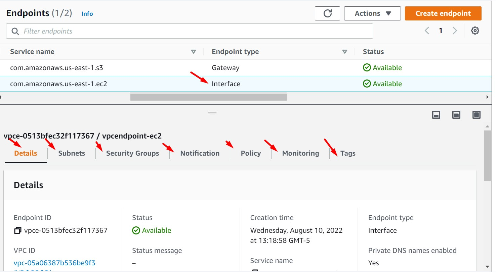

<br>


---
<br>

### Enlaces

 * https://aws.amazon.com/privatelink/pricing/
 * https://aws.amazon.com/privatelink/features/
