# AWS Solutions Architect Associate - Laboratorio 10

<br>

### Objetivo: 
* Configuración de Peering Connection

### Tópico:
* Networking

### Dependencias:
* Implementación del Laboratorio 01
* Implementación del Laboratorio 02
* Implementación del Laboratorio 03

<br>

---

### A - Configuración de Peering Connection


<br>

1. Desplegamos la plantilla CloudFormation "/code/lab10_cloudformation_ec2_db_ohio.yaml" en el servicio AWS CloudFormation de la región de Ohio (us-east-2). Previamente deberemos generar un "Key Pair" en el servicio EC2 de la misma región (Ohio). La plantilla usará los siguientes parámetros.

  * **Stack Name:** lab10-cloudformation-ec2-db-ohio
  * **InstancesFamily:** No modificar. Se seleccionará el tipo de familia t2.micro por defecto.
  * **KeyPair:** aws-solutionsarchitectassociate-ohio (nombre del KeyPair previamente generado)
  * **SubnetCIDR1D:** 10.0.1.0/24
  * **VPCCIDRD:** 10.0.0.0/16. Este segmento de red no deberá solapar al CIDR de la VPC de la región de N. Virginia. Si hemos seguido los laboratorios no deberá existir problemas de solapamiento.


<br>

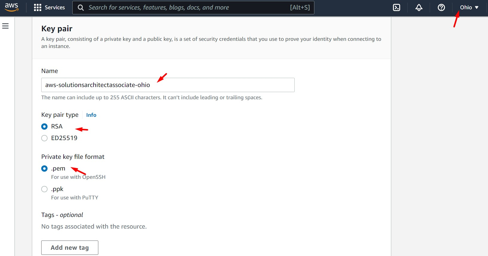

<br>


2. La plantilla nos generará una instancia MySQL "QA DB". Podremos conectarnos vía "System Manager - Session Manager" a la instancia. Validar que el puerto 3306 se encuentre arriba (Región: Ohio). 

<br>

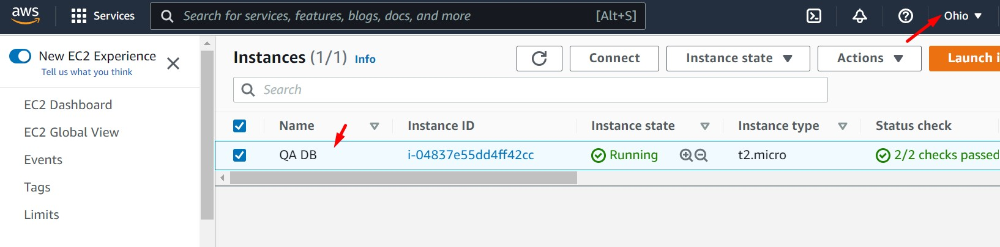

<br>

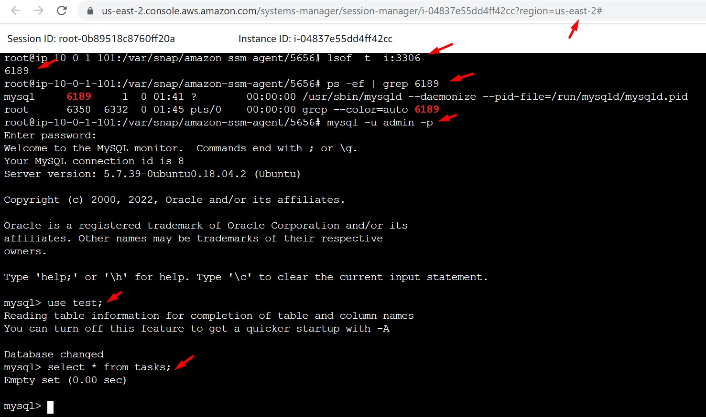

<br>

```bash
lsof -t -i:3306
#Se tendrá como resultado un PID_NUMBER
ps -ef | grep PID_NUMBER
mysql -u admin -p
#Ingresamos el password "admin"
use test;
select * from tasks;
````

3. Ingresamos a la instancia "PROD BACKEND" de la región de N. Virginia. Modificamos el archivo .env ubicado en la ruta /opt/aws-solutionsarchitectassociate/App/backend/ con el objetivo de colocar la IP Privada de la instancia "QA DB" de la región Ohio

```bash
cd /opt/aws-solutionsarchitectassociate/App/backend/
nano .env
#Modificar el campo "DB_URI" y guardamos cambios
lsof -t -i:80
#Tendremos un PID_NUMBER resultante
kill -9 PID_NUMBER
npm start &
```

<br>

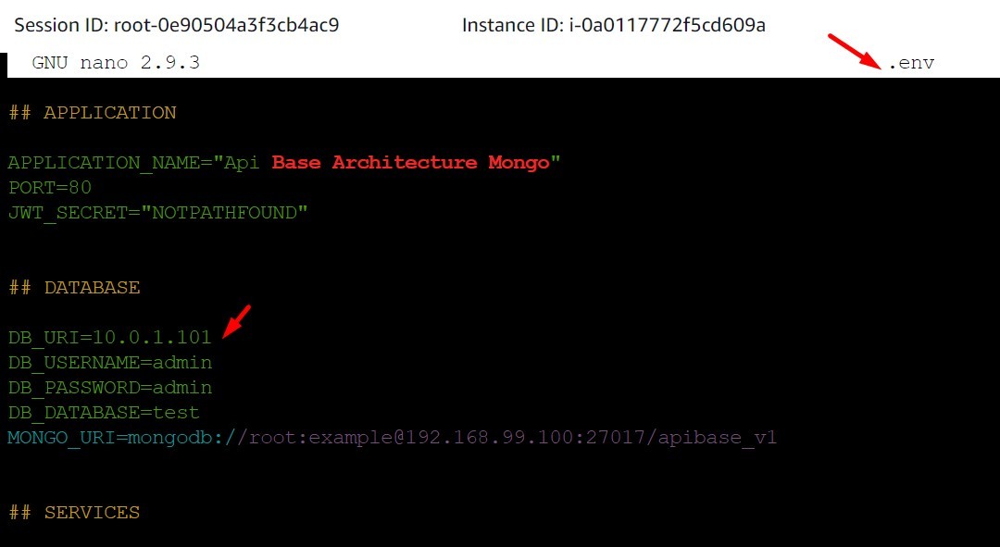

<br>

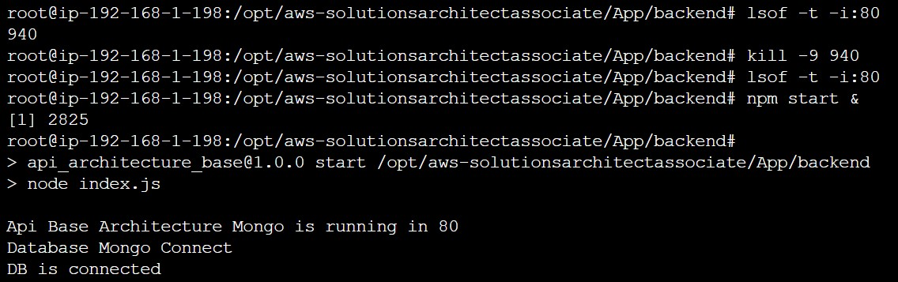

<br>

4. Validamos nuestra aplicación. Esta no presenta el comportamiento normal debido a que no hay conectividad entre las instancias "PROD BACKEND" y "QA DB".

<br>

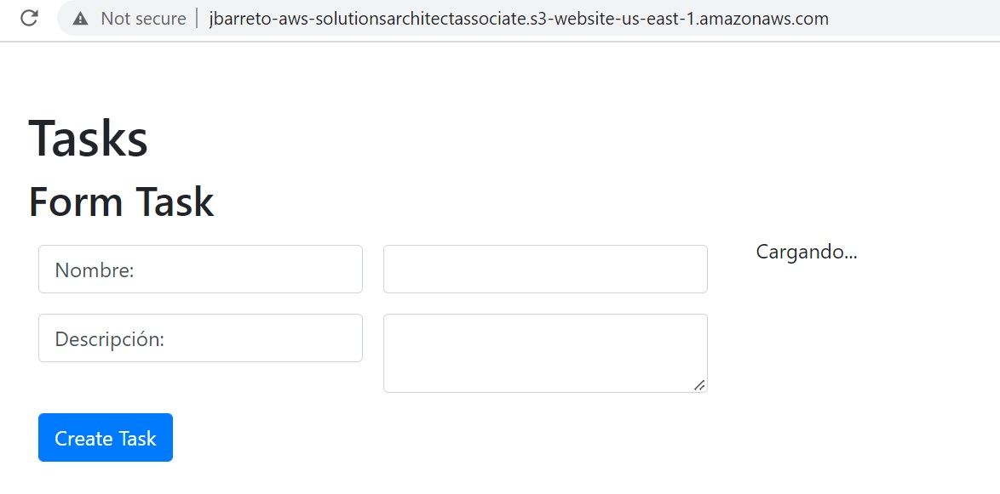

<br>

5. Debido a que las instancias se encuentran en dos VPCs distintas, configuramos VPC Peering Connections. Nos dirigimos al servicio VPC, luego a la opción "Peering Connections" de la región N.Virginia. Dar clic en "Create Peering Connection". Deberemos ingresar el VPC ID aprovisionado en la región Virginia y el aprovisionado en la región de Ohio. 

<br>

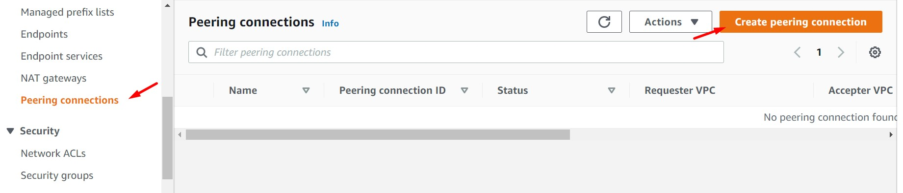

<br>

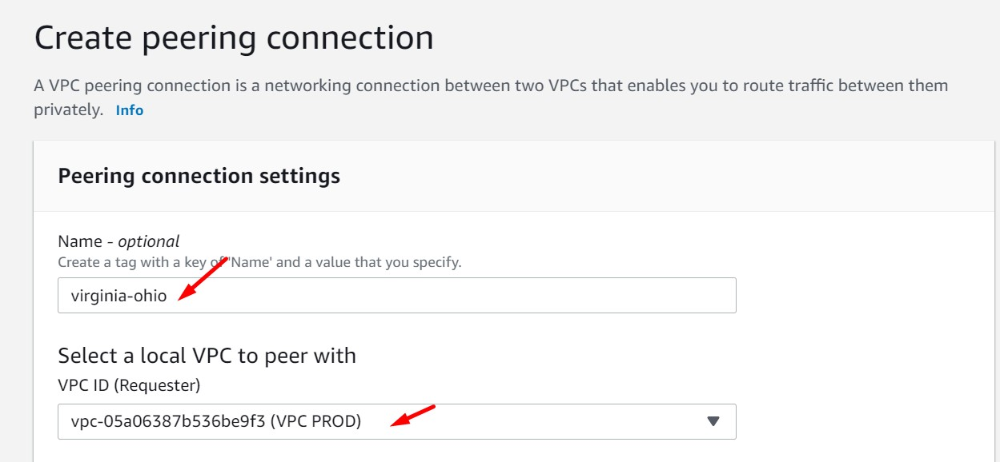

<br>

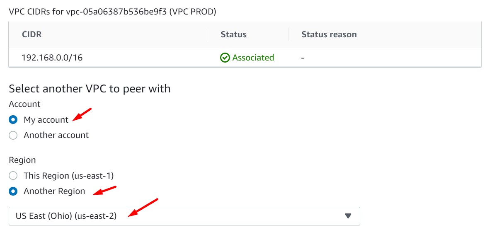

<br>

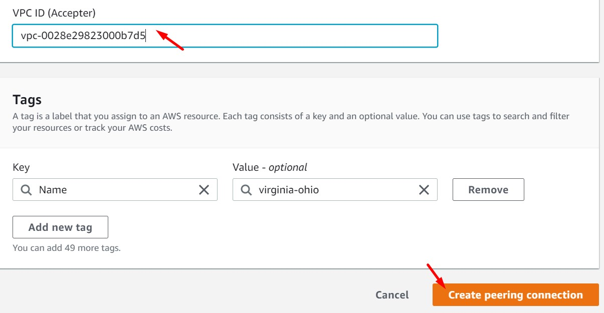

<br>

6. Nos dirigimos al servicio VPC de la región Ohio, luego ingresamos la opción "Peering Connection". Seleccionamos el registro generado, damos clic en "Actions" y luego seleccionamos "Accept request". Validaremos que el estado del "Peering Connection" es "Active" en Ohio y en Virginia.

<br>

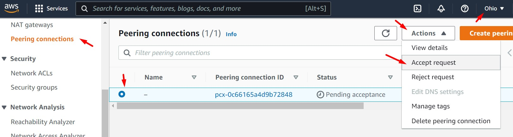

<br>

7. La siguiente y última configuración corresponde en agregar una nueva ruta en el Route Table respectivo. Esta actividad se deberá realizar tanto en la región de Ohio como en la región de N. Virginia. Los route tables a configurar son: "QA RT PUBLIC" (Ohio) y "RT PUBLICA PROD" (N.Virginia)"

  * CIDR VPC N.Virginia (VPC PROD): 192.168.0.0/16. La VPC PROD tendrá como destino VPC QA (10.0.0.0/16)
  * CIDR VPC Ohio (VPC QA): 10.0.0.0/16. La VPC QA tendrá como destino VPC PROD (192.168.0.0/16)


<br>

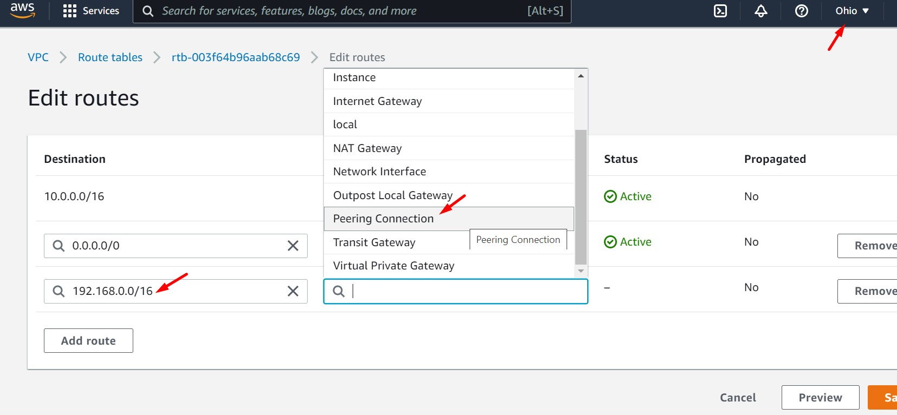

<br>

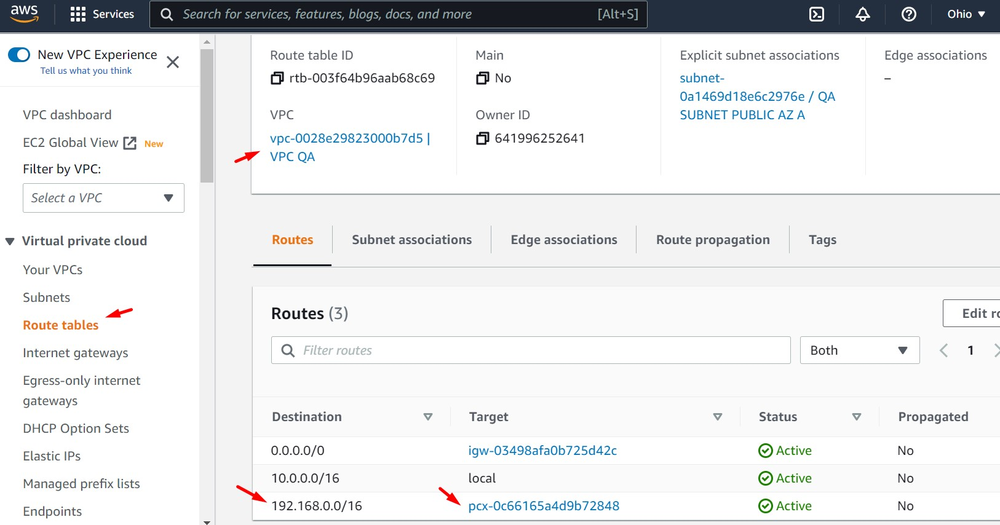

<br>

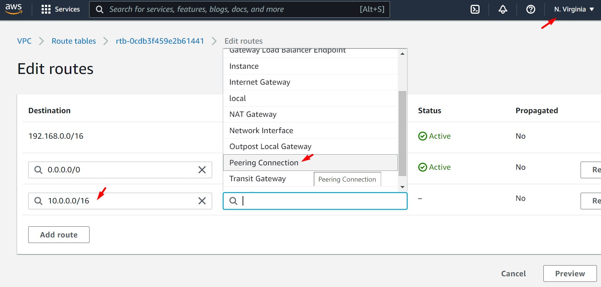

<br>

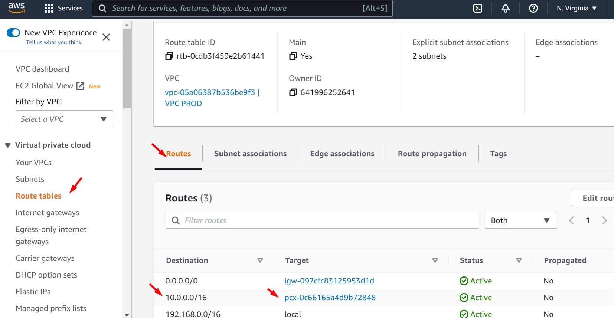

<br>

8. Accedemos la instancia "PROD BACKEND" (N.Virginia) y levantamos el servicio nuevamente. Validar la respuesta de nuestra aplicación. Ingresar un nuevo registro en nuestra aplicación.

```bash
cd /opt/aws-solutionsarchitectassociate/App/backend/
npm start &
```

<br>

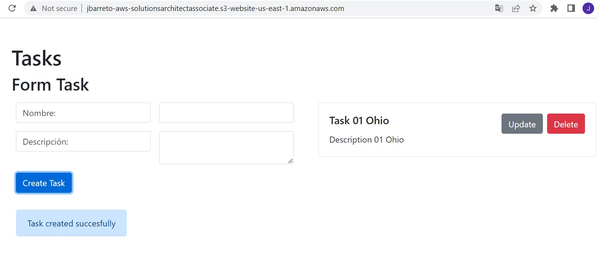

<br>

9. Ingresamos a la instancia "QA DB" (Ohio) y validamos que el registro se haya generado en MySQL

```bash
mysql -u admin -p
#Ingresamos el password "admin"
use test;
select * from tasks;
````

<br>

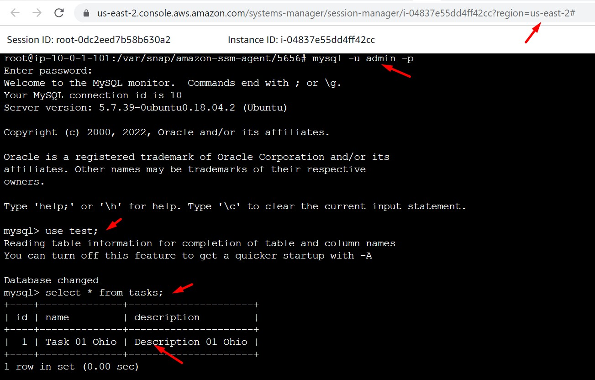

<br>

