# AWS Solutions Architect Associate - Laboratorio 11

<br>

### Objetivo: 
* Despliegue de una balanceador de aplicaciones (Application Load Balancer)

### Tópico:
* Compute

### Dependencias:
* Ninguna

<br>

---

### A - Despliegue de una balanceador de aplicaciones (Application Load Balancer)


<br>

1. Debemos tener una llave Key Pair disponible. De no ser así, acceder al servicio EC2 y luego a la opción "Key Pair". Generar llave RSA y .pem 

<br>

2. Acceder al servicio AWS Cloud9 y generar un nuevo ambiente de trabajo (Ubuntu 18.04 LTS)

<br>

3. Ejecutar los siguinentes comandos en nuestro Cloud9

```bash
#Ubuntu 18.04
sudo apt-get update
git clone https://github.com/jbarreto7991/aws-solutionsarchitectassociate.git
```

<br>

4. Acceder al laboratorio 11 (Lab-11), carpeta "code". Validar que se cuenta con dos archivos CloudFormation: "1_lab11-vpc.yaml" y "2_lab11-ec2.yaml"  Analizar el contenido de estos archivos.

<br>

5. Desplegar cada plantilla CloudFormation ejecutando AWSCLI. Considerar los parámetros a ser ingresados.

<br>

6. **1_lab11-vpc.yaml** (Esperar el despliegue total de esta plantilla cloudformation para continuar con la siguiente plantilla). En la sección "ParameterValue", ingresar el nombre del KeyPair creado en el paso 1. Esta plantilla creará la VPC "192.168.0.0/16", 06 Subnets dentro de este CIDR, un NAT Instances y demás componentes de red. No deberán existir redes existentes en este rango de IPs. Validar la creación del Stack desde la consola AWS a través del servicio AWS CloudFormation. El siguiente comando considera el valor "aws-solutionsarchitectassociate" para el KeyPair, reemplazar el nombre según la llave respectiva.

```bash
aws cloudformation create-stack --stack-name lab11-vpc --template-body file://~/environment/aws-solutionsarchitectassociate/Lab-11/code/1_lab11-vpc.yaml --parameters ParameterKey=KeyPair,ParameterValue="aws-solutionsarchitectassociate" --capabilities CAPABILITY_IAM
```

<br>

7. **2_lab11-ec2.yaml**. En la sección "ParameterValue", ingresar el nombre del KeyPair creado en el paso 1. Esta plantilla creará dos instancias EC2 ubicados, uno de ellos, en la subnet privada AZ A y el otro en la subnet privada AZ B.

```bash
aws cloudformation create-stack --stack-name lab11-ec2 --template-body file://~/environment/aws-solutionsarchitectassociate/Lab-11/code/2_lab11-ec2.yaml --parameters ParameterKey=KeyPair,ParameterValue="aws-solutionsarchitectassociate" --capabilities CAPABILITY_IAM
```

<br>

8. En el despliegue de recursos a través de CloudFormation se han generado 6 subnets: 2 subnets públicas (a ser usadas por el BALANCEADOR), 2 subnets privadas (donde han sido desplegado dos EC2 INSTANCES BACKEND) y otras 2 subnets privadas que actualmente no tiene uso, pero serán destinadas en los siguientes laboratorios para la base de datos.

<br>

9. Ingresamos al servicio EC2, luego al features "Target Groups". Damos clic en el botón "Create Target Group". Seleccionamos/ingresamos los siguientes valores:

  * Choose a target type: Instances
  * Target group name: tg-app
  * Protocol - Port: HTTP - 80
  * VPC: PROD VPC
  * Protocol version: HTTP1
  * Health Checks
    * Health Check Protocol: HTTP
    * Health check path: /
  * Advanced health check settings
    * Port: Traffic port
    * Healthy threshold: 3
    * Unhealthy threshold: 2
    * Timeout: 3
    * Interval: 5
    * Success codes: 200


<br>

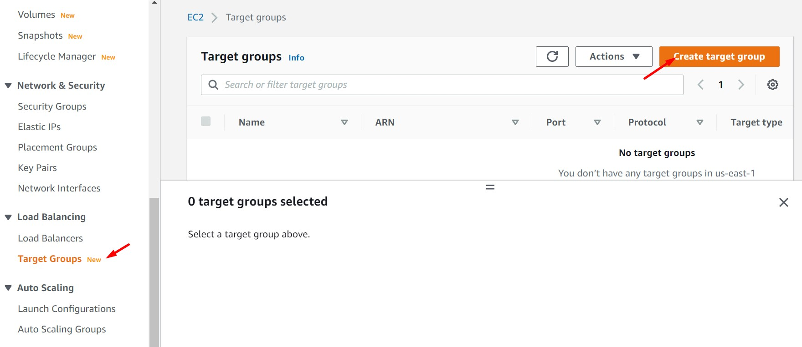

<br>

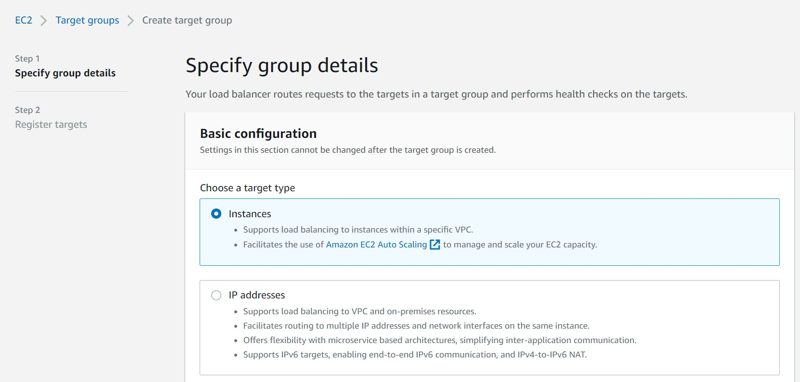

<br>

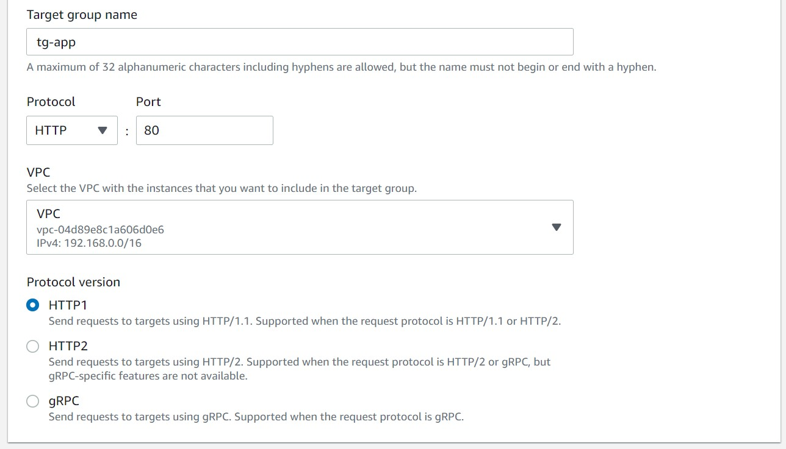

<br>

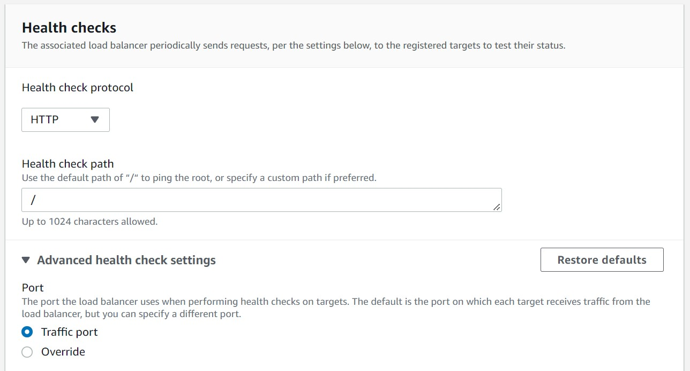

<br>

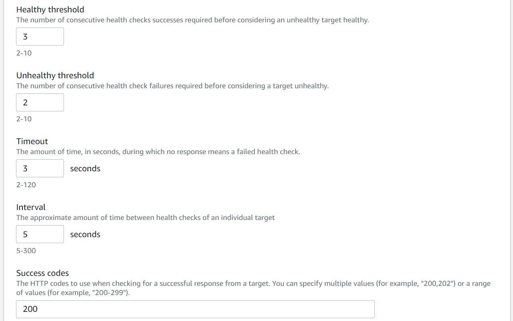

<br>

10. En la siguiente pantalla, seleccionamos las dos instancias generadas a través de CloudFormation. Seleccionamos el puerto 80 (puerto donde está levantado nuestro servicio en las instancias EC2) en la opción "Ports for the selected instances" y damos clic en el botón "Include as pending below". Luego dar clic en el botón "Create Target Group"

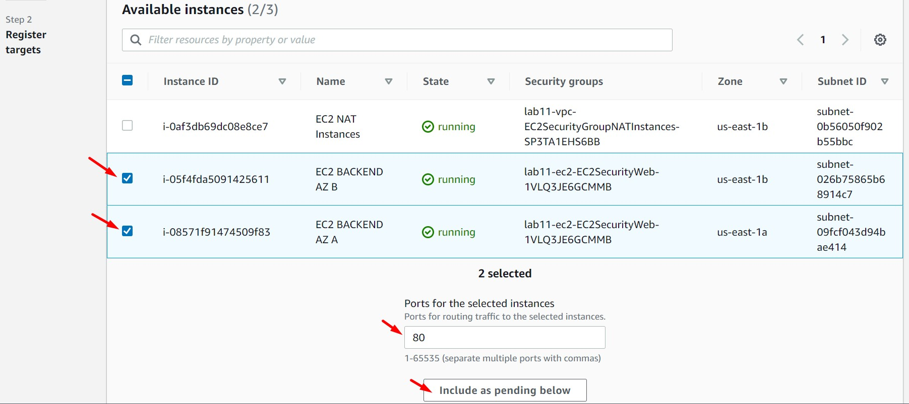

<br>

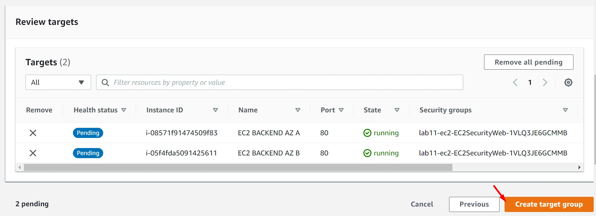

<br>

11. Ingresamos al feature "Load Balancers" y damos clic en el botón "Create Load Balancer". Seleccionamos el balanceador tipo "Application Load Balancer" y configuramos los siguientes items. Luego, dar clic en "Create Load Balancer"

  * **Basic configuration**
    * Load balancer name: alb
    * Scheme: Internet-facing
    * IP address type: IPv4
  * **Network mapping**
    * VPC: PROD VPC
    * Mappings:
      * us-east-1a | Subnet: SUBNET PUBLICA AZ A
      * us-east-1b | Subnet: SUBNET PUBLICA AZ B
  * **Security Groups**
    * Security Groups: lab11-ec2-EC2SecurityWeb 
  * **Listen and routing**
    * Protocol: HTTP
    * Port: 80
    * Default action: Forward to "tg-app" 

<br>

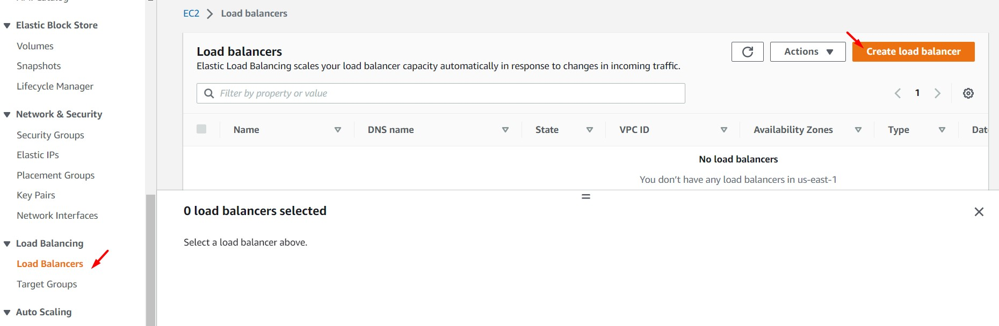

<br>

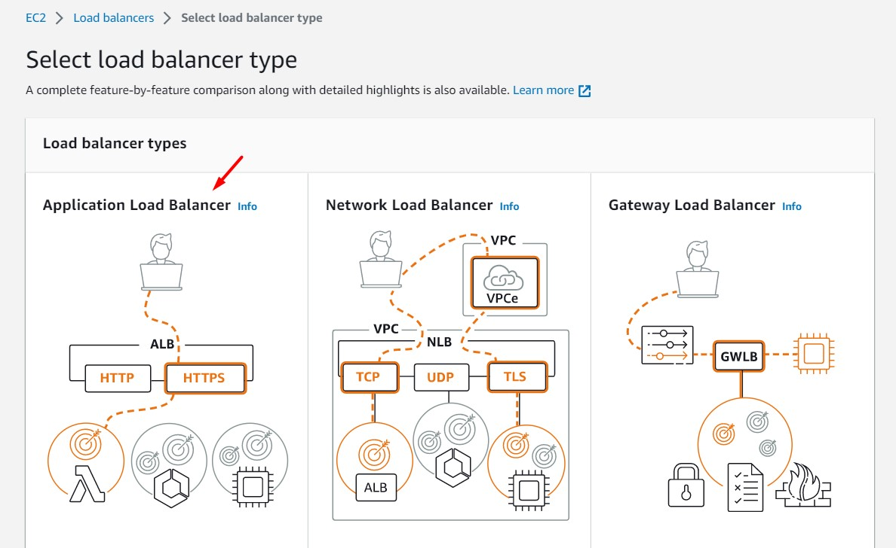

<br>

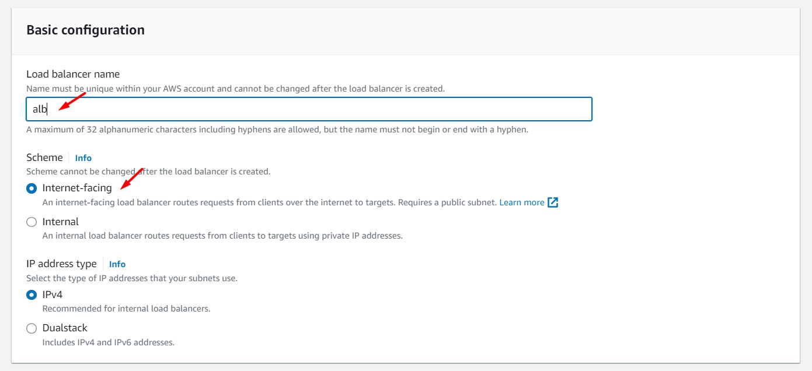

<br>

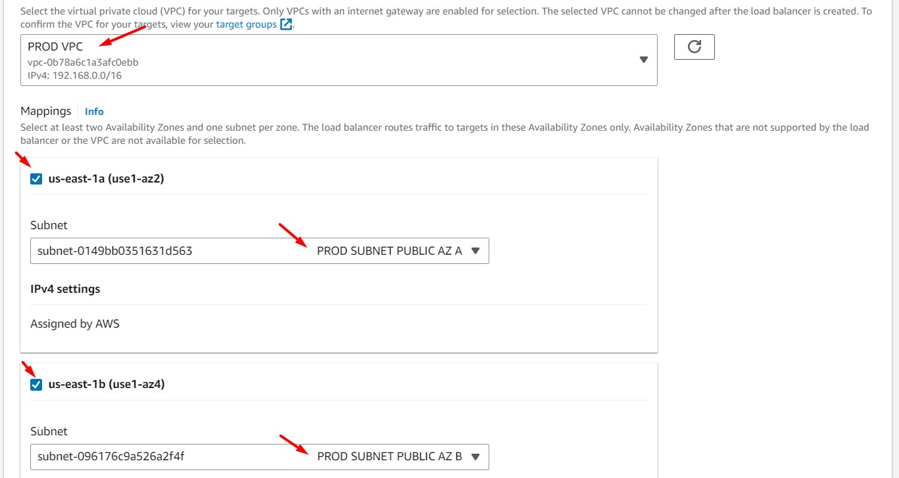

<br>


<br>

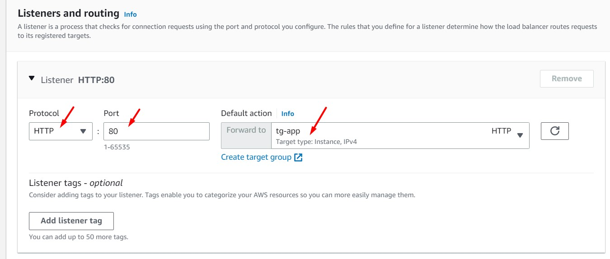

<br>

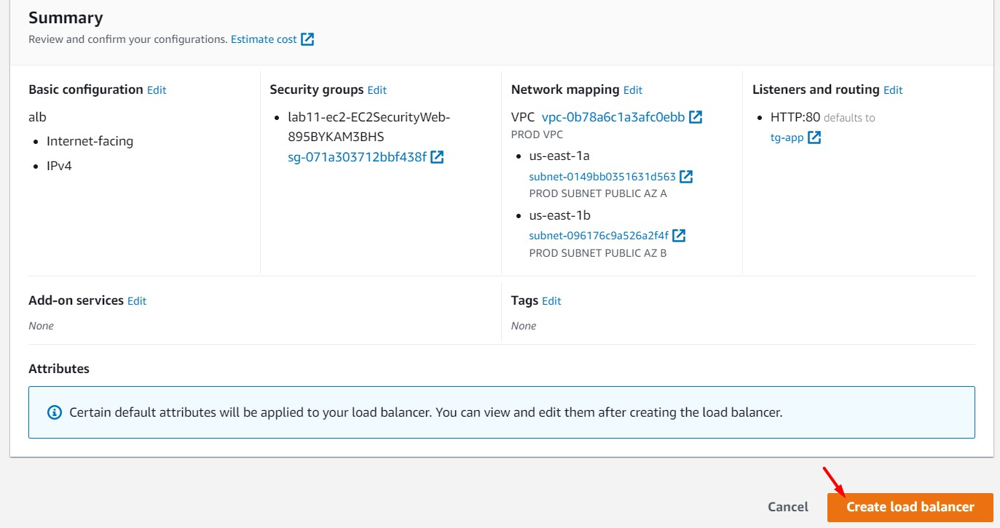

<br>

12. Esperamos unos pocos minutos y visualizaremos nuestro balanceador en el estado "Active". Usamos el "DNS Name" para cargar la aplicación. Analizar la información mostrada.

<br>

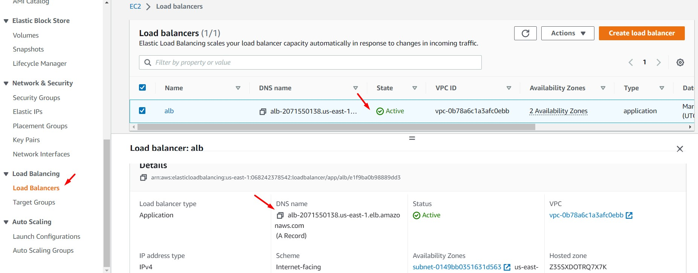

<br>

13. Usando el "DNS Name" (alb-212213027.us-east-1.elb.amazonaws.com) del balanceador aprovisionado visualizamos que nuestra aplicación carga. Si refrescamos el navegador, visualizaremos que el contenido de nuestra aplicación cambia a nivel de "EC2 Instance ID" y "Availability Zone". Este comportamiento demuestra la principal característica de una balanceador, es decir balancear el tráfico entre la instancia "PROD BACKEND AZ A" y "PROD BACKEND AZ B".

<br>

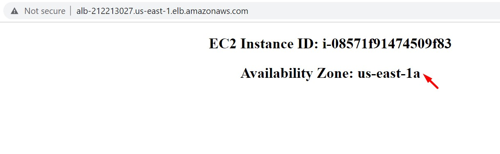

<br>

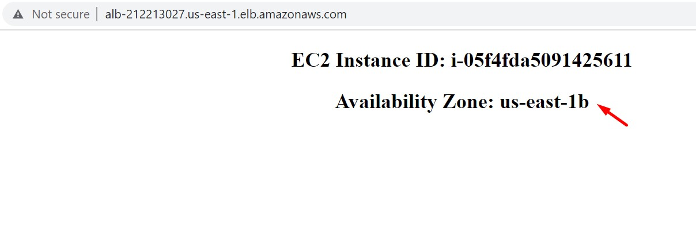

<br>

---

### Eliminación de recursos

```bash
#Eliminar el Application Load Balancer "alb" (ALB)

#Eliminar el Target Group (tg-app)

aws cloudformation delete-stack --stack-name lab11-ec2
aws cloudformation delete-stack --stack-name lab11-vpc
```