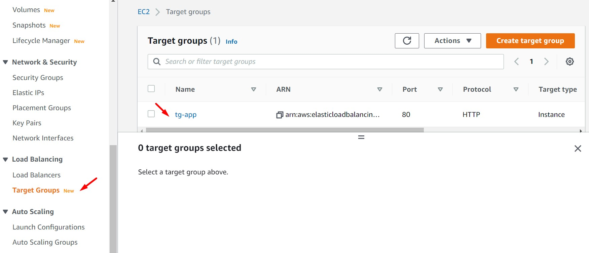
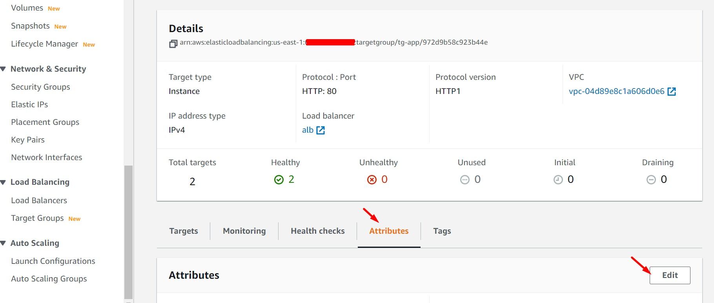
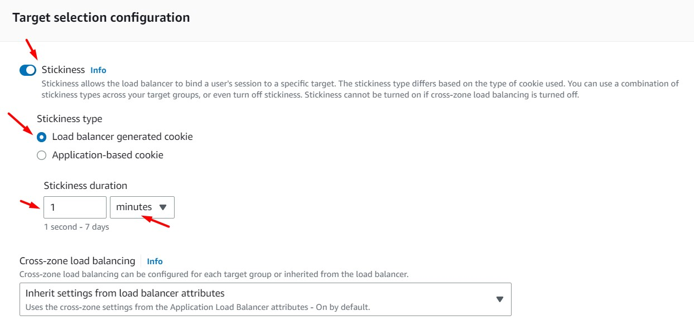

# AWS Solutions Architect Associate - Laboratorio 12

 

### Objetivo: 
* Configuración de Sticky Session en el Application Load Balancer (ALB)

### Tópico:
* Compute

### Dependencias:
* Implementación del Laboratorio 11

 

---

### A - Configuración de Sticky Session en el Application Load Balancer (ALB)

 

1. Cada vez que consumimos la URL de nuestro navegador podemos visualizar un contenido diferente a nivel de datos de "EC2 Instances ID" y "Availability Zone"

 

2. Accedemos al target group creado previamente (tg-app). Luego, accedemos a la opción "Attributes" y damos clic en el botón "Edit"

 

 

 

3. Habilitamos la opción "Stickiness" y seleccionamos "Load balancer generated cookie". Ingresamos el valor de "1 minute" en el campo "Stickiness duration". Damos clic en el botón "Save changes"

 

 

4. Accedemos al DNS Name del balanceador de aplicaciones. Visualizaremos que dentró del tiempo configurado (1 minuto) la aplicación nos muestra la misma información. Pasado ese tiempo, el contenido de la aplicación cambia. Durante el tiempo configurado del Sticky Session el balanceador sólo direcciona al usuario a una instancia EC2.

---

 

### Enlaces

* https://docs.aws.amazon.com/elasticloadbalancing/latest/application/sticky-sessions.html
