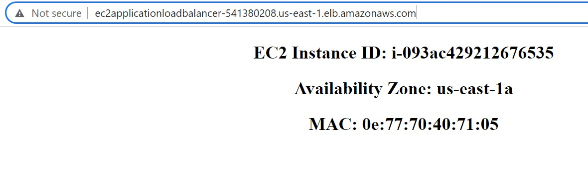
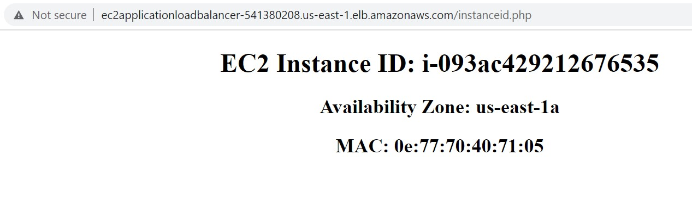
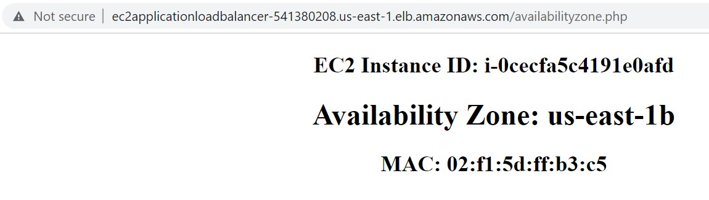
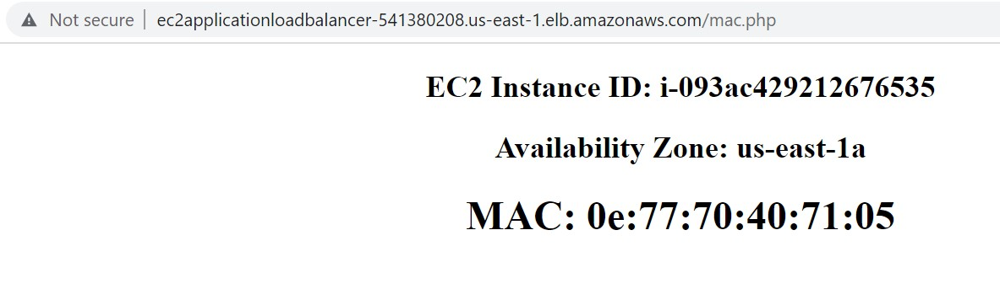
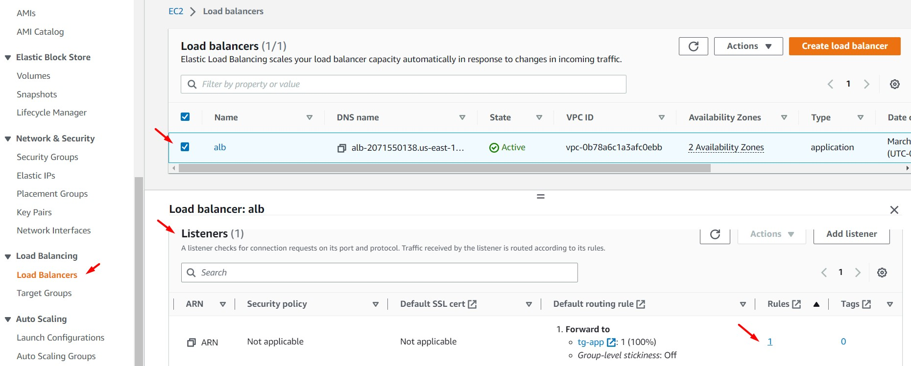
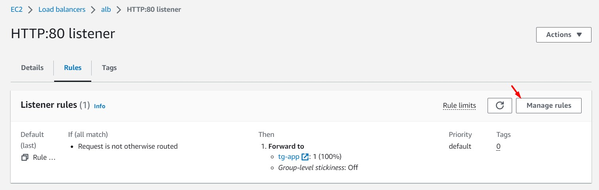
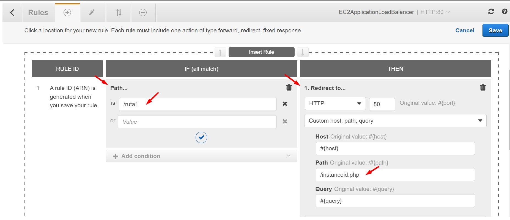
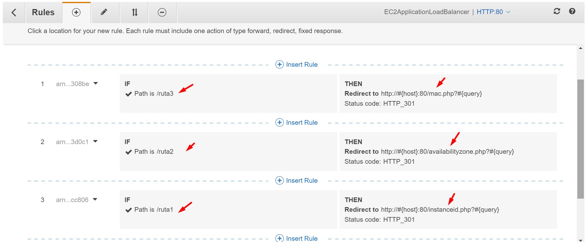

# AWS Solutions Architect Associate - Laboratorio 13

<br>

### Objetivo: 
* Configuración del Listener Rules en el Application Load Balancer (ALB)

### Tópico:
* Compute

### Dependencias:
* Ninguna

<br>

---

### A - Configuración de Listener Rules en el Application Load Balancer (ALB)


<br>

1. Debemos tener una llave Key Pair disponible. De no ser así, acceder al servicio EC2 y luego a la opción "Key Pair". Generar llave RSA y .pem 

<br>

2. Acceder al servicio AWS Cloud9 y generar un nuevo ambiente de trabajo (Ubuntu 18.04 LTS)

<br>

3. Ejecutar los siguinentes comandos en nuestro Cloud9

```bash
#Ubuntu 18.04
sudo apt-get update
git clone https://github.com/jbarreto7991/aws-solutionsarchitectassociate.git
```

<br>

4. Acceder al laboratorio 13 (Lab-13), carpeta "code". Validar que se cuenta con tres archivos CloudFormation: "1_lab13-vpc.yaml", "2_lab13-ec2.yaml" y "3_lab13_alb_targetgroup". Analizar el contenido de estos archivos.

<br>

5. Desplegar cada plantilla CloudFormation ejecutando AWSCLI. Considerar los parámetros a ser ingresados.

<br>

6. **1_lab13-vpc.yaml** (Esperar el despliegue total de esta plantilla cloudformation para continuar con las siguientes plantillas). En la sección "ParameterValue", ingresar el nombre del KeyPair creado en el paso 1. Esta plantilla creará la VPC "192.168.0.0/16", 06 Subnets dentro de este CIDR, un NAT Instances y demás componentes de red. No deberán existir redes existentes en este rango de IPs. Validar la creación del Stack desde la consola AWS a través del servicio AWS CloudFormation. El siguiente comando considera el valor "aws-solutionsarchitectassociate" para el KeyPair, reemplazar el nombre según la llave respectiva.

```bash
aws cloudformation create-stack --stack-name lab13-vpc --template-body file://~/environment/aws-solutionsarchitectassociate/Lab-13/code/1_lab13-vpc.yaml --parameters ParameterKey=KeyPair,ParameterValue="aws-solutionsarchitectassociate" --capabilities CAPABILITY_IAM
```

<br>

7. **2_lab13-ec2.yaml** (Esperar el despliegue total de esta plantilla cloudformation para continuar con la siguiente plantilla). En la sección "Parameters", ingresar el nombre del KeyPair creado en el paso 1. Esta plantilla creará dos instancias EC2 ubicados, uno de ellos, en la subnet privada AZ A y el otro en la subnet privada AZ B. Cada subnet tendrá las siguientes páginas "index.php", "instanceid.php", "availabilityzone.php" y "mac.php"

```bash
aws cloudformation create-stack --stack-name lab13-ec2 --template-body file://~/environment/aws-solutionsarchitectassociate/Lab-13/code/2_lab13-ec2.yaml --parameters ParameterKey=KeyPair,ParameterValue="aws-solutionsarchitectassociate" --capabilities CAPABILITY_IAM
```

<br>

8. En el despliegue de recursos a través de CloudFormation se han generado 6 subnets: 2 subnets públicas (a ser usadas por el BALANCEADOR), 2 subnets privadas (donde han sido desplegadas dos EC2 INSTANCES BACKEND) y otras 2 subnets privadas que actualmente no tiene uso, pero serán destinadas en los siguientes laboratorios para la base de datos.

<br>

9. **3_lab13-alb-targetgroup.yaml**. Esta plantilla no tiene parámetros por ingresar. Generará un target group y un balanceador de aplicaciones. Además, las instancias EC2 se asociarán al target group en el puerto 80.

```bash
aws cloudformation create-stack --stack-name lab13-alb-targetgroup --template-body file://~/environment/aws-solutionsarchitectassociate/Lab-13/code/3_lab13-alb-targetgroup.yaml
```

<br>

10. Con la ejecución de estas tres plantillas, tenemos nuestro laboratorio base construido.

<br>

11. Navegar en las siguientes URLs. Reemplazar con el "DNS Name" respectivo, para este laboratorio el DNS Name corresponde a "ec2applicationloadbalancer-541380208.us-east-1.elb.amazonaws.com"

    * http://ec2applicationloadbalancer-541380208.us-east-1.elb.amazonaws.com/
    * http://ec2applicationloadbalancer-541380208.us-east-1.elb.amazonaws.com/instanceid.php
    * http://ec2applicationloadbalancer-541380208.us-east-1.elb.amazonaws.com/availabilityzone.php
    * http://ec2applicationloadbalancer-541380208.us-east-1.elb.amazonaws.com/mac.php

<br>



<br>



<br>



<br>



<br>

12. Accedemos a la sección "Listener" de nuestro balanceador de aplicaciones. Luego, en la columna "Rules" accedemos al enlace respectivo. En la siguiente pantalla "HTTP:80 listener" damos clic en el botón "Manage rules". Damos clic en el icono "+", luego damos clic en el enlace "Insert Rule" e ingresamos los siguientes valores detallados a continuación.

    * Sección **"IF (all match)"**, seleccionamos "Add condition - Path". Ingresamos el texto "ruta1"
    * Sección **"THEN"**, seleccionamos "Add action - Redirect to". Ingresamos los siguientes valores:
        * HTTP: 80
        * Custom host, path, query
        * Path: /instanceid.php

Luego damos clic en los íconos "Checks" ubicados uno en cada columna. Finalmente damos clic en "Save".

<br>



<br>



<br>



<br>



<br>


13. Realizamos las validaciones respectivas. 

    * Si ingresamos a http://ec2applicationloadbalancer-541380208.us-east-1.elb.amazonaws.com/ruta1 tenemos redireccionamiento a http://ec2applicationloadbalancer-541380208.us-east-1.elb.amazonaws.com/instanceid.php
    * Si ingresamos a http://ec2applicationloadbalancer-541380208.us-east-1.elb.amazonaws.com/ruta2 tenemos redireccionamiento a http://ec2applicationloadbalancer-541380208.us-east-1.elb.amazonaws.com/availabilityzone.php
    * Si ingresamos a http://ec2applicationloadbalancer-541380208.us-east-1.elb.amazonaws.com/ruta3 tenemos redireccionamiento a http://ec2applicationloadbalancer-541380208.us-east-1.elb.amazonaws.com/mac.php


---

### Eliminación de recursos

```bash
aws cloudformation delete-stack --stack-name lab13-alb-targetgroup
aws cloudformation delete-stack --stack-name lab13-ec2
aws cloudformation delete-stack --stack-name lab13-vpc
```