# AWS Solutions Architect Associate - Laboratorio 14

 

### Objetivo: 
* Creación de un certificado SSL/TLS y su asociación al Application Load Balancer

### Tópico:
* Security, Identity & Compliance
* Content Delivery

### Dependencias:
* Implementación del Laboratorio 13
* Será necesario contar con un Dominio creado previamente para completar la validación del certificado SSL/TLS. Esto se podrá realizar a través del servicio Route53 de AWS u otro proveedor de dominios (por ejemplo GoDaddy)

 

---

### A - Creación de un certificado SSL/TLS y su asociación al Application Load Balancer

 

1. Accedemos al servicio Route 53 y validamos nuestro dominio. En este laboratorio nuestro dominio es "jorge-barreto.com"

 

 

2. Accedemos al servicio "AWS Certificate Manager" y damos clic en el botón "Request". Luego seleccionar la opción "Request a public certificate" y dar clic en el botón "Next". Ingresamos los siguientes valores y damos clic en el valor "Request".

    * Fully qualified domain name:
        * jorge-barreto.com
        * *.jorge-barreto.com

 

 

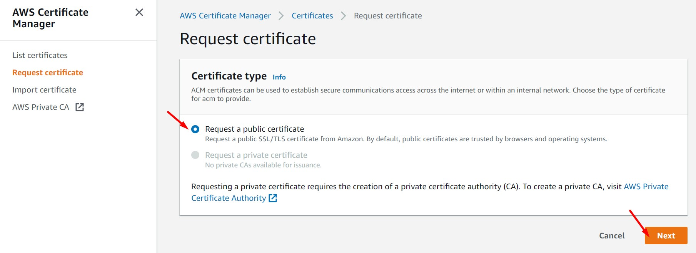

 

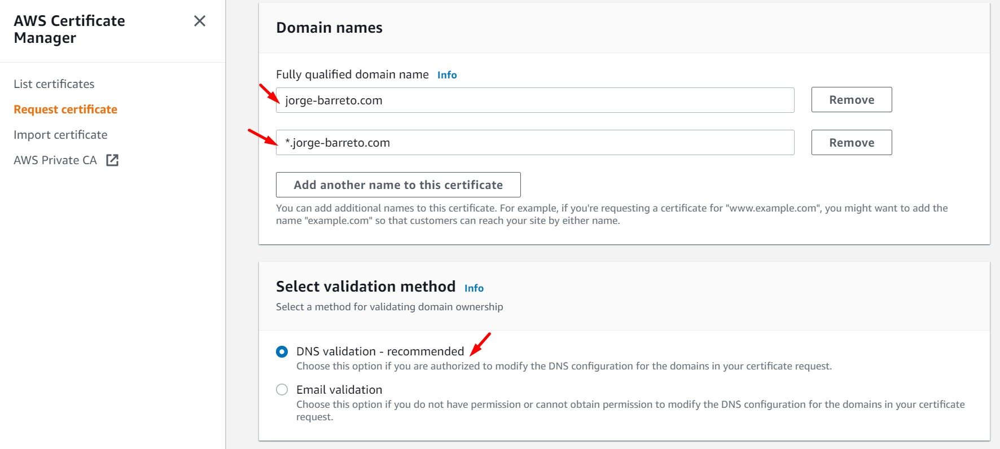

 

3. El estado inicial del certificado será "Pending validation". Accedemos al detalle del certificado e identificamos los valores de "CNAME name" y "CNAME value". Para este laboratorio se tienen los siguientes valores:

    * CNAME name:  _17b909f502f31737fa2b547e34f271c0.jorge-barreto.com.
    * CNAME value: _22e8d4480e5f1d14787e3efc59cc491e.wsqgzrdths.acm-validations.aws.

 

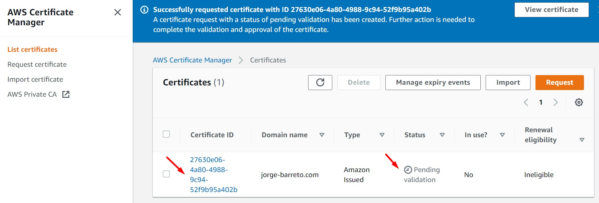

 

 

4. Accedemos al servicio Route 53 y al dominio existente. Luego, damos clic en "Create record". Ingresamos los siguientes valores:

    * Record name: _17b909f502f31737fa2b547e34f271c0
    * Record type: CNAME
    * Alias: Desactive
    * Value: _22e8d4480e5f1d14787e3efc59cc491e.wsqgzrdths.acm-validations.aws.
    * TTL(seconds): 300 
    * Routing Policy: Simple

 

 

 

5. Regresamos al servicio AWS Certificate Manager y validamos que el nuevo estado de certificado es "Issued" 

 

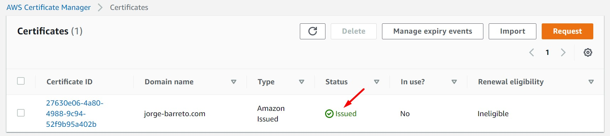

 

6. Copiamos el DNS Name del balanceador de aplicaciones y accedemos luego al dominio existente en Route 53. Luego, damos clic en "Create record". Ingresamos los siguientes valores para el balanceador de aplicaciones:

    * Record name: app
    * Record type: A - Routes traffic to an IPv4 address and some AWS resources
    * Alias: Active
    * Route traffic to: Alias to Application and Classic Load Balancer
    * Choose Region: US East (N. Virginia) [us-east-1]
    * Choose Load Balancer: EC2ApplicationLoadBalancer-541380208.us-east-1.elb.amazonaws.com. Ingresar el DNS Name particular
    * Routing Policy: Simple
    * Evaluate target health: Yes

 

 

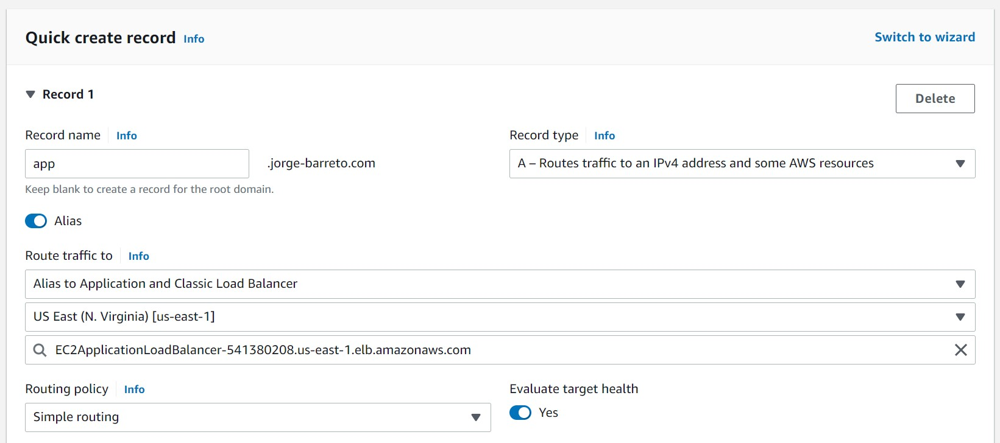

 

7. Nos dirigimos al balanceador de aplicaciones, luego a la pestaña "Listeners" y damos clic en el botón "Add listener". Realizamos las siguientes configuraciones y finalmente damos clic en el botón "Add". 

    * Listener details
        * Protocol: HTTPS
        * Port: 443
        * Default actions: Forward
            * Target group: EC2LoadBalancerTargetGroupApp
    * Secure listener settings
        * Security Policy: ELBSecurityPolicy-2016-08
        * Default SSL/TLS certificate
            * From ACM: Seleccionar certificado generado desde "Certificate Manager"

 

 

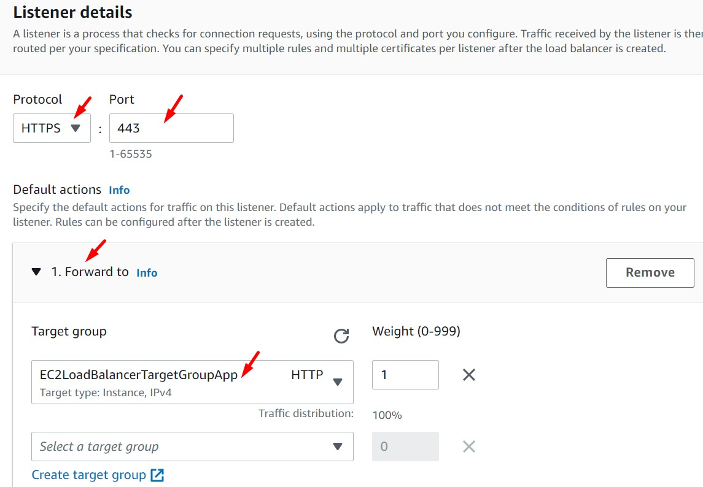

 

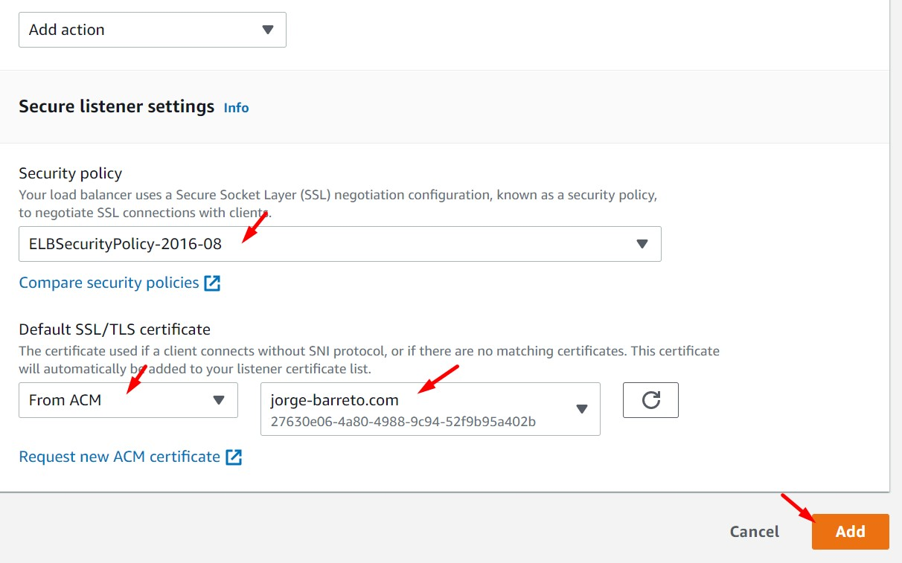

 

8. Desde el navegador web accedemos a "https://app.jorge-barreto.com" (o al subdominio configurado). Validamos el uso del certificado de seguridad.

 

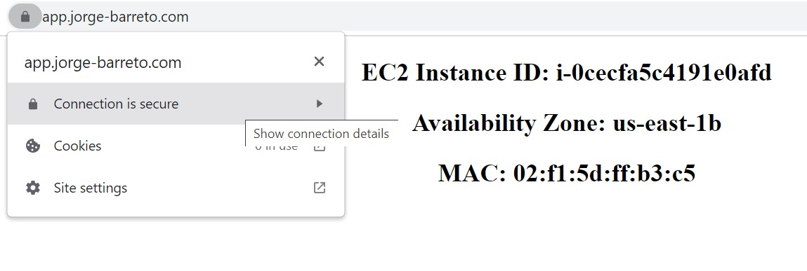

 

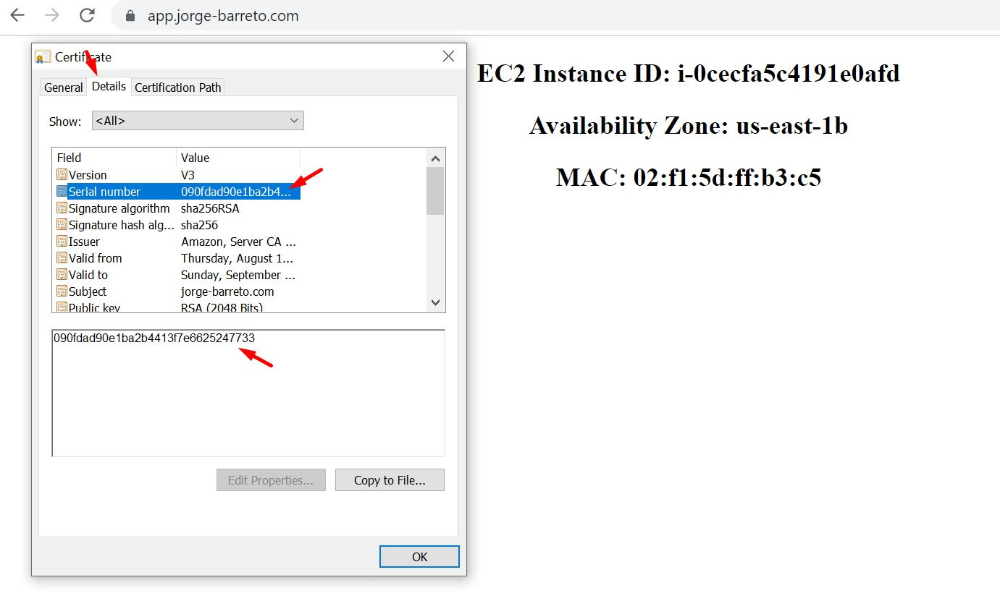

 

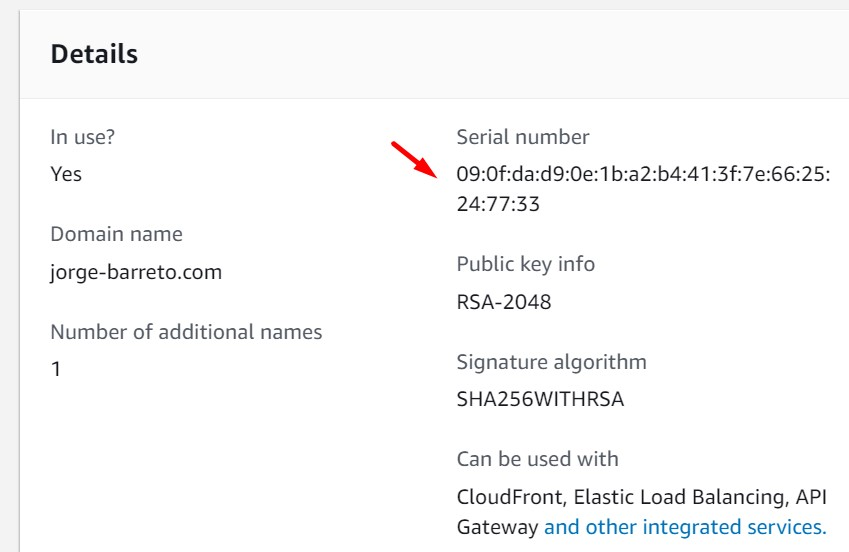

 

9. Si cargamos la página usando "http://app.jorge-barreto.com" (no https). Validaremos que la página carga sin el certificado. Accedemos al balanceador, luego a la pestaña "Listener" y damso clic en el enlace de la columna "Rules". Luego, damos clic en "Manage rules". Agregamos la siguiente regla.

    * Sección **"IF (all match)"**, seleccionamos "Add condition - Host Header". Ingresamos el texto "app.jorge-barreto.com"
    * Sección **"THEN"**, seleccionamos "Add action - Redirect to". Ingresamos los siguientes valores:
        * HTTPS: 443
        * Original host, path, query
        * Path: /instanceid.php

 

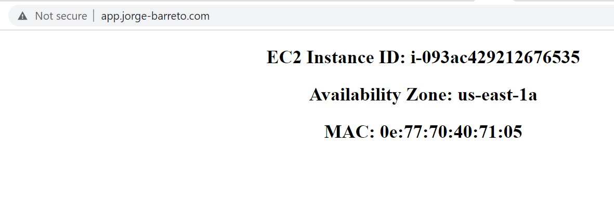

 

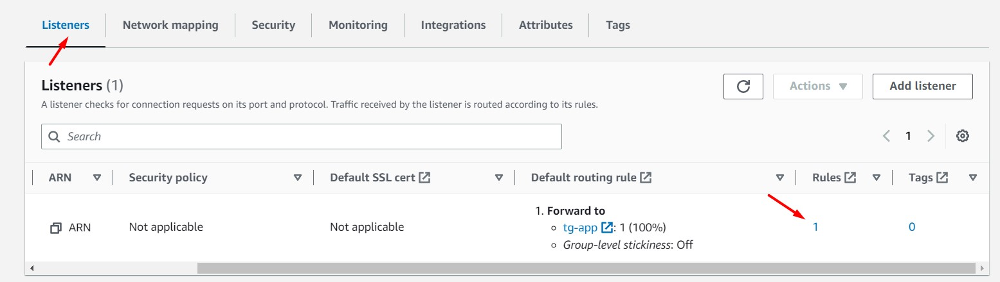

 

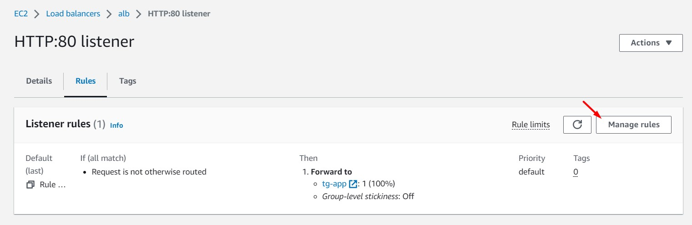

 

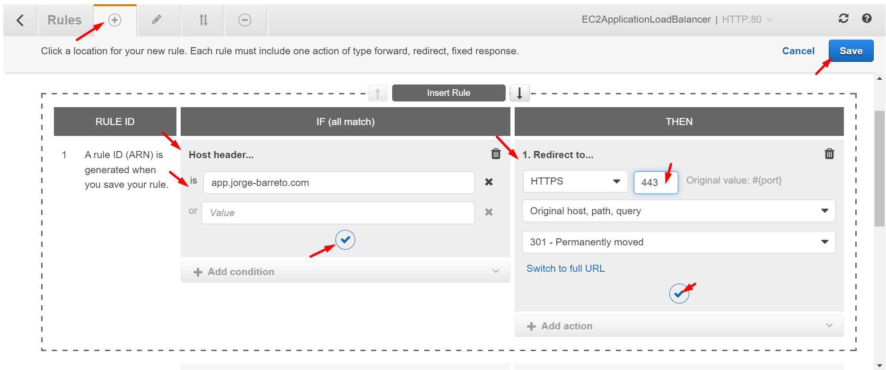

 

10.  Una vez registrada la nueva regla de Listener para HTTP:80 realizamos la carga de la aplicación sobre HTTP "http://app.jorge-barreto.com". Validamos el redireccionamiento de HTTP a HTTPS. 

 

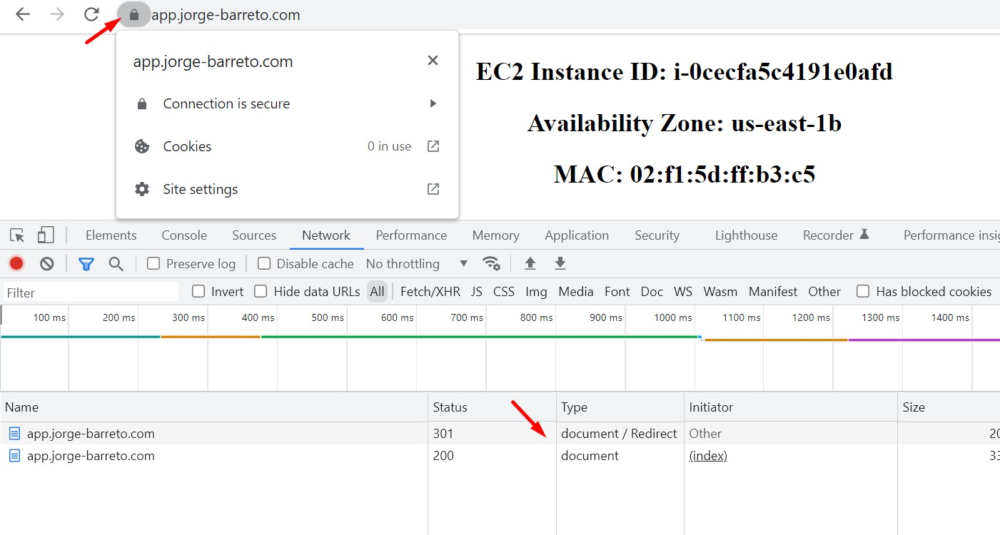

 