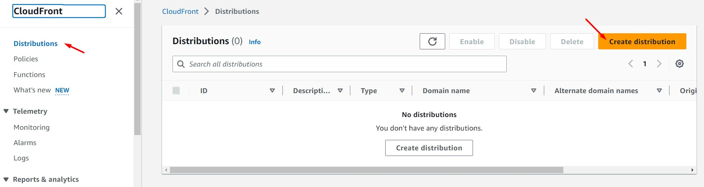
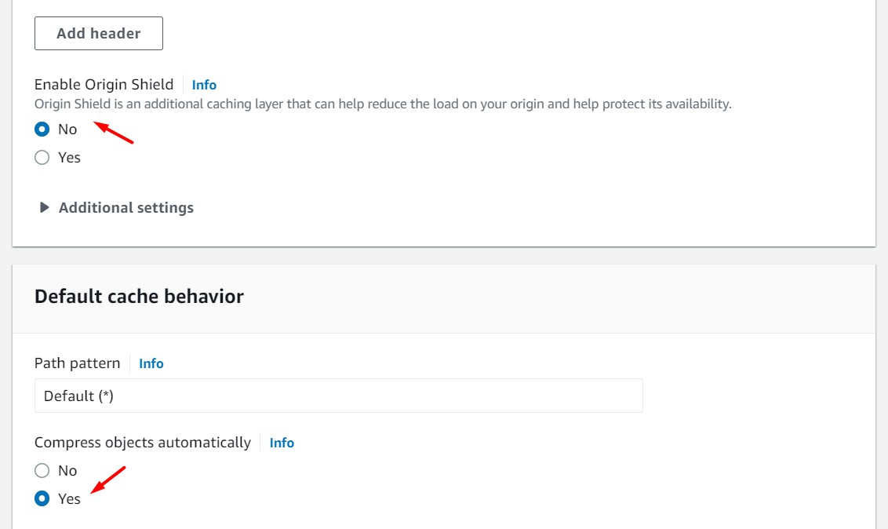
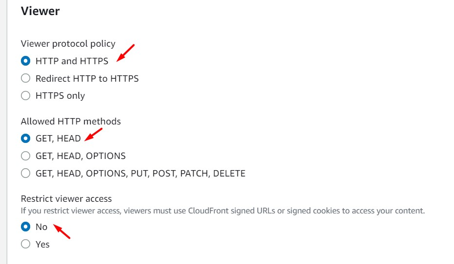
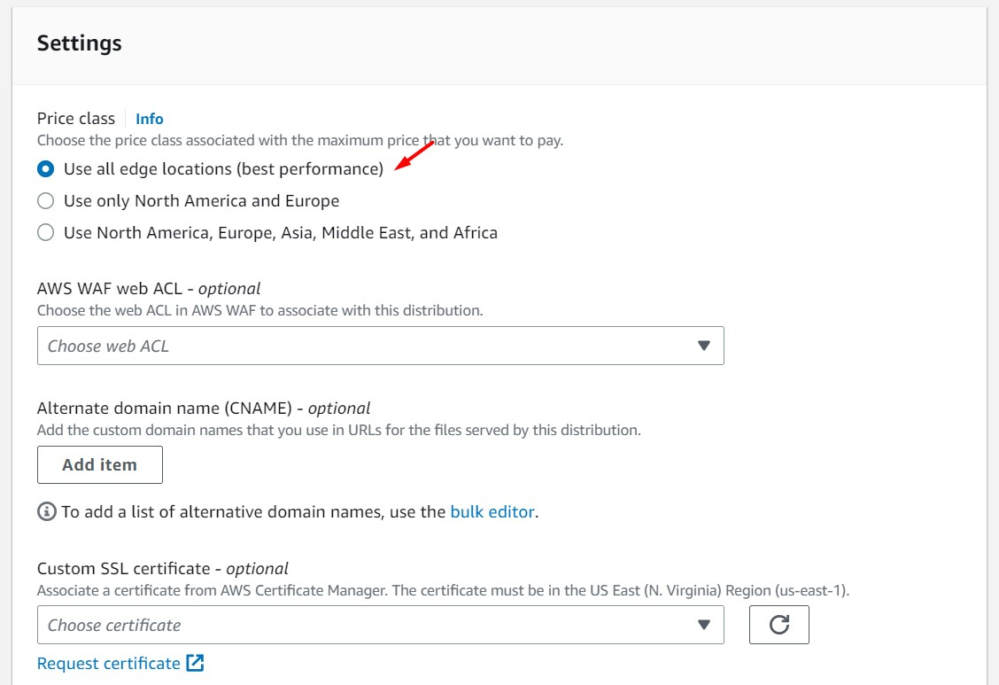
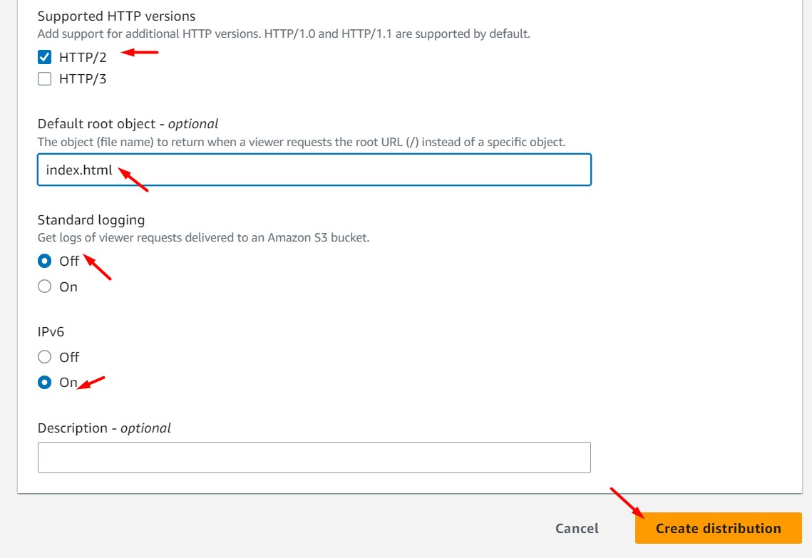
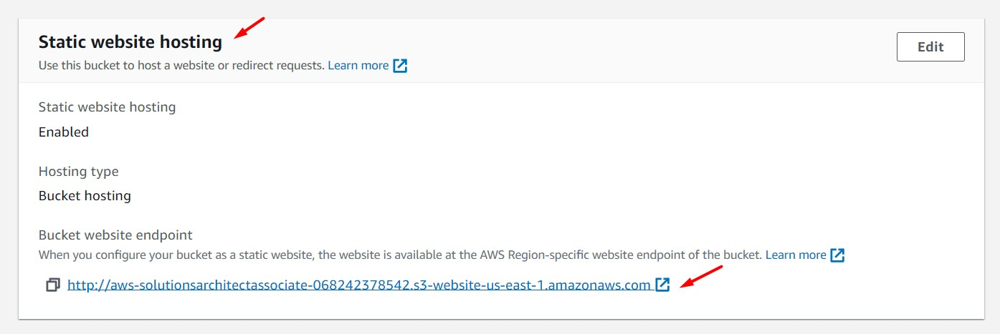
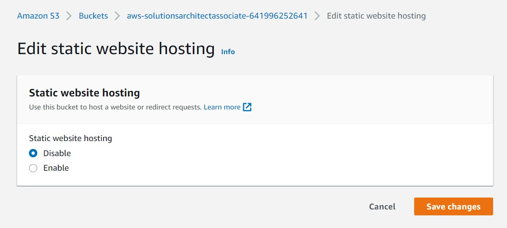
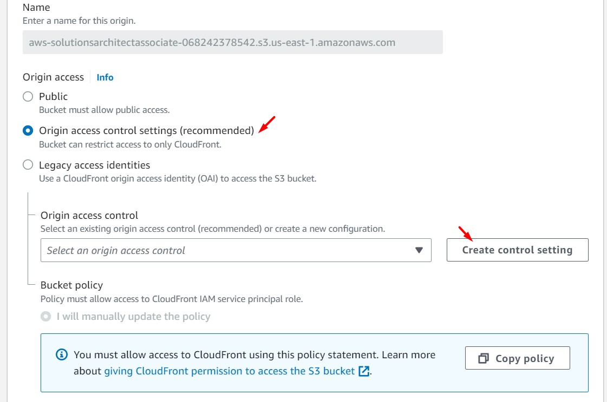
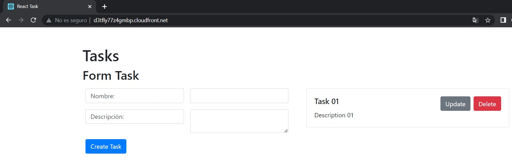
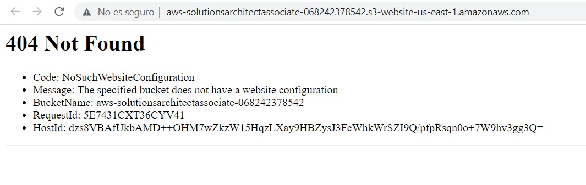

# AWS Solutions Architect Associate - Laboratorio 17

<br>

### Objetivo: 
* Despliegue de una distribución CloudFront usando como origen un bucket de S3
* Configurar OAC (Origin Access Control) en la distribución CloudFront y el bucket S3 

### Tópico:
* Content Delivery
* Storage
* Security, Identity & Compliance

### Dependencias:
* Ninguna

<br>

---

### A - Despliegue de una distribución CloudFront usando como origen un bucket de S3

<br>

1. Debemos tener una llave Key Pair disponible. De no ser así, acceder al servicio EC2 y luego a la opción "Key Pair". Generar llave RSA y .pem 

2. Acceder al servicio AWS Cloud9 y generar un nuevo ambiente de trabajo (Ubuntu 18.04 LTS)

3. Ejecutar los siguinentes comandos en nuestro Cloud9

```bash
#Ubuntu 18.04
sudo apt-get update
git clone https://github.com/jbarreto7991/aws-solutionsarchitectassociate.git
```

4. Acceder al laboratorio 17 (Lab-17), carpeta "code". Validar que se cuenta con dos archivos CloudFormation: "1_lab17-vpc.yaml" y "2_lab17-ec2.yaml". Analizar el contenido de estos archivos.

5. Desplegar cada plantilla CloudFormation ejecutando AWSCLI. Considerar los parámetros a ser ingresados.

    <br>
6. **1_lab17-vpc.yaml** (Esperar el despliegue total de esta plantilla cloudformation para continuar con la siguiente plantillas). En la sección "ParameterValue", ingresar el nombre del KeyPair creado en el paso 1. Esta plantilla creará la VPC "192.168.0.0/16", 06 Subnets dentro de este CIDR, un NAT Instances y demás componentes de red. No deberán existir redes existentes en este rango de IPs. Validar la creación del Stack desde la consola AWS a través del servicio AWS CloudFormation. El siguiente comando considera el valor "aws-solutionsarchitectassociate" para el KeyPair, reemplazar el nombre según la llave respectiva.

```bash
aws cloudformation create-stack --stack-name lab17-vpc --template-body file://~/environment/aws-solutionsarchitectassociate/Lab-17/code/1_lab17-vpc.yaml --parameters ParameterKey=KeyPair,ParameterValue="aws-solutionsarchitectassociate" --capabilities CAPABILITY_IAM
```

7. **2_lab17-ec2.yaml**. En la sección "Parameters", ingresar el nombre del KeyPair creado en el paso 1. Esta plantilla creará dos instancias EC2 (PROD BACKEND y PROD DB), un balanceador de aplicaciones y un Bucket S3 (con el nombre 'aws-solutionsarchitectassociate-${AWS::AccountId}').

```bash
aws cloudformation create-stack --stack-name lab17-ec2 --template-body file://~/environment/aws-solutionsarchitectassociate/Lab-17/code/2_lab17-ec2.yaml --parameters ParameterKey=KeyPair,ParameterValue="aws-solutionsarchitectassociate" --capabilities CAPABILITY_IAM
```

8. Accedemos al servicio de Amazon CloudFront y damos clic en el botón "Create distribution". Ingresamos/seleccionamos los siguientes valores. Luego, dar clic en el botón "Create distribution"

    * **Origin**
        * Origin domain: Seleccionar S3 Bucket respectivo
        * Origin path - optional: None
        * Name: Valor pre-cargado automáticamente
        * Origin Access: Public
        * Add custom header - optional: None
        * Enable Origin Shield: No
    * **Default cache behavior**
        * Path pattern: Default(*)
        * Compress objects automatically: Yes
    * **Viewer**
        * Viewer protocol policy: HTTP and HTTPS
        * Allowed HTTP methods: GET, HEAD
        * Restrict viewer access: No
    * **Cache key and origin requests**
        * Cache policy and origin request policy (recommended)
            * Cache policy: Caching Optimized
            * Origin request policy - optional: None
        * Response headers policy - optional: None
    * **Function associations - optional:** None
    * **Settings**
        * Price class: Use all edge locations (best performance)
        * AWS WAF web ACL - optional: None
        * Alternate domain name (CNAME) - optional: None
        * Custom SSL certificate - optional: None
        * Supported HTTP versions: HTTP/2
        * Default root object - optional: index.html
        * Standard logging: Off
        * IPv6: On
        * Description - optional: None


<br>



<br>


<br>



<br>



<br>


<br>


<br>



<br>



<br>

9. Después de unos minutos accedemos a la URL que genera CloudFront. Cargamos la página en HTTP (no en HTTPS). Por ejemplo: http://d3tfly77z4gmbp.cloudfront.net/. Validamos la carga de nuestra aplicación.

<br>


<br>


<br>
<br>

### B - Configurar OAC (Origin Access Control) en la distribución CloudFront y el bucket S3 

10. También será posible acceder al contenido de nuestra aplicación desde la URL generada por el bucket S3 (Static website hosting). Los siguientes pasos tendrán por objetivo desactivar determinadas configuraciones en el bucket S3 y habilitar OAC (Origin Access Control) desde CloudFront.

<br>


<br>


<br>


11. Accedemos al bucket S3 respectivo y ejecutamos las siguientes acciones:

    * Desactivamos Static website hosting (Properties)
    * Habilitar "Block public access (bucket settings)" (Permissions)
    * Eliminar Bucket Policy (Permissions)


<br>



<br>


<br>


<br>

12. Accedemos al servicio de CloudFront, luego a la sección "Origins". Seleccionamos nuestro origen creado y damos clic en "Edit". Nos direccionamos a la sección "Origin access" y seleccionamos la opción "Origin access control settings (recommended)". Luego damos clic en el botón "Create control settings" y clic en "Create". Guardamos los cambios dando clic en el botón "Save changes"

<br>


<br>



<br>


<br>


<br>

13. Desde el servicio CloudFront se nos muestra el mensaje "The S3 bucket policy need to be updated". Dar clic en "Copy Policy". Accedemos al servicio S3 y agregamos la política copiada previamete. Validaremos que seguimos teniendo acceso a nuestra aplicación desde CloudFront, pero no desde S3 (debido a la eliminación de configuraciones previadas). En S3, analizar la política S3 agregada (ubicada en la sección "Permissions") 

```bash
{
        "Version": "2008-10-17",
        "Id": "PolicyForCloudFrontPrivateContent",
        "Statement": [
            {
                "Sid": "AllowCloudFrontServicePrincipal",
                "Effect": "Allow",
                "Principal": {
                    "Service": "cloudfront.amazonaws.com"
                },
                "Action": "s3:GetObject",
                "Resource": "arn:aws:s3:::aws-solutionsarchitectassociate-XXXXXXXXXXXX/*",
                "Condition": {
                    "StringEquals": {
                      "AWS:SourceArn": "arn:aws:cloudfront::XXXXXXXXXXXX:distribution/E23BUH48WZVWVM"
                    }
                }
            }
        ]
      }
```

<br>


<br>


<br>


<br>



<br>


### Eliminación de recursos

```bash
aws cloudformation delete-stack --stack-name lab17-vpc
aws cloudformation delete-stack --stack-name lab17-ec2
#Eliminar contenido del bucket S3
#Deshabilitar y Eliminar distribución CloudFront
```
