# AWS Solutions Architect Associate - Laboratorio 19

<br>

### Objetivo: 
* Configuración del "Routing Policies Latency" en Route 53
* Configuración del "Routing Policies Weighted" en Route 53

### Tópico:
* Networking
* Content Delivery

### Dependencias:
* Será necesario contar con un Dominio creado en Route53 u otro proveedor de dominios/DNS

### Costo:
* El uso de Route 53 tiene un costo asociado.

<br>

---

### A - Configuración del "Routing Policies Latency" en Route 53

<br>

1. Generar Keys Pair en las regions de **N.Virginia (us-east-1)** y **Paris (eu-west-3)**. De no ser así, acceder al servicio EC2 y luego a la opción "Key Pair" de cada región indicada. Generar llave RSA y .pem. En este laboratorio se usarán las llaves "nvirginia" y "paris" 

<br>

2. Acceder al servicio AWS Cloud9 en N.Virginia y generar un nuevo ambiente de trabajo (Ubuntu 18.04 LTS)

<br>

3. Ejecutar los siguientes comandos en nuestro Cloud9

```bash
#Ubuntu 18.04
sudo apt-get update
git clone https://github.com/jbarreto7991/aws-solutionsarchitectassociate.git
```

<br>

4. Acceder al laboratorio 19 (Lab-19), carpeta "code". Validar que existe el archivo 1_lab19-vpc-ec2-alb.yaml. Analizar el contenido de este archivo.

<br>

5. Desplegar esta plantilla de CloudFormation en la región de N. Virginia y Paris, ejecutando AWSCLI. Personalizar los parámetros a ser ingresados.

<br>

6. **1_lab19-vpc-ec2-alb.yaml**. En la sección "ParameterValue", reemplazar el nombre del KeyPair por el creado en el paso 1. Esta plantilla creará una VPC con 02 subnets públicas y 02 subnets privadas, un NAT Instances y demás componentes de red. No deberán existir redes existentes en este rango de IPs (CIDR). Ejecutado el comando, validar la creación del Stack desde la consola AWS a través del servicio AWS CloudFormation en las regiones de N. Virginia y Paris. El siguiente comando considera los valores de "nvirginia" y "paris" para el KeyPair, reemplazar el nombre según llave respectiva.

```bash
aws cloudformation create-stack --stack-name lab19-vpc-ec2-alb-nvirginia --template-body file://~/environment/aws-solutionsarchitectassociate/Lab-19/code/1_lab19-vpc-ec2-alb.yaml --parameters ParameterKey=KeyPair,ParameterValue="nvirginia" --capabilities CAPABILITY_IAM --region us-east-1
```

```bash
aws cloudformation create-stack --stack-name lab19-vpc-ec2-alb-paris --template-body file://~/environment/aws-solutionsarchitectassociate/Lab-19/code/1_lab19-vpc-ec2-alb.yaml --parameters ParameterKey=KeyPair,ParameterValue="paris" --capabilities CAPABILITY_IAM --region eu-west-3

```

<br>

7. Desplegados los recursos en ambas regiones, acceder al DNS Name del balanceador de aplicaciones de cada región. Accederemos al contenido de nuestro servicio.

<br>

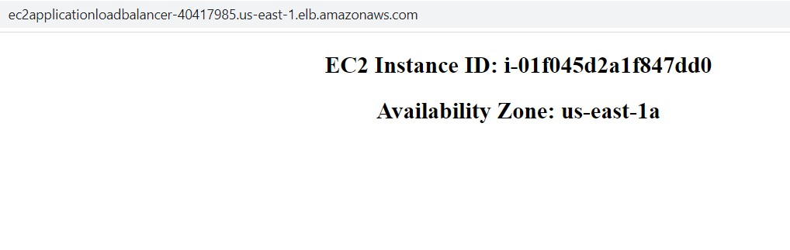

<br>

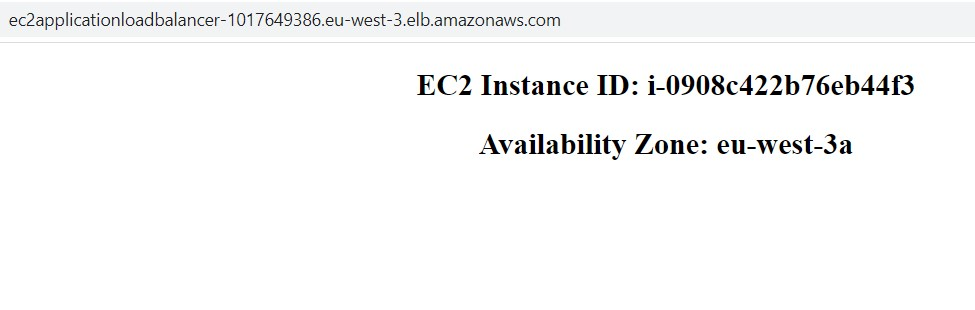

<br>


8. Accedemos al servicio de Route53, accedemos a nuestro "Hosted Zones" configurado. Tal como se indicó en la sección "Dependencias" al inicio de este laboratorio, este laboratorio cuenta con un dominio público "jorge-barreto.com". Ingresar al "Hosted Zone" Público y dar clic en el botón "Create Record". 

<br>

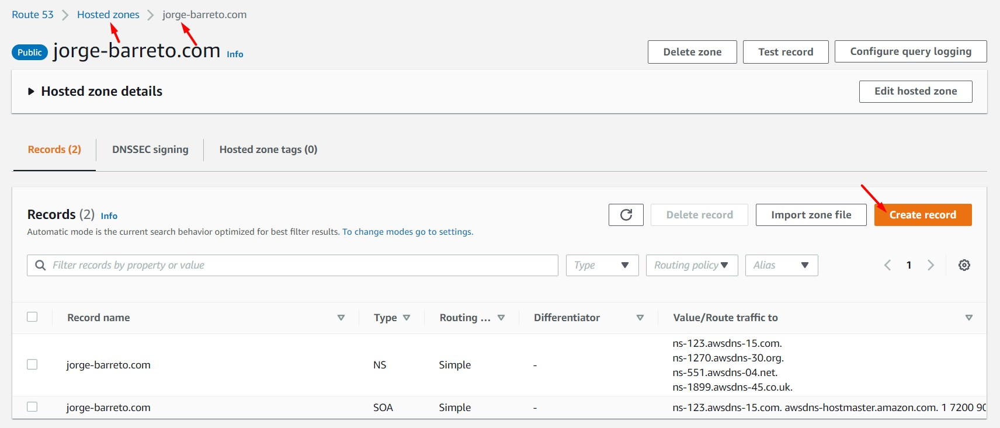

<br>


<br>

9. Seleccionamos/ingresamos las siguientes configuraciones. Se realizará una configuración para la región N. Virginia y otra configuración para la región de París. Guardar los cambios al finalizar la configuración. 

    * **N.Virginia**
        * Record name: latency.jorge-barreto.com
        * Record Type: A - Routes traffic to an IPv4 address and some AWS resources
        * Alias: On
        * Route traffic to: Alias to Application and Classic Load Balancer
            * US East (N.Virginia) [us-east-1]
            * Seleccionar $DNS_Name_ALB de la región N.Virginia
        * Routing Policy: Latency
        * Region: US East (N.Virginia)
        * Evaluate target health: Off
        * Record ID: us-east-1

    * **Paris**
        * Record name: latency.jorge-barreto.com
        * Record Type: A - Routes traffic to an IPv4 address and some AWS resources
        * Alias: On
        * Route traffic to: Alias to Application and Classic Load Balancer
            * Europe (Paris) [eu-west-3]
            * Seleccionar $DNS_Name_ALB de la región N.Virginia
        * Routing Policy: Latency
        * Region: Europe (Paris)
        * Evaluate target health: Off
        * Record ID: eu-west-3

<br>


<br>

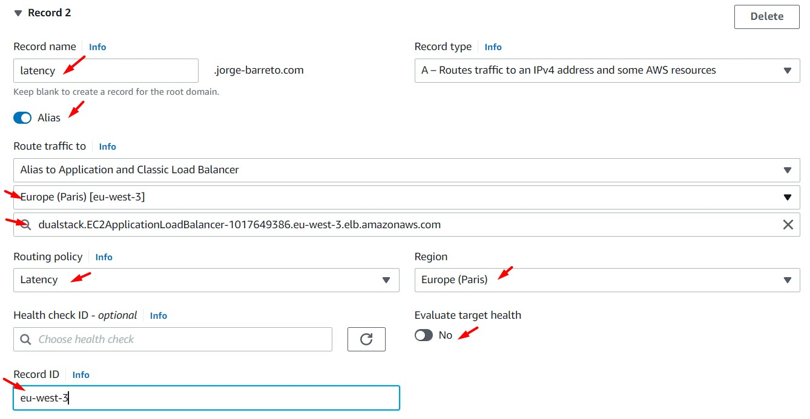

<br>

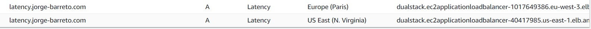

<br>

10. Ingresamos a la página web "Proton VPN" [https://protonvpn.com/es_la/] y nos creamos una cuenta. Una vez logueados desde la cuenta previamente creada, descargamos el instalador adeacuado. Nos logueamos y accedemos a la aplicación desde nuestras laptops.

<br>

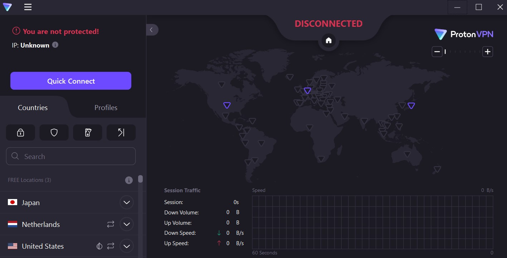

<br>


11. Usando "Proto VPN", activamos la VPN y nos conectamos a un país disponiblie (por ejemplo "United States"). Luego, desde la web, accedemos a la URL registrada en Route53: "latency.jorge-barreto.com". Accedemos a la aplicación varias veces y observamos que el resultado de nuestra web corresponde al servicio de N.Virginia. "United Stated" cuenta con una latencia más baja hacía N. Virginia.

<br>

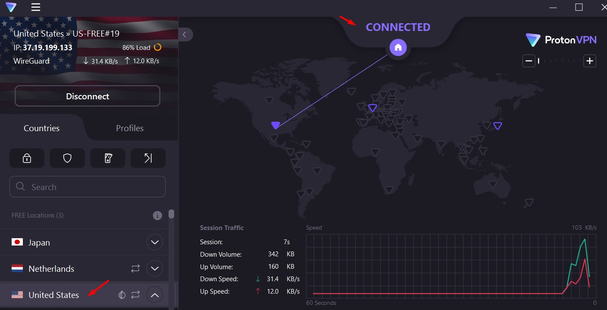

<br>

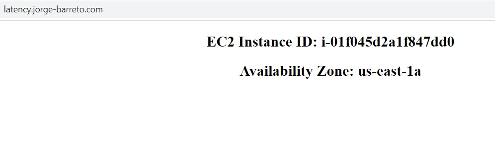

<br>

12. Nos desconectamos a "United States" y nos conectamos a "Netherlands" (u otro país). Luego, desde la web, accedemos nuevamente a la URL registrada en Route53: "latency.jorge-barreto.com". Accedemos a la aplicación varias veces y observamos que el resultado de nuestra web corresponde al servicio de Paris. "Netherlands" cuenta con una latencia más baja hacía París. Concluyendo, al ser consultada la URL "latency.jorge-barreto.com" validamos que nuestra aplicación responde de manera distinta, esta respuesta dependerá del país en donde nos encontremos conectados desde la VPN. Desactivamos la VPN.

<br>


<br>


<br>

---

### B - Configuración del "Routing Policies Weighted" en Route 53

<br>


13. Accedemos al servicio de Route53, accedemos a nuestro "Hosted Zones" configurado. Este laboratorio usará "jorge-barreto.com". Dar clic en el botón "Create Record". 

<br>


<br>


<br>

14. Seleccionamos/ingresamos las siguientes configuraciones. Se realizará una configuración para la región N.Virginia y otra configuración para la región de París. Guardar los cambios al finalizar la configuración.

    * **N.Virginia**
        * Record name: weighted.jorge-barreto.com
        * Record Type: A - Routes traffic to an IPv4 address and some AWS resources
        * Alias: On
        * Route traffic to: Alias to Application and Classic Load Balancer
            * US East (N.Virginia) [us-east-1]
            * Seleccionar $DNS_Name_ALB de la región N.Virginia
        * Routing Policy: Weighted
        * Weight: 10
        * Evaluate target health: Off
        * Record ID: us-east-1

    * **Paris**
        * Record name: weighted.jorge-barreto.com
        * Record Type: A - Routes traffic to an IPv4 address and some AWS resources
        * Alias: On
        * Route traffic to: Alias to Application and Classic Load Balancer
            * Europe (Paris) [eu-west-3]
            * Seleccionar $DNS_Name_ALB de la región N.Virginia
        * Routing Policy: Weighted
        * Weight: 30
        * Evaluate target health: Off
        * Record ID: eu-west-3

<br>

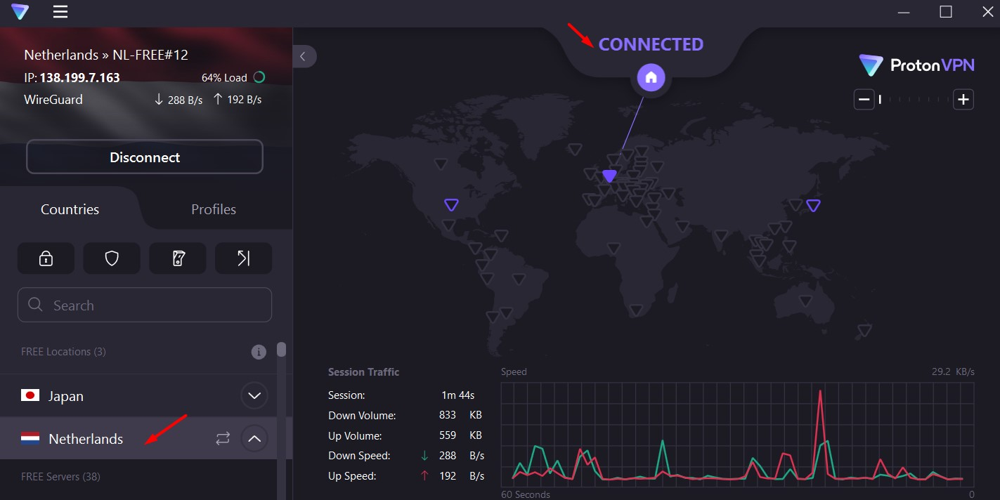

<br>

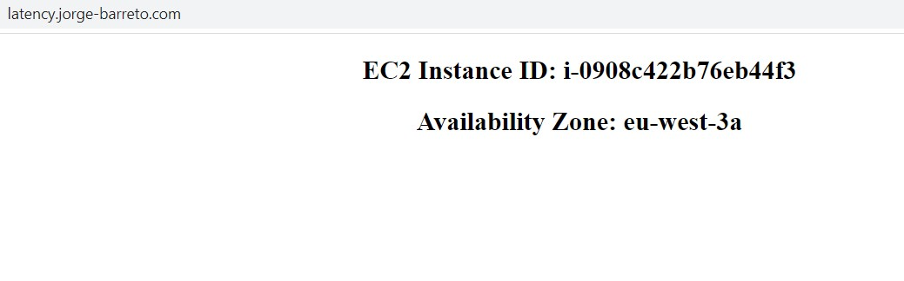

<br>


<br>

15. Ingresamos a nuestra instancia de Cloud9 y ejecutamos el siguiente comando. Obtendremos los siguientes resultados. Analizamos la sección "ANSWER SECTION" de estos resultados y buscaremos las IP Públicas resultantes en la sección "Network Interface" del servicio EC2. Ejecutar este comando en varias veces. Se validará que las IP Públicas mostradas (por cada ejecución) corresponderán a uno de los dos balanceadores de aplicaciones ubicados en N.Virginia o Paris. Los resultados tendrán un resultado proporcional al detallado en el campo "Weight" del "Record" del servicio "Route53". Consultado la URL "weighted.jorge-barreto.com" distintas veces validamos que nuestra aplicación muestra distinto contenido. En vez del comando "dig", podremos usar la siguiente aplicación "http://www.kloth.net/services/nslookup.php" 


```bash
dig weighted.jorge-barreto.com
```

```bash
#Primer tipo de resultado
; <<>> DiG 9.11.3-1ubuntu1.17-Ubuntu <<>> weighted.jorge-barreto.com
;; global options: +cmd
;; Got answer:
;; ->>HEADER<<- opcode: QUERY, status: NOERROR, id: 35729
;; flags: qr rd ra; QUERY: 1, ANSWER: 2, AUTHORITY: 0, ADDITIONAL: 1

;; OPT PSEUDOSECTION:
; EDNS: version: 0, flags:; udp: 65494
;; QUESTION SECTION:
;weighted.jorge-barreto.com.    IN      A

;; ANSWER SECTION:
weighted.jorge-barreto.com. 1   IN      A       52.47.177.65
weighted.jorge-barreto.com. 1   IN      A       35.181.123.137

;; Query time: 0 msec
;; SERVER: 127.0.0.53#53(127.0.0.53)
;; WHEN: X X X X:X:X UTC X
;; MSG SIZE  rcvd: 87
```

```bash
#Segundo tipo de resultado
; <<>> DiG 9.11.3-1ubuntu1.17-Ubuntu <<>> weighted.jorge-barreto.com
;; global options: +cmd
;; Got answer:
;; ->>HEADER<<- opcode: QUERY, status: NOERROR, id: 50074
;; flags: qr rd ra; QUERY: 1, ANSWER: 2, AUTHORITY: 0, ADDITIONAL: 1

;; OPT PSEUDOSECTION:
; EDNS: version: 0, flags:; udp: 65494
;; QUESTION SECTION:
;weighted.jorge-barreto.com.    IN      A

;; ANSWER SECTION:
weighted.jorge-barreto.com. 60  IN      A       54.162.42.27
weighted.jorge-barreto.com. 60  IN      A       3.210.177.190

;; Query time: 3 msec
;; SERVER: 127.0.0.53#53(127.0.0.53)
;; WHEN: X X X X:X:X UTC X
;; MSG SIZE  rcvd: 87
```


<br>

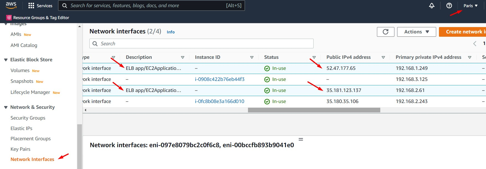

<br>

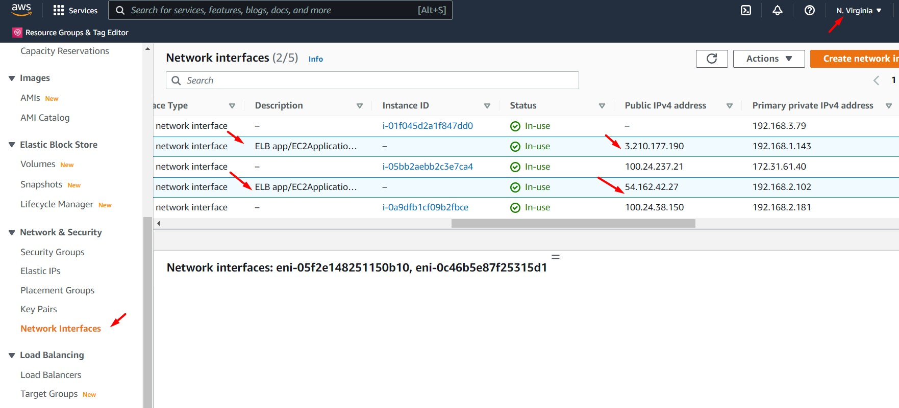

<br>


---

### Eliminación de recursos

<br>

```bash
aws cloudformation delete-stack --stack-name lab19-vpc-ec2-alb-nvirginia --region us-east-1
aws cloudformation delete-stack --stack-name lab19-vpc-ec2-alb-paris --region eu-west-3

```