# AWS Solutions Architect Associate - Laboratorio 20

<br>

### Objetivo: 
* Creación de un IAM User Programmatic
* Uso del SDK de Python (boto3)
* Uso de IAM roles

### Tópico:
* Security,Identity & Compliance

### Dependencias:
* Ninguna

<br>

---

### A - Creación de un IAM User Programmatic

<br>

1. Hacer uso de nuestra Key Pair. De no ser así, acceder al servicio EC2 y luego a la opción "Key Pair". Generar llave RSA y .pem.

<br>

2. Acceder al servicio AWS Cloud9 y generar un nuevo ambiente de trabajo (Ubuntu 18.04 LTS)

<br>

3. Ejecutar los siguientes comandos en nuestro Cloud9

```bash
#Ubuntu 18.04
sudo apt-get update
git clone https://github.com/jbarreto7991/aws-solutionsarchitectassociate.git
```

<br>

4. **1_lab20-vpc-ec2-iam.yaml**. En la sección "ParameterValue", reemplazar el nombre del KeyPair creado en el paso 1. Esta plantilla creará una VPC, 02 subnets públicas y demás componentes de red; además de una instancia EC2. En esta instancia se instalará python3 y pip3, además descargará archivos con código python del repositorio en la ruta /home/ubuntu. Validar la creación del Stack desde la consola AWS a través del servicio AWS CloudFormation. En el siguiente comando considerar reemplazar el valor del Key Pair con el valor respectivo.

```bash
aws cloudformation create-stack --stack-name lab20-vpc-ec2-iam --template-body file://~/environment/aws-solutionsarchitectassociate/Lab-20/code/1_lab20-vpc-ec2-iam.yaml --parameters ParameterKey=KeyPair,ParameterValue="aws-solutionsarchitectassociate" --capabilities CAPABILITY_IAM --region us-east-1
```

<br>

5. Accedemos al servicio IAM y generamos un "IAM User" asociado a la política "AmazonS3FullAccess". Luego, accedemos al detalle del "IAM User", y desde la pestaña "Security credentials" generamos un nuevo "Access Key". Copiar los valores "Access key" y "Secret access key" al finalizar el proceso de creación.

    * Username: User01
    * Set Permissions: Attach existing policies directly
    * Search: AmazonS3FullAccess

<br>


<br>

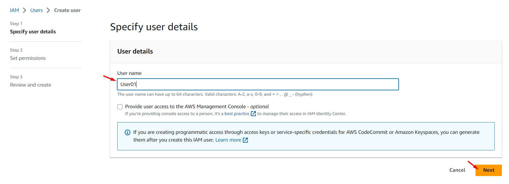

<br>


<br>


<br>

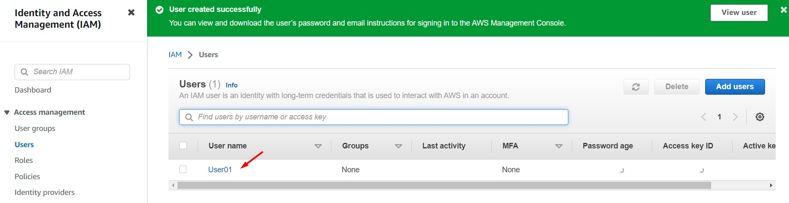

<br>

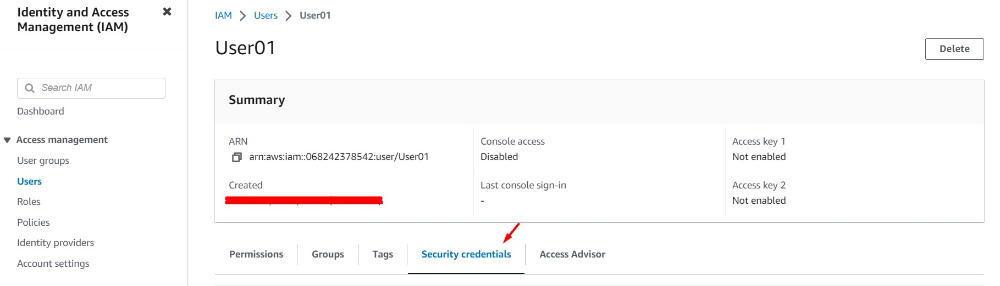

<br>

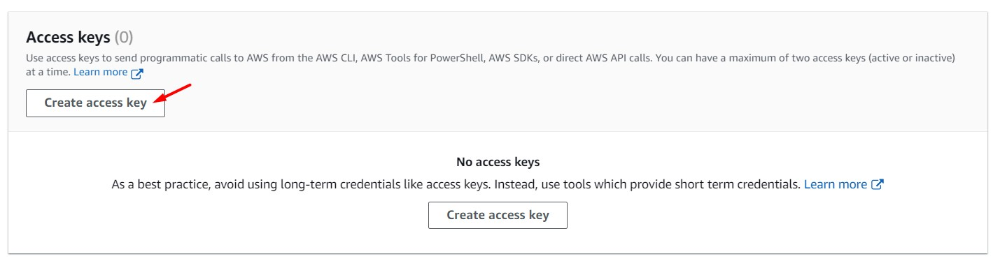

<br>


<br>


<br>


<br>

6. Desde Cloud9, generamos un bucket S3 usando AWSCLI.

```bash
aws_account=$(aws sts get-caller-identity --query "Account" --output text)
echo $aws_account
aws s3api create-bucket --bucket lab20-aws-solutionsarchitectassociate-$aws_account --region us-east-1
```
<br>

### B - Uso del SDK de Python (boto3)

<br>

7. Accedemos por SSH a la instancia EC2 "IAM Challenge" y editamos las variables "$aws_access_key_id" y "$aws_Secret_access_key" del archivo 2_sdk_python_s3_with_accesskey.py ubicado en /home/ubuntu. Guardamos los cambios y ejecutamos el archivo en mención usando python3. Validamos que el script liste todos los buckets S3 de nuestra cuenta AWS.

```bash
#Conexión a la instancia EC2
ssh -i keypair_name.pem ubuntu@public_ip

#Ejecucción de archivo python
python3 /home/ubuntu/2_sdk_python_s3_with_accesskey.py
```
<br>

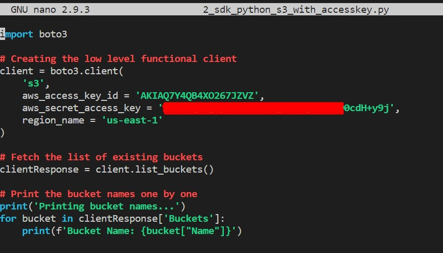

<br>

8. Usando python3 ejecutaremos el archivo "3_sdk_python_s3_without_accesskey.py". Tendremos el siguiente error al ejecutar el archivo. Analizar contenido y diferencias de los archivos "2_sdk_python_s3_with_accesskey.py" y "3_sdk_python_s3_without_accesskey.py". 

```bash
#Ejecucción de archivo python
python3 2_sdk_python_s3_with_accesskey.py

#Error
botocore.exceptions.NoCredentialsError: Unable to locate credentials
```

<br>

### C - Uso de IAM roles

<br>

9. Accedemos al servicio IAM, ingresamos a la opción "Roles" y damos clic en el botón "Create Role". Seleccionamos/ingresamos los siguientes valores, luego damos clic en el botón "Create role"

    * Trusted entity type: AWS Service
    * Use case: EC2
    * Permissions policies: AmazonS3FullAccess
    * Role name: ec2_role_lab20

<br>

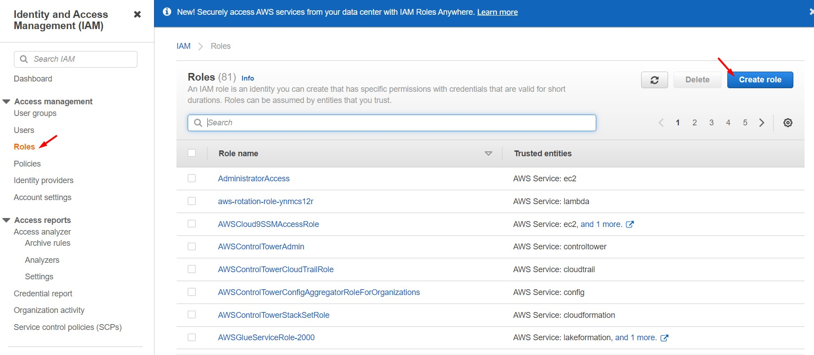

<br>

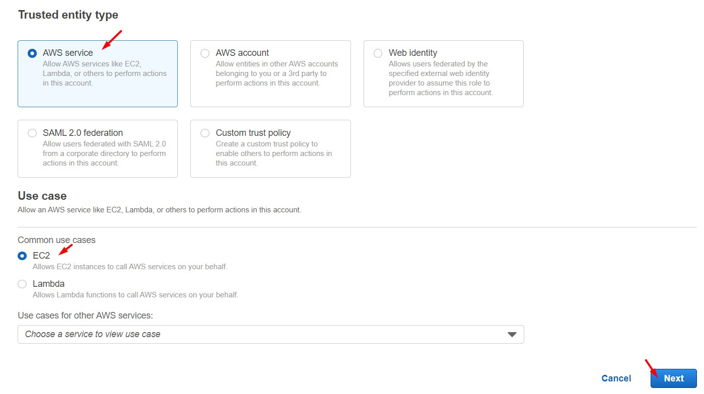

<br>

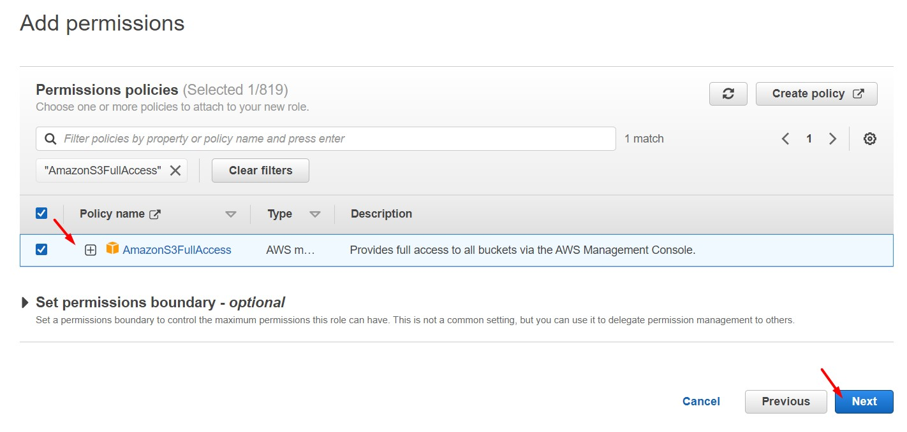

<br>

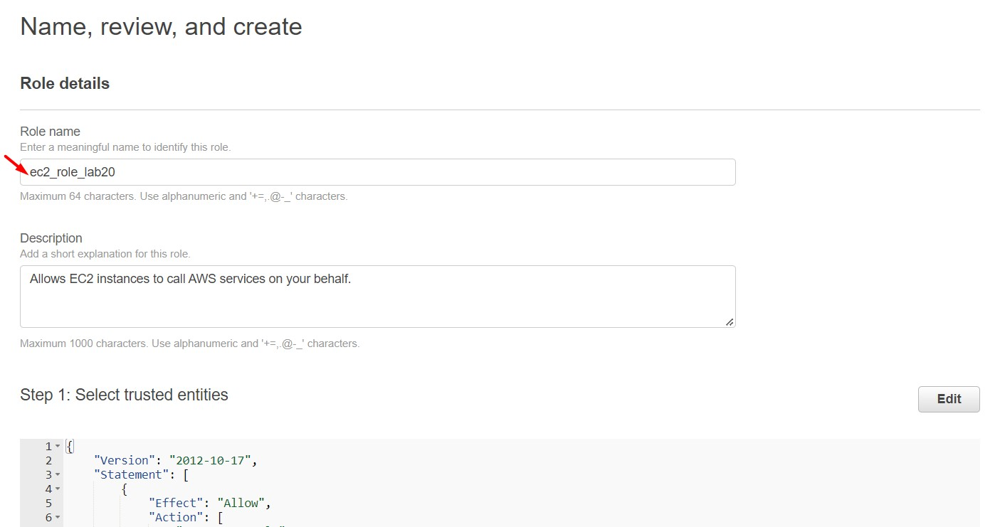

<br>

10. Accedemos al servicio EC2, seleccionamos la instancia EC2 "IAM Challenge" y agregamos el role "ec2_role_lab20" previamente creado.

<br>

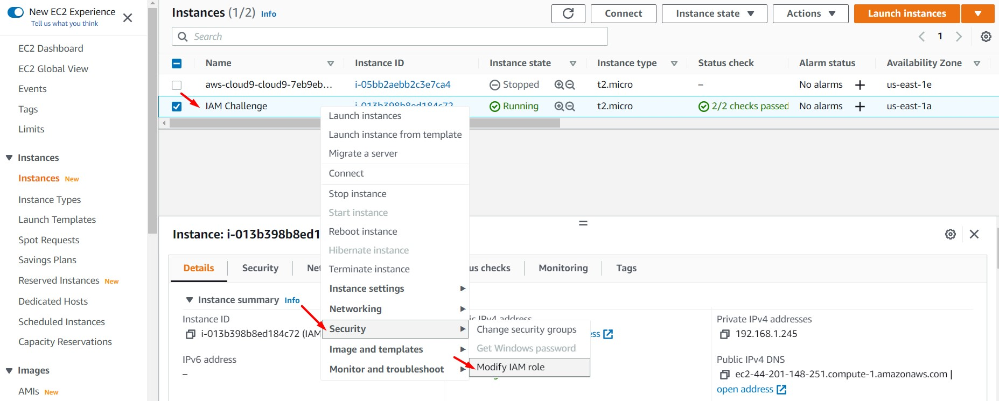

<br>

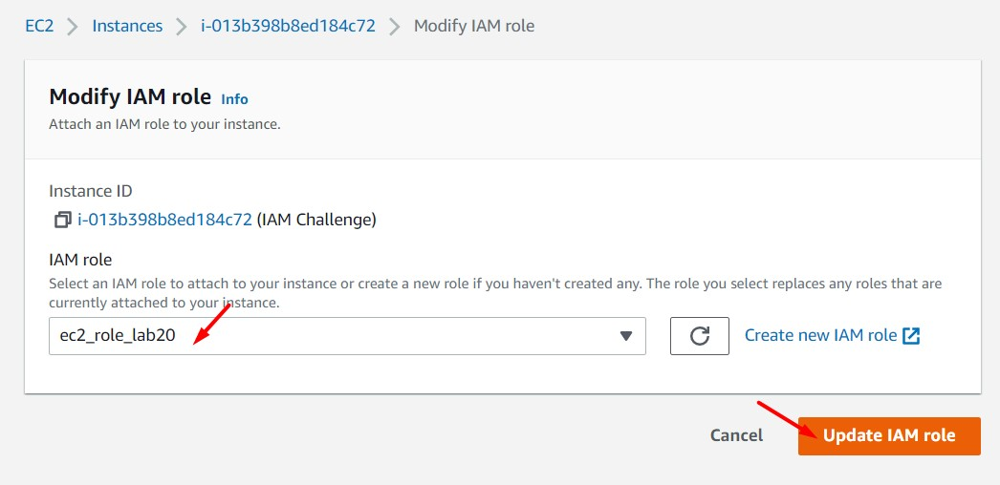

<br>

11. Desde nuestra instancia EC2 ejecutaremos el archivo "3_sdk_python_s3_without_accesskey.py" nuevamente. En esta ocasión validamos que nos devuelve como resultado la lista de buckets S3.

```bash
#Ejecucción de archivo python
python3 3_sdk_python_s3_without_accesskey.py
```

<br>

12. Si un atacante accede a nuestra instancia podrá obtener las credenciales almacenadas en el archivo python "2_sdk_python_s3_with_accesskey". Podrán acceder a ellos también si estos archivos son cargados en repositorios públicos. Una vez obtenida las credenciales "Access key" y "Secret access key", los atacantes podrán usar estas para acceder a nuestros recursos en AWS (estos accesos estarán limitados al tipo de política asociado al usuario IAM User Programmatic). Debemos proteger siempre los "Access key ID" y "Secret access key" generados. Es buena practica, usar "IAM Roles" asociadas a nuestras instancias EC2.

<br>

---

### Eliminación de recursos

<br>

```bash
aws cloudformation delete-stack --stack-name lab20-vpc-ec2-iam --region us-east-1
#Eliminar IAM User "User01"
#Eliminar IAM Role "ec2_role_lab20"
#Eliminar Instancia Cloud9
```