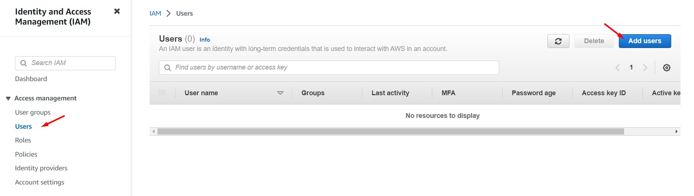
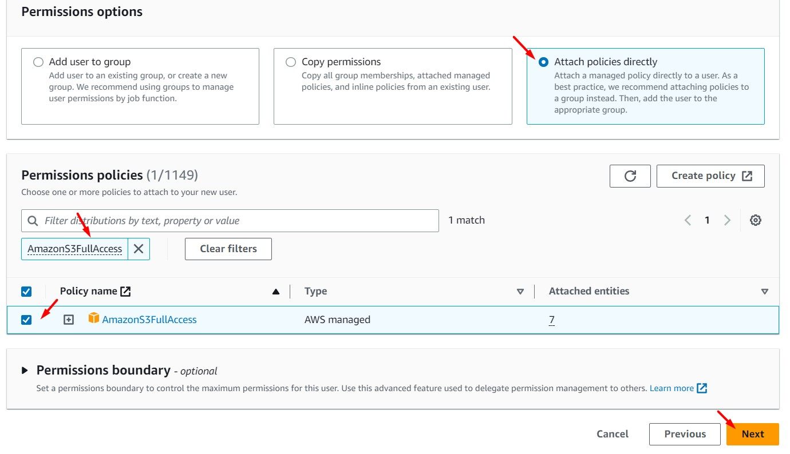
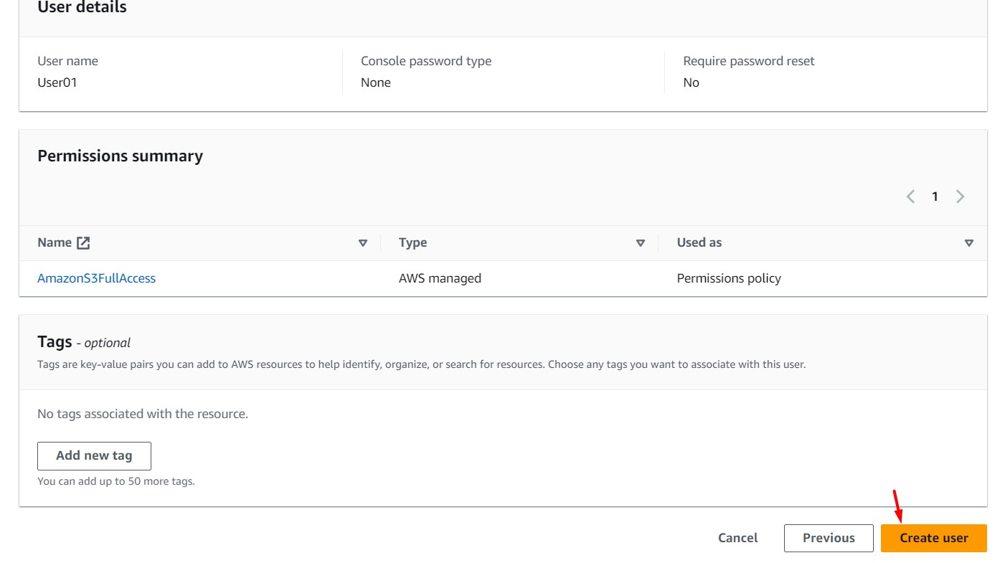
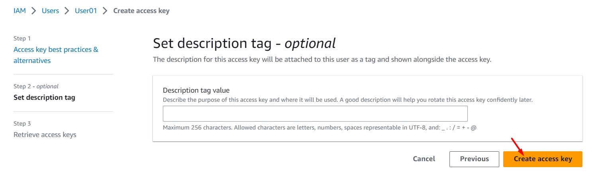
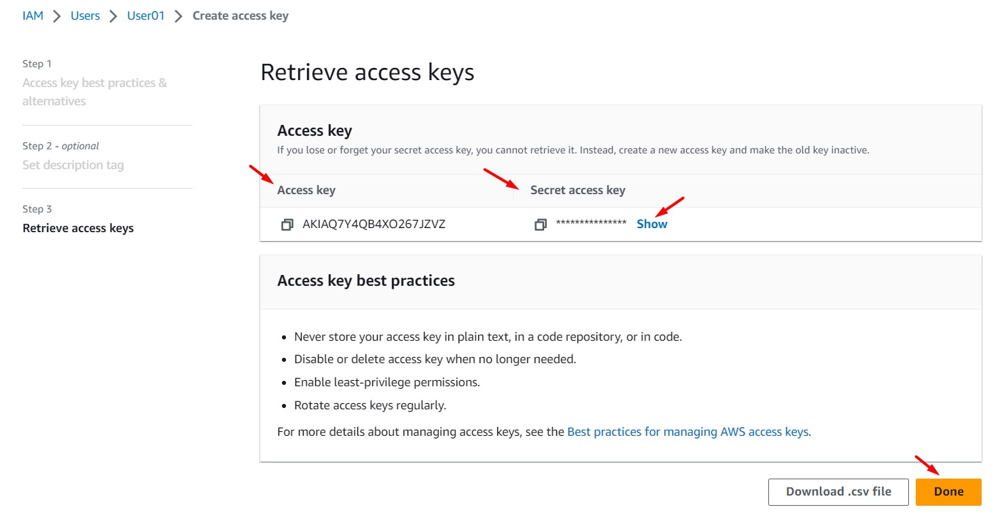
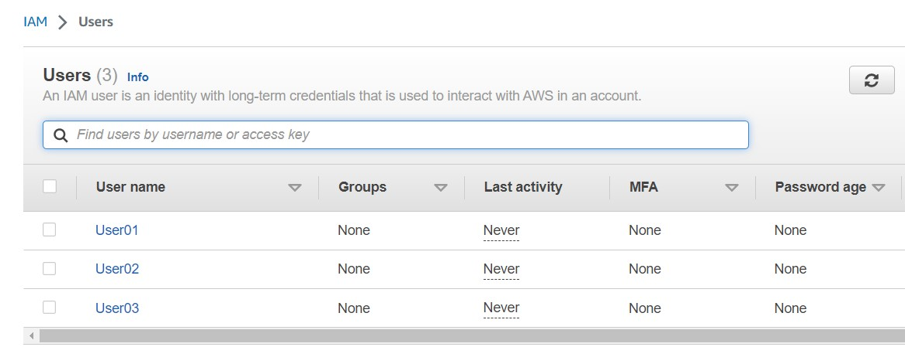

# AWS Solutions Architect Associate - Laboratorio 21

<br>

### Objetivo: 
* Evaluando jerarquía de evaluación de permisos en IAM

### Tópico:
* Security,Identity & Compliance

### Dependencias:
* Ninguna

<br>

---

### A - Evaluando niveles de permisos en IAM

<br>

1. Hacer uso de nuestra Key Pair. De no ser así, acceder al servicio EC2 y luego a la opción "Key Pair". Generar llave RSA y .pem.

<br>

2. Acceder al servicio AWS Cloud9 y generar un nuevo ambiente de trabajo (Ubuntu 18.04 LTS)

<br>

3. Ejecutar los siguientes comandos en nuestro Cloud9

```bash
#Ubuntu 18.04
sudo apt-get update
git clone https://github.com/jbarreto7991/aws-solutionsarchitectassociate.git
```

<br>

4. **1_lab21-iam-evaluates-credentials.yaml**. En la sección "ParameterValue", reemplazar el nombre del KeyPair creado en el paso 1. Esta plantilla creará una VPC, 02 subnets públicas y demás componentes de red; además una instancia EC2. Esta instancia instalará python3, pip3 y awscliv2, además de descargar dos archivos python en nuestra ruta de trabajo /home/ubuntu. Validar la creación del Stack desde la consola AWS a través del servicio AWS CloudFormation. En el siguiente comando, considerar reemplazar el valor del Key Pair con el valor respectivo.

```bash
aws cloudformation create-stack --stack-name lab21-iam-evaluates-credentials --template-body file://~/environment/aws-solutionsarchitectassociate/Lab-21/code/1_lab21-iam-evaluates-credentials.yaml --parameters ParameterKey=KeyPair,ParameterValue="aws-solutionsarchitectassociate" --capabilities CAPABILITY_IAM --region us-east-1
```

<br>

5. Accedemos al servicio IAM y generamos 03 "IAM User - Programmatic"  a través de la siguiente configuración. Cada usuario programático tendrá asociado un política distinta. En el paso final damos clic en "Create User". Luego, guardar los valores "Access key ID" y "Secret access key" de cada usuario.

    * Username: User01
        * Set Permissions: Attach existing policies directly
        * Search: AmazonS3FullAccess
        * Security Credentials: Access keys
            * Create access key: Application running on an AWS compute service

    * Username: User02
        * Set Permissions: Attach existing policies directly
        * Search: AmazonEC2FullAccess
        * Security Credentials: Access keys
            * Create access key: Application running on an AWS compute service

    * Username: User03
        * Set Permissions: Attach existing policies directly
        * Search: IAMFullAccess
        * Security Credentials: Access keys
            * Create access key: Application running on an AWS compute service

<br>



<br>


<br>



<br>



<br>


<br>


<br>


<br>


<br>



<br>



<br>



<br>

6. Accedemos por SSH a la instancia EC2 "IAM Challenge" y generamos las siguientes variables de entorno usando las credenciales "Access Key" y "Secret Access Key" del **User01**:

```bash
#Conexión a la instancia EC2
ssh -i keypair_name.pem ubuntu@public_ip

#Crear las siguientes variables de entorno 
export AWS_ACCESS_KEY_ID='AAAAA7Y4QB4XP2F3BBBB'
export AWS_SECRET_ACCESS_KEY='AAAAA8wg6/JP6YegqR4vPgynfXi3o6Hd+71bBBBBB'
AWS_DEFAULT_REGION='us-east-1'
echo $AWS_ACCESS_KEY_ID
echo $AWS_SECRET_ACCESS_KEY
echo $AWS_DEFAULT_REGION
```

<br>

7. Ejecutamos los siguientes comandos usando AWSCLI y analizamos los resultados. El primer comando (relacionado a S3) nos traerá la lista de nuestros buckets S3, los siguientes dos comandos no serán exitosos. El comando relacionado a "ec2" nos mostrará el siguiente mensaje: "An error occurred (UnauthorizedOperation) when calling the DescribeInstances operation: You are not authorized to perform this operation". Asimismo el comando relaciona a "iam" nos mostrará el mensaje "User01 is not authorized to perform: iam:ListUsers on resource"

```bash
aws s3 ls
aws ec2 describe-instances --region us-east-1
aws iam list-users
```

<br>

8. Habilitar la configuración de "AWSCLI" e ingresar las credenciales ("Access Key" y "Secret Access Key") del **User02**

```bash
aws configure

#Ingresar los accesos del usuario programático 02
AWS Access Key ID [None]: AAAAA7Y4QB4XHAHBBBBB
AWS Secret Access Key [None]: AAAAAjtYNLkUu4iZ8Mkx8YmeQktuLdPRALrBBBBB
Default region name [None]: us-east-1
Default output format [None]:
```

<br>

9. Ejecutamos los siguientes comandos usando AWSCLI y analizamos los resultados. El primer comando (relacionado a S3) nos seguirá listado nuestros buckets S3, los siguientes dos comandos seguirán no siendo exitosos. En este momento estamos usando las credenciales "Access Key" y "Secret Access Key" desde variables de entorno y desde AWSCLI. Hay prioridad en las variables de entorno (jerarquía de evaluación).

```bash
aws s3 ls
aws ec2 describe-instances --region us-east-1
aws iam list-users
```

<br>

10. Eliminamos las variables de entorno previamente configuradas y volvemos a ejecutar los comandos AWSCLI. En el caso anterior, el comando relacionado a S3 era el único comando que traía data, en este nuevo caso el único comando que trae data es el relacionado a EC2. Al eliminar las variables de entorno las únicas credenciales válidas son las relacionadas a AWSCLI. Al permanecer las variables de entorno, AWS da prioridad a las credenciales seteadas en las variables de entorno frente a las credenciales de AWS (existe una jerarquía de evaluación).

```bash
#Variables de Entorno
unset AWS_ACCESS_KEY_ID
unset AWS_SECRET_ACCESS_KEY
unset AWS_DEFAULT_REGION
echo $AWS_ACCESS_KEY_ID
echo $AWS_SECRET_ACCESS_KEY
echo $AWS_DEFAULT_REGION

#Validación
aws s3 ls
aws ec2 describe-instances --region us-east-1
aws iam list-users
```

<br>

11. En nuestra ruta /home/ubuntu, ejecutamos el archivo 3_sdk_python_iam_without_accesskey.py. Validaremos que tendremos como respuesta errores relacionados a permisos "botocore.exceptions.ClientError: An error occurred (AccessDenied) when calling the ListUsers operation: User02 is not authorized to perform: iam:ListUsers on resource". En el archivo 2_sdk_python_iam_with_accesskey.py reemplazaremos las secciones "aws_access_key_id" y "aws_secret_access_key" con las credenciales del **User03** y ejecutaremos el archivo.

```bash
#Ejecución de archivo python
python3 3_sdk_python_iam_without_accesskey.py

#Ejecución de archivos python
python3 2_sdk_python_iam_with_accesskey.py
```

<br>

12. Al ejecutar el archivo 2_sdk_python_iam_with_accesskey.py observamos que tenemos resultados favorables. A pesar que existen otros privilegios a nivel de variables de entorno o awscli, AWS da prioridad a las credenciales configuradas en el código. Se sigue validando que existe una jerarquía de evaluación de permisos.

```bash
#Resultado
User: User01
UserID: AIDAQ7Y4QB4XBFSNEAOGA
ARN: arn:aws:iam::XXXXXXXXXXXX:user/User01
CreatedOn: XXXX-XX-XX XX:XX:XX+00:00

User: User02
UserID: AIDAQ7Y4QB4XCJ3UCHWJG
ARN: arn:aws:iam::XXXXXXXXXXXX:user/User02
CreatedOn: XXXX-XX-XX XX:XX:XX+00:00

User: User03
UserID: AIDAQ7Y4QB4XMUE3REBSD
ARN: arn:aws:iam::XXXXXXXXXXXX:user/User03
CreatedOn: XXXX-XX-XX XX:XX:XX+00:00
```

<br>

13. Configuraremos un rol para nuestra instancia EC2 "IAM Challenge" y le asignaremos los permisos de "AmazonRDSFullAccess"

    * Trusted entity type: AWS Service
    * Use case: EC2
    * Permissions policies: AmazonRDSFullAccess
    * Role name: ec2_role_lab20

<br>

14. Ejecutamos los siguientes comandos desde AWSCLI y analizamos los resultados. El comando relacionado a EC2 es el comando que traerá resultados, los otros tres comandos seguirán siendo no exitosos. Procedemos a eliminar las variables de entorno y la configuración de AWSCLI.

```bash
#Validación
aws s3 ls
aws ec2 describe-instances --region us-east-1
aws iam list-users
aws rds describe-db-instances --region us-east-1

#Eliminando variables de entorno
unset AWS_ACCESS_KEY_ID
unset AWS_SECRET_ACCESS_KEY
unset AWS_DEFAULT_REGION
echo $AWS_ACCESS_KEY_ID
echo $AWS_SECRET_ACCESS_KEY
echo $AWS_DEFAULT_REGION

#Eliminación de AWSCLI
mv ~/.aws/credentials ~/.aws/bk_credentials
mv ~/.aws/config ~/.aws/bk_config
```

<br>

15. Ejecutamos los siguientes comandos desde AWSCLI y analizamos los resultados. El comando relacionado a RDS es el comando que ahora traerá resultados, los otros tres comandos no son exitosos. El EC2 Role tiene el menor privilegio respecto a las credenciales guardadas en archivos, las variables de entorno y AWSCLI. Cuando **una misma instancia EC2** o recurso en AWS usa credenciales guardadas en archivos, variables de entorno, AWSCLI y IAM Roles a la vez; AWS aplicará una jerarquía de evaluación. Encontrarnos con esta situación técnica es dificil en un entorno real. Este laboratorio tiene fines académicos.

```bash
#Validación
aws s3 ls
aws ec2 describe-instances --region us-east-1
aws iam list-users
aws rds describe-db-instances --region us-east-1

#Resultado
{
    "DBInstances": []
}
```

<br>

---

### Eliminación de recursos

<br>

```bash
aws cloudformation delete-stack --stack-name lab21-iam-evaluates-credentials --region us-east-1
#Eliminación del IAM Role "ec2_role_lab20"
#Eliminación de los IAM User "User01", "User02" y "User03"
```