# AWS Solutions Architect Associate - Laboratorio 22

<br>

### Objetivo: 
* Crear una cuenta AWS a través del servicio AWS Organizations
* Hacer "Switch Role" entre cuentas de AWS desde la consola

### Tópico:
* Management & Governance
* Security,Identity & Compliance

### Dependencias:
* Contar con una cuenta de correo electrónico. Se hará uso de esta cuenta de correo electrónico con el objetivo de crear una nueva cuenta AWS desde el servicio AWS Organizations.

<br>

---

### A - Crear una cuenta AWS a través del servicio AWS Organizations

<br>

1. Durante el desarrollo de este laboratorio haremos uso de dos cuentas de AWS, llamaremos cuenta "A" a la cuenta "Padre" (o cuenta administradora de "AWS Organizations") y cuenta "B" a la cuenta hija (o cuenta que forma parte de una organización).

<br>

2. Accedemos al servicio AWS Organizations y damos clic en el botón "Create an organization". 

<br>

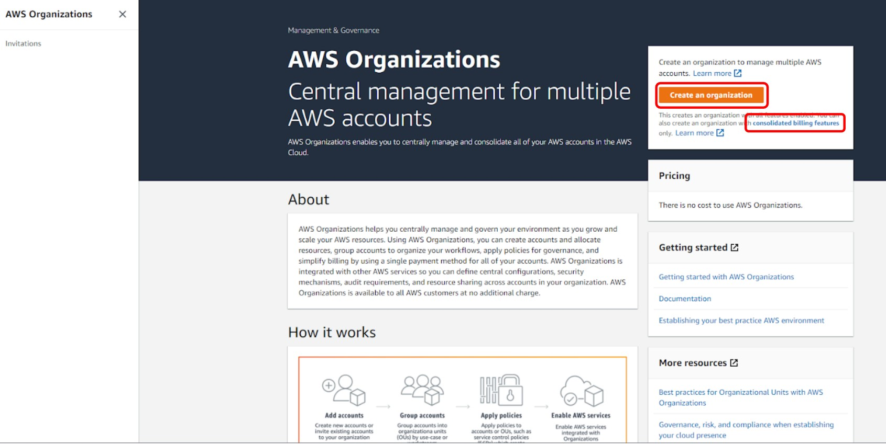

<br>

3. Desde el servicio activado de AWS Organizations, dar clic en el botón "Add an AWS Account" y seleccionar/ingresar los siguientes valores. Luego, dar clic en "Create AWS Account"

    * Select "Create an AWS Account"
    * AWS account name: "Ingresar alias de la cuenta, por ejemplo Sandbox o awstraining-01"
    * Email address of the account's owner: "Ingresar email indicado en el inicio del laboratorio" (en la sección "Dependencias")
    * IAM role name: OrganizationAccountAccessRole (valor por defecto)

<br>

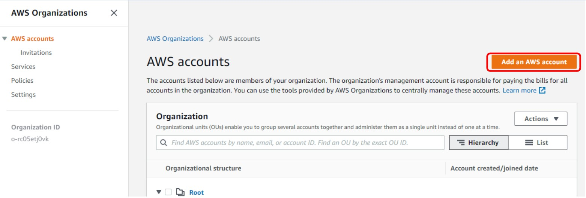

<br>


<br>


4. Después de unos segundos, AWS habrá generado nuestra cuenta de AWS.

<br>

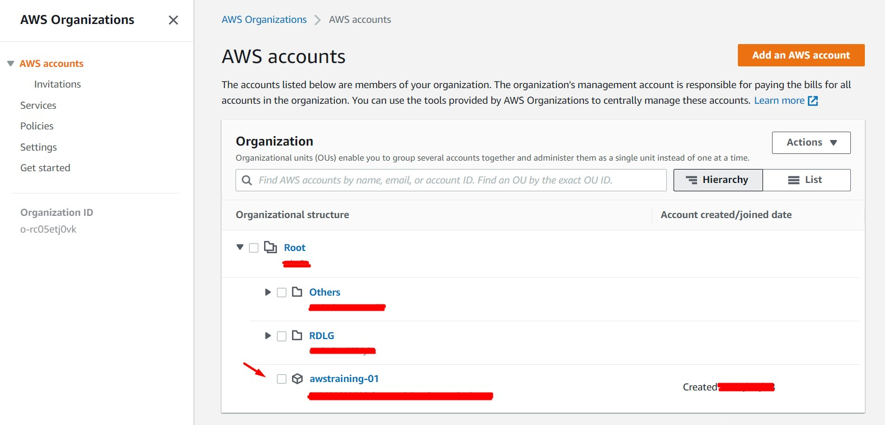

<br>

5. En otro navegador o algún navegador oculto abrimos la página de AWS con el objetivo de loguearnos a nuestra nueva cuenta de AWS. Accedemos como Root User, damos clic en el botón "Next", luego damos clic en la opción "Forgot Password". Seguimos los pasos enviados a través del correo electrónico asociada a la nueva cuenta AWS.

<br>

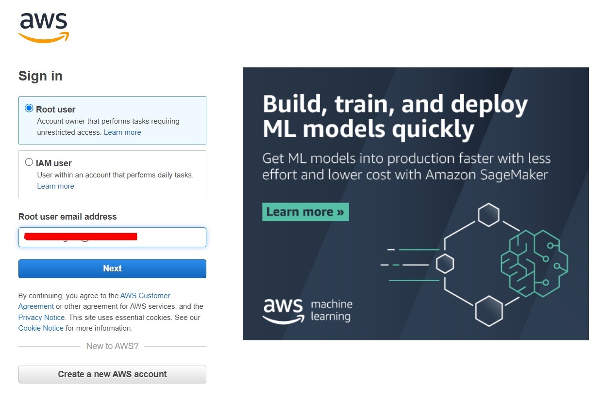

<br>

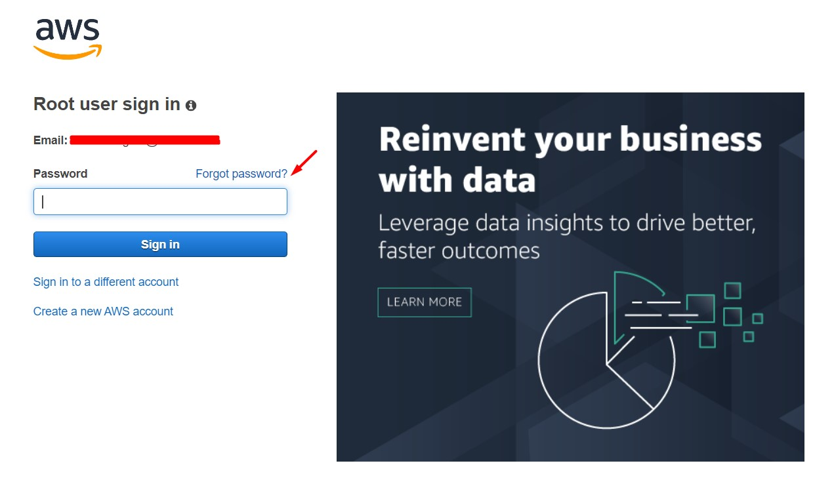

<br>

6. Reseteamos la contraseña y volvemos a loguear a nuestra nueva cuenta de AWS. Si tenemos problemas con la activación de la nueva cuenta considerar los siguientes escenerarios:

    * Es probable que al acceder a algún servicio AWS de nuestra nueva cuenta, sea necesario realizar algunos pasos más. Seguir las indicaciones brindadas.
    * Es problema que al acceder a algún servicio AWS de nuestra nueva cuenta tengamos que esperar hasta 24 horas para que los servicios sean activados.
    * De no tener nuestra cuenta activa en 24 horas generar un caso con AWS.
        * Service: Account Management
        * Category: General Account Question
        * Severity: General question
        * Subject: Agregar información (en inglés)
        * Description: Agregar información detallada en inglés

<br>

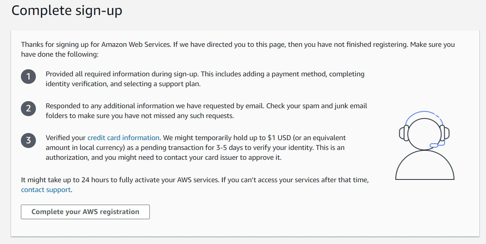

<br>

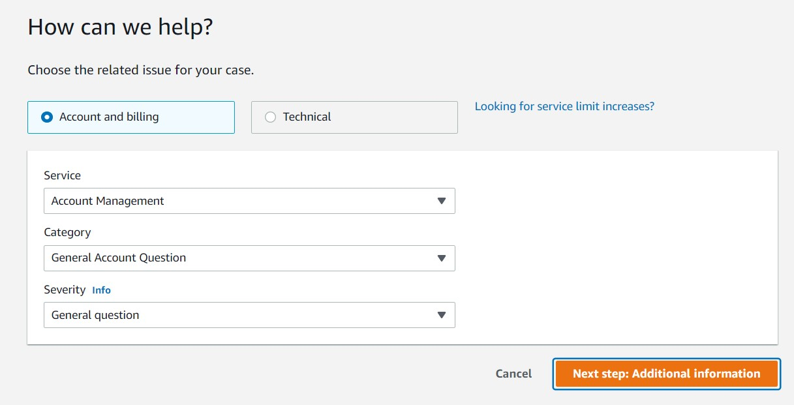

<br>

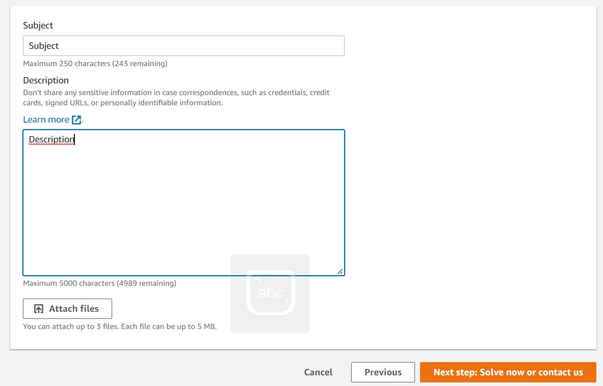

<br>

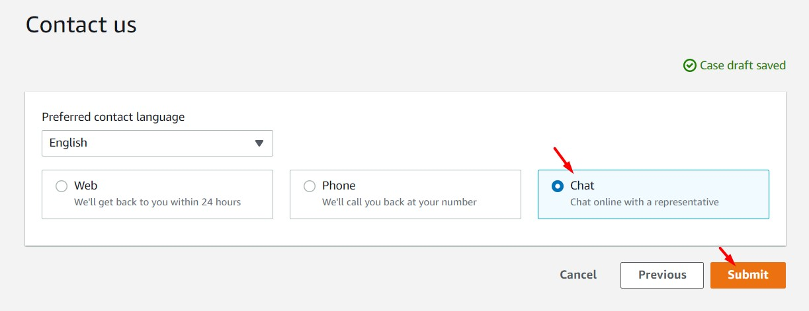

<br>

7. Una vez dentro de nuestra nueva cuenta AWS, accedemos al servicio de AWS Organizations. Validamos que esta nueva cuenta pertenece a nuestra organización (Organization ID)

<br>

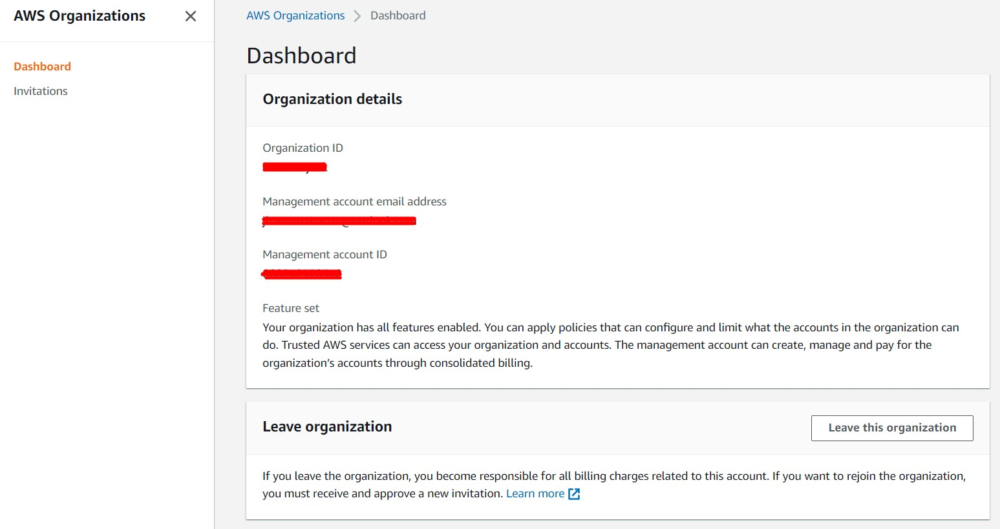

<br>

8. Accedemos al servicio S3 (en nuestra nueva cuenta AWS - cuenta hijo) y generamos un bucket S3 de prueba en la región de N.Virginia.

    * **Bucket Name:** aws-architectsolutions-{$account_id}

<br>

9. Regresamos a nuestra primera cuenta AWS (cuenta padre) y generamos un bucket S3 de prueba en la región de N.Virginia.

    * **Bucket Name:** aws-architectsolutions-{$account_id}

<br>

10. Desde la cuenta AWS Padre (donde se habilitó AWS Organizations), ingresamos al servicio IAM y generamos un usuario IAM tipo "Password - AWS Management Console access" con las siguientes características:

    * User name: user
    * Provide user access to the AWS Management Console - optional: Enabled
    * Are you providing console access to a person?: I want to create an IAM user
    * Console password: Custom password (Ingresar contraseña)
    * Users must create a new password at next sign-in (recommended): Disabled
    * Attach existing policies directly
    * Policy name: Administrator Access

<br>

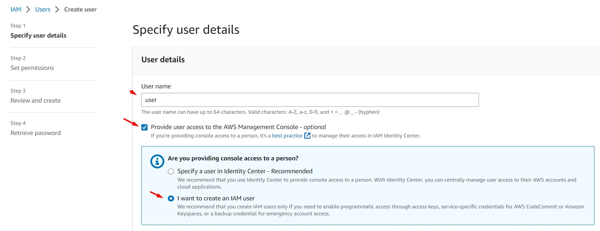

<br>

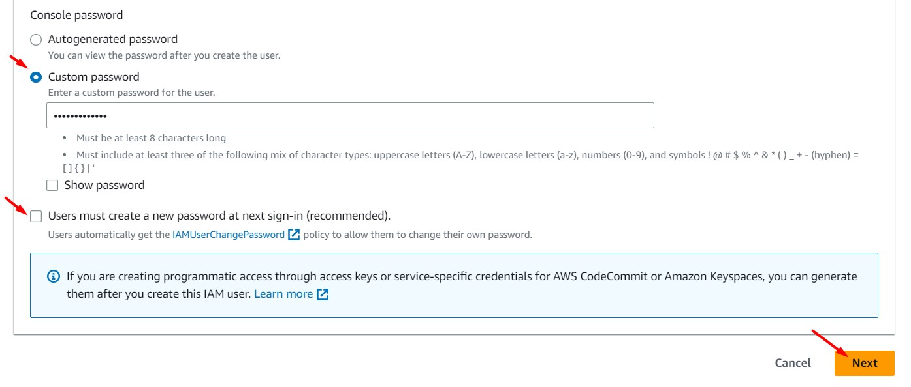

<br>

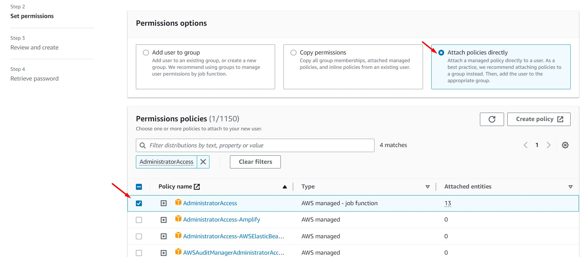

<br>

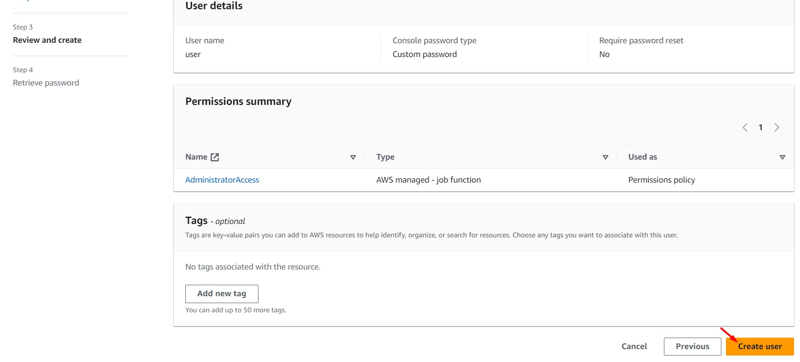

<br>


### B - Hacer "Switch Role" entre cuentas de AWS

<br>

11. Desde la cuenta AWS Padre (origen) ingresamos al servicio IAM y generamos la siguiente polìtica personaliza “PolicyCrossAccount”. Reemplazamos el valor de "AWSID-DestinationAccount" por el número de cuenta de la cuenta destino (12 dígitos).

```bash
{    
    "Version": "2012-10-17",    
    "Statement": 
    {        
        "Effect": "Allow",        
        "Action": "sts:AssumeRole",        
        "Resource": [            
            "arn:aws:iam::${AWSID-DestinationAccount}:role/RoleCrossAccount" 
        ]
    }
}
```

<br>

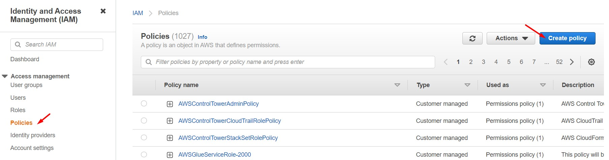

<br>

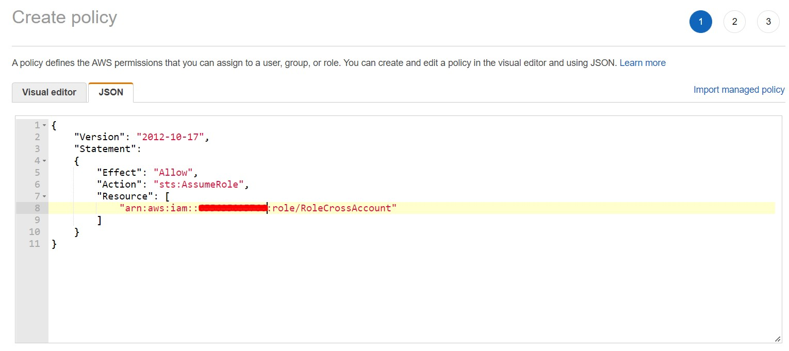

<br>

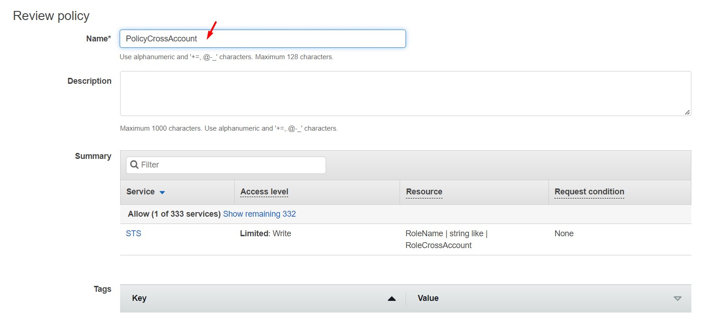

<br>

12. Asignamos la política "PolicyCrossAccount" al usuario "User" previamente generado. Se observará que el usuario "User" contará con 02 políticas, siendo una de ellas de tipo "AWS managed policy" (AdministratorAccess) y la otra de tipo "Managed policy" (PolicyCrossAccount).

<br>


<br>

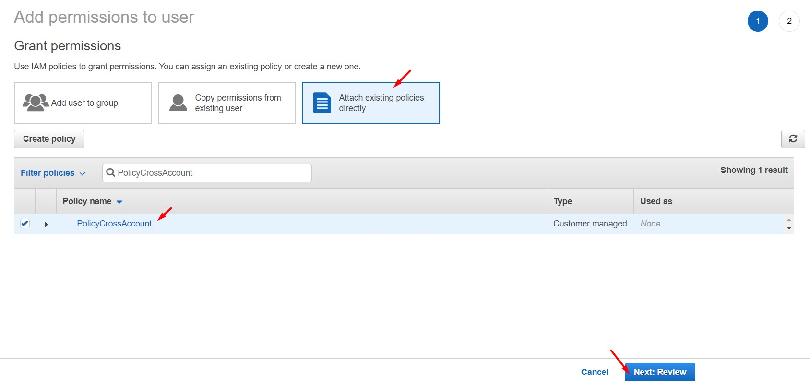

<br>

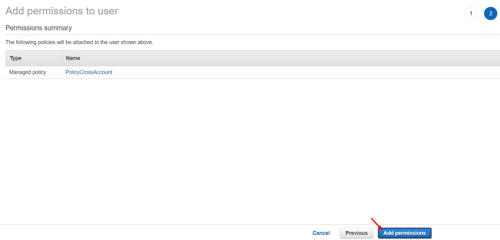

<br>

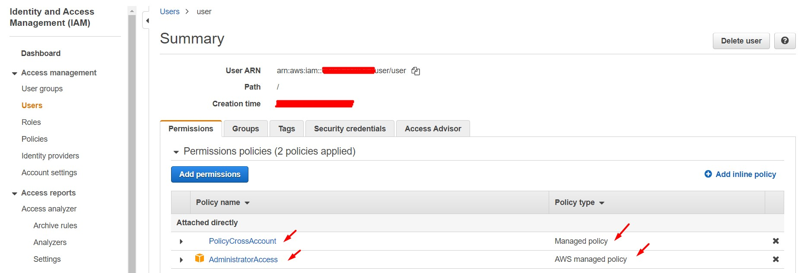

<br>

13. En la cuenta destino, creamos un rol de nombre "RoleCrossAccount" asociado al ID de la cuenta origen (El nombre "RoleCrossAccount" corresponde a lo detallado en la política del paso 11 - JSON File 8). Considerar los siguientes valores:

    * Trusted Entity Type: AWS Account
    * An AWS Account: Another AWS Account
        * Account ID: Cuenta AWS origen
    * Permissions policies: AdministratorAccess
    * Role name: RoleCrossAccount

<br>

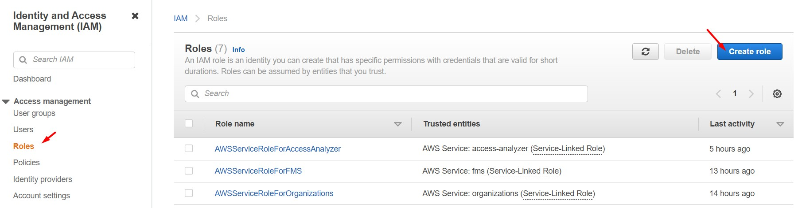

<br>

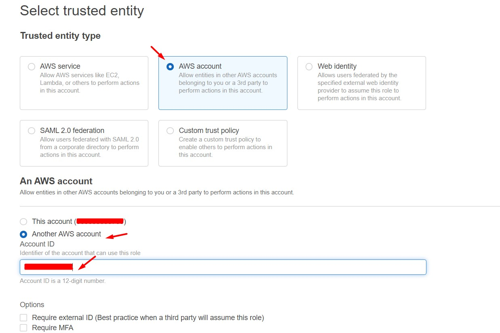

<br>

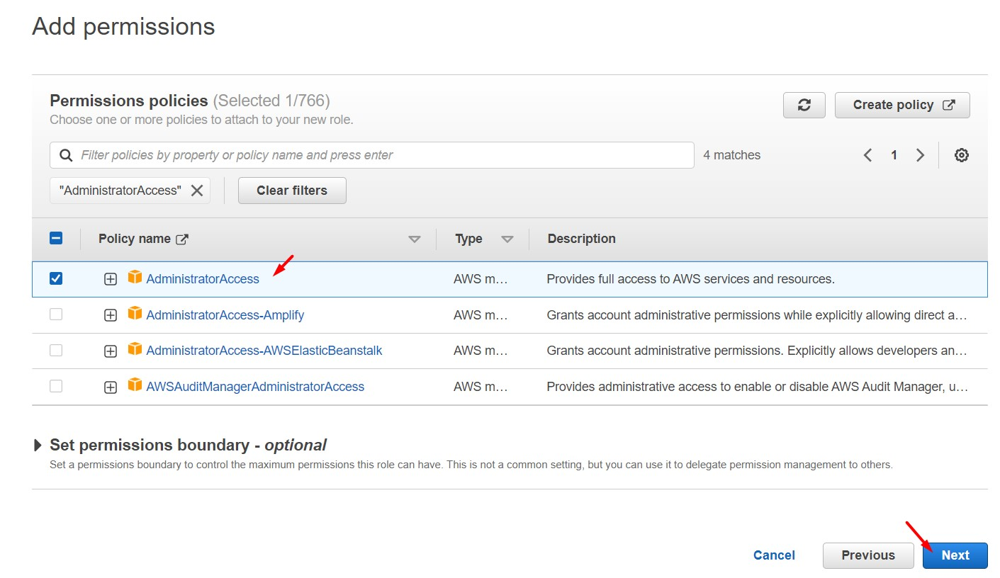

<br>

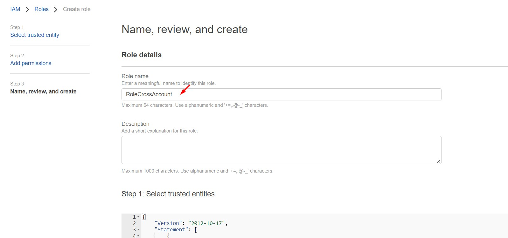

<br>

14. Accedemos al rol "RoleCrossAccount" creado. Analizamos las secciones "Permissions" y "Trust relationships". 

<br>

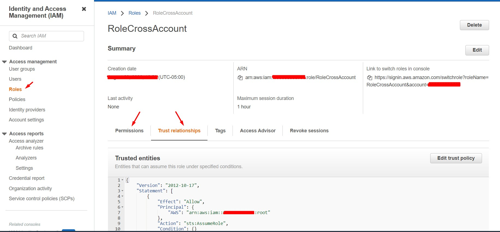

<br>

15. Accedemos modo usuario (no modo root) usando el usuario "User" en nuestra cuenta padre (origen). Al ingresar de este modo, AWS solicitará ingresar el número de cuenta AWS en el login, así Accederemos como "IAM User" a la cuenta origen de AWS. Dentro de AWS, validaremos que nuestro usuario se carga en la consola. Damos clic en el botón ubicado al lado derecho superior (nombre de usuario), y luego damos clic en la opción "Switch role" (Si estamos logueados con el usuario "Root" no visualizaremos esta opción)


<br>

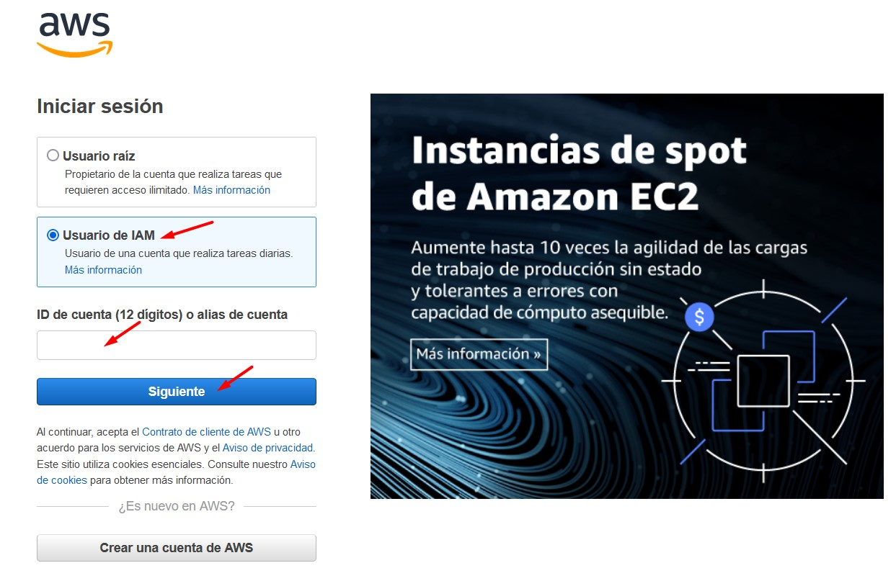

<br>

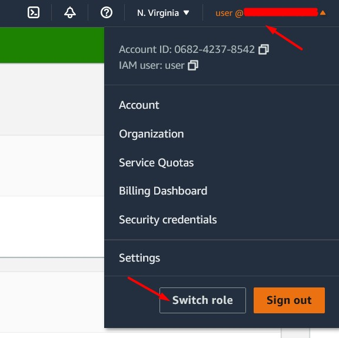

<br>

16. Ingresamos los siguientes valores y damos clic en la opción "Cambiar función". Validaremo que nos encontramos en la cuenta destino y accederemos al servicio S3. Asi mismo en la sección derecha superior de la consola podremos visualizar que se carga el rol "RoleCrossAccount"

    * Cuenta: Ingresamos el ID de la cuenta destino
    * Función: RoleCrossAccount
    * Nombre de Visualización: Ingreso no obligatorio
    * Color: Selección no obligatorio

<br>

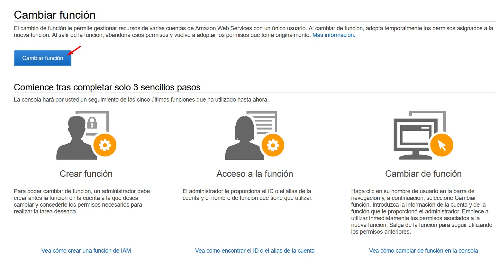

<br>

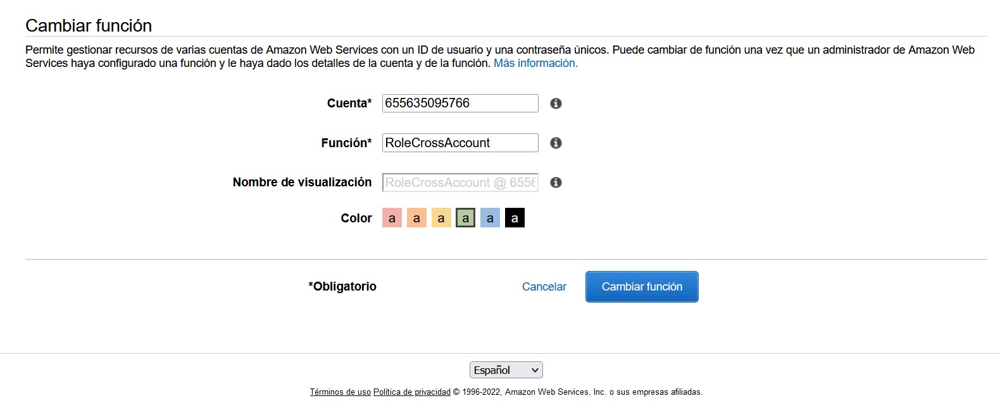

<br>

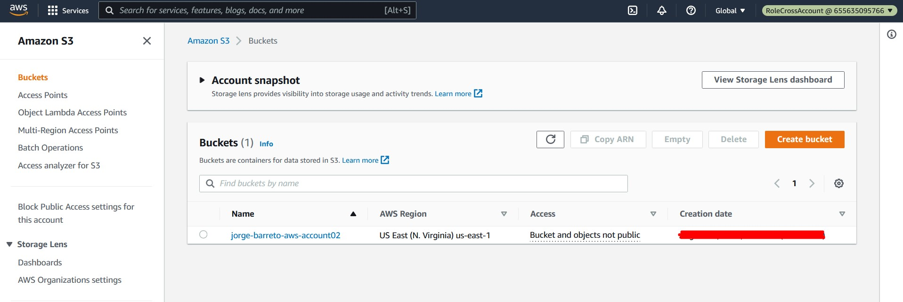

<br>

---

### Eliminación de recursos

```bash
#Eliminar Bucket S3 creado en la cuenta origen
#Eliminar Bucket S3 creado en la cuenta destino
#IAM Policy creado en la cuenta origen
#IAM Role creado en la cuenta destino
#Deshabilitar AWS Organizations
```
