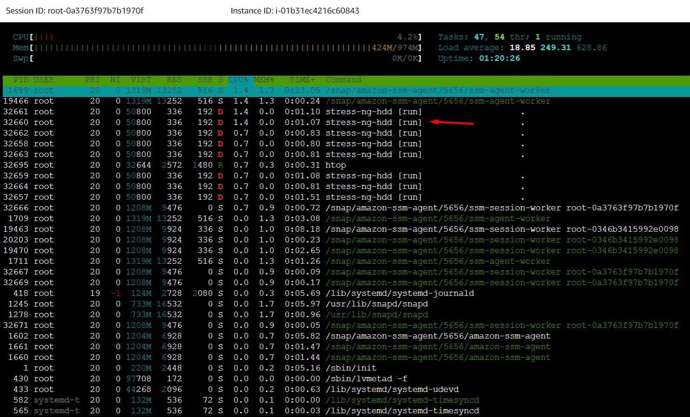
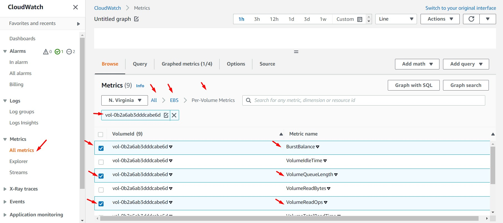
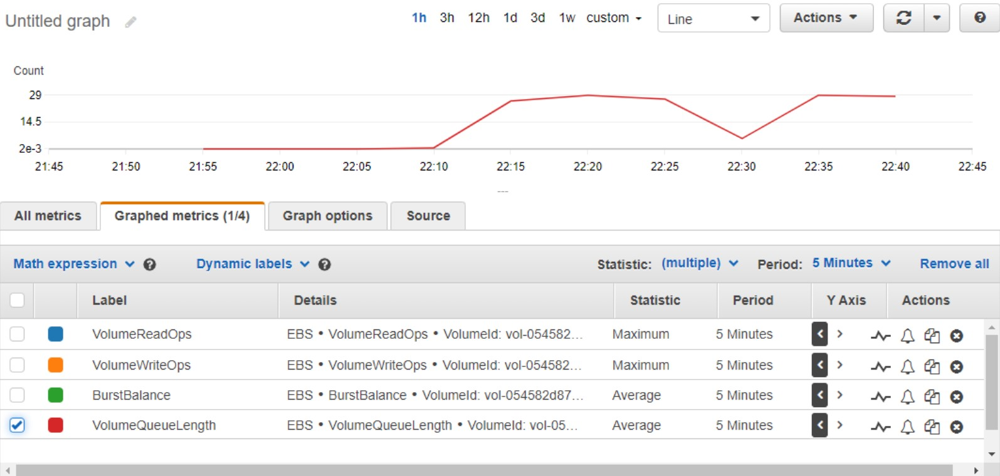
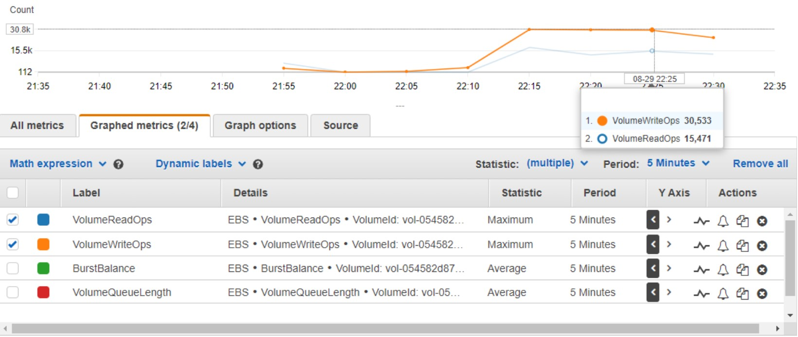
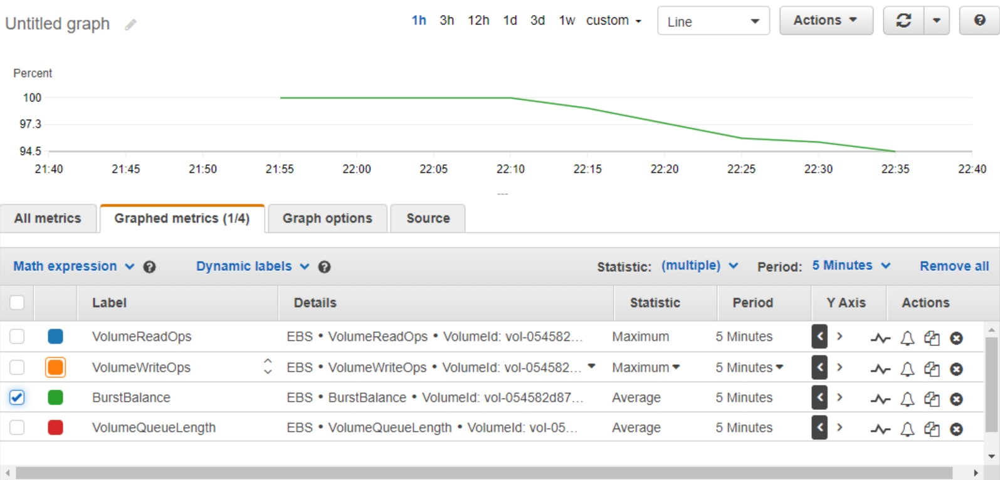

# AWS Solutions Architect Associate - Laboratorio 25

<br>

### Objetivo: 
* Analizar métricas de performance en volúmenes EBS

### Tópico:
* Storage

### Dependencias:
* Ninguna

<br>


---

### A - Analizar métricas de performance en volúmenes EBS

<br>

1. Desplegamos la plantilla AWS CloudFormation ubicada en /code/1_lab25_ebs_cloudwatch_metrics.yaml en nuestra cuenta de AWS. Debido a que hemos desplegado varias plantilla en laboratorios anteriores, no se detallará el pasa a paso de este procedimiento. Tenemos:

    * Despliegue manual de la plantilla CloudFormation a través de la consola AWS
    * Despliegue de la plantilla CloudFormation usando AWSCLI en Cloud9
    * Considerar en ambos casos:  
        * Seleccionar/ingresar el valor de "KeyPair"
        * Seleccionar/ingresar el valor de "Subnet"
        * Seleccionar/ingresar el valor de "VPC"

```bash

#Ubuntu 18.04
sudo apt-get update
git clone https://github.com/jbarreto7991/aws-solutionsarchitectassociate.git

aws cloudformation create-stack --stack-name lab25-ebs-cloudwatch-metrics --template-body file://~/environment/aws-solutionsarchitectassociate/Lab-25/code/1_lab25-ebs-cloudwatch-metrics.yaml --parameters ParameterKey=KeyPair,ParameterValue="aws-solutionsarchitectassociate" ParameterKey=Subnet,ParameterValue="subnet-29b70f18"  ParameterKey=VPC,ParameterValue="vpc-dd59d8a0" --capabilities CAPABILITY_IAM
```

<br>

2. Accedemos vía System Manager - Session Managear a la instancia EC2 desplegada ("EBS Performance") y ejecutamos el siguiente comando

```bash
htop
```

<br>

3. Visualizaremos que los procesos desplegados desde nuestra plantilla de CloudFormation se están ejecutando. El comando "stress-ng --hdd 8 --timeout 900s" ejecutado desde la instancia EC2 tiene por intención la saturación del volumen EBS.

<br>



<br>

4. Esperamos unos minutos para que nuestro proceso recopile datos y luego accedemos al servicio "CloudWatch" y al features "Metrics". Filtramos por el servicio "EBS" y el ID de nuestro volumen (obtenemos el ID de nuestro volumen a través de la pestaña Storage al dar clic sobre nuestra instancia EC2). 


<br>



<br>

5. Luego, seleccionamos las siguientes métricas:
* Burst Balance
* VolumeQueueLength
* VolumeReadOps
* VolumeWriteOps


<br>

6. **VolumeQueueLength.** Observamos que existen valores distinto a cero en la métrica "VolumeQueueLength". La longitud de la cola de volumen es el número de solicitudes de E/S pendientes para un dispositivo. La longitud de la cola debe calibrarse correctamente con el tamaño de E/S y la latencia para evitar la creación de cuellos de botella en el sistema operativo invitado o en el enlace de red a EBS. Esta imagen evidencia los cuellos de botella de mi volumen EBS.

<br>



<br>

7. **VolumeReadOps y VolumeWriteOps.** Asi mismo identificamos que en un determinado momento en el tiempo (con espacio de 5 minutos) el valor de "VolumeWriteOps" es de 30533 y el valor de "VolumeReadOps" es de 15471. Realizamos el siguiente cálculo para obtener el total de IOPS usado por el volumen. El valor obtenido es de 153 IOPS. Al ser nuestro volumen EBS de 8 GiB y tipo gp2 tendremos 100 IOPS por defecto. En este espacio de 5 minutos, nuestro volumen está consumiendo más IOPS de los que puede aprovisionar (sin hacer uso de los créditos). Esto se ve reflejado en las solicitudes pendientes de "VolumeQueueLength".

```bash
(30533 + 15471)    = 153.34 IOPS.
_______________
    5 (60)
```

<br>



<br>

8. **Burst Balance.** Los créditos de ráfaga (burst credits) se acumulan en un ratio de 3 por cada giga configurado por segundo, donde cada crédito será consumido por escritura o lectura. Observamos el consumo de créditos a través de la métrica "Burst Balance"

<br>



<br>


---

### Eliminación de recursos

```bash
aws cloudformation delete-stack --stack-name lab25-ebs-cloudwatch-metrics
```
