# AWS Solutions Architect Associate - Laboratorio 26

<br>

### Objetivo: 
* Configuración de volúmenes EC2 Instances Store (Volúmenes Efímeros)

### Tópico:
* Storage

### Dependencias:
* Ninguna

### Costo:
* El tipo de instancia usado en este laboratorio (c5d.large) no se encuentra dentro de la capa gratuita. Tarifa por hora: 0,096 USD.

<br>


---

### A - Configuración de volúmenes EC2 Instances Store (Volúmenes Efímeros)

<br>

1. Aprovisionar una Instancia EC2 Ubuntu 18.04 LTS. La instancia se deberá configurar según la siguiente información:

    * "Instance Type": c5d.large
    * Generar una "Key Pair" tipo RSA en formato .pem
    * "Network Settings": Por defecto (VPC Default) 
    * Crear "Security Group" (Inbound Rules) lo detallado a continuación. 
        * Port: 22
        * Target: MyIP   
    * Configure Storage: Por defecto. Durante el proceso de creación de la instancia EC2 visualizaremos que la instancia contará con un volumen root EBS de 8 GiB y un volumen efímero (EC2 Instances Store) de 50 Gb. Los volúmenes root siempre serán tipo EBS

<br>

2. Conectarse a la instancia EC2 y ejecutar el siguiente comando. Visualizaremos ambos discos usando los nombres "nvme0n1" (disco root de 8 GiB) y "nvme1n1" (disco efímero de 50 GiB). El disco root nvme1n1 cuenta con su UUID.

```bash
lsblk -fm
```
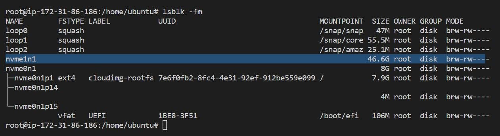

<br>

3. Ejecutar el siguiente comando. Visualizaremos que sólo el disco Root EBS se encuentra montado en la ruta "/". Aún el disco efímero no se encuentra montado en la instancia EC2.

```bash
df -h
```
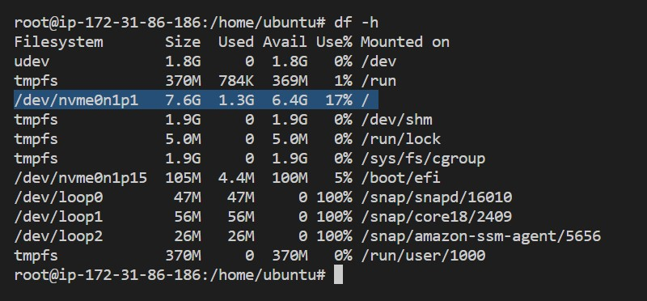

<br>

4. Ejecutar el siguiente comando. Si el resultado es "data", como en este ejemplo, continuar con el siguiente paso.

```bash
sudo file -s /dev/nvme1n1
```
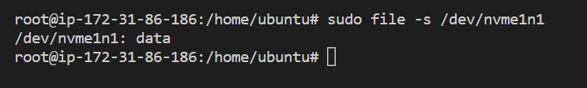

<br>

5. Ejecutar el siguiente comando. Procedemos a formatear el disco. El sistema de archivo será "ext4".

```bash
sudo mkfs -t ext4 /dev/nvme1n1
```
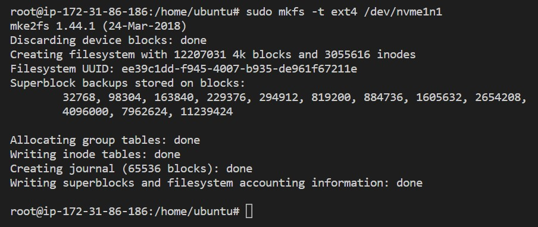

<br>

6. Ejecutar el siguiente comando. Visualizamos que el disco nvme1n1 cuenta ahora con su código UUID aunque la columna MOUNTPOINT aún no contiene información.

```bash
lsblk -fm
```
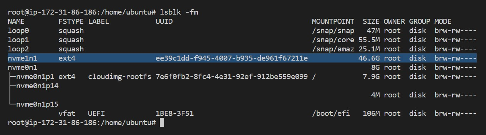

<br>

7. Ejecutar los siguientes comandos. Las columnas "MOUNTPOINT" (resultado del primer comando) y "Mounted On" (resultado del segundo comando) ya cuenta con data. 

```bash
mkdir /mount
sudo mount /dev/nvme1n1 /mount
lsblk -fm
```
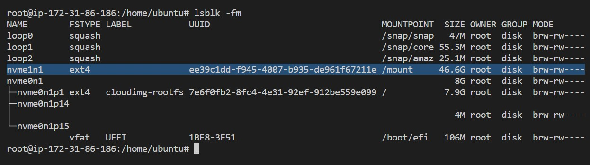

<br>

```bash
df -h
```

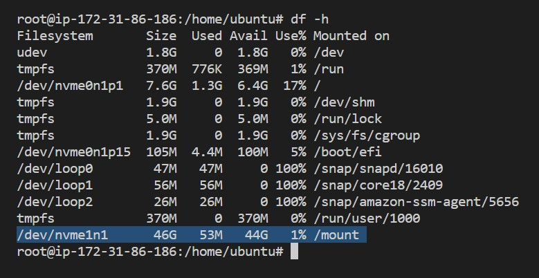

<br>

8. Ejecutar los siguientes comandos. Generamos un archivo simple y lo guardamos en el disco efímero previamente montado, simulando la persistencia de datos. 

```bash
echo "Test" >> /mount/test
cat /mount/test
```

<br>

9. Ejecutar los siguientes comandos. Obtenemos el valor UUID resultado del comando "lsblk -fm" del disco nvme1n1. Luego, agregamos el siguiente registro en el archivo /etc/fstab (reemplazamos el valor de UUID por el valor respectivo). Esto permitirá que el disco sea montado automáticamente. Ejecutar "mount -a" para validar nuestra configuración.

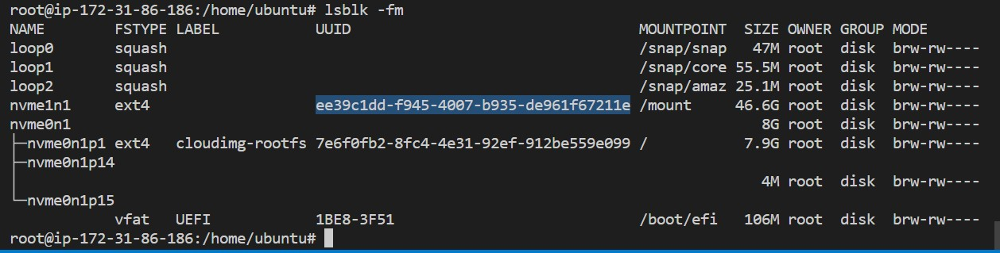

<br>

```bash
lsblk -fm
nano /etc/fstab
```

```bash
UUID=ee39c1dd-f945-4007-b935-de961f67211e /mount ext4 defaults,nofail 0 2
```

```bash
mount -a
```

<br>

10. Ejecutar los siguientes comandos. Visualizamos en lineas generales que el disco efímero previamente montado, se encuentra correctamente configurado y este almacena un archivo. 

```bash
uptime
cat /mount/test
lsblk -fm
```
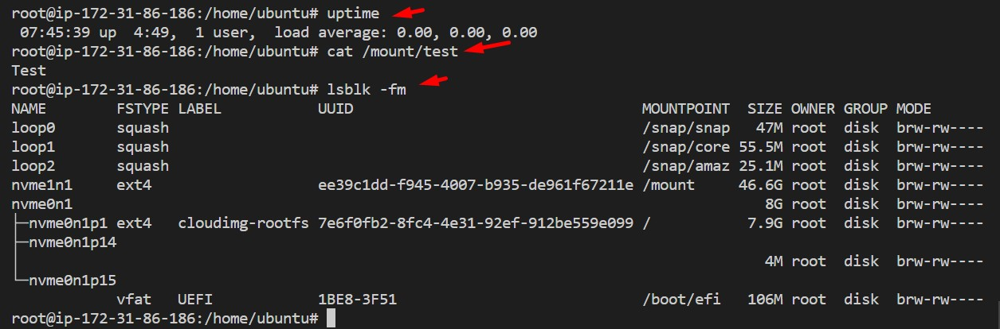

<br>

11. Desde la consola de AWS procedemos a reiniciar la instancia EC2. Validamos que hay una desconexión SSH desde nuestro terminal. Después de unos segundos, volvemos a ingresar a la instancia EC2. El comando "uptime" indica que la instancia tiene 3 minutos de uso. El reboot no afectó nuestra configuración previa debido a que encontramos el disco efímero montado y podemos leer el contenido del archivo creado. Considerar la ejecución de los siguientes comandos.

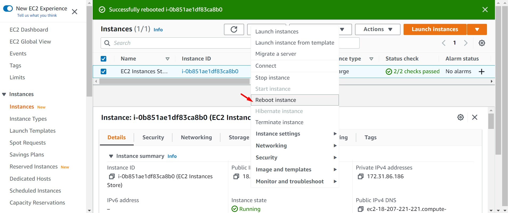

```bash
uptime
cat /mount/test
lsblk -fm
```
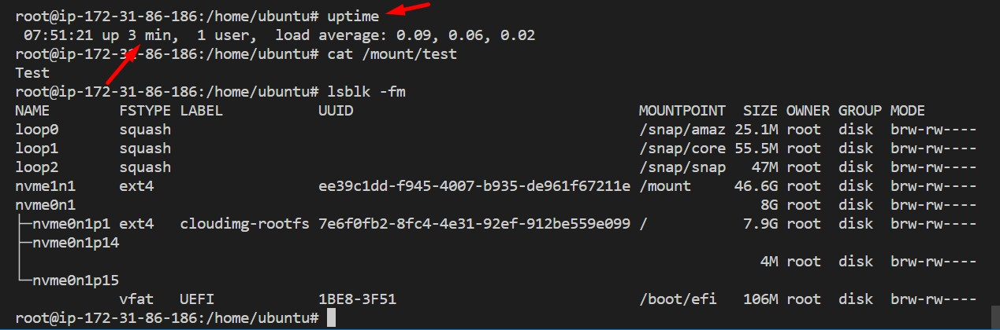

<br>

12. Realizamos un "stop" y luego un "start" sobre la instancia EC2 desde la consola de AWS y nos logueamos nuevamente a la instancia. Considerar que la IP Pública de la instancia habrá cambiado.

<br>

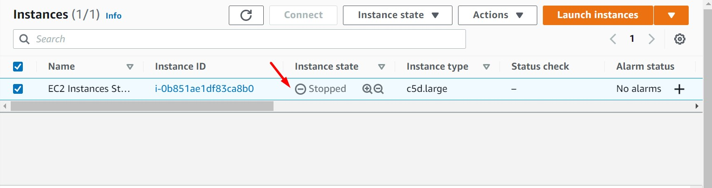

<br>

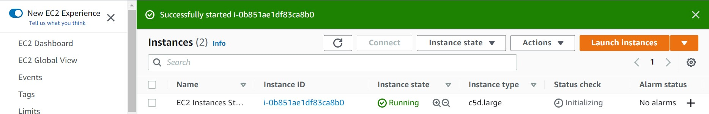

<br>

13. Validamos que la instancia cuenta sólo con el disco root EBS de 8 GiB montado. Al igual que en pasos anteriores, está pendiendo el formateo y asociación el nuevo disco efímero (EC2 Instances Store). Este comportamiento es propio de los volúmenes "EC2 Instances Store"

<br>

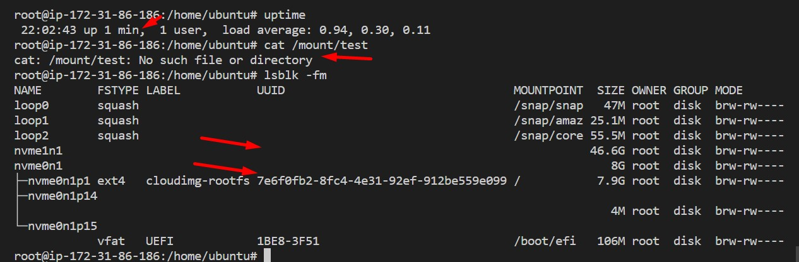

<br>


---

### Eliminación de recursos

```bash
#Eliminar instancia EC2 (c5d.large)
```
