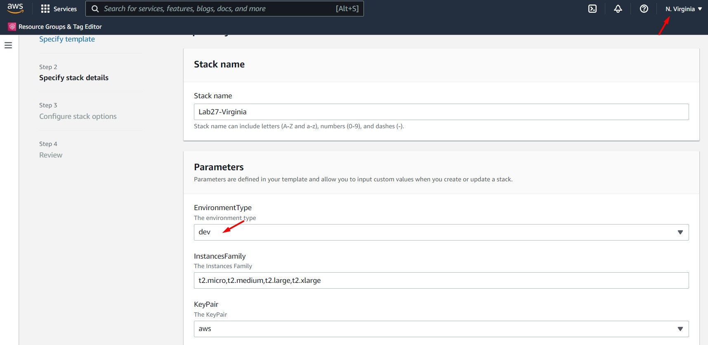
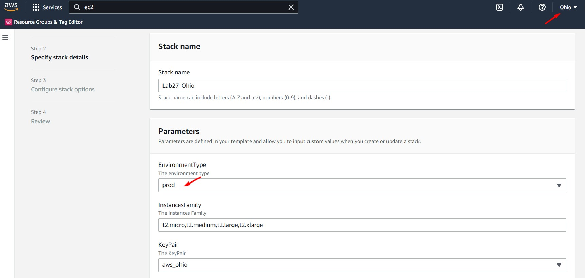
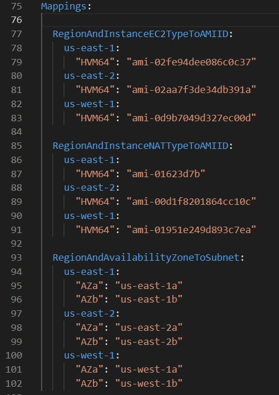
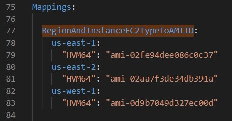
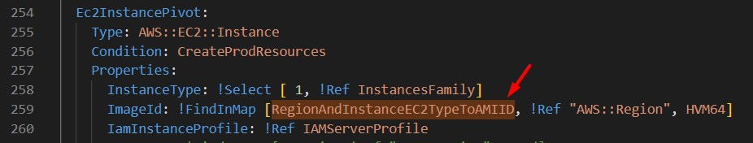
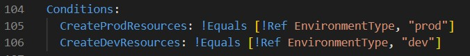
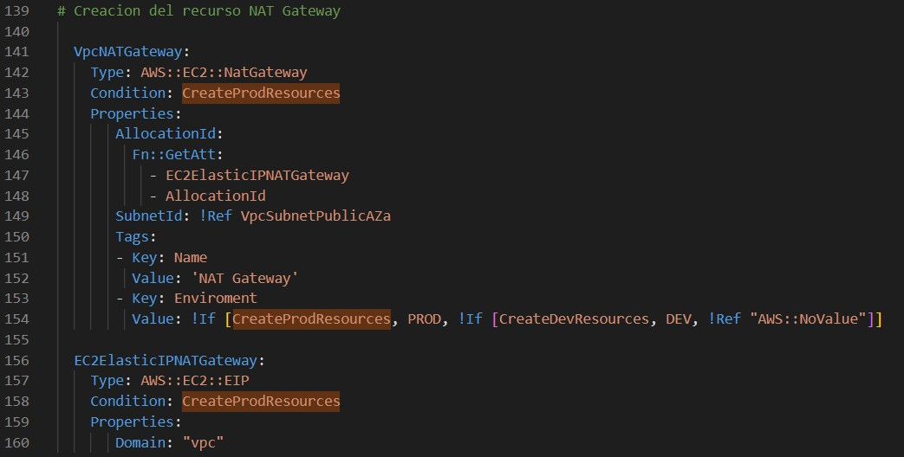
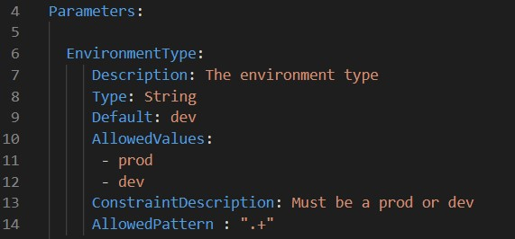

# AWS Solutions Architect Associate - Laboratorio 27

 

### Objetivo: 
* Desplegar un stack de CloudFormation multi-región usando "Mappings", "Conditions" y "Parameters"

### Tópico:
* Management & Governance

### Dependencias:
* Ninguna

### Costo:
 * Al seleccionar la opción "prod" en el parámetro "EnvironmentType" se desplegará un NAT Gateway, recurso que tiene un precio de 0,045 USD/hora y 0,045 USD por GB de datos procesados. Cada hora parcial consumida de gateway NAT se factura como una hora completa. 

 

---

### A - Desplegar un stack de CloudFormation multi-región usando "Mappings", "Conditions" y "Parameters"

 

1. Este laboratorio usará las regiones de N.Virginia y Ohio. Será necesario tener una KeyPair creada en cada región. Este laboratorio nombrará a las KeyPair como "aws-solutionsarchitectassociate" y "aws-solutionsarchitectassociate-ohio"

 

2. Desplegamos la plantilla AWS CloudFormation ubicada en /code/1_lab27-cloudformation.yaml en la región de **N.Virginia (us-east-1)** en nuestra cuenta de AWS. Ingresamos/seleccionamos los siguientes valores:

    * Stack name: Lab27-Virginia
    * EnvironmentType: **dev**
    * InstancesFamily: t2.micro,t2.medium,t2.large,t2.xlarge
    * KeyPair: aws-solutionsarchitectassociate
    * SubnetCIDR1: 192.168.1.0/24
    * SubnetCIDR2: 192.168.2.0/24
    * SubnetCIDR3: 192.168.3.0/24
    * SubnetCIDR4: 192.168.4.0/24
    * SubnetCIDR5: 192.168.5.0/24
    * SubnetCIDR6: 192.168.6.0/24
    * VPCCIDR: 192.168.0.0/16 

 

 

3. Desplegamos la plantilla AWS CloudFormation ubicada en /code/1_lab27-cloudformation.yaml en la región de **Ohio (us-east-2)** en nuestra cuenta de AWS. Ingresamos/seleccionamos los siguientes valores:

    * Stack name: Lab27-Ohio
    * EnvironmentType: **prod**
    * InstancesFamily: t2.micro,t2.medium,t2.large,t2.xlarge
    * KeyPair: aws-solutionsarchitectassociate-ohio
    * SubnetCIDR1: 192.168.1.0/24
    * SubnetCIDR2: 192.168.2.0/24
    * SubnetCIDR3: 192.168.3.0/24
    * SubnetCIDR4: 192.168.4.0/24
    * SubnetCIDR5: 192.168.5.0/24
    * SubnetCIDR6: 192.168.6.0/24
    * VPCCIDR: 192.168.0.0/16 

 

 

4. Una vez que los Stacks se han aprovisionado correctamente, analizamos los recursos generados en cada una de ellas. 

    |                 N. Virginia                     |                      Ohio                       |
    |-------------------------------------------------|-------------------------------------------------|
    |                                                 | EC2ElasticIPAssignment	                        |
    |                                                 | EC2ElasticIPNATGateway                          |
    |                                                 | EC2ElasticIPPivot                               |
    | EC2SecurityBastionRemoteConnection	          | EC2SecurityBastionRemoteConnection	            |
    | EC2SecurityGroupNatConnection	                  | EC2SecurityGroupNatConnection                   |
    | EC2SecurityGroupRemoteConnection	              | EC2SecurityGroupRemoteConnection	            |
    | Ec2InstanceNat	                              | 	                                            |
    |                                                 | Ec2InstancePivot                                |
    | IAMPolicySSM                                    | IAMPolicySSM                                    |
    | IAMRoleEC2                                      | IAMRoleEC2                                      |
    | IAMServerProfile	                              | IAMServerProfile                                |
    | Vpc                                             | Vpc                                             |
    | VpcInternetGateway                              | VpcInternetGateway	                            |
    | VpcInternetGatewayAttachment	                  | VpcInternetGatewayAttachment	                |
    | VpcInternetRoutePublicAttachment	              | VpcInternetRoutePublicAttachment                |
    |                                                 | VpcNATGateway                                   |
    | VpcNatInstanceRoutePrivateAttachment            | VpcNatInstanceRoutePrivateAttachment		    |
    | VpcRouteTablePrivate	                          | VpcRouteTablePrivate                            |
    | VpcRouteTablePublic                             | VpcRouteTablePublic                             |
    | VpcSubnetPrivateAZa	                          | VpcSubnetPrivateAZa                             |
    | VpcSubnetPrivateAZaRouteTablePrivateAttachment  | VpcSubnetPrivateAZaRouteTablePrivateAttachment  |	
    | VpcSubnetPrivateAZb                             | VpcSubnetPrivateAZb                             |
    | VpcSubnetPrivateAZbRouteTablePrivateAttachment  | VpcSubnetPrivateAZbRouteTablePrivateAttachment  |	
    | VpcSubnetPrivateDBAZa	                          | VpcSubnetPrivateDBAZa	                        |
    | VpcSubnetPrivateDBAZaRouteTablePrivateAttachment| VpcSubnetPrivateDBAZaRouteTablePrivateAttachment|	
    | VpcSubnetPrivateDBAZb                           | VpcSubnetPrivateDBAZb                           |
    | VpcSubnetPrivateDBAZbRouteTablePrivateAttachment| VpcSubnetPrivateDBAZbRouteTablePrivateAttachment|	
    | VpcSubnetPublicAZa                              | VpcSubnetPublicAZa                              |
    | VpcSubnetPublicAZaRouteTablePublicAttachment    | VpcSubnetPublicAZaRouteTablePublicAttachment	|
    | VpcSubnetPublicAZb	                          | VpcSubnetPublicAZb                              |
    | VpcSubnetPublicAZbRouteTablePublicAttachment	  | VpcSubnetPublicAZbRouteTablePublicAttachment    |

 

5. Al seleccionar el ambiente de "prod" en la región de Ohio, este stack desplegará únicamente los siguientes recursos. El ambiente de producción (prod) usará un NAT Gateway y una instancia EC2 como Bastion (Pivot).

    * EC2ElasticIPAssignment
    * EC2ElasticIPNATGateway
    * EC2ElasticIPPivot
    * Ec2InstancePivot

 

6. Al seleccionar el ambiente de "dev" en la región de N.Virginia, este stack desplegará únicamente los siguientes recursos. El ambiente de desarrollo (dev) usará un NAT Instances.

    * Ec2InstanceNat

 

7. La misma plantilla de CloudFormation permite crear diferentes recursos según el ambiente seleccionado, para esto CloudFormation hace uso de los componentes "Mappings", "Conditions" y "Parameters". Analizamos directamente la plantilla "yaml" almacenada en /code/1_lab27-cloudformation.yaml 

 

 

8. La sección opcional **Mappings** hace coincidir una clave con un conjunto correspondiente de valores con nombre. Por ejemplo, si se desea establecer valores en función de una región, se puede crear una asignación que utilice el nombre de la región como clave y contenga los valores que desea especificar para cada región específica. En la sección "RegionAndInstanceEC2TypeToAMIID" de la siguiente imagen, los 03 IDs de AMIs corresponden a la imagen "ubuntu/images/hvm-ssd/ubuntu-bionic-18.04-amd64-server-20210128 (Canonical, Ubuntu, 18.04 LTS, amd64 bionic image build on 2021-01-28)". La misma imagen tendrá IDs distintos por región. El valor "RegionAndInstanceEC2TypeToAMIID" será usado en el despliegue de la instancia "Ec2InstancePivot". Es decir, si está plantilla se despliega en la región de N. Virginia (us-east-1), Ohio (us-east-2) o N.California (us-west-1) se estará desplegando la misma instancia Ubuntu 18.04 LTS a pesar de tener AMI IDs distintos. 

 

 

 

9. La sección opcional **Conditions** contiene declaraciones que definen las circunstancias bajo las cuales se crean o configuran las entidades. Por ejemplo, se puede crear una condición y luego asociarla con un recurso o salida para que AWS CloudFormation solo cree el recurso o la salida si la condición es verdadera. De manera similar, se puede asociar la condición con una propiedad para que AWS CloudFormation solo establezca la propiedad en un valor específico si la condición es verdadera. Si la condición es falsa, AWS CloudFormation establece la propiedad en un valor diferente al que especifique. En la sección "Conditions" se visualiza la creación de dos condiciones, uno asociada al ambiente dev y otro asociada al ambiente prod. Además, visualizamos que el recurso NAT Gateway sólo se aprovisionará en el ambiente de prod.

 

 

 

10. La sección opcional **Parameters** permite personalizar las plantillas de CloudFormation. Los parámetros permiten ingresar valores personalizados a su plantilla cada vez que crea o actualiza una pila. La imagen detalla la creación de dos parámetros "dev" y "prod" a su vez estos parámetros están asociados a las condiciones "CreateProdResources" y "CreateDevResources".

 

 

 

11. Identificar las siguientes "Intrinsic functions" en la plantilla 1_lab27-cloudformation.yaml

    * If
    * Ref
    * Select
    * FindInMap
    * Sub

 

12. Identificar las siguientes "Resource attribute" en la plantilla 1_lab27-cloudformation.yaml

    * DependsOn

 

13. Identificar los siguientes "Pseudo parameters" en la plantilla 1_lab27-cloudformation.yaml

    * AWS::Region
    * AWS::NoValue
