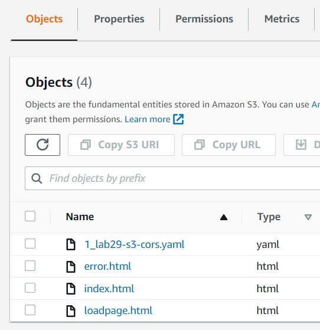
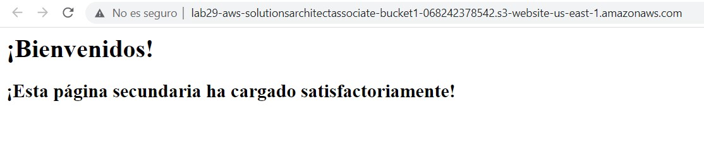
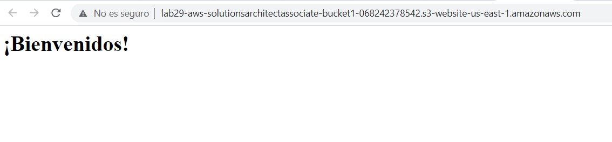
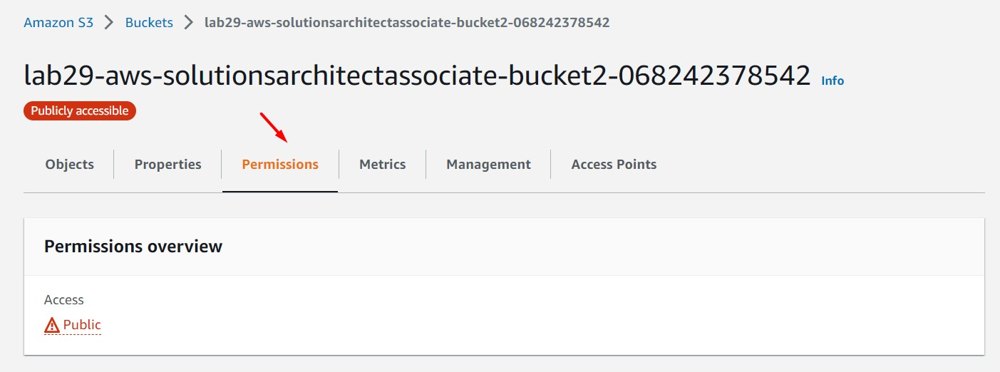
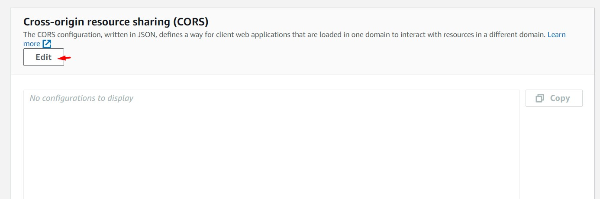
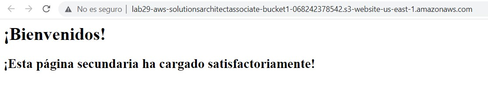

# AWS Solutions Architect Associate - Laboratorio 29

<br>

### Objetivo: 
* Configuración de Cross-origin resource sharing (CORS) en S3 (Permissions)

### Tópico:
* Storage

### Dependencias:
* Ninguna

<br>


---

### A - Configuración de CORS en S3

<br>

1. Acceder al servicio AWS Cloud9 y generar un nuevo (o encender nuestro) ambiente de trabajo (Ubuntu 18.04 LTS)

<br>

2. Ejecutar los siguinentes comandos en nuestro Cloud9

```bash
#Ubuntu 18.04
sudo apt-get update
git clone https://github.com/jbarreto7991/aws-solutionsarchitectassociate.git
```

<br>

3. Acceder al laboratorio 29 (Lab-29), carpeta "code". Validar que se cuenta con la carpeta lab29-s3-cors. Esta a su vez contendrá la plantilla de cloudformation "1_lab29-s3-cors.yaml". En esta misma carpeta encontraremos 3 simples archivos estáticos (error.html, index.html y loadpage.html). Analizar el contenido de estos elementos.

<br>

4. Desplegar la plantilla CloudFormation "1_lab29-s3-cors.yaml" ejecutando AWSCLI.

<br>

5. **1_lab29-s3-cors.yaml** Esta plantilla no contiene parámetros de despliegue. Después del despliegue analizar los recursos aprovisiones: dos buckets S3 y dos políticas basadas en recursos S3.

```bash
aws cloudformation create-stack --stack-name lab29-s3-cors --template-body file://~/environment/aws-solutionsarchitectassociate/Lab-29/code/lab29-s3-cors/1_lab29-s3-cors.yaml 
```

<br>

6. Movemos todos los archivos que se encuentran en la carpeta Lab-29/code/lab29-s3-cors/ al bucket "lab29-aws-solutionsarchitectassociate-bucket1-${AWS::AccountId}" (Bucket 01).

```bash
cd ~/environment/aws-solutionsarchitectassociate/Lab-29/code/lab29-s3-cors/
BUCKET=$(aws s3 ls | sort -r | awk 'NR ==2 { print $3 }')
echo $BUCKET
aws s3 sync . s3://$BUCKET --include "*.html" --exclude "index2.html"
```

<br>



<br>

7. Ingresamos al servicio S3, a la propiedad "Static WebSite Hosting" del bucket "lab29-aws-solutionsarchitectassociate-bucket1-${AWS::AccountId}" (Bucket 01) y validamos la carga de nuestra aplicación. La página "index.html" invoca a la página "loadpage.html", ambas páginas se encuentran momentaneamente en el mismo bucket (Bucket 01)

<br>



<br>

8. Para comprender los permisos CORS moveremos el archivo "loadpage.html" del "Bucket 01" al "Bucket 02". Esto implica que el archivo "index.html" ahora apunte al archivo "loadpage.html" del "Bucket 02".

<br>

9. Desde Cloud9, ingresamos al archivo "index2.html" y modificamos el campo "BUCKET2_STATICWEBSITE_HOSTING_DESTINATION" por "lab29-aws-solutionsarchitectassociate-bucket2-${AWS::AccountId}". Obtenemos el valor de este segundo bucket ejecutando el siguiente comando:

```bash
BUCKET=$(aws s3 ls | sort -r | awk 'NR ==1 { print $3 }')
echo $BUCKET
```

<br>


<br>


10. Realizamos modificaciones sobre nuestro archivo "index2.html" y subimos esta actualización al Bucket 01. Volvemos a revisar el contenido de nuestra aplicación. Con los cambios realizados anteriormente validaremos que sólo carga una parte de nuestra página. 

```bash
cd ~/environment/aws-solutionsarchitectassociate/Lab-29/code/lab29-s3-cors/
rm index.html
mv index2.html index.html
BUCKET=$(aws s3 ls | sort -r | awk 'NR ==2 { print $3 }')
echo $BUCKET
aws s3 cp index.html s3://$BUCKET
```
<br>



<br>


11. Con el objeto de asegurarnos que la lectura del archivo "loadpage.html" sea desde el segundo bucket, eliminamos el archivo "loadpage.html" del primer bucket S3 y subimos este archivo al segundo bucket "lab29-aws-solutionsarchitectassociate-bucket2-${AWS::AccountId}". Inspeccionamos nuestra página y encontraremos problemas relacionados a CORS.

```bash
cd ~/environment/aws-solutionsarchitectassociate/Lab-29/code/lab29-s3-cors/

#Eliminando archivo loadpage.html del primer bucket S3
BUCKET=$(aws s3 ls | sort -r | awk 'NR ==2 { print $3 }')
echo $BUCKET
aws s3api delete-object --bucket $BUCKET --key loadpage.html

#Agregando archivo loadpage.html al segundo bucket S3
BUCKET=$(aws s3 ls | sort -r | awk 'NR ==1 { print $3 }')
echo $BUCKET
aws s3 cp loadpage.html s3://$BUCKET
```

<br>


<br>


12. Accedemos al "Bucket 02" y agregamos la siguiente política CORS. Reemplazamos el valor BUCKET_STATICWEBSITE_HOSTING_ORIGIN por la URL generada por AWS en la sección "Static Website Hosting" (del "Bucket 02"). No debe ir un "/" al final de esta URL. Si usamos el código de la sección "Ejemplo" reemplazar el valor "AAAAAAAAAAAA" por el "Account ID"

```bash
#Plantilla
[
    {
      "AllowedOrigins": ["http://BUCKET_STATICWEBSITE_HOSTING_ORIGIN"],
      "AllowedHeaders": ["Authorization"],
      "AllowedMethods": ["GET"],
      "MaxAgeSeconds": 3000
    }
]

#Ejemplo
[
    {
        "AllowedHeaders": [
            "Authorization"
        ],
        "AllowedMethods": [
            "GET"
        ],
        "AllowedOrigins": [
            "http://lab29-aws-solutionsarchitectassociate-bucket1-AAAAAAAAAAAA.s3-website-us-east-1.amazonaws.com"
        ],
        "ExposeHeaders": [],
        "MaxAgeSeconds": 3000
    }
]
```

<br>



<br>



<br>

13. Volvemos a cargar nuestra aplicación. Nuestra aplicación cargará correctamente nuevamente.

<br>



<br>

---

### Eliminación de recursos

```bash
#Eliminar objetos almacenados en los Buckets S3
aws cloudformation delete-stack --stack-name lab29-s3-cors
#Eliminar Buckets S3
```
