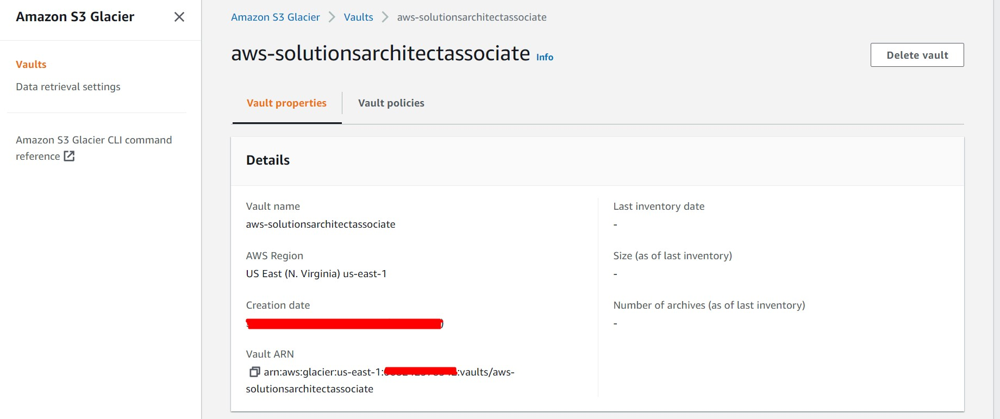
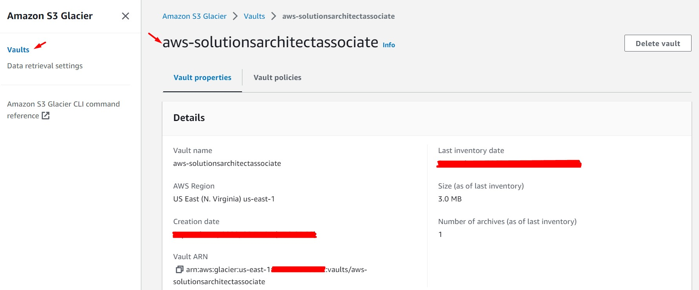

# AWS Solutions Architect Associate - Laboratorio 30

<br>

### Objetivo: 
* Subir archivos directamente a S3 Glacier usando AWSCLI

### Tópico:
* Storage

### Dependencias:
* Ninguna

<br>


---

### A - Subir archivos directamente a S3 Glacier usando AWSCLI

<br>

1. Acceder al servicio AWS Cloud9 y generar un nuevo (o encender nuestro) ambiente de trabajo (Ubuntu 18.04 LTS)

<br>

2. Ejecutar los siguientes comandos en Cloud9

```bash
#Comando AWSCLI
aws glacier create-vault --account-id - --vault-name aws-solutionsarchitectassociate

#Resultado
{
    "location": "/068242378542/vaults/aws-solutionsarchitectassociate"
}
```

<br>

3. Generar un archivo de 3 MB en Cloud9

```bash
#Comando
dd if=/dev/urandom of=largefile bs=3145728 count=1

#Resultado. Nombre del archivo "largefile"
1+0 records in
1+0 records out
3145728 bytes (3.1 MB, 3.0 MiB) copied, 0.0201717 s, 156 MB/s
```

<br>

4. Dividir el archivo en trozos de 1 MB. Validar que se hayan generado los siguientes 3 archivos: chunka, chunkb, chunkc

```bash
#Comando
split -b 1048576 --verbose largefile chunk

#Resultado. Se generarán 03 archivos: chunkaa, chunkab y chunkac
creating file 'chunkaa'
creating file 'chunkab'
creating file 'chunkac'
```

<br>

5. Crear una carga de varias partes (multipart-upload) en Amazon S3 Glacier mediante el comando "initiate-multipart-upload"

```bash
#Comando AWSCLI
aws glacier initiate-multipart-upload --account-id - --archive-description "multipart upload test" --part-size 1048576 --vault-name aws-solutionsarchitectassociate

#Resultado
{
    "location": "/068242378542/vaults/aws-solutionsarchitectassociate/multipart-uploads/9MA2n8fOy3JEeewr5jZVAS230NXO8rntvOaqjejKTHx4eV1gYZqIpdWAaVrcIvvNFhPQ1Nt8Kz99AnDLCqOvdXXsCzbR",
    "uploadId": "9MA2n8fOy3JEeewr5jZVAS230NXO8rntvOaqjejKTHx4eV1gYZqIpdWAaVrcIvvNFhPQ1Nt8Kz99AnDLCqOvdXXsCzbR"
}
```

<br>

6. Setear el valor del campo "uploadId" en la variable de entorno UPLOADID

```bash
#Comando
UPLOADID="9MA2n8fOy3JEeewr5jZVAS230NXO8rntvOaqjejKTHx4eV1gYZqIpdWAaVrcIvvNFhPQ1Nt8Kz99AnDLCqOvdXXsCzbR"
echo $UPLOADID

#Resultado
9MA2n8fOy3JEeewr5jZVAS230NXO8rntvOaqjejKTHx4eV1gYZqIpdWAaVrcIvvNFhPQ1Nt8Kz99AnDLCqOvdXXsCzbR
```

<br>

7. Subir el archivo a S3 Glacier a través de los siguientes 03 comandos AWSCLI

```bash
#Comando AWSCLI
aws glacier upload-multipart-part --upload-id $UPLOADID --body chunkaa --range 'bytes 0-1048575/*' --account-id - --vault-name aws-solutionsarchitectassociate

aws glacier upload-multipart-part --upload-id $UPLOADID --body chunkab --range 'bytes 1048576-2097151/*' --account-id - --vault-name aws-solutionsarchitectassociate

aws glacier upload-multipart-part --upload-id $UPLOADID --body chunkac --range 'bytes 2097152-3145727/*' --account-id - --vault-name aws-solutionsarchitectassociate

#Resultado 01
{
    "checksum": "d35c8c03b6d096803338d112c7ec4dec8c60c4eb6a86ab4558a898cfcd78909c"
}

#Resultado 02
{
    "checksum": "a0753e30ccbba91096e3c81336e4a540837280d12e44493277301bc24f5815b8"
}

#Resultado 03
{
    "checksum": "db585fe5a24202d532823005145e69b071ffd11e578ac3ae515911913f2144f4"
}
```

<br>

8. Calculando el hash del árbol a través de la ejecución de los siguientes comandos.

```bash
#Comandos
openssl dgst -sha256 -binary chunkaa > hash1
openssl dgst -sha256 -binary chunkab > hash2
openssl dgst -sha256 -binary chunkac > hash3

cat hash1 hash2 > hash12
openssl dgst -sha256 -binary hash12 > hash12hash

cat hash12hash hash3 > hash123
openssl dgst -sha256 hash123

#Resultado
SHA256(hash123)= a78d89ed7938c9f975a3912ed983dc7e52946ac63df2e3e713cbc5d0e6b30366
```

<br>

9. Setear el valor del hash en la variable de entorno TREEHASH

```bash
TREEHASH=a78d89ed7938c9f975a3912ed983dc7e52946ac63df2e3e713cbc5d0e6b30366
echo $TREEHASH
```

<br>

10. Completar la carga hacia AWS S3 Glacier usando el comando "complete-multipart-upload"

```bash
#Comando AWSCLI
aws glacier complete-multipart-upload --checksum $TREEHASH --archive-size 3145728 --upload-id $UPLOADID --account-id - --vault-name aws-solutionsarchitectassociate

#Resultado
{
    "location": "/068242378542/vaults/aws-solutionsarchitectassociate/archives/6okecr4Y_lL8wq8EINur-vcJJgRzVzqufr6wi_i6EDkZ2g9vSBqNELPnRGZnBG3OKAcAGEKLLfjAOUDXYv5wmPn8Igh5w05i3lSDD2vxLfuYvuF_FWc43k0IAB8OubFvOsZPf15DEg",
    "checksum": "a78d89ed7938c9f975a3912ed983dc7e52946ac63df2e3e713cbc5d0e6b30366",
    "archiveId": "6okecr4Y_lL8wq8EINur-vcJJgRzVzqufr6wi_i6EDkZ2g9vSBqNELPnRGZnBG3OKAcAGEKLLfjAOUDXYv5wmPn8Igh5w05i3lSDD2vxLfuYvuF_FWc43k0IAB8OubFvOsZPf15DEg"
}
```

<br>

11. Verificar el estado de la bóveda. **El estado de la bóveda se actualiza aproximadamente una vez al día**. 

```bash
#Comando AWSCLI
aws glacier describe-vault --account-id - --vault-name aws-solutionsarchitectassociate

#Respuesta
{
    "VaultARN": "arn:aws:glacier:us-east-1:068242378542:vaults/aws-solutionsarchitectassociate",
    "VaultName": "aws-solutionsarchitectassociate",
    "CreationDate": "XXXX-XX-XXTXX:XX:XX.XXXZ",
    "LastInventoryDate": "XXXX-XX-XXTXX:XX:XX.XXXZ",
    "NumberOfArchives": 1,
    "SizeInBytes": 3178496
}
```

<br>



<br>



<br>

12. Eliminar los archivos fragmentados y hash que se generaron

```bash
#Comando
rm chunk* hash*
```

<br>

---

### Eliminación de recursos

```bash
#Eliminar Cloud9
```
