# AWS Solutions Architect Associate - Laboratorio 31

<br>

### Objetivo: 
* Integración de S3, Glue, Crawler y Athena

### Tópico:
* Storage
* Analytics

### Dependencias:
* Ninguna

<br>


---

### A - Integración de S3, Glue, Crawler y Athena

<br>

1. Acceder al servicio AWS Cloud9 y generar un nuevo (o encender nuestro) ambiente de trabajo (Ubuntu 18.04 LTS)

<br>

2. Ejecutar los siguinentes comandos en nuestro Cloud9

```bash
#Ubuntu 18.04
sudo apt-get update
git clone https://github.com/jbarreto7991/aws-solutionsarchitectassociate.git
```

<br>

3. Acceder al laboratorio 31 (Lab-31), carpeta "code". Validar que se cuenta con la plantilla de cloudformation "1_lab31-s3-glue.yaml".

<br>

4. Desplegar la respectiva plantilla CloudFormation ejecutando AWSCLI.

<br>

5. **1_lab31-s3-glue.yaml** Esta plantilla no contiene parámetros de despliegue. Después del despliegue, analizar los recursos aprovisionados: dos buckets S3 (uno para ser usado por el Crawler de Glue y el otro para ser usado por Athena) y el recurso "AWS Glue Database" "lab31-glue-database".

```bash
aws cloudformation create-stack --stack-name lab31-s3-glue --template-body file://~/environment/aws-solutionsarchitectassociate/Lab-31/code/1_lab31-s3-glue.yaml --capabilities CAPABILITY_IAM
```

<br>

6. Descargar el siguiente archivo ("tripdata.csv") en nuestro Cloud9 enviroment y cargar el archivo al bucket S3 "lab31-aws-solutionsarchitectassociate-s3-${Account_ID}". Analizar el contenido del archivo (valores y tipo de datos por cada columna).

```bash
#Descarga de archivo de prueba
wget https://s3.amazonaws.com/tripdata/201306-citibike-tripdata.zip
unzip 201306-citibike-tripdata.zip
mv 201306-citibike-tripdata.csv tripdata.csv

#Analizar contenido de archivo tripdata.csv
head tripdata.csv -n 10

#Upload a Bucket S3
BUCKET=$(aws s3 ls | sort -r | awk 'NR ==1 { print $3 }')
echo $BUCKET
aws s3 cp tripdata.csv s3://$BUCKET
```

<br>

7. Ingresar al servicio AWS Glue y analizar las siguientes secciones:

    * Sección "Data catalog - Databases"
    * Sección "Data catalog - Databases - Tables"
    * Sección "Data catalog - Crawlers"

<br>

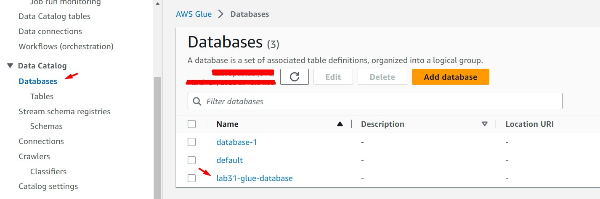

<br>

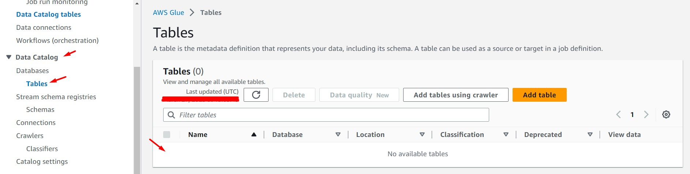

<br>

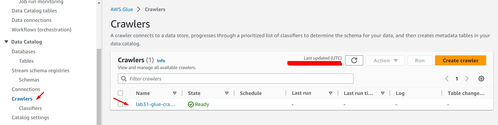

<br>

8. Ir a la sección "Data catalog - Crawlers". Seleccionar el crawler "lab31-glue-crawler" y dar clic en botón "Run". Esperamos unos pocos minutos hasta que la ejecución del crawler finalice.

<br>

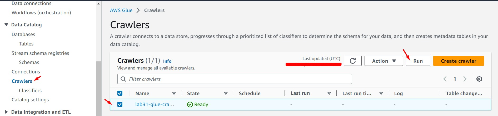

<br>

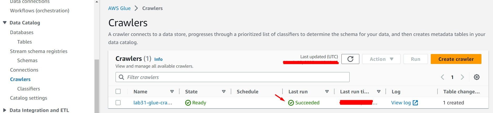

<br>


9. Ir a la sección  "Data catalog - Databases - Tables". Validar la creación de la tabla "lab31-glue-crawler-lab31_aws_solutionsarchitectassociate_s3". Accedemos al detalle de la tabla. Visualizamos los siguientes valores:

    * Location: s3://lab31-aws-solutionsarchitectassociate-s3-AAAAAAAAAAAA/
    * Input format: org.apache.hadoop.mapred.TextInputFormat
    * Output format: org.apache.hadoop.hive.ql.io.HiveIgnoreKeyTextOutputFormat
    * Serde serialization lib: org.apache.hadoop.hive.serde2.lazy.LazySimpleSerDe
    * Classification: csv
    * Schema: Analizar valores "Column name" y "Data Type". Comparar valores respecto al contenido del archivo tripdata.csv


<br>

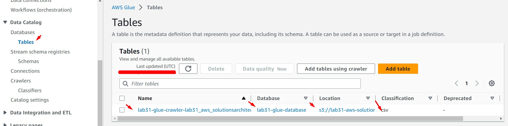

<br>

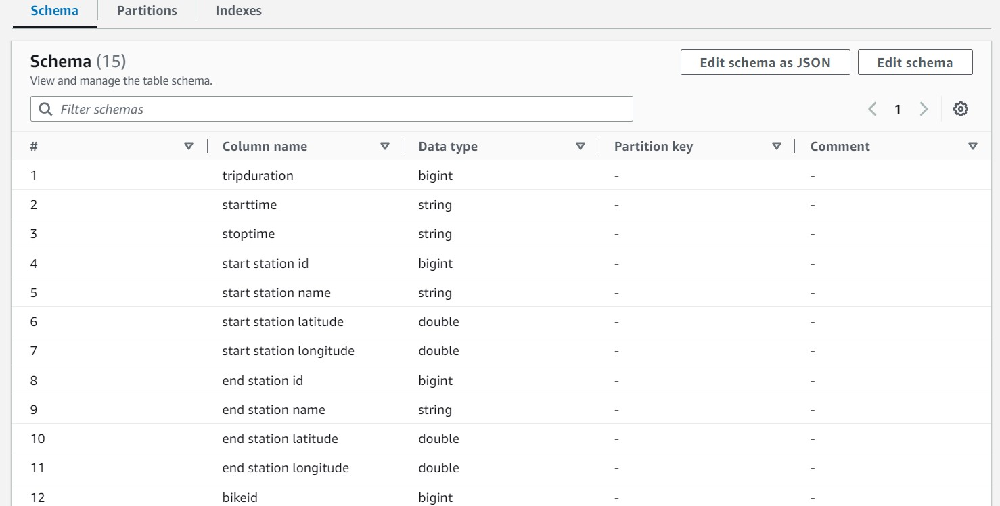

<br>

10. Ir al servicio "Athena". Luego accedemos a la opción "Settings" y damos clic en la opción "Manage". Configuramos como Bucket destino el bucket "lab31-aws-solutionsarchitectassociate-athena". Dar clic en el botón "Save". La plantilla CloudFormation desplegada en este laboratorio aprovision el bucket "lab31-aws-solutionsarchitectassociate-athena-AAAAAAAAAAAA". Seleccionar este bucket como destino de Athena.

<br>

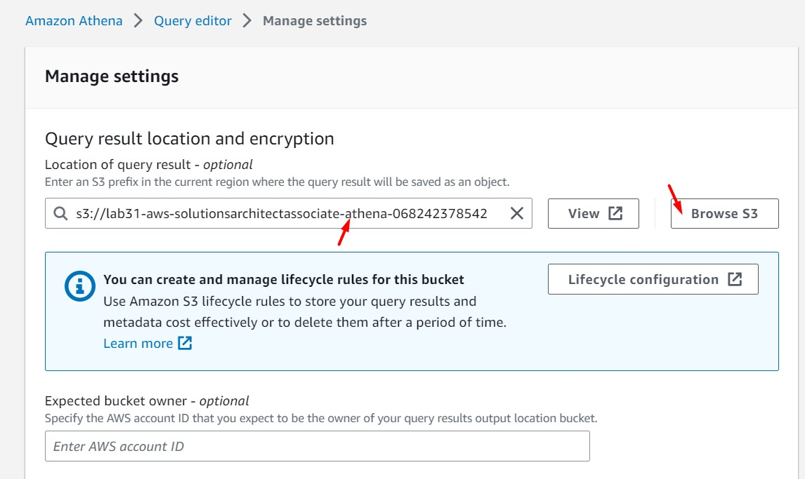

<br>

11. Regresamos a la opción "Editor" (panel principal de Athena). Luego, buscamos en la opción "Database" el database "lab31-glue-database". Identificada la Tabla "lab31-glue-crawler-lab31-aws-solutionsarchitectassociate_s3_AAAAAAAAAAAA" damos clic en el "ícono con 3 puntos" y seleccionamos la opción "Preview Table". Se podrá visualizar el contenido del archivo "tripdata.csv" a través del resultado de Athena.

<br>

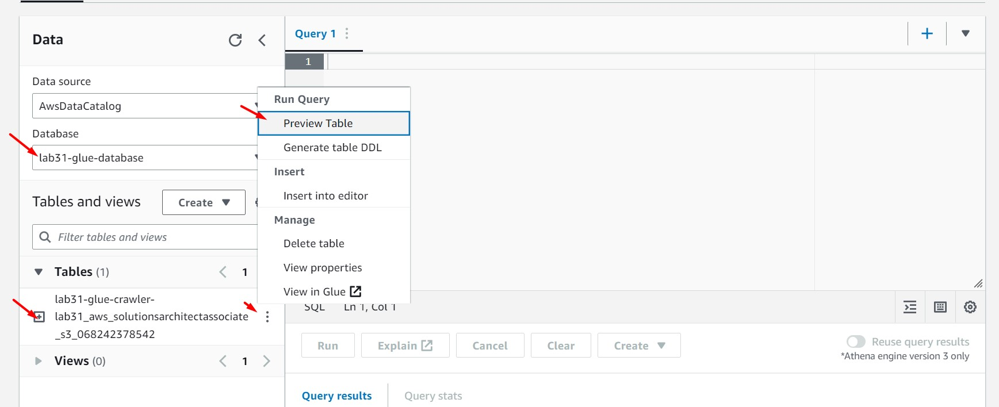

<br>

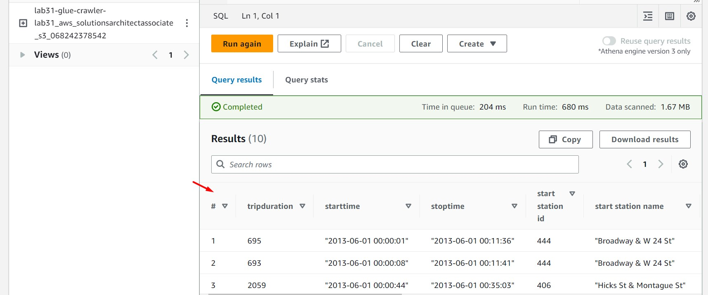

<br>

12. Si ingresamos al contenido del bucket "lab31-aws-solutionsarchitectassociate-athena-AAAAAAAAAAAA" (bucket repositorio de Athena) podremos visualizar que se han generado dos archivos:

 * 9c311fde-fa3c-484d-8949-fd22740f0cba.csv
 * 9c311fde-fa3c-484d-8949-fd22740f0cba.csv.metadata

<br>

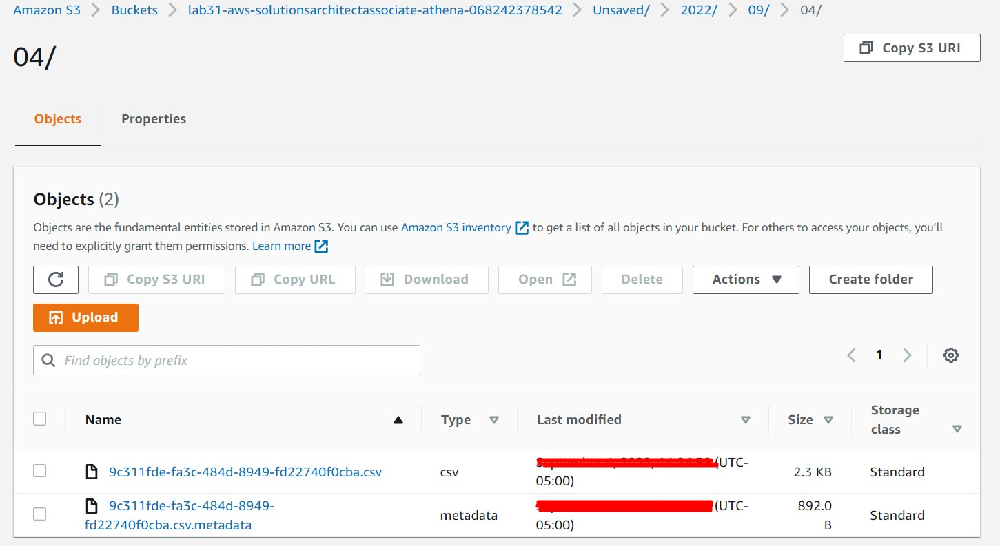

<br>

13. El archivo "9c311fde-fa3c-484d-8949-fd22740f0cba.csv" contendrá 10 registros, el mismo resultado que se obtuvo ejecutando el query directamente desde Athena.

```bash
#Contenido del archivo "9c311fde-fa3c-484d-8949-fd22740f0cba.csv"
"tripduration","starttime","stoptime","start station id","start station name","start station latitude","start station longitude","end station id","end station name","end station latitude","end station longitude","bikeid","usertype","birth year","gender"
"4535","""2013-06-27 13:08:41""","""2013-06-27 14:24:16""","455","""1 Ave & E 44 St""","40.75001986","-73.96905301","528","""2 Ave & E 31 St""","40.74290902","-73.97706058","20360","""Customer""",,"0"
"1897","""2013-06-27 13:06:55""","""2013-06-27 13:38:32""","314","""Cadman Plaza West & Montague St""","40.69383","-73.990539","459","""W 20 St & 11 Ave""","40.746745","-74.007756","15118","""Customer""",,"0"
"970","""2013-06-27 13:08:23""","""2013-06-27 13:24:33""","2003","""1 Ave & E 18 St""","40.733812191966315","-73.98054420948029","267","""Broadway & W 36 St""","40.75097711","-73.98765428","16001","""Customer""",,"0"
"557","""2013-06-27 13:06:56""","""2013-06-27 13:16:13""","463","""9 Ave & W 16 St""","40.74206539","-74.00443172","314","""Cadman Plaza West & Montague St""","40.69383","-73.990539","15179","""Customer""",,"0"
"725","""2013-06-27 13:06:51""","""2013-06-27 13:18:56""","445","""E 10 St & Avenue A""","40.72740794","-73.98142006","402","""Broadway & E 22 St""","40.7403432","-73.98955109","15555","""Customer""",,"0"
"361","""2013-06-27 13:06:56""","""2013-06-27 13:12:57""","536","""1 Ave & E 30 St""","40.74144387","-73.97536082","546","""E 30 St & Park Ave S""","40.74444921","-73.98303529","19706","""Subscriber""","1979","1"
"692","""2013-06-27 13:07:03""","""2013-06-27 13:18:35""","284","""Greenwich Ave & 8 Ave""","40.7390169121","-74.0026376103","324","""DeKalb Ave & Hudson Ave""","40.689888","-73.981013","15040","""Subscriber""","1967","1"
"366","""2013-06-27 13:03:09""","""2013-06-27 13:09:15""","523","""W 38 St & 8 Ave""","40.75466591","-73.99138152","362","""Broadway & W 37 St""","40.75172632","-73.98753523","17388","""Subscriber""","1978","1"
"1036","""2013-06-27 13:06:49""","""2013-06-27 13:24:05""","151","""Cleveland Pl & Spring St""","40.722103786686034","-73.99724900722504","326","""E 11 St & 1 Ave""","40.72953837","-73.98426726","17251","""Customer""",,"0"
"354","""2013-06-27 13:07:27""","""2013-06-27 13:13:21""","224","""Spruce St & Nassau St""","40.71146364","-74.00552427","415","""Pearl St & Hanover Square""","40.7047177","-74.00926027","16011","""Subscriber""","1985","1"

```


### Eliminación de recursos

```bash
#Eliminar objetos almacenados en los Buckets S3
aws cloudformation delete-stack --stack-name lab31-s3-glue
#Eliminar Buckets S3
```
