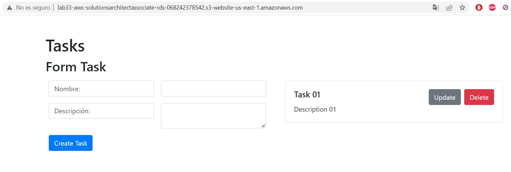
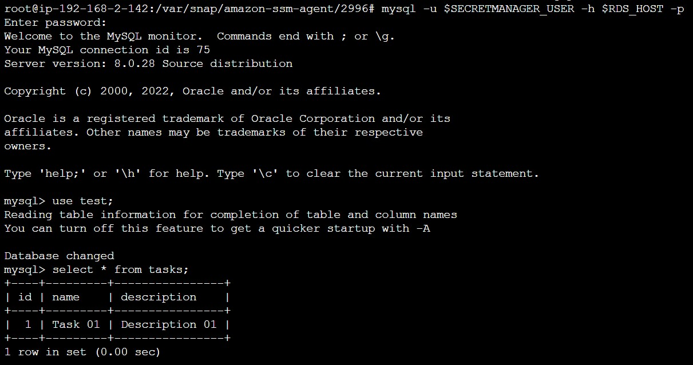
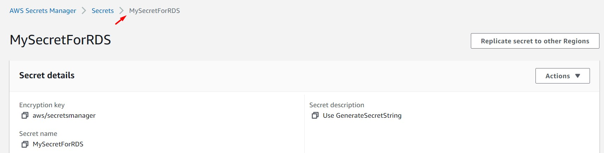
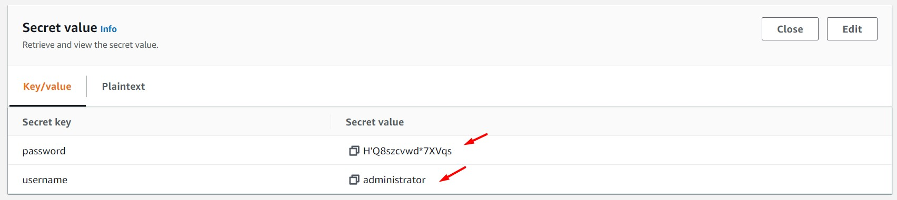
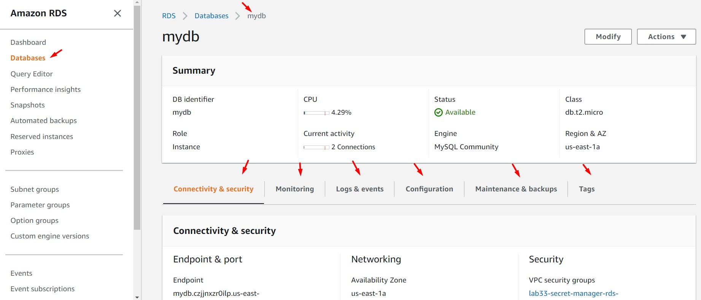

# AWS Solutions Architect Associate - Laboratorio 33

<br>

### Objetivo: 
* Aprovisionamiento de una instancia RDS desde CloudFormation usando Secrets Manager como generador de credenciales

### Tópico:
* Database
* Security, Identity & Compliance

### Dependencias:
* No deben de existir secretos previos generados en el servicio de "Secrets Manager"

<br>


---

### A - Aprovisionamiento de una instancia RDS desde CloudFormation usando Secret Manager como generador de credenciales

<br>

1. Debemos tener una llave Key Pair disponible. De no ser así, acceder al servicio EC2 y luego a la opción "Key Pair". Generar llave RSA y .pem 

<br>

2. Acceder al servicio AWS Cloud9 y generar un nuevo ambiente de trabajo (Ubuntu 18.04 LTS)

<br>

3. Ejecutar los siguientes comandos en nuestro Cloud9

```bash
#Ubuntu 18.04
sudo apt-get update
git clone https://github.com/jbarreto7991/aws-solutionsarchitectassociate.git
```

<br>

4. Acceder al laboratorio 33 (Lab-33), carpeta "code". Validar que se cuenta con tres archivos CloudFormation: "1_lab33-vpc.yaml", "2_lab33-secret-manager-rds.yaml" y "3_lab33-ec2-s3.yaml". Analizar el contenido de estos archivos.

<br>

5. Desplegar cada plantilla CloudFormation ejecutando AWSCLI. Considerar los parámetros a ser ingresados.

<br>

6. **1_lab33-vpc.yaml** (Esperar el despliegue total de esta plantilla cloudformation para continuar con las siguientes plantillas). En la sección "ParameterValue", ingresar el nombre del KeyPair creado en el paso 1. Esta plantilla creará la VPC "192.168.0.0/16", 06 Subnets dentro de este CIDR, un NAT Instances y demás componentes de red. No deberán existir redes existentes en este rango de IPs. Validar la creación del Stack desde la consola AWS a través del servicio AWS CloudFormation. El siguiente comando considera el valor "aws-solutionsarchitectassociate" para el KeyPair, reemplazar el nombre según la llave respectiva.

```bash
aws cloudformation create-stack --stack-name lab33-vpc --template-body file://~/environment/aws-solutionsarchitectassociate/Lab-33/code/1_lab33-vpc.yaml --parameters ParameterKey=KeyPair,ParameterValue="aws-solutionsarchitectassociate" --capabilities CAPABILITY_IAM
```

<br>

7. **2_lab33-secret-manager.yaml** (Esperar el despliegue total de esta plantilla cloudformation para continuar con la siguiente plantilla. Debido al aprovisionamiento de una instancia de base de datos, el despliegue demorará varios minutos). La plantilla cargará 3 parámetros por defecto. Esta plantilla aprovisionará secretos en el servicio de Secrets Manager, un Subnet Group y una instancia de base de datos RDS

```bash
aws cloudformation create-stack --stack-name lab33-secret-manager-rds --template-body file://~/environment/aws-solutionsarchitectassociate/Lab-33/code/2_lab33-secret-manager-rds.yaml
```

<br>

8. **3_lab33-ec2-s3.yaml**. Esta plantilla tiene como parámetro el valor "Key Pair". El siguiente comando considera el valor "aws-solutionsarchitectassociate" para el KeyPair, reemplazar el nombre según la llave respectiva. Esta plantilla desplegará principalmente una instancia EC2 (backend de la aplicación) y un bucket de S3 (Frontend de la aplicación). La instancia EC2 se asociará con la instancia RDS desplegada en la plantilla anterior.

```bash
aws cloudformation create-stack --stack-name lab33-ec2-s3 --template-body file://~/environment/aws-solutionsarchitectassociate/Lab-33/code/3_lab33-ec2-s3.yaml --parameters ParameterKey=KeyPair,ParameterValue="aws-solutionsarchitectassociate" --capabilities CAPABILITY_IAM
```

<br>

9. Con la ejecución de estas tres plantillas, tenemos nuestro laboratorio base construido.

<br>

10. Accedemos a la URL (Bucket website endpoint) de la propiedad "Static website hosting" del bucket S3. Validamos la carga de nuestra aplicación. Generamos registros.

<br>



<br>

11. Desde la instancia EC2 "EC2 BACKEND", usando System Manager - Session Manager, nos conectamos a la instancia RDS aprovisionada. Hacemos uso de AWSCLI para obtener los secretos en "Secrets Manager". Es posible obtener los secretos haciendo uso de la consola de AWS.

```bash
#Obtenemos el endpoint de nuestra instancia de DB
REGION=$(curl -s http://169.254.169.254/latest/meta-data/placement/availability-zone | sed 's/\(.*\)[a-z]/\1/')
RDS_HOST=$(aws rds describe-db-instances --region $REGION | jq -r '.DBInstances[] | .Endpoint | .Address')
echo $RDS_HOST

#Obtenemos el usuario y contraseña para conectarnos
SECRETMANAGER_NAME=$(aws secretsmanager list-secrets --region $REGION | jq -r '.SecretList[] | .Name')
#aws secretsmanager describe-secret --secret-id MySecretForRDS --region $REGION            
SECRETMANAGER_USER=$(aws secretsmanager get-secret-value --secret-id $SECRETMANAGER_NAME --version-stage AWSCURRENT --region $REGION | jq -r '.SecretString | fromjson | .username')            
SECRETMANAGER_PASSWORD=$(aws secretsmanager get-secret-value --secret-id $SECRETMANAGER_NAME --version-stage AWSCURRENT --region $REGION | jq -r '.SecretString | fromjson | .password')
echo $SECRETMANAGER_USER
echo $SECRETMANAGER_PASSWORD
            
#Conexión a la base de datos
mysql -u $SECRETMANAGER_USER -h $RDS_HOST -p
#Ingresamos contraseña obtenida

#Validación de creación de registro
use test;
select * from tasks;
```

<br>



<br>



<br>



<br>

12. Ejecutamos los siguientes comandos desde MySQL. Validamos que nuestro usuario "administrator" está registrado correctamente. El valor "@@global.read_only" en "0" indica que la instancia NO es de sólo lectura.

```bash
#Comandos a ejecutar
SELECT user FROM mysql.user;
SELECT @@global.read_only;
select * from information_schema.user_privileges;

#Resultado
mysql> SELECT user FROM mysql.user;
+------------------+
| user             |
+------------------+
| administrator    |
| mysql.infoschema |
| mysql.session    |
| mysql.sys        |
| rdsadmin         |
+------------------+
5 rows in set (0.00 sec)

mysql> SELECT @@global.read_only;
+--------------------+
| @@global.read_only |
+--------------------+
|                  0 |
+--------------------+
1 row in set (0.00 sec)

mysql> select * from information_schema.user_privileges;
+--------------------------------+---------------+----------------------------+--------------+
| GRANTEE                        | TABLE_CATALOG | PRIVILEGE_TYPE             | IS_GRANTABLE |
+--------------------------------+---------------+----------------------------+--------------+
| 'mysql.infoschema'@'localhost' | def           | SELECT                     | NO           |
| 'mysql.infoschema'@'localhost' | def           | SYSTEM_USER                | NO           |
| 'mysql.infoschema'@'localhost' | def           | AUDIT_ABORT_EXEMPT         | NO           |
| 'mysql.session'@'localhost'    | def           | USAGE                      | NO           |
| 'mysql.session'@'localhost'    | def           | SYSTEM_VARIABLES_ADMIN     | NO           |
| 'mysql.session'@'localhost'    | def           | SYSTEM_USER                | NO           |
| 'mysql.session'@'localhost'    | def           | SESSION_VARIABLES_ADMIN    | NO           |
| 'mysql.session'@'localhost'    | def           | PERSIST_RO_VARIABLES_ADMIN | NO           |
| 'mysql.session'@'localhost'    | def           | CONNECTION_ADMIN           | NO           |
| 'mysql.session'@'localhost'    | def           | CLONE_ADMIN                | NO           |
| 'mysql.session'@'localhost'    | def           | BACKUP_ADMIN               | NO           |
| 'mysql.session'@'localhost'    | def           | AUDIT_ABORT_EXEMPT         | NO           |
| 'mysql.sys'@'localhost'        | def           | USAGE                      | NO           |
| 'mysql.sys'@'localhost'        | def           | SYSTEM_USER                | NO           |
| 'mysql.sys'@'localhost'        | def           | AUDIT_ABORT_EXEMPT         | NO           |
| 'rdsadmin'@'localhost'         | def           | SELECT                     | YES          |
| 'rdsadmin'@'localhost'         | def           | INSERT                     | YES          |
| 'rdsadmin'@'localhost'         | def           | UPDATE                     | YES          |
| 'rdsadmin'@'localhost'         | def           | DELETE                     | YES          |
| 'rdsadmin'@'localhost'         | def           | CREATE                     | YES          |
| 'rdsadmin'@'localhost'         | def           | DROP                       | YES          |
| 'rdsadmin'@'localhost'         | def           | RELOAD                     | YES          |
| 'rdsadmin'@'localhost'         | def           | SHUTDOWN                   | YES          |
| 'rdsadmin'@'localhost'         | def           | PROCESS                    | YES          |
| 'rdsadmin'@'localhost'         | def           | FILE                       | YES          |
| 'rdsadmin'@'localhost'         | def           | REFERENCES                 | YES          |
| 'rdsadmin'@'localhost'         | def           | INDEX                      | YES          |
| 'rdsadmin'@'localhost'         | def           | ALTER                      | YES          |
| 'rdsadmin'@'localhost'         | def           | SHOW DATABASES             | YES          |
| 'rdsadmin'@'localhost'         | def           | SUPER                      | YES          |
| 'rdsadmin'@'localhost'         | def           | CREATE TEMPORARY TABLES    | YES          |
| 'rdsadmin'@'localhost'         | def           | LOCK TABLES                | YES          |
| 'rdsadmin'@'localhost'         | def           | EXECUTE                    | YES          |
| 'rdsadmin'@'localhost'         | def           | REPLICATION SLAVE          | YES          |
| 'rdsadmin'@'localhost'         | def           | REPLICATION CLIENT         | YES          |
| 'rdsadmin'@'localhost'         | def           | CREATE VIEW                | YES          |
| 'rdsadmin'@'localhost'         | def           | SHOW VIEW                  | YES          |
| 'rdsadmin'@'localhost'         | def           | CREATE ROUTINE             | YES          |
| 'rdsadmin'@'localhost'         | def           | ALTER ROUTINE              | YES          |
| 'rdsadmin'@'localhost'         | def           | CREATE USER                | YES          |
| 'rdsadmin'@'localhost'         | def           | EVENT                      | YES          |
| 'rdsadmin'@'localhost'         | def           | TRIGGER                    | YES          |
| 'rdsadmin'@'localhost'         | def           | CREATE TABLESPACE          | YES          |
| 'rdsadmin'@'localhost'         | def           | CREATE ROLE                | YES          |
| 'rdsadmin'@'localhost'         | def           | DROP ROLE                  | YES          |
| 'rdsadmin'@'localhost'         | def           | SYSTEM_USER                | YES          |
| 'rdsadmin'@'localhost'         | def           | SET_USER_ID                | YES          |
| 'rdsadmin'@'localhost'         | def           | SERVICE_CONNECTION_ADMIN   | YES          |
| 'administrator'@'%'            | def           | SELECT                     | YES          |
| 'administrator'@'%'            | def           | INSERT                     | YES          |
| 'administrator'@'%'            | def           | UPDATE                     | YES          |
| 'administrator'@'%'            | def           | DELETE                     | YES          |
| 'administrator'@'%'            | def           | CREATE                     | YES          |
| 'administrator'@'%'            | def           | DROP                       | YES          |
| 'administrator'@'%'            | def           | RELOAD                     | YES          |
| 'administrator'@'%'            | def           | PROCESS                    | YES          |
| 'administrator'@'%'            | def           | REFERENCES                 | YES          |
| 'administrator'@'%'            | def           | INDEX                      | YES          |
| 'administrator'@'%'            | def           | ALTER                      | YES          |
| 'administrator'@'%'            | def           | SHOW DATABASES             | YES          |
| 'administrator'@'%'            | def           | CREATE TEMPORARY TABLES    | YES          |
| 'administrator'@'%'            | def           | LOCK TABLES                | YES          |
| 'administrator'@'%'            | def           | EXECUTE                    | YES          |
| 'administrator'@'%'            | def           | REPLICATION SLAVE          | YES          |
| 'administrator'@'%'            | def           | REPLICATION CLIENT         | YES          |
| 'administrator'@'%'            | def           | CREATE VIEW                | YES          |
| 'administrator'@'%'            | def           | SHOW VIEW                  | YES          |
| 'administrator'@'%'            | def           | CREATE ROUTINE             | YES          |
| 'administrator'@'%'            | def           | ALTER ROUTINE              | YES          |
| 'administrator'@'%'            | def           | CREATE USER                | YES          |
| 'administrator'@'%'            | def           | EVENT                      | YES          |
| 'administrator'@'%'            | def           | TRIGGER                    | YES          |
+--------------------------------+---------------+----------------------------+--------------+
72 rows in set (0.00 sec)
```

<br>

13. Accedemos al servicio RDS, luego a la instancia RDS aprovisionada y analizamos la siguiente información:

    * DB identifier
    * Class db.t2.micro
    * Region & AZ
    * **Connectivity & Security**
        * Endpoint
        * VPC
        * Subnet group
        * VPC security groups
        * Public accessibility
    * **Monitoring**
        * CPU Utilization
        * DB Connections
        * Free Storage Space
        * Freeable Memory
    * **Logs & events**
        * Recent events
        * Logs
    * **Configuration**
        * Engine version
        * DB name
        * Option groups
        * Parameter group
        * Instance class
        * Master username
        * Multi-AZ
        * Encryption
        * Storage type
        * Storage
        * Performance Insights

<br>



<br>

