# AWS Solutions Architect Associate - Laboratorio 34

<br>

### Objetivo: 
*  Configuración y análisis de la propiedad "Read Replica" en la instancia de RDS.

### Tópico:
* Database

### Dependencias:
* Implementación del Laboratorio 33

<br>


---

### A - Configuración y análisis de la propiedad "Read Replica" en la instancia de RDS.

<br>


1. Desde el servicio EC2 accedemos a la opción "Network Interfaces". Validaremos que sólo tenemos una tarjeta de red ENI (Ver columna "Description" el valor de "RDSNetworkInterface")

<br>

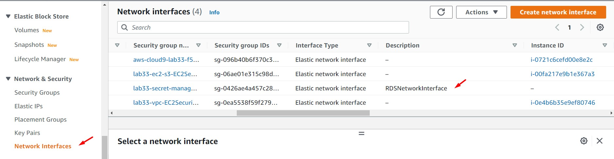

<br>

2. Accedemos al servicio de RDS, seleccionamos nuestra instancia de db, damos clic en la opción "Actions" y luego damos clic en la opción "Create read replica".

<br>

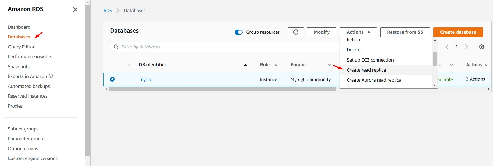

<br>

3. En la nueva ventana cargada, nos dirigimos a la sección "Settings", ingresamos el siguiente valor en el campo "DB instance identifier". Dejamos los otros valores tal como han sido cargados, luego damos clic en "Create read replica". Esperamos unos minutos mientras la instancia de lectura de base de datos se aprovisiona.

    * DB instance identifier: readreplica

<br>

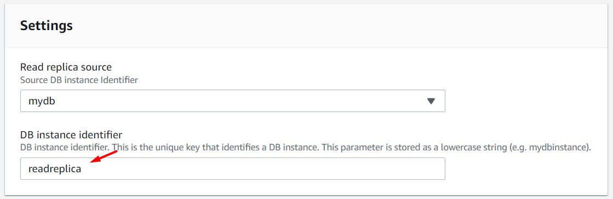

<br>

4. Cuando el aprovisionamiento de la nueva instancia haya finalizado y el estado de la misma sea "Available". Ingresamos al "DB identifier: readreplica" y obtenemos el valor del endpoint.

<br>

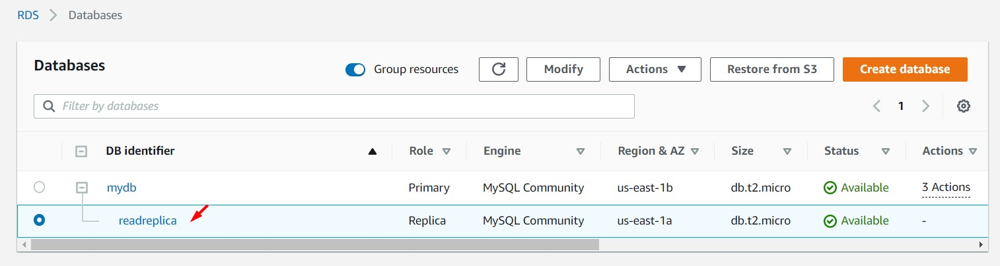

<br>

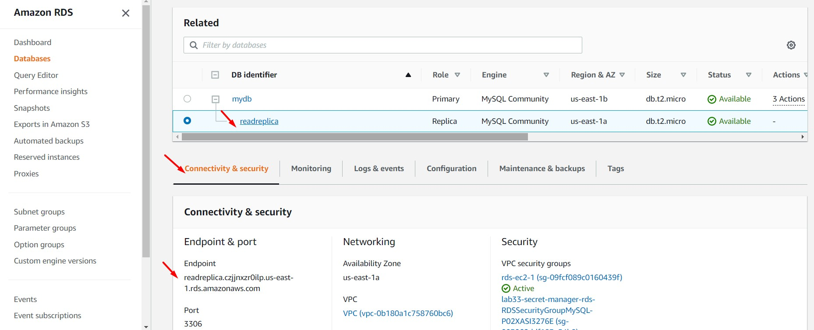

<br>

5. Ingresamos a nuestra instancia EC2 "EC2 BACKEND" y modificamos el archivo .env con el objetivo de agregar el endpoint del RDS Read Replica. Reemplazamos el valor de "DB_URI" y reiniciamos el servicio. Se cargará un mensaje similar en nuestra instancia EC2.

```bash
nano /opt/aws-solutionsarchitectassociate/App/backend/.env
#Reemplazar Endpoint RDS Read Replica obtenido en el paso anterior en la variable "DB_URI"
cd /opt/aws-solutionsarchitectassociate/App/backend/
sudo lsof -t -i:80
#El comando anterior resolverá un ID
kill -9 $ID
sudo lsof -t -i:80
npm start &
```

<br>

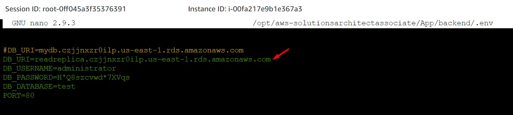

<br>


6. Accedemos a la URL (Bucket website endpoint) de la propiedad "Static website hosting" del bucket S3. Validamos la carga de nuestra aplicación. Generamos un nuevo registro. Se valida que se muestra el mensaje "sqlMessage: The MySQL server is running with the --read-only option so it cannot execute this statement" a nivel de System Manager - Session Manager y a nivel de Navegador Web

```bash
 "{"status":500,"message":"Internal Server Error","stack":{"code":"ER_OPTION_PREVENTS_STATEMENT","errno":1290,"sqlMessage":"The MySQL server is running with the --read-only option so it cannot execute this statement","sqlState":"HY000","index":0,"sql":"INSERT INTO tasks(name,description) VALUES('Task 02','Description 02')"}}"
```

<br>

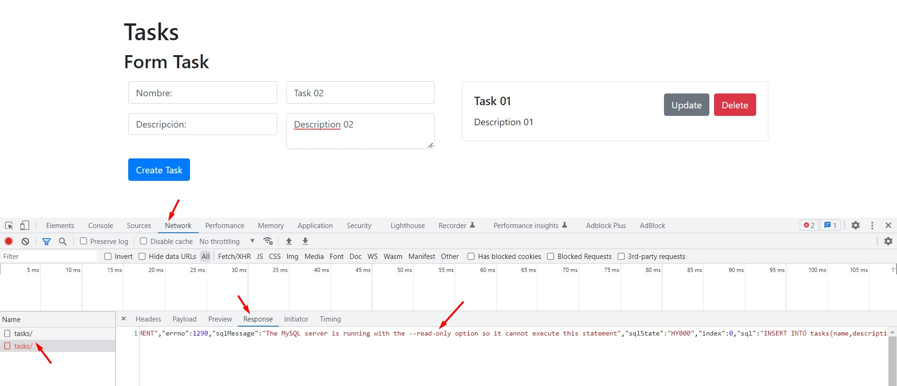

<br>

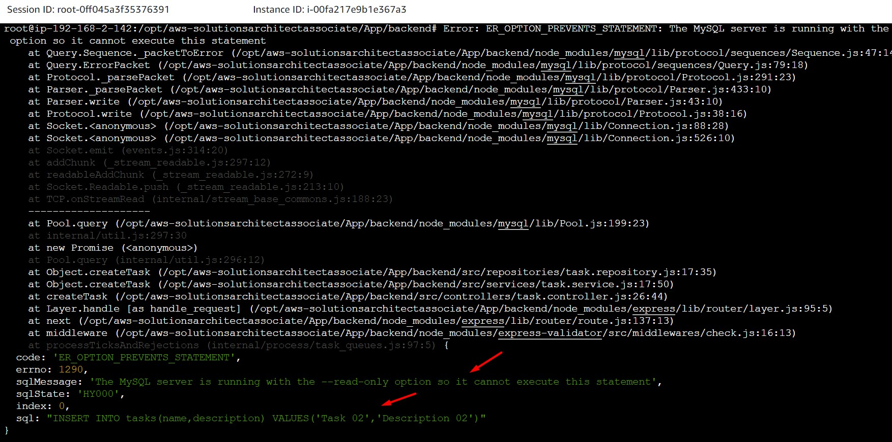

<br>

7. Desde la instancia EC2 "EC2 BACKEND", usando System Manager - Session Manager, nos conectamos a la instancia RDS Read Replica. Validamos la creación de nuestro registro.

```bash
#Obtenemos el endpoint de nuestra instancia de DB
REGION=$(curl -s http://169.254.169.254/latest/meta-data/placement/availability-zone | sed 's/\(.*\)[a-z]/\1/')
RDS_HOST=$(aws rds describe-db-instances --region $REGION | jq -r '.DBInstances[] | .Endpoint | .Address' | awk 'FNR == 2 {print}')
echo $RDS_HOST

#Obtenemos el usuario y contraseña para conectarnos
SECRETMANAGER_NAME=$(aws secretsmanager list-secrets --region $REGION | jq -r '.SecretList[] | .Name')
#aws secretsmanager describe-secret --secret-id MySecretForRDS --region $REGION            
SECRETMANAGER_USER=$(aws secretsmanager get-secret-value --secret-id $SECRETMANAGER_NAME --version-stage AWSCURRENT --region $REGION | jq -r '.SecretString | fromjson | .username')            
SECRETMANAGER_PASSWORD=$(aws secretsmanager get-secret-value --secret-id $SECRETMANAGER_NAME --version-stage AWSCURRENT --region $REGION | jq -r '.SecretString | fromjson | .password')
echo $SECRETMANAGER_USER
echo $SECRETMANAGER_PASSWORD
            
#Conexión a la base de datos
mysql -u $SECRETMANAGER_USER -h $RDS_HOST -p
#Ingresamos contraseña obtenida

#Validación de creación de registro
use test;
select * from tasks;
```

<br>

8. Ejecutamos los siguientes comandos desde MySQL. Validamos que nuestro usuario "administrator" está registrado correctamente:

    * AWS para "RDS Read Replica" ha creado el usuario "rdsrepladmin". 
    * El valor "@@global.read_only" en "1" indica que la instancia es de sólo lectura. 
    * Al usuario "rdsrepladmin" se le ha generado un privilegio tipo "REPLICATION SLAVE"

<br>

```bash
#Comandos a ejecutar
SELECT user FROM mysql.user;
SELECT @@global.read_only;
select * from information_schema.user_privileges;

#Resultado
mysql> SELECT user FROM mysql.user;
+------------------+
| user             |
+------------------+
| administrator    |
| rdsrepladmin     |
| mysql.infoschema |
| mysql.session    |
| mysql.sys        |
| rdsadmin         |
+------------------+
6 rows in set (0.00 sec)

mysql> SELECT @@global.read_only;
+--------------------+
| @@global.read_only |
+--------------------+
|                  1 |
+--------------------+
1 row in set (0.00 sec)

mysql> select * from information_schema.user_privileges;
+--------------------------------+---------------+----------------------------+--------------+
| GRANTEE                        | TABLE_CATALOG | PRIVILEGE_TYPE             | IS_GRANTABLE |
+--------------------------------+---------------+----------------------------+--------------+
| 'mysql.infoschema'@'localhost' | def           | SELECT                     | NO           |
| 'mysql.infoschema'@'localhost' | def           | SYSTEM_USER                | NO           |
| 'mysql.infoschema'@'localhost' | def           | AUDIT_ABORT_EXEMPT         | NO           |
| 'mysql.session'@'localhost'    | def           | USAGE                      | NO           |
| 'mysql.session'@'localhost'    | def           | SYSTEM_VARIABLES_ADMIN     | NO           |
| 'mysql.session'@'localhost'    | def           | SYSTEM_USER                | NO           |
| 'mysql.session'@'localhost'    | def           | SESSION_VARIABLES_ADMIN    | NO           |
| 'mysql.session'@'localhost'    | def           | PERSIST_RO_VARIABLES_ADMIN | NO           |
| 'mysql.session'@'localhost'    | def           | CONNECTION_ADMIN           | NO           |
| 'mysql.session'@'localhost'    | def           | CLONE_ADMIN                | NO           |
| 'mysql.session'@'localhost'    | def           | BACKUP_ADMIN               | NO           |
| 'mysql.session'@'localhost'    | def           | AUDIT_ABORT_EXEMPT         | NO           |
| 'mysql.sys'@'localhost'        | def           | USAGE                      | NO           |
| 'mysql.sys'@'localhost'        | def           | SYSTEM_USER                | NO           |
| 'mysql.sys'@'localhost'        | def           | AUDIT_ABORT_EXEMPT         | NO           |
| 'rdsadmin'@'localhost'         | def           | SELECT                     | YES          |
| 'rdsadmin'@'localhost'         | def           | INSERT                     | YES          |
| 'rdsadmin'@'localhost'         | def           | UPDATE                     | YES          |
| 'rdsadmin'@'localhost'         | def           | DELETE                     | YES          |
| 'rdsadmin'@'localhost'         | def           | CREATE                     | YES          |
| 'rdsadmin'@'localhost'         | def           | DROP                       | YES          |
| 'rdsadmin'@'localhost'         | def           | RELOAD                     | YES          |
| 'rdsadmin'@'localhost'         | def           | SHUTDOWN                   | YES          |
| 'rdsadmin'@'localhost'         | def           | PROCESS                    | YES          |
| 'rdsadmin'@'localhost'         | def           | FILE                       | YES          |
| 'rdsadmin'@'localhost'         | def           | REFERENCES                 | YES          |
| 'rdsadmin'@'localhost'         | def           | INDEX                      | YES          |
| 'rdsadmin'@'localhost'         | def           | ALTER                      | YES          |
| 'rdsadmin'@'localhost'         | def           | SHOW DATABASES             | YES          |
| 'rdsadmin'@'localhost'         | def           | SUPER                      | YES          |
| 'rdsadmin'@'localhost'         | def           | CREATE TEMPORARY TABLES    | YES          |
| 'rdsadmin'@'localhost'         | def           | LOCK TABLES                | YES          |
| 'rdsadmin'@'localhost'         | def           | EXECUTE                    | YES          |
| 'rdsadmin'@'localhost'         | def           | REPLICATION SLAVE          | YES          |
| 'rdsadmin'@'localhost'         | def           | REPLICATION CLIENT         | YES          |
| 'rdsadmin'@'localhost'         | def           | CREATE VIEW                | YES          |
| 'rdsadmin'@'localhost'         | def           | SHOW VIEW                  | YES          |
| 'rdsadmin'@'localhost'         | def           | CREATE ROUTINE             | YES          |
| 'rdsadmin'@'localhost'         | def           | ALTER ROUTINE              | YES          |
| 'rdsadmin'@'localhost'         | def           | CREATE USER                | YES          |
| 'rdsadmin'@'localhost'         | def           | EVENT                      | YES          |
| 'rdsadmin'@'localhost'         | def           | TRIGGER                    | YES          |
| 'rdsadmin'@'localhost'         | def           | CREATE TABLESPACE          | YES          |
| 'rdsadmin'@'localhost'         | def           | CREATE ROLE                | YES          |
| 'rdsadmin'@'localhost'         | def           | DROP ROLE                  | YES          |
| 'rdsadmin'@'localhost'         | def           | SYSTEM_USER                | YES          |
| 'rdsadmin'@'localhost'         | def           | SET_USER_ID                | YES          |
| 'rdsadmin'@'localhost'         | def           | SERVICE_CONNECTION_ADMIN   | YES          |
| 'administrator'@'%'            | def           | SELECT                     | YES          |
| 'administrator'@'%'            | def           | INSERT                     | YES          |
| 'administrator'@'%'            | def           | UPDATE                     | YES          |
| 'administrator'@'%'            | def           | DELETE                     | YES          |
| 'administrator'@'%'            | def           | CREATE                     | YES          |
| 'administrator'@'%'            | def           | DROP                       | YES          |
| 'administrator'@'%'            | def           | RELOAD                     | YES          |
| 'administrator'@'%'            | def           | PROCESS                    | YES          |
| 'administrator'@'%'            | def           | REFERENCES                 | YES          |
| 'administrator'@'%'            | def           | INDEX                      | YES          |
| 'administrator'@'%'            | def           | ALTER                      | YES          |
| 'administrator'@'%'            | def           | SHOW DATABASES             | YES          |
| 'administrator'@'%'            | def           | CREATE TEMPORARY TABLES    | YES          |
| 'administrator'@'%'            | def           | LOCK TABLES                | YES          |
| 'administrator'@'%'            | def           | EXECUTE                    | YES          |
| 'administrator'@'%'            | def           | REPLICATION SLAVE          | YES          |
| 'administrator'@'%'            | def           | REPLICATION CLIENT         | YES          |
| 'administrator'@'%'            | def           | CREATE VIEW                | YES          |
| 'administrator'@'%'            | def           | SHOW VIEW                  | YES          |
| 'administrator'@'%'            | def           | CREATE ROUTINE             | YES          |
| 'administrator'@'%'            | def           | ALTER ROUTINE              | YES          |
| 'administrator'@'%'            | def           | CREATE USER                | YES          |
| 'administrator'@'%'            | def           | EVENT                      | YES          |
| 'administrator'@'%'            | def           | TRIGGER                    | YES          |
| 'rdsrepladmin'@'%'             | def           | REPLICATION SLAVE          | NO           |
+--------------------------------+---------------+----------------------------+--------------+
73 rows in set (0.01 sec)
```

<br>

9. Ejecutamos el siguiente comando desde MySQL sin éxito.

```bash
SET GLOBAL read_only = OFF;
```

<br>

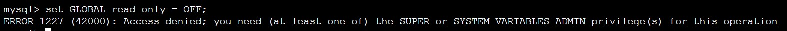

<br>

10. Desde la opción "Network Interfaces" (en el servicio EC2) validamos que se ha generado una segunda ENI. Hacemos ping a la URL de la instancia "Read Replica" con el objetivo de obtener la IP Privada (si el security group se encuentra abierto para ICMP, no es posible obtener un resultado éxitoso para ping. Es un atributo de los RDS). Buscamos la IP Privada en la sección de ENI.

<br>

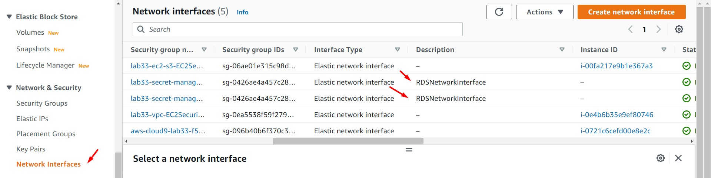

<br>

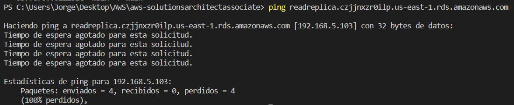

<br>

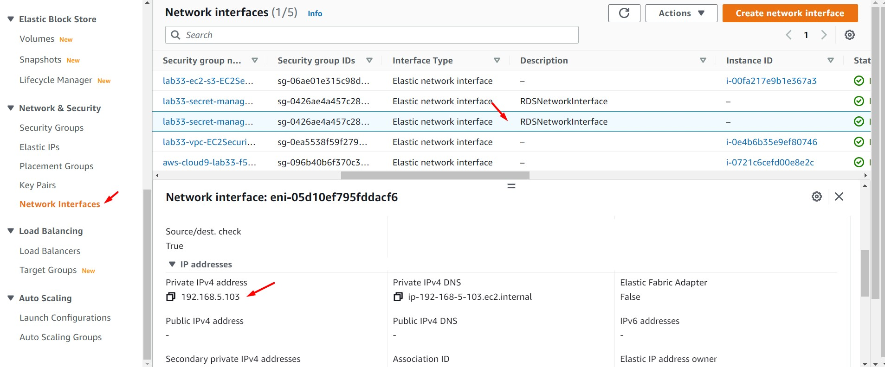

<br>

