# AWS Solutions Architect Associate - Laboratorio 35

 

### Objetivo: 
*  Configuración y análisis de la propiedad "Multi-AZ" en la instancia de RDS.

### Tópico:
* Database

### Dependencias:
* Implementación del Laboratorio 33
* Implementación del Laboratorio 34

 

---

### A - Configuración y análisis de la propiedad "Multi-AZ" en la instancia de RDS.

 

1. Desde el servicio EC2 accedemos a la opción "Network Interfaces". Validaremos que tenemos dos tarjetas de red ENI (Ver columna "Description" el valor de "RDSNetworkInterface"). Una corresponde a la instancia master RDS y otra a la instancia "Read Replica".

 

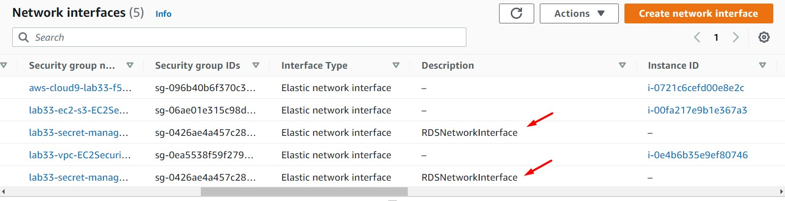

 

2. Accedemos al servicio de RDS, luego accedemos a nuestra instancia de db, damos clic en la opción "Modify". Nos dirigimos a la opción "Availability & durability" y damos clic en la opción "Create a standby instance (recommended for production usage)". Aplicamos los cambios a través de "Apply immediately". Dar clic en "Modify DB Instance"

 

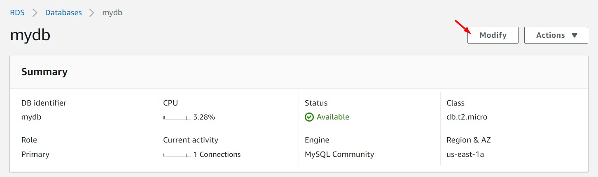

 

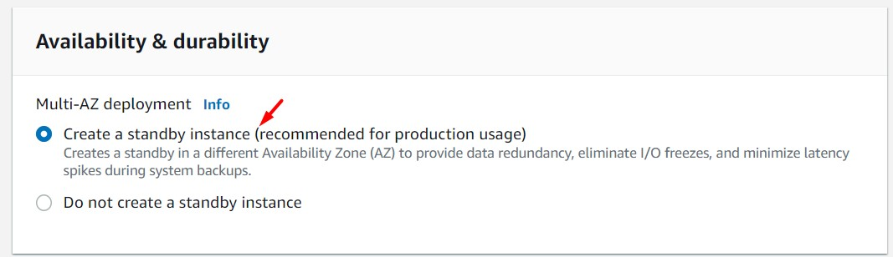

 

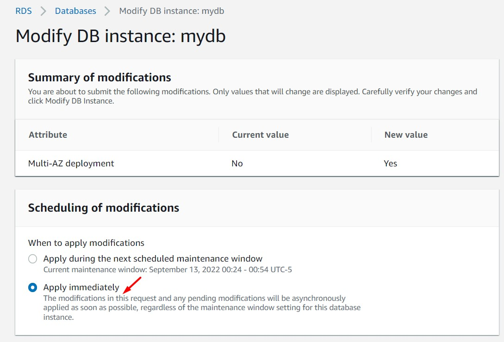

 

3. Esperamos unos minutos mientras la instancia de base de datos se aprovisiona con los nuevos cambios.

 

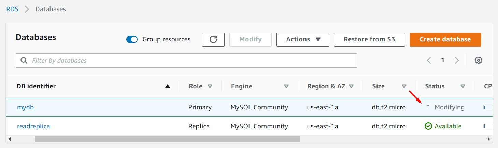

 

4. Cuando el aprovisionamiento de la nueva instancia haya finalizado y el estado de la misma sea "Available". Ingresamos al "DB identifier: mydb" y analizamos la sección "Configuration". El campo "Multi-AZ" tendrá por valor "Yes". Desde la opción "Connectivity & security" obtenemos el valor "Endpoint". Resaltamos los siguientes campos:

    * Public accessibility: No
    * Subnet group: rds-subnet-group

 

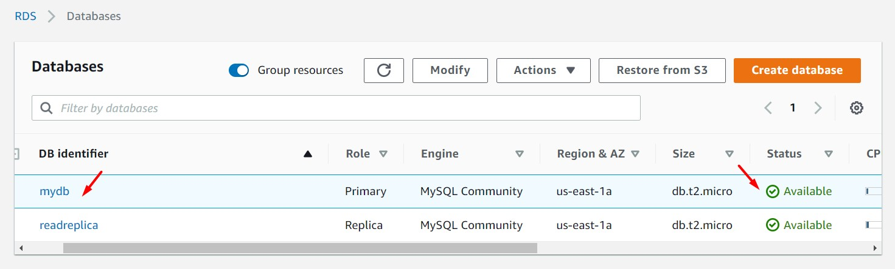

 

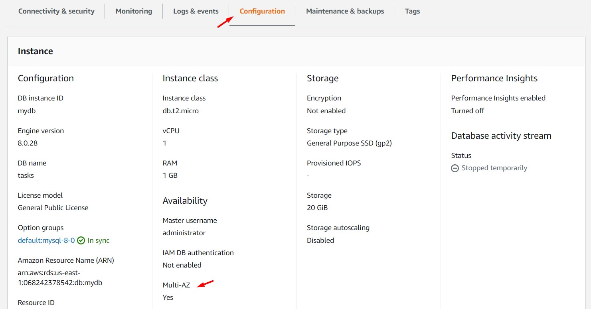

 

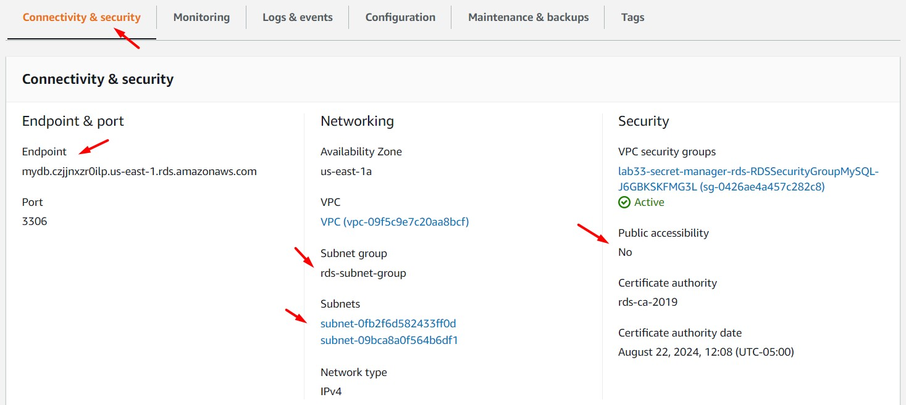

 

5. Desde la opción "Network Interfaces" (en el servicio EC2) validamos que se ha generado una tercera ENI. Por el momento (y para este caso) tenemos las siguientes IPs (obtenemos estos valores a través de un "ping" a las URLs "mydb" y "readreplica"):

    * 192.168.5.28 --> Corresponde a "mydb" modo MASTER
    * 192.168.5.103 --> Corresponde a "readreplica"
    * 192.168.6.89 --> Corresponde a "mydb" modo STANDBY "multi-az" (Se obtiene por descarte, no por ping)

 

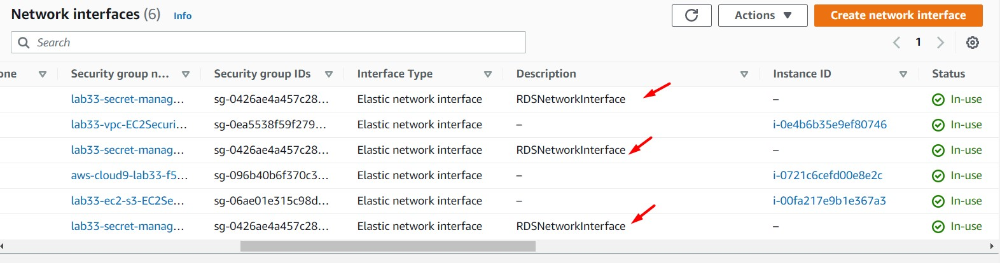

 

6. Con el objetivo de evidenciar el "multi-az" modificaremos el tamaño de nuestra instancia de base de datos "mydb". En nuestra configuración actual tenemos (sin contar el "readreplica") 02 instancias de base de datos (db.t2.micro) uno en modo "MASTER" y otro en modo "STANDBY". Al modificar el tamaño de la instancia de base de datos, RDS modificará el tamaño, primeramente de la instancia en modo "STANDBY" y luego hará una promoción de esta base de datos como "MASTER" (AWS provisionará una nueva instancia para realizar este cambio de instancia). La instancia de base de datos originalmente como "MASTER" cambiará a "STANDBY", es en este estado donde se modificará el tamaño de la instancia (AWS provisionará una nueva instancia para realizar este cambio de instancia)

 

7. Ingresamos al servicio de RDS, luego a la instancia "mydb" y damos clic en el botón "Modify". Nos dirigimos a la sección "Instance configuration" y seleccionamos el tipo "db.t2.medium". Damos clic en el botón "Continue". Seleccionamos la opción "Apply immediately" y damos clic en el botón "Modify DB Instances". Validamos que cambia el estado de nuestra instancia.

 

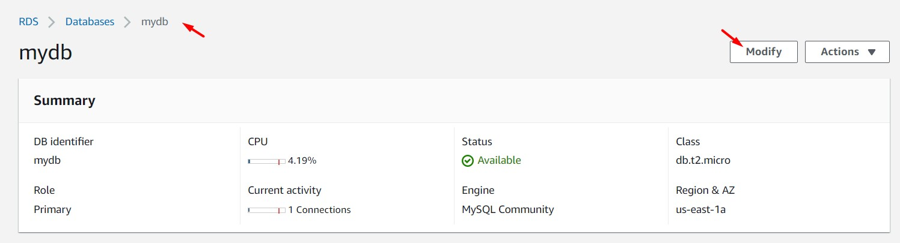

 

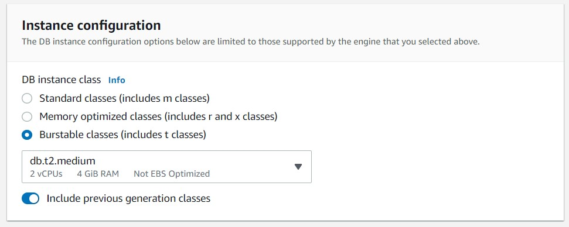

 

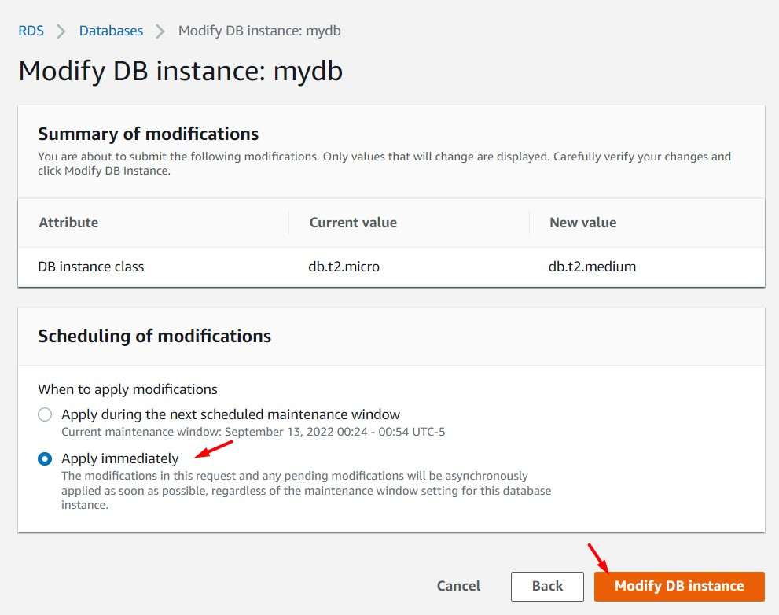

 

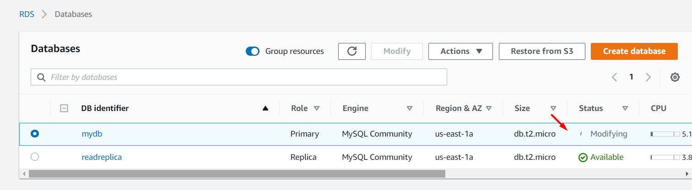

 

8. Desde la opción "Network Interfaces" (en el servicio EC2) validamos que se ha generado una cuarta ENI y hasta una quinta ENI (a ser usado internamente por AWS para el cambio de tamaño de instancia), en este lapso de tiempo se han generado dos nuevos IPs: 192.168.6.232 y 192.168.5.81. Finalizado el upgrade al nuevo tamaño de la instancia las IPS se mantienen: l

    * 192.168.5.28 --> Corresponde a "mydb" modo STANDBY "multi-az" (Antigua instancia "MASTER")
    * 192.168.6.89 --> Corresponde a "mydb" modo MASTER (Antigua instancia "STANDBY")
    * 192.168.5.103 --> Corresponde a "readreplica"

 

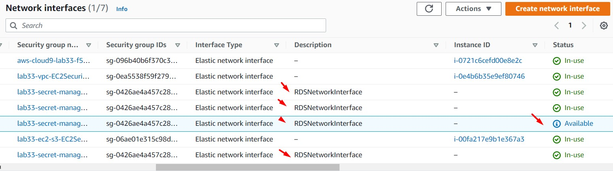

 

9. Hacemos ping a la URL de la instancia de base de datos, antes y después del cambio de tamaño de instancia. Validamos que antes del cambio de tamaño de instancia, la URL resolvía la IP "192.168.5.28". Después del cambio de tamaño de instancia, la misma URL resuelve la IP "192.168.6.232". Hacemos ping a la URL de la instancia "mydb" con el objetivo de obtener la IP Privada (si el security group se encuentra abierto para ICMP, no es posible obtener un resultado éxitoso para ping. Es un atributo de los RDS). 

 

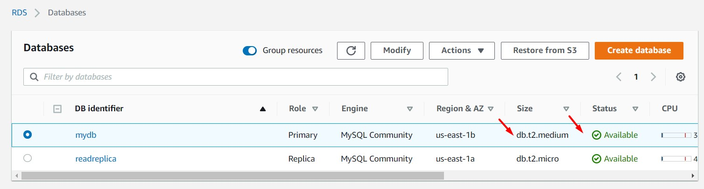

 

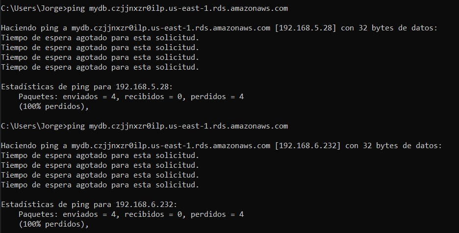

 
