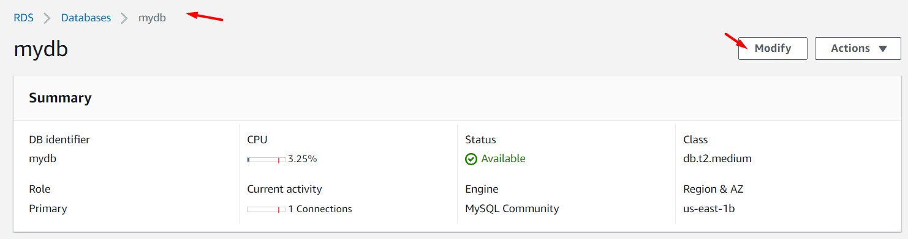
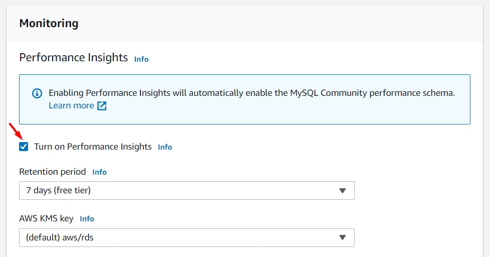
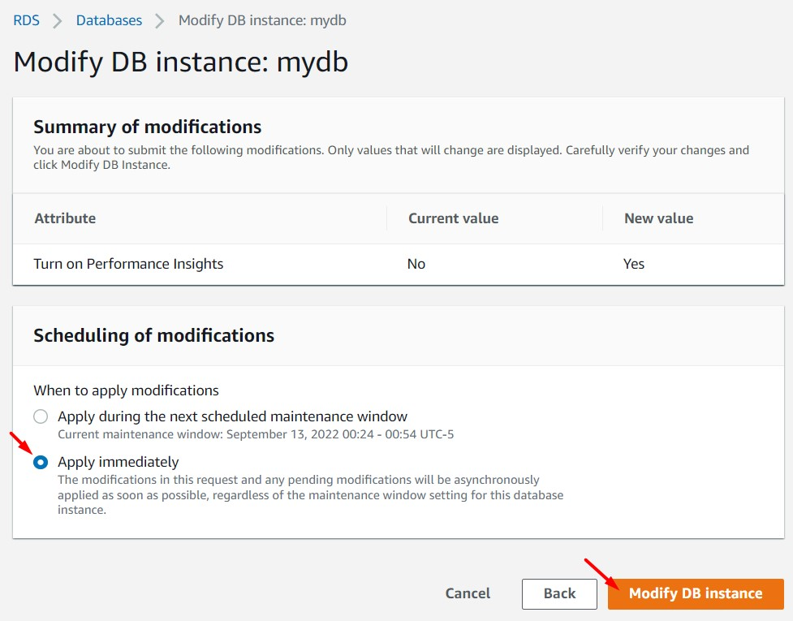
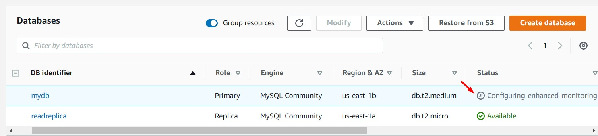
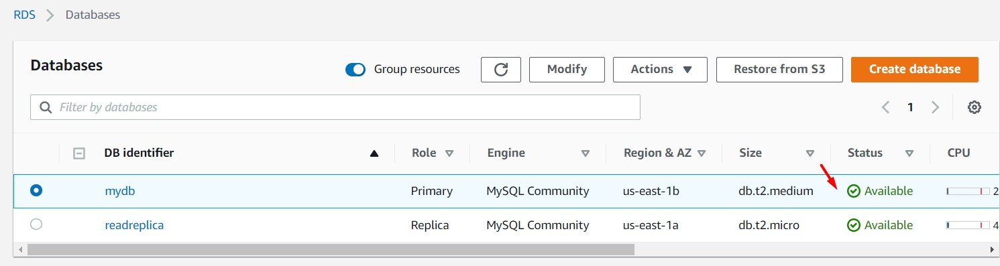
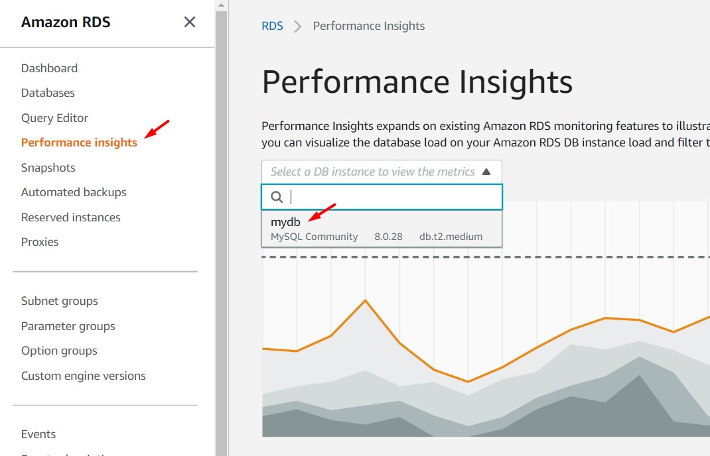
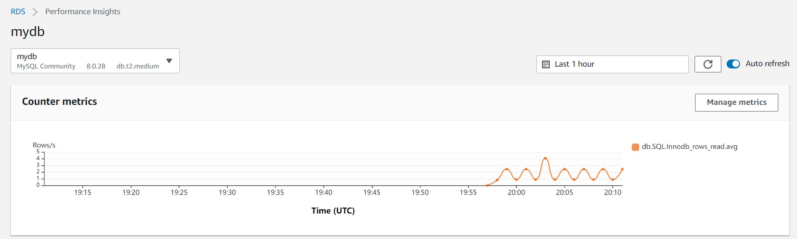

# AWS Solutions Architect Associate - Laboratorio 36

 

### Objetivo: 
*  Configuración de "Performance Insights" en la instancia de RDS.

### Tópico:
* Database

### Dependencias:
* Implementación del Laboratorio 33
* Implementación del Laboratorio 34
* Implementación del Laboratorio 35

 

---

### A - Configuración de “Performance Insigth” en la instancia de RDS.

 

1. Ingresamos al servicio RDS, luego ingresamos a nuestra instancia "mydb" y damos clic en el botón "Modify". Nos dirigimos a la sección "Monitoring" y damos clic en la opción "Turn on Performance Insights". Damos clic en el botón "Continue", seleccionamos la opción "Apply immediately" y damos clic en el botón "Modify DB Instance". 

 

 

 

 

 

 

2. Ingresamos a la opción "Performance insights" y seleccionamos la opción "mydb" en el campo "Select a DB instance to view the metrics". Se cargará un dashboard con valores referentes a métricas internas de la instancia de base de datos. Las sección de este dashboard son:

    * Counter metrics
    * Database load
    * Top
        * Top Waits
        * Top SQL
        * Top hosts
        * Top users
        * Top databases

 

 

 

3. La función de "Información sobre rendimiento" ("Performance insights") de Amazon RDS es una característica de ajuste y monitoreo del rendimiento de las bases de datos que ayuda a evaluar rápidamente la carga de las bases de datos y determinar cuándo y dónde tomar las medidas oportunas. La característica de "Información sobre rendimiento" ("Performance insights") permite a los usuarios que no son expertos detectar problemas de rendimiento mediante un panel intuitivo que muestra la carga de la base de datos. Esta opción utiliza métodos de recopilación de datos ligeros que no afectan el rendimiento de las aplicaciones. 