# AWS Solutions Architect Associate - Laboratorio 37

<br>

### Objetivo: 
*  Instalación del "Agente Unificado CloudWatch" (Memoria, Espacio en disco y Logs) a través de "System Manager - Parameter Store" y "Run Command"

### Tópico:
* Management & Governance

### Dependencias:
* Ninguno

<br>


---

### A - Instalación del "Agente Unificado CloudWatch" (Memoria, Espacio en disco y Logs) a través de "System Manager - Parameter Store" y "Run Command"

<br>

1. Accedemos al servicio "System Manager - Parameter Store". Dar clic en "Create Parameter". 

<br>

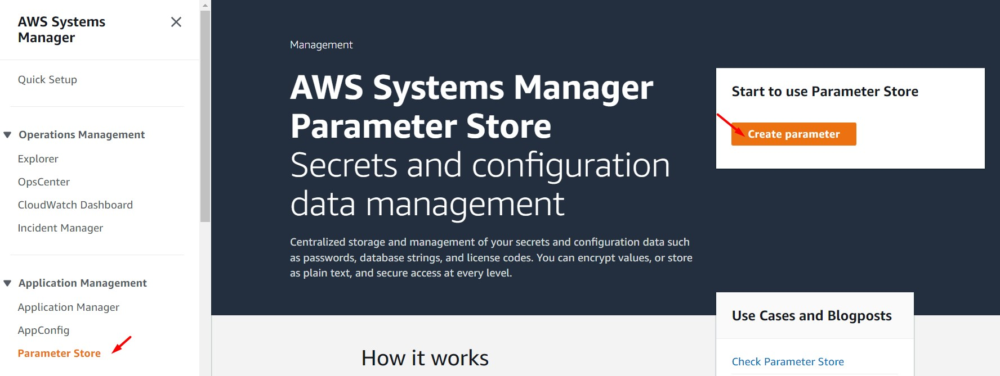

<br>

2. Ingresar y/o seleccionar los siguientes valores. Luego dar clic en el botón "Create parameter".

    * Name: AmazonCloudWatch-linux
    * Description: Amazon CloudWatch configuration
    * Tier: Standard
    * Type: String
    * Data Type: Text
    * Value: "Ingresar el siguiente JSON"

<br>

```bash
{
	"agent": {
		"metrics_collection_interval": 60,
		"run_as_user": "root"
	},
	"logs": {
		"logs_collected": {
			"files": {
				"collect_list": [
					{
						"file_path": "/var/log/apache2/access.log",
						"log_group_name": "apache2",
						"log_stream_name": "{instance_id}"
					}
				]
			}
		}
	},
	"metrics": {
		"append_dimensions": {
			"AutoScalingGroupName": "${aws:AutoScalingGroupName}",
			"ImageId": "${aws:ImageId}",
			"InstanceId": "${aws:InstanceId}",
			"InstanceType": "${aws:InstanceType}"
		},
		"metrics_collected": {
			"collectd": {
				"metrics_aggregation_interval": 60
			},
			"disk": {
				"measurement": [
					"used_percent"
				],
				"metrics_collection_interval": 60,
				"resources": [
					"*"
				]
			},
			"mem": {
				"measurement": [
					"mem_used_percent"
				],
				"metrics_collection_interval": 60
			},
			"statsd": {
				"metrics_aggregation_interval": 60,
				"metrics_collection_interval": 10,
				"service_address": ":8125"
			}
		}
	}
}
```


<br>

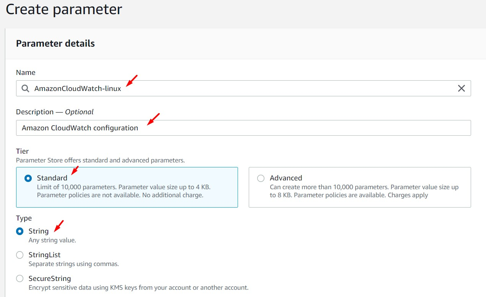

<br>

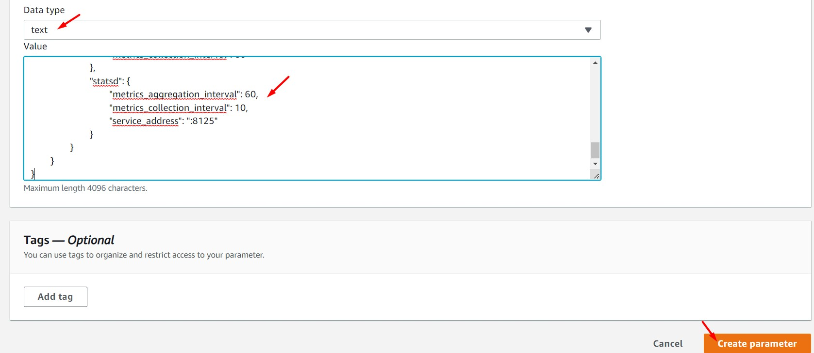

<br>

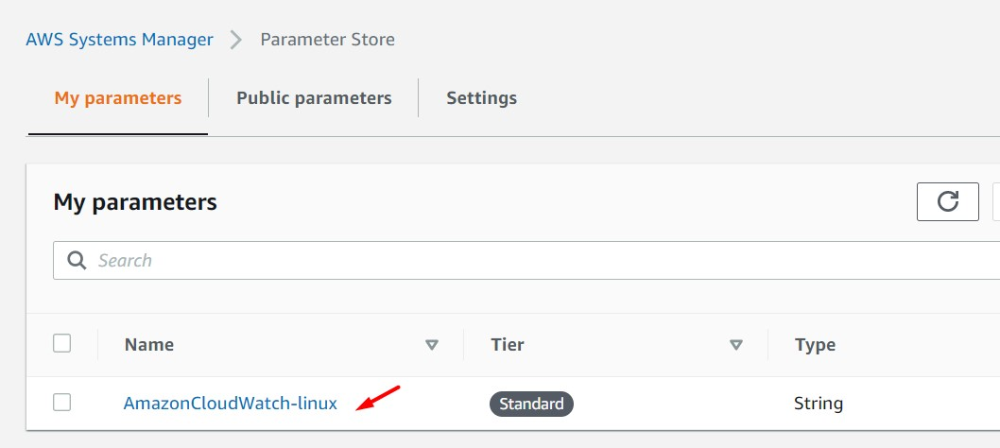

<br>

3. Acceder al servicio AWS Cloud9 y generar un nuevo (o encender nuestro) ambiente de trabajo (Ubuntu 18.04 LTS)

<br>

4. Ejecutar los siguinentes comandos en nuestro Cloud9

```bash
#Ubuntu 18.04
sudo apt-get update
git clone https://github.com/jbarreto7991/aws-solutionsarchitectassociate.git
```

<br>

5. Acceder al laboratorio 37 (Lab-37), carpeta "code". Validar que se cuenta con la plantilla de cloudformation "1_lab37_cloudwatch-agent".

<br>

6. Desplegar la respectiva plantilla CloudFormation ejecutando AWSCLI.

<br>

7. **1_lab37_cloudwatch-agent** Esta plantilla contiene los siguientes parámetros de despliegue: KeyPair, SubnetID y VPCID. Reemplazar estos valores en la siguiente línea de comando. Será válido usar la consola de AWS para el despliegue de esta plantilla. Esta plantilla aprovisionará una instancia EC2 con las aplicaciones "apache2" y el "Agente Unificado Cloudwatch" (agente instalado desde "System Manager - Parameter Store")

```bash
aws cloudformation create-stack --stack-name lab37-cloudwatch-agent --template-body file://~/environment/aws-solutionsarchitectassociate/Lab-37/code/1_lab37-cloudwatch-agent.yaml --parameters ParameterKey=KeyPair,ParameterValue="aws-solutionsarchitectassociate" ParameterKey=Subnet,ParameterValue="subnet-43d4a125" ParameterKey=Vpc,ParameterValue="vpc-dd59d8a0" --capabilities CAPABILITY_NAMED_IAM
```

<br>

8. Ingresar al servicio "System Manager - Run Command", dar clic en el botón "Run Command". Buscar la opción "AWS-RunShellScript" y seleccionarla. 

<br>

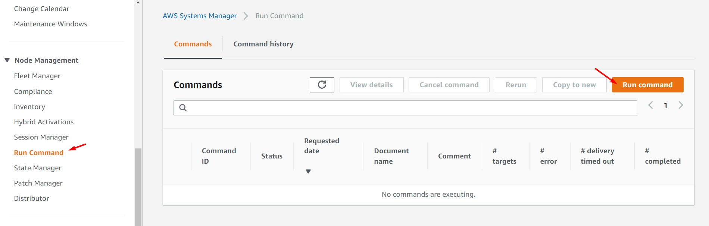

<br>

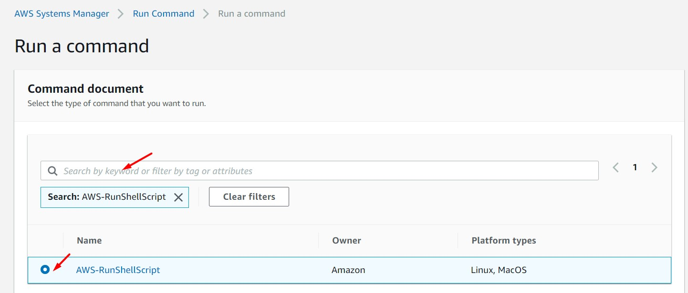

<br>

9. En la sección "Commands" de esa misma ventana, agregar el siguiente comando:

```bash
service amazon-cloudwatch-agent status
```

<br>

10. En la sección "Targets" seleccionar la opción "Choose instance manually" y seleccionar la instancia de nombre "EC2 CloudWatch".

<br>

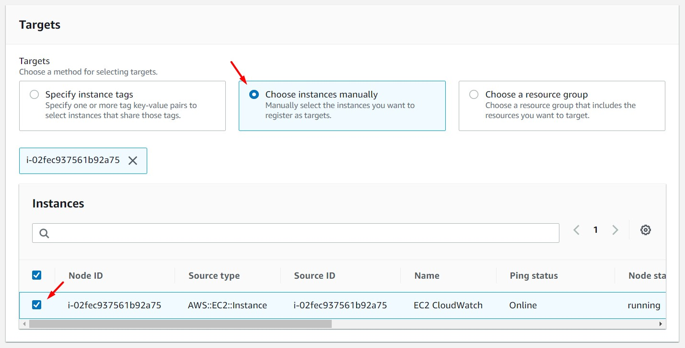

<br>

11. En la sección "Output options" deshabilitar la opción "Enable an S3 bucket". Dar clic en el botón "Run". Validar que el status después de unos segundos es "Failed" y se obtiene el siguiente resultado:

```bash
● amazon-cloudwatch-agent.service - Amazon CloudWatch Agent
Loaded: loaded (/etc/systemd/system/amazon-cloudwatch-agent.service; disabled; vendor preset: enabled)
Active: inactive (dead)
```

<br>


<br>

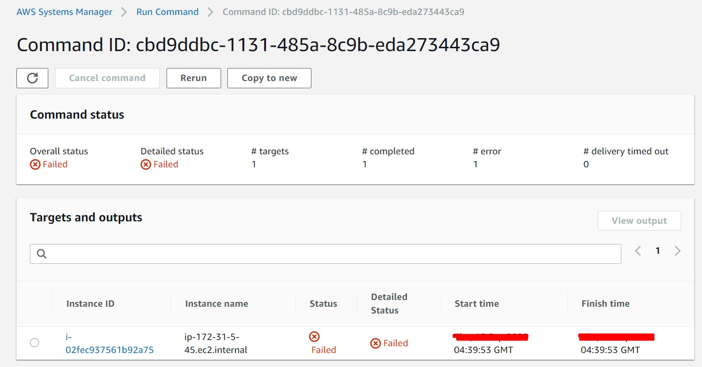

<br>


<br>

12.  Repetir los pasos 8, 9, 10 y 11 para los siguientes comandos. Validar que el estado final del comando es "Success"

```bash
#Primer Comando
sudo /opt/aws/amazon-cloudwatch-agent/bin/amazon-cloudwatch-agent-ctl -a fetch-config -m ec2 -c ssm:AmazonCloudWatch-linux -s

#Segundo Comando
sudo /opt/aws/amazon-cloudwatch-agent/bin/amazon-cloudwatch-agent-ctl -m ec2 -a start
service amazon-cloudwatch-agent status
```
<br>

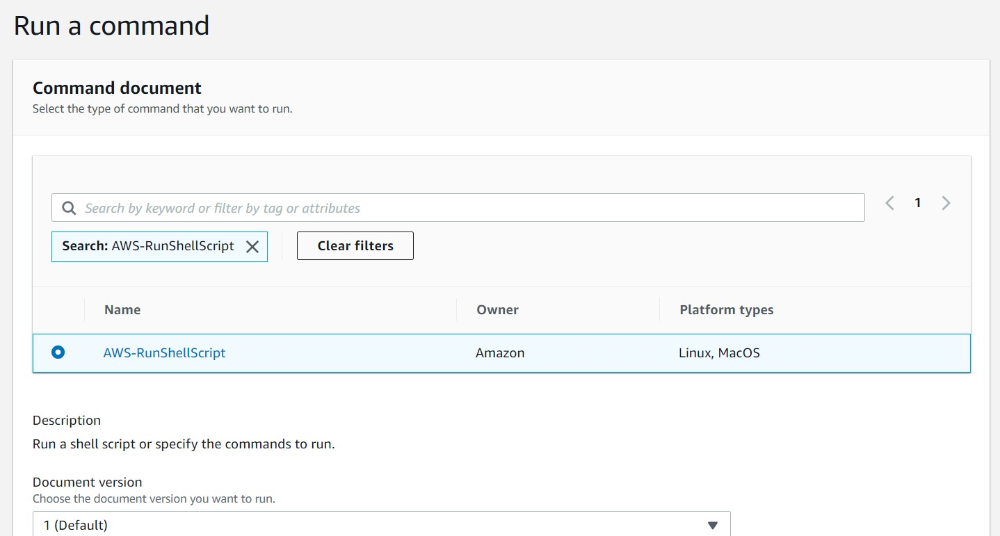

<br>

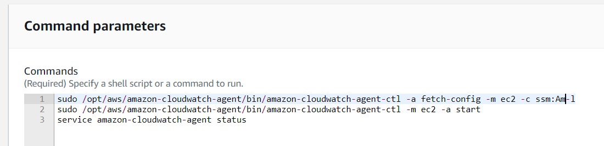

<br>

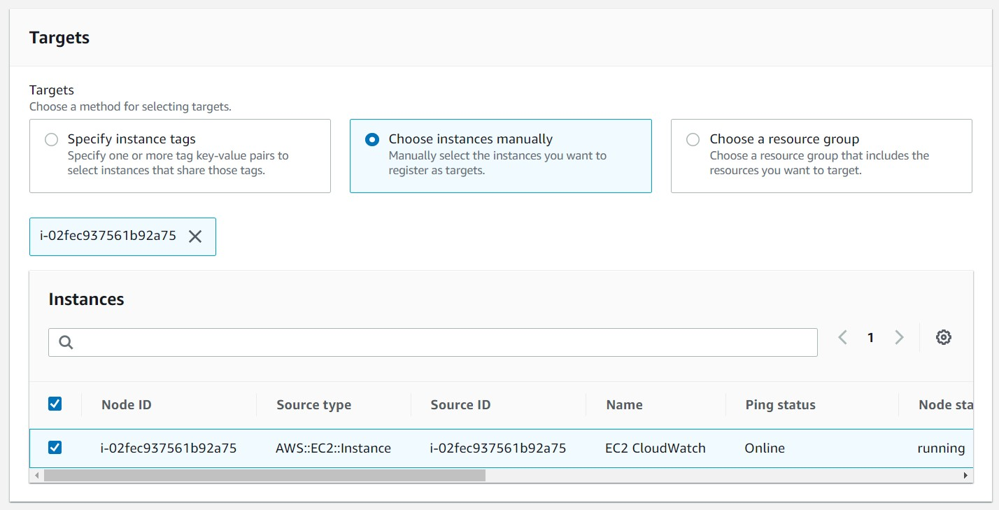

<br>

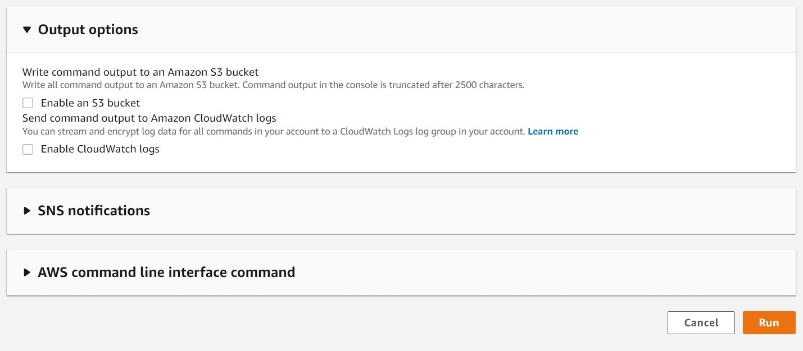

<br>

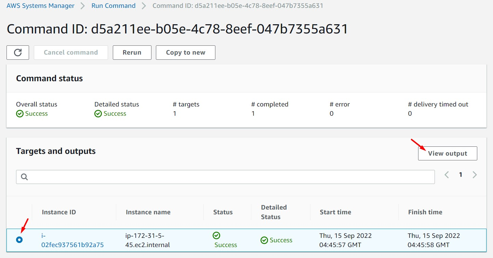

<br>


13. Seleccionamos el registro y damos clic en la opción "Output". Obtenemos el siguiente mensaje. El mensaje indica que el "Agente Unificado" CloudWatch ha sido encendido correctamente desde "System Manager - Paramater Store"

<br>

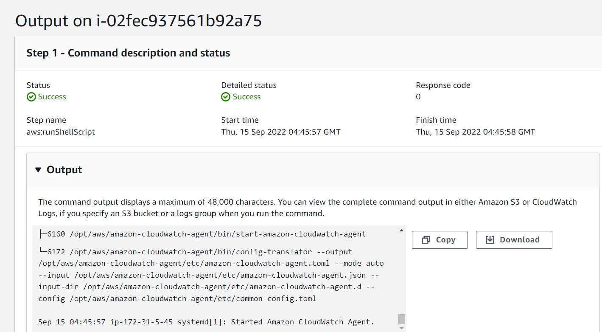

<br>

```bash
****** processing amazon-cloudwatch-agent ******
/opt/aws/amazon-cloudwatch-agent/bin/config-downloader --output-dir /opt/aws/amazon-cloudwatch-agent/etc/amazon-cloudwatch-agent.d --download-source ssm:Am-linux --mode ec2 --config /opt/aws/amazon-cloudwatch-agent/etc/common-config.toml --multi-config default
I! Trying to detect region from ec2
D! [EC2] Found active network interface
Region: us-east-1
credsConfig: map[]
Error in retrieving parameter store content: AccessDeniedException: User: arn:aws:sts::068242378542:assumed-role/lab37-cloudwatch-agent-BackendIAMRoleEC2-1OCP5AUPVRZ0W/i-02fec937561b92a75 is not authorized to perform: ssm:GetParameter on resource: arn:aws:ssm:us-east-1:068242378542:parameter/Am-linux because no identity-based policy allows the ssm:GetParameter action
	status code: 400, request id: 6215bce2-4968-4763-8443-e7f3de98bb7e
E! Fail to fetch/remove json config: AccessDeniedException: User: arn:aws:sts::068242378542:assumed-role/lab37-cloudwatch-agent-BackendIAMRoleEC2-1OCP5AUPVRZ0W/i-02fec937561b92a75 is not authorized to perform: ssm:GetParameter on resource: arn:aws:ssm:us-east-1:068242378542:parameter/Am-linux because no identity-based policy allows the ssm:GetParameter action
	status code: 400, request id: 6215bce2-4968-4763-8443-e7f3de98bb7e
Fail to fetch the config!
****** processing cwagent-otel-collector ******
cwagent-otel-collector will not be started as it has not been configured yet.

****** processing amazon-cloudwatch-agent ******
Both amazon-cloudwatch-agent and cwagent-otel-collector are not configured. Applying amazon-cloudwatch-agent default configuration.
/opt/aws/amazon-cloudwatch-agent/bin/config-downloader --output-dir /opt/aws/amazon-cloudwatch-agent/etc/amazon-cloudwatch-agent.d --download-source default --mode ec2 --config /opt/aws/amazon-cloudwatch-agent/etc/common-config.toml --multi-config default
I! Trying to detect region from ec2
D! [EC2] Found active network interface
Successfully fetched the config and saved in /opt/aws/amazon-cloudwatch-agent/etc/amazon-cloudwatch-agent.d/default.tmp
Start configuration validation...
/opt/aws/amazon-cloudwatch-agent/bin/config-translator --input /opt/aws/amazon-cloudwatch-agent/etc/amazon-cloudwatch-agent.json --input-dir /opt/aws/amazon-cloudwatch-agent/etc/amazon-cloudwatch-agent.d --output /opt/aws/amazon-cloudwatch-agent/etc/amazon-cloudwatch-agent.toml --mode ec2 --config /opt/aws/amazon-cloudwatch-agent/etc/common-config.toml --multi-config default
I! Detecting run_as_user...
I! Trying to detect region from ec2
D! [EC2] Found active network interface
No csm configuration found.
No log configuration found.
Configuration validation first phase succeeded
/opt/aws/amazon-cloudwatch-agent/bin/amazon-cloudwatch-agent -schematest -config /opt/aws/amazon-cloudwatch-agent/etc/amazon-cloudwatch-agent.toml
Configuration validation second phase succeeded
Configuration validation succeeded
● amazon-cloudwatch-agent.service - Amazon CloudWatch Agent
   Loaded: loaded (/etc/systemd/system/amazon-cloudwatch-agent.service; enabled; vendor preset: enabled)
   Active: active (running) since Thu 2022-09-15 04:45:57 UTC; 44ms ago
 Main PID: 6160 (start-amazon-cl)
    Tasks: 6 (limit: 1140)
   CGroup: /system.slice/amazon-cloudwatch-agent.service
           ├─6160 /opt/aws/amazon-cloudwatch-agent/bin/start-amazon-cloudwatch-agent
           └─6172 /opt/aws/amazon-cloudwatch-agent/bin/config-translator --output /opt/aws/amazon-cloudwatch-agent/etc/amazon-cloudwatch-agent.toml --mode auto --input /opt/aws/amazon-cloudwatch-agent/etc/amazon-cloudwatch-agent.json --input-dir /opt/aws/amazon-cloudwatch-agent/etc/amazon-cloudwatch-agent.d --config /opt/aws/amazon-cloudwatch-agent/etc/common-config.toml

Sep 15 04:45:57 ip-172-31-5-45 systemd[1]: Started Amazon CloudWatch Agent.
```

<br>

14. Ingresar a la instancia EC2 a través de "System Manager - Session Manager" y ejecutar el siguiente comando:

```bash
sudo service amazon-cloudwatch-agent status
```
<br>

15. Validar que se muestre el siguiente mensaje. Validamos, tal como se observo en el paso 13, que el "Agente Unificado CloudWatch" se encuentra activo.

<br>

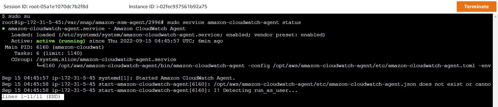

<br>

```bash
# service amazon-cloudwatch-agent status
● amazon-cloudwatch-agent.service - Amazon CloudWatch Agent
   Loaded: loaded (/etc/systemd/system/amazon-cloudwatch-agent.service; enabled; vendor preset: enabled)
   Active: active (running) since Sun 2021-09-05 22:11:39 UTC; 41s ago
 Main PID: 6173 (amazon-cloudwat)
    Tasks: 6 (limit: 1140)
   CGroup: /system.slice/amazon-cloudwatch-agent.service
           └─6173 /opt/aws/amazon-cloudwatch-agent/bin/amazon-cloudwatch-agent -config /opt/aws/amazon-cloudwatch-agent/etc/amazon-cloudwatch-agent.t

Sep 05 22:11:39 ip-172-31-81-220 systemd[1]: Started Amazon CloudWatch Agent.
Sep 05 22:11:39 ip-172-31-81-220 start-amazon-cloudwatch-agent[6173]: /opt/aws/amazon-cloudwatch-agent/etc/amazon-cloudwatch-agent.json does not exis
Sep 05 22:11:39 ip-172-31-81-220 start-amazon-cloudwatch-agent[6173]: Valid Json input schema.
Sep 05 22:11:39 ip-172-31-81-220 start-amazon-cloudwatch-agent[6173]: I! Detecting run_as_user...
```

<br>

16. Ir al servicio "CloudWatch - All Mectrics". Validar que se haya generado la métrica personaliza "CWAgent". Esta métrica contendrá, las métricas de memoria y espacio en disco. Analizar cada resultado.

<br>

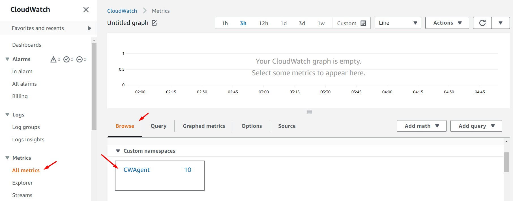

<br>


<br>

17. Desde la instancia "EC2 CloudWatch" ejecutar el siguiente comando:

```bash
tail -f /var/log/apache2/access.log
```

<br>

18. A través del navegador web, consumir la ip pública de la instancia "EC2 CloudWatch" varias veces con el objetivo de generar logs. Ver los resultados desde la consola de EC2,

```bash
root@ip-172-31-5-45:/var/snap/amazon-ssm-agent/2996# tail -f /var/log/apache2/access.log

38.25.16.154 - - [XX/XX/XXXX:04:56:58 +0000] "GET / HTTP/1.1" 200 3477 "-" "Mozilla/5.0 (Windows NT 10.0; Win64; x64) AppleWebKit/537.36 (KHTML, like Gecko) Chrome/105.0.0.0 Safari/537.36"
38.25.16.154 - - [XX/XX/XXXX::04:56:59 +0000] "GET /icons/ubuntu-logo.png HTTP/1.1" 200 3623 "http://34.205.37.32/" "Mozilla/5.0 (Windows NT 10.0; Win64; x64) AppleWebKit/537.36 (KHTML, like Gecko) Chrome/105.0.0.0 Safari/537.36"
38.25.16.154 - - [XX/XX/XXXX::04:56:59 +0000] "GET /favicon.ico HTTP/1.1" 404 490 "http://34.205.37.32/" "Mozilla/5.0 (Windows NT 10.0; Win64; x64) AppleWebKit/537.36 (KHTML, like Gecko) Chrome/105.0.0.0 Safari/537.36"
38.25.16.154 - - [XX/XX/XXXX::04:57:01 +0000] "GET / HTTP/1.1" 200 3476 "-" "Mozilla/5.0 (Windows NT 10.0; Win64; x64) AppleWebKit/537.36 (KHTML, like Gecko) Chrome/105.0.0.0 Safari/537.36"
38.25.16.154 - - [15/Sep/2022:04:57:03 +0000] "GET / HTTP/1.1" 200 3476 "-" "Mozilla/5.0 (Windows NT 10.0; Win64; x64) AppleWebKit/537.36 (KHTML, like Gecko) Chrome/105.0.0.0 Safari/537.36"
38.25.16.154 - - [15/Sep/2022:04:57:50 +0000] "-" 408 0 "-" "-"
```
<br>

19. Ir al servicio "CloudWatch - Log Groups". Validar que se ha generado el log group "apache2". Ingresar al "Log Stream: apache2". Analizar el resultado.

<br>

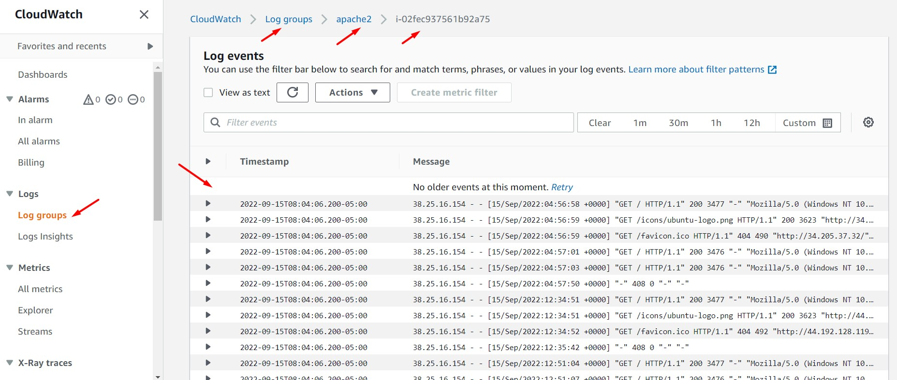

<br>

20. Si no se visualiza las métricas personalizadas de memoria o espacio en disco en "CloudWatch Metrics" o no se visualizan los logs de apache2 en "CloudWatch Logs" reiniciar el servicio del agente a través de los siguientes comandos:

```bash
#Stop Services
sudo /opt/aws/amazon-cloudwatch-agent/bin/amazon-cloudwatch-agent-ctl -m ec2 -a stop

#Obtain file configure
sudo /opt/aws/amazon-cloudwatch-agent/bin/amazon-cloudwatch-agent-ctl -a fetch-config -m ec2 -c ssm:AmazonCloudWatch-linux -s

#Start Services
sudo /opt/aws/amazon-cloudwatch-agent/bin/amazon-cloudwatch-agent-ctl -m ec2 -a start

#Agent Services Status 
service amazon-cloudwatch-agent status
```
<br>

21. El "Agente Unificado CloudWatch" en la carpeta /opt/aws/amazon-cloudwatch-agent/logs/ cuenta con un archivo log. De tener problemas aún, consultar este log.

```bash
tail -f /opt/aws/amazon-cloudwatch-agent/logs/amazon-cloudwatch-agent.log
```

<br>

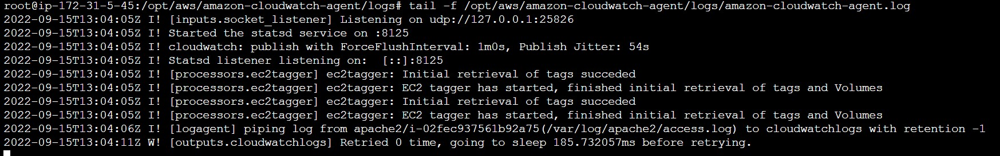

<br>

---

### Eliminación de recursos

<br>

```bash
aws cloudformation delete-stack --stack-name 1_lab37_cloudwatch-agent --region us-east-1
```