# AWS Solutions Architect Associate - Laboratorio 38

<br>

### Objetivo: 
*  Configuración de "CloudWatch Event Rules (Schedule)" y el apagado/encendido automático de instancias EC2 con Tags usando Lambdas

### Tópico:
* Management & Governance
* Compute

### Dependencias:
* Ninguno

<br>


---

### A - Configuración de "CloudWatch Event Rules (Schedule)" y el apagado/encendido automático de instancias EC2 con Tags usando Lambdas

<br>


1. Acceder al servicio AWS Cloud9 y generar un nuevo (o encender nuestro) ambiente de trabajo (Ubuntu 18.04 LTS)

<br>

2. Ejecutar los siguinentes comandos en nuestro Cloud9

```bash
#Ubuntu 18.04
sudo apt-get update
git clone https://github.com/jbarreto7991/aws-solutionsarchitectassociate.git
```

<br>

3. Acceder al laboratorio 38 (Lab-38), carpeta "code". Validar que se cuenta con la plantilla de cloudformation "1_lab38-ec2-tags".

<br>

4. Desplegar la respectiva plantilla CloudFormation ejecutando AWSCLI.

<br>

5. **1_lab38-ec2-tags** Esta plantilla contiene los siguientes parámetros de despliegue: KeyPair, SubnetID y VPCID. Reemplazar estos valores en la siguiente línea de comando. Será válido usar la consola de AWS para el despliegue de esta plantilla. Esta plantilla aprovisionará dos instancias EC2 con el Tag "Scheduled:true".

<br>

```bash
aws cloudformation create-stack --stack-name lab38-ec2-tags --template-body file://~/environment/aws-solutionsarchitectassociate/Lab-38/code/1_lab38-ec2-tags.yaml --parameters ParameterKey=KeyPair,ParameterValue="aws-solutionsarchitectassociate" ParameterKey=Subnet,ParameterValue="subnet-43d4a125" ParameterKey=VPC,ParameterValue="vpc-dd59d8a0" --capabilities CAPABILITY_NAMED_IAM
```

<br>

6. Acceder al servicio IAM y generar la siguiente política personalizada. Esta política tendrá por nombre "lab38_ec2_start_stop"

```bash
{
  "Version": "2012-10-17",
  "Statement": [
    {
      "Effect": "Allow",
      "Action": [
        "logs:CreateLogGroup",
        "logs:CreateLogStream",
        "logs:PutLogEvents"
      ],
      "Resource": "arn:aws:logs:*:*:*"
    },
    {
      "Effect": "Allow",
      "Action": [
        "ec2:Start*",
        "ec2:Stop*",
        "ec2:DescribeInstances"
      ],
      "Resource": "*"
    }
  ]
}
```

<br>

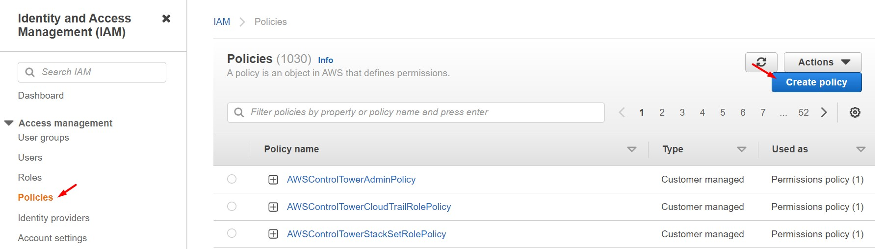

<br>


<br>

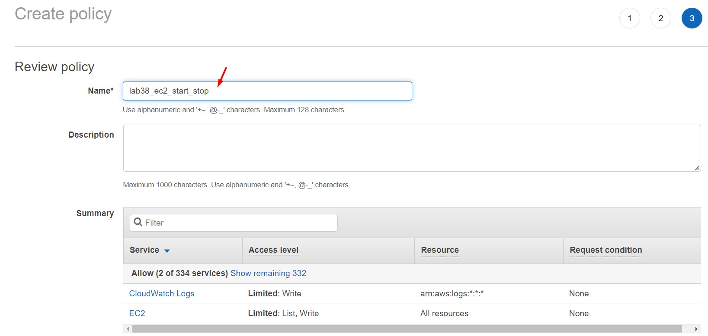

<br>


7. Desde el servicio IAM, generamos un rol para Lambda. Nos dirigimos a la sección de "Roles" y damos clic sobre el botón "Create role". Seleccionamos/ingresamos los siguientes valores. Al final, damos clic sobre el botón "Create Role"

	* Trusted entity type: AWS Service
	* Use Case: Lambda
	* Permissions policies: lab38_ec2_start_stop
	* Role name: lab38_ec2_start_stop

<br>

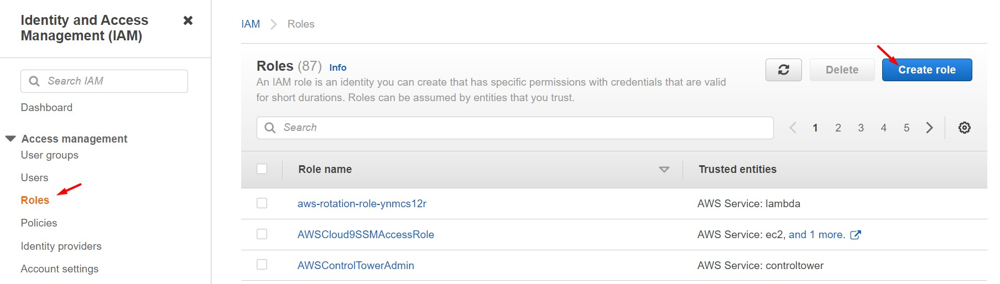

<br>

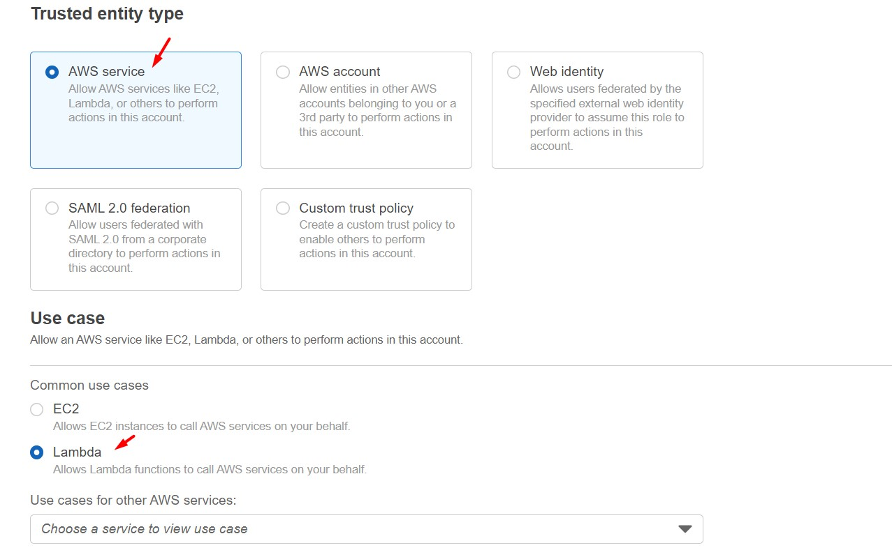

<br>

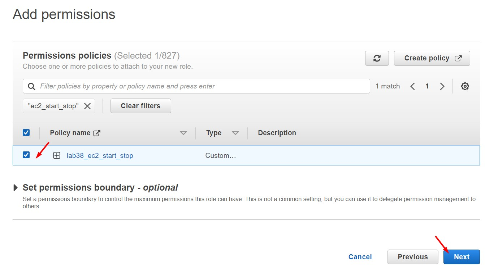

<br>

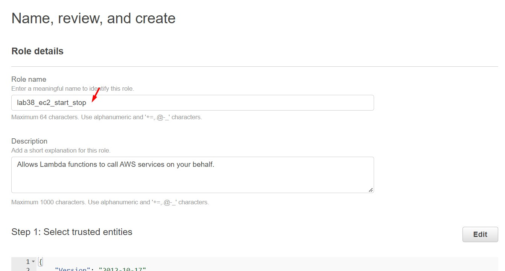

<br>


8. Ingresar al servicio "AWS Lambda". Luego dar clic en el botón "Create function". Ingresar/seleccionar los siguientes valores:

	* Choose one of the following options to create your function: Author from scratch
	* Function name: ec2_start_stop
	* Runtime: Python 3.9
	* Architecture: x86_64
	* Permissions:
		* Use an existing role: lab38_ec2_start_Stop

<br>

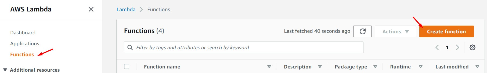

<br>

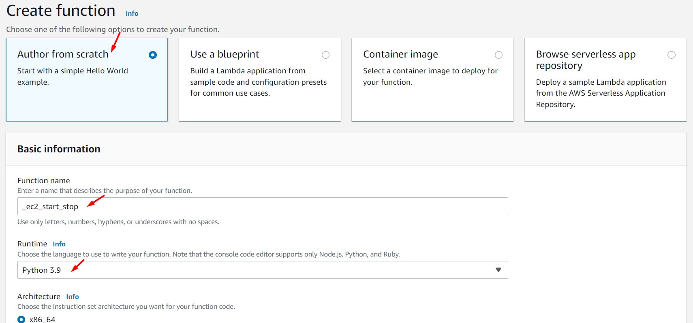

<br>

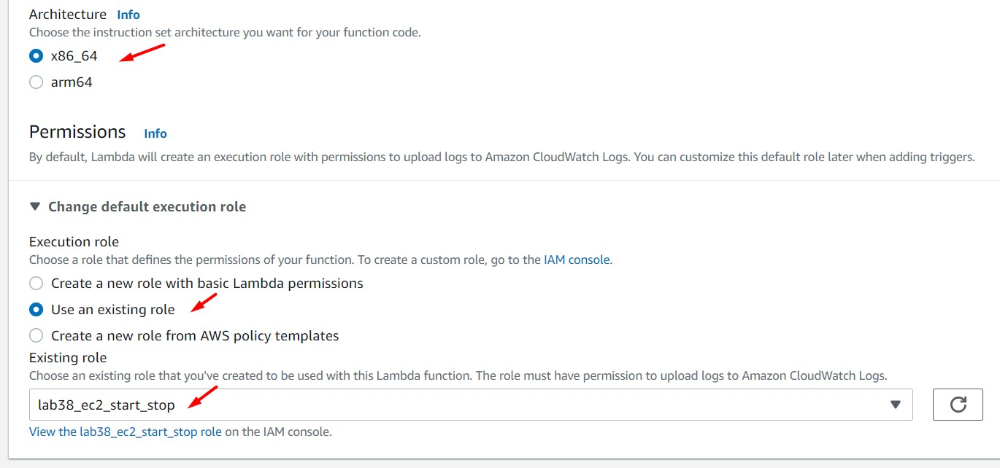

<br>

9. Dentro de la función lambda, nos dirigimos a la sección "Code" (sección seleccionada por defecto). Luego, damos doble clic sobre el archivo "lambda_function.py" y reemplazamos el código existente por el siguiente código. Una vez ingresado el código dar clic en el botón "Deploy".

```bash
import boto3
import time
from datetime import timedelta
from datetime import datetime
from datetime import date, timedelta

#define boto3 the connection
ec2 = boto3.resource('ec2')

def lambda_handler(event, context):
    
	# Get current time in format H:M
    current_time = datetime.now()
    utc = current_time - timedelta(hours=5)
    current_time_utc=utc.strftime("%H:%M")
    print (current_time_utc)

	# Find all the instances that are tagged with Scheduled:True
    filters = [{
            'Name': 'tag:Scheduled',
            'Values': ['True']
        }
    ]

	# Search all the instances which contains scheduled filter 
    instances = ec2.instances.filter(Filters=filters)

    stopInstances = []   
    startInstances = []   

	# Locate all instances that are tagged to start or stop.
    for instance in instances:
        
        for tag in instance.tags:
            if tag['Key'] == 'ScheduleStop':
                if tag['Value'] == current_time_utc:
                    stopInstances.append(instance.id)
                    pass
                pass
            if tag['Key'] == 'ScheduleStart':
                if tag['Value'] == current_time_utc:
                    startInstances.append(instance.id)
                    pass
                pass
            pass
        pass
    
    print (current_time_utc)
    
    # shut down all instances tagged to stop. 
    if len(stopInstances) > 0:
        # perform the shutdown
        stop = ec2.instances.filter(InstanceIds=stopInstances).stop()
        print (stop)
    else:
        print ("No instances to shutdown")

    # start instances tagged to stop. 
    if len(startInstances) > 0:
        # perform the start
        start = ec2.instances.filter(InstanceIds=startInstances).start()
        print (start)
    else:
        print ("No instances to start")
```

<br>

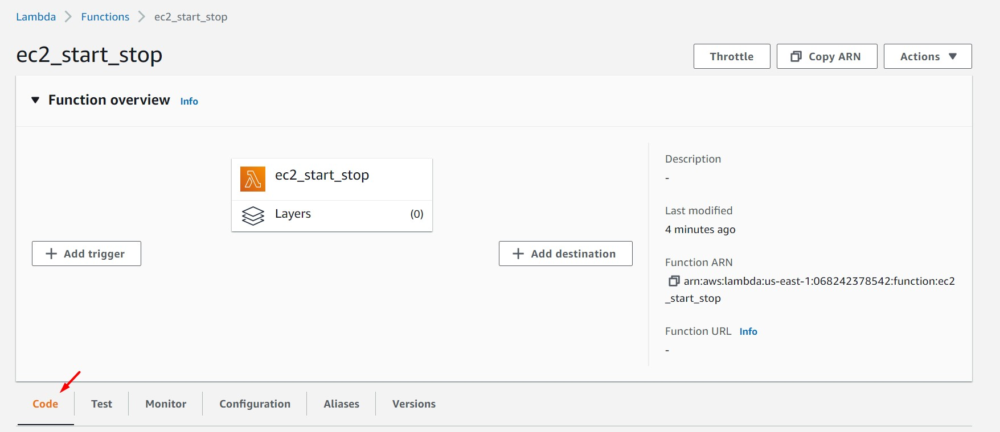

<br>

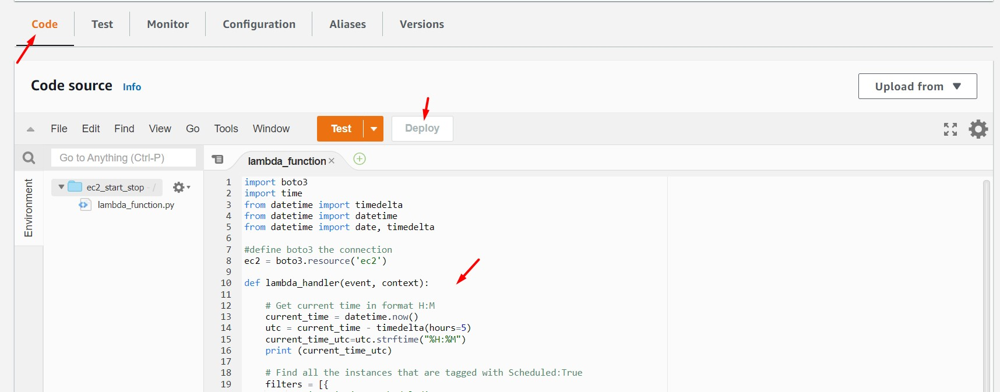

<br>


10. Agregamos los siguientes tag a las instancias "EC2 Lab38" aprovisionadas a través de la plantilla de CloudFormation. El valor "HH:MM" hace referencia a la hora en que se desea que la instancia se encienda o apague. El formato "HH" es de 24 horas.

<br>

	     Key       |  Value
	__________________________
	Scheduled      |  True (Agregado desde la plantilla de CloudFormation)
	ScheduleStart  |  HH:MM
	ScheduleStop   |  HH:MM

<br>

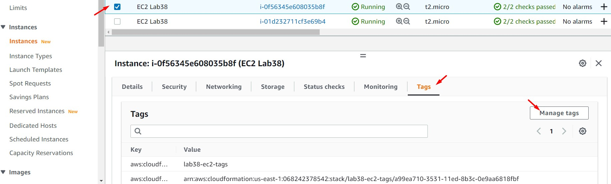

<br>

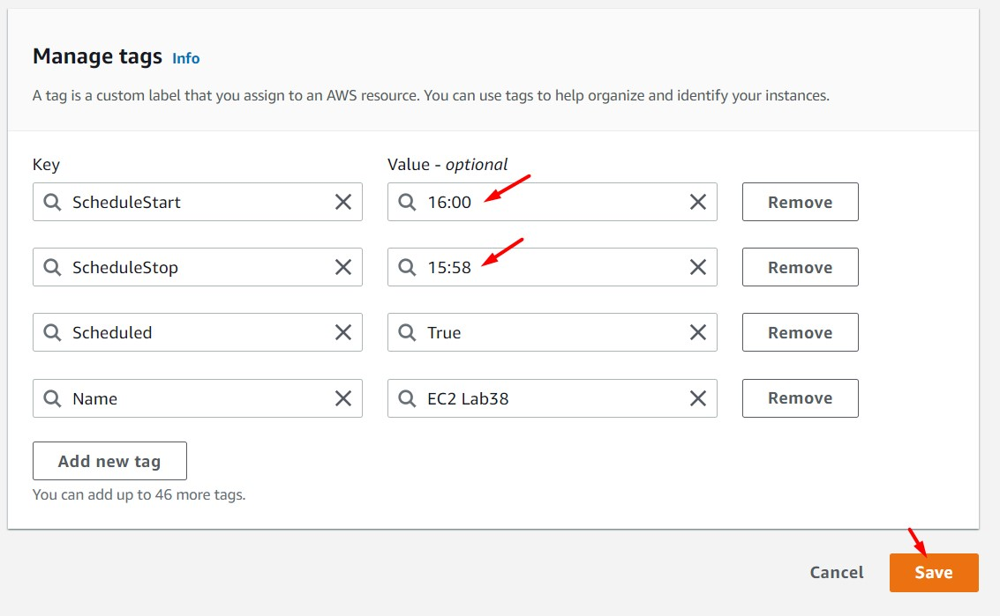

<br>

11. Ingresamos nuevamente a la función Lambda creada previamente. Damos clic sobre el botón "Test". Ingresamos/Seleccionamos los siguientes valores. Luego, ejecutaremos la función dando clic en el botón "Test". Validaremos el encendido y apagado de la instancia según hora de ejecución registrada en los Tags de las instancias EC2.

	* Event name: test
	* Event JSON: {}

<br>

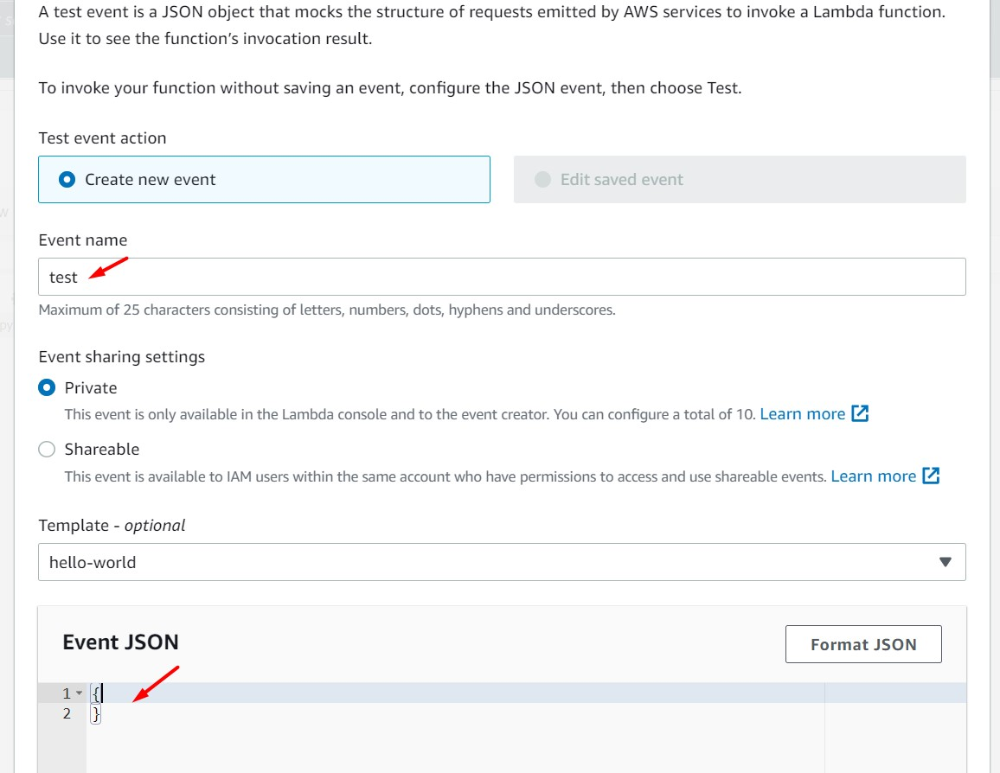

<br>

12. Si ejecutamos el Lambda antes de la hora programada en las instancias EC2 el evento de apagado no se ejecutará.

<br>

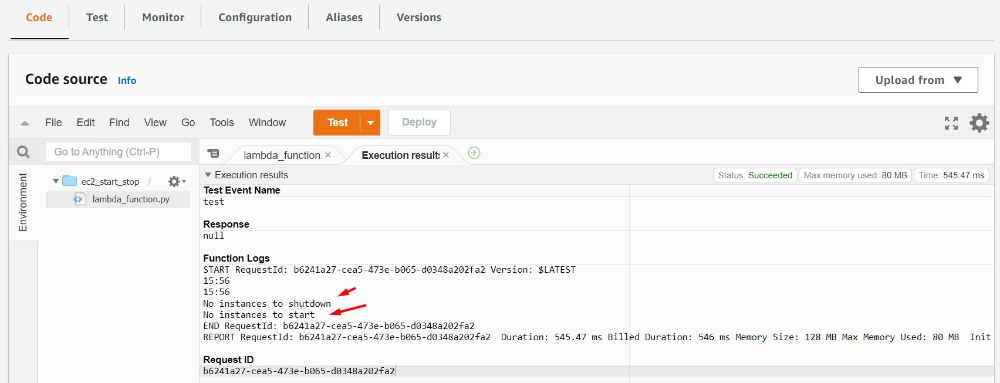

<br>

13. Si ejecutamos el Lambda en la hora programada de apagado en las instancias EC2 el evento de apagado se ejecutará. Considerar que hasta el momento el proceso es manual.

<br>

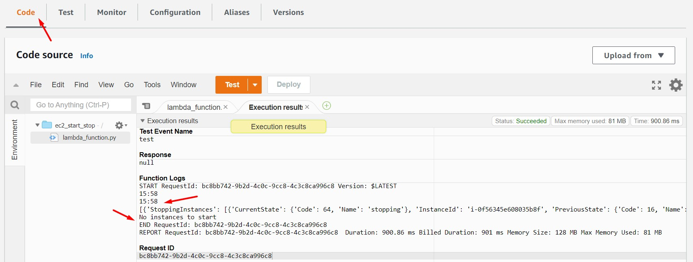

<br>

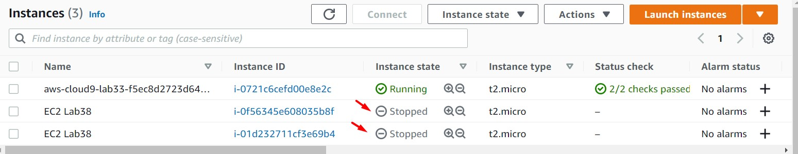

<br>

14. Si ejecutamos el Lambda en la hora programada de encendido en las instancias EC2 el evento de encendido se ejecutará. Considerar que hasta el momento el proceso es manual.

<br>

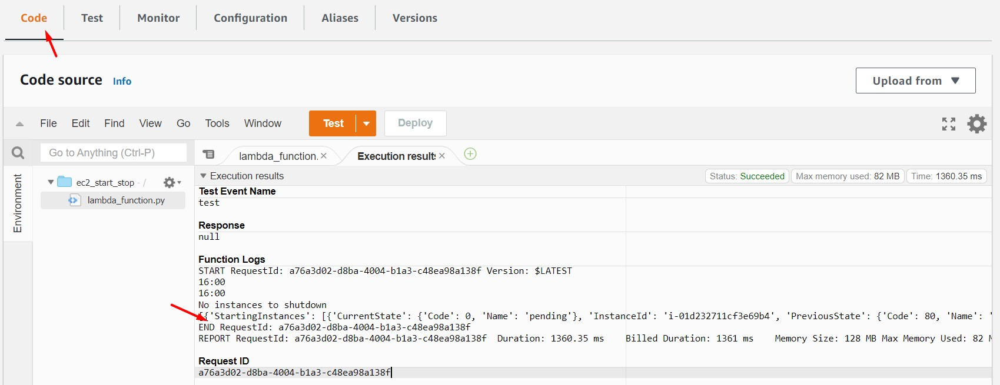

<br>

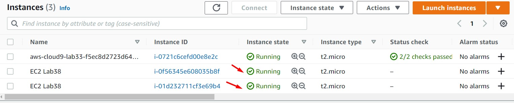

<br>

15. Accedemos al features de "CloudWatch Events Rules" (existe la posibilidad que al ingresar a este features seamos redireccionados a "Event Bridge". De ser así, regresar a "CloudWatch Events Rules". Se usará directamente "Event Bridge" en los siguientes laboratorios). Damos clic en el botón "Create Rule". Consideramos las siguientes configuraciones.


	* Event Sources
		* Event Source: Schedule
		* Fixed rate of: 1 Minute
	* Targets
		* Lambda function: ec2_start_stop

<br>

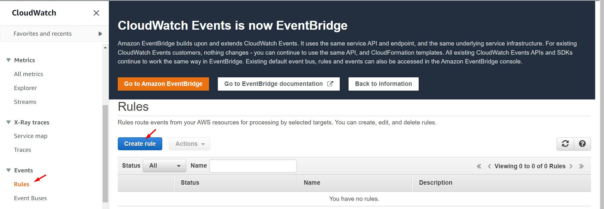

<br>

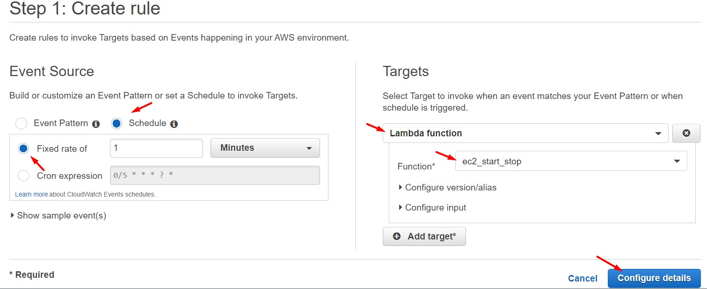

<br>

16. Ingresamos por nombre el valor de "ec2_start_stop" y verificamos que el cambio "State" se encuentre habilitado. Luego damos clic en el botón "Create rule"

	* Name: ec2_start_stop
	* State: Enabled

<br>

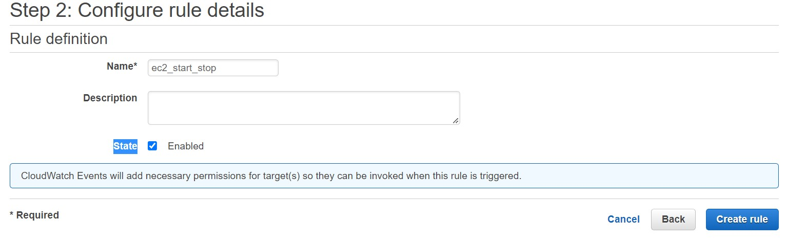

<br>

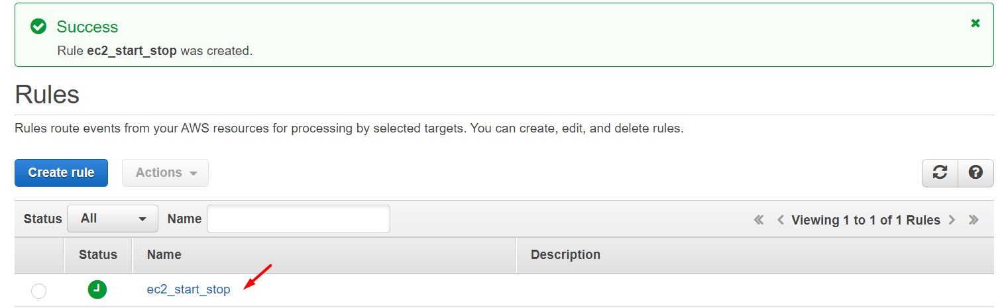

<br>


17. Modificamos los valores "ScheduleStop" y "ScheduleStart" de los Tags de nuestras instancias EC2 y validamos que estas se apaguen y enciendan, según lo configurado. Revisamos los Logs generados por Lambda en CloudWatch Logs - Log groups "/aws/lambda/ec2_start_stop"

<br>

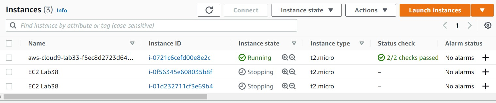

<br>

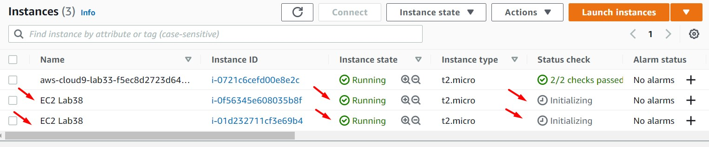

<br>

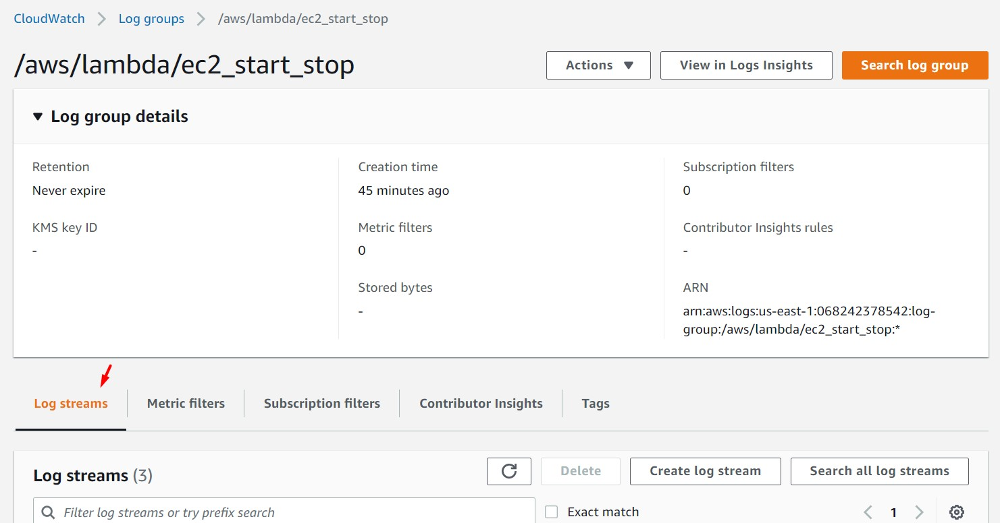

<br>

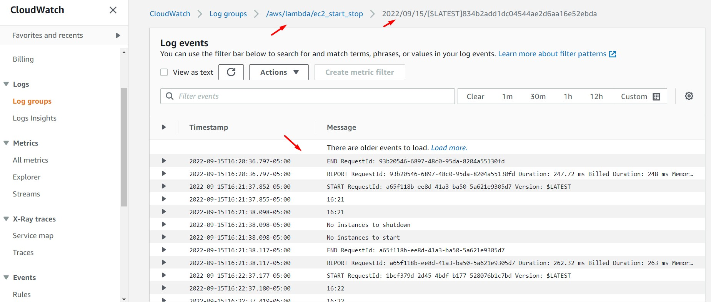

<br>

---

### Eliminación de recursos

<br>

```bash
aws cloudformation delete-stack --stack-name 1_lab38-ec2-tags --region us-east-1
#Eliminar Role "lab38_ec2_start_stop"
#Eliminar Lambda "lab38_ec2_start_stop"
```


