# AWS Solutions Architect Associate - Laboratorio 39

<br>

### Objetivo: 
*  Configuración de "Event Bridge (Rule with an event pattern)", "GuardDuty" y notificaciones "SNS" para identificación de amenazas en nuestra cuenta de AWS.

### Tópico:
* Management & Governance
* Application Integration
* Security, Identity & Compliance

### Dependencias:
* Ninguno

### Costo:
* Durante el desarrollo del laboratorio (especialmente en el paso 10) se estarán desplegando instancias tipo "t2.nano" que hacen "crypto_mining". Estas instancias no están dentro de la capa gratutita (0,0058 USD	por hora)

### Referencias:
* Parte del laboratorio se basa en los scripts de AWS obtenidos desde https://github.com/aws-samples/aws-incident-response-playbooks-workshop/tree/main/playbooks/crypto_mining/simulation 

<br>


---

### A - Configuración de "Event Bridge (Rule with an event pattern)", "GuardDuty" y notificaciones "SNS" para identificación de amenazas en nuestra cuenta de AWS.

<br>


1. Acceder al servicio AWS Cloud9 y generar un nuevo (o encender nuestro) ambiente de trabajo (Ubuntu 18.04 LTS)

<br>

2. Ejecutar los siguinentes comandos en nuestro Cloud9

```bash
#Ubuntu 18.04
sudo apt-get update
git clone https://github.com/jbarreto7991/aws-solutionsarchitectassociate.git
```

<br>

3. Acceder al laboratorio 39 (Lab-39), carpeta "code". Validar que se cuenta con la plantilla de cloudformation "1_lab39-eventbridge-guardduty-sns".

<br>

4. Desplegar la respectiva plantilla CloudFormation ejecutando AWSCLI.

<br>

5. **1_lab39-eventbridge-guardduty-sns** Esta plantilla contiene los siguientes parámetros de despliegue: KeyPair, SubnetID y VPCID. Reemplazar estos valores en la siguiente línea de comando. Será válido usar la consola de AWS para el despliegue de esta plantilla. Esta plantilla aprovisionará dos instancias EC2: Atacante y victima". La instancia atacante tendrá instalado "nmap". La instancia victima tendrá instalado "apache2".

<br>

```bash
aws cloudformation create-stack --stack-name lab39-eventbridge-guardduty-sns --template-body file://~/environment/aws-solutionsarchitectassociate/Lab-39/code/1_lab39-eventbridge-guardduty-sns.yaml --parameters ParameterKey=KeyPair,ParameterValue="aws-solutionsarchitectassociate" ParameterKey=Subnet,ParameterValue="subnet-43d4a125" ParameterKey=VPC,ParameterValue="vpc-dd59d8a0" --capabilities CAPABILITY_NAMED_IAM
```

<br>

6. Accedemos al servicio "GuardDuty", damos clic en el botón "Get Started" y luego clic en el botón "Enable GuardDuty". Seguidamente ingresamos a la opción "Settings" y nos dirigimos a la sección "Findings export options". Seleccionamos el siguiente valor y damos clic en el botón "Save"

    * Frequency for updated findings: Update CWE and S3 every 15 minutes.

<br>

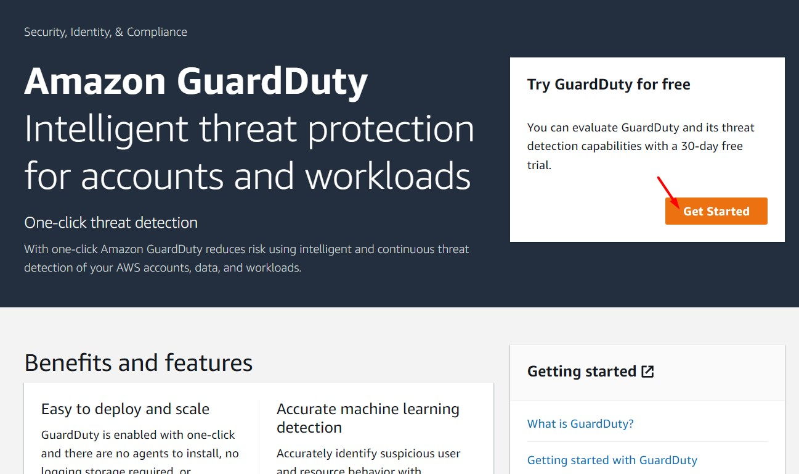

<br>

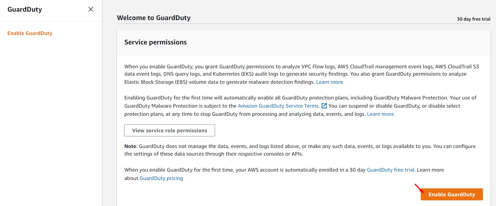

<br>


<br>

7. Ingresamos al servicio SNS y damos clic en el botón "Create topic". Seleccionamos/ingresamos la siguiente información y damos clic en el botón "Create topic"

    * Type: Standard
    * Name: prod

<br>

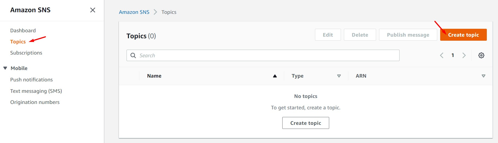

<br>

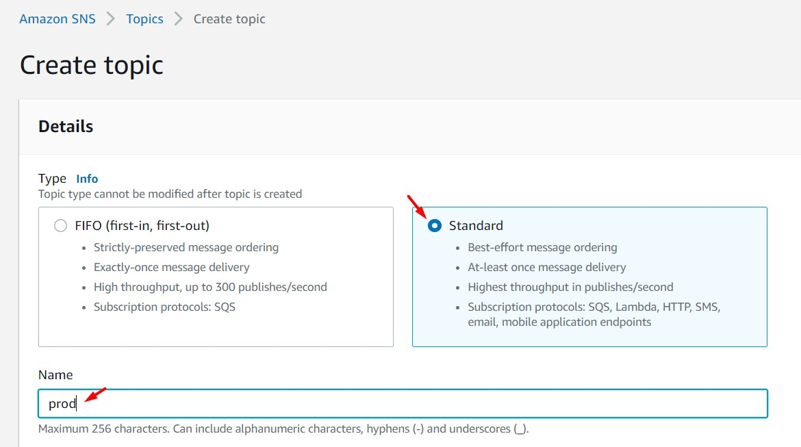

<br>

8. Ingresamos a la opción "Subscriptions" y damos clic en el botón "Create subscription". Seleccionamos/ ingresamos la siguiente información y luego damos clic en el botón "Create Subscription". Llegará una notificación al correo electrónico ingresado, deberemos aceptar la subscripción. Cambiará el estado de nuestra subscripción SNS a " Confirmed" 

    * Protocol: Email
    * Endpoint: email@email.com

<br>

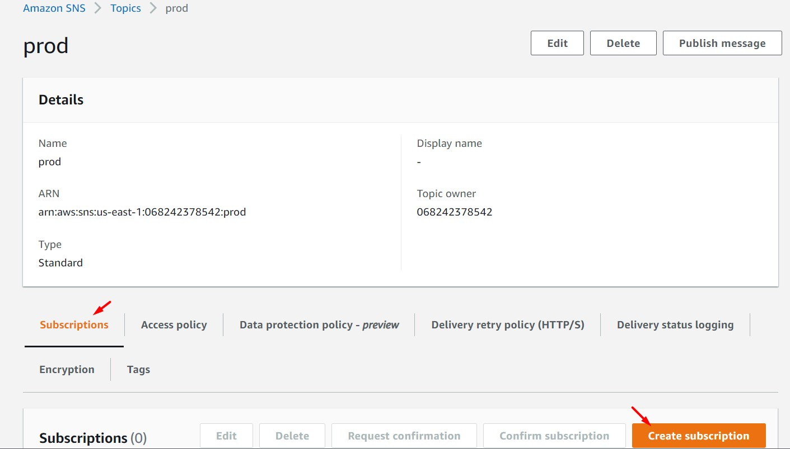

<br>

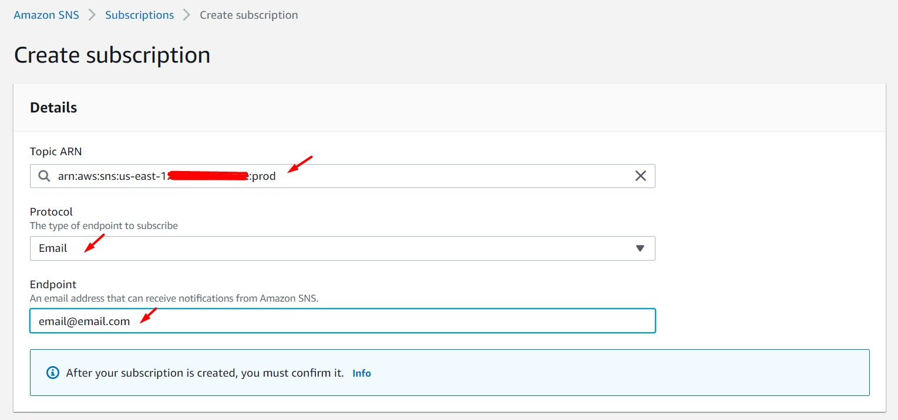

<br>

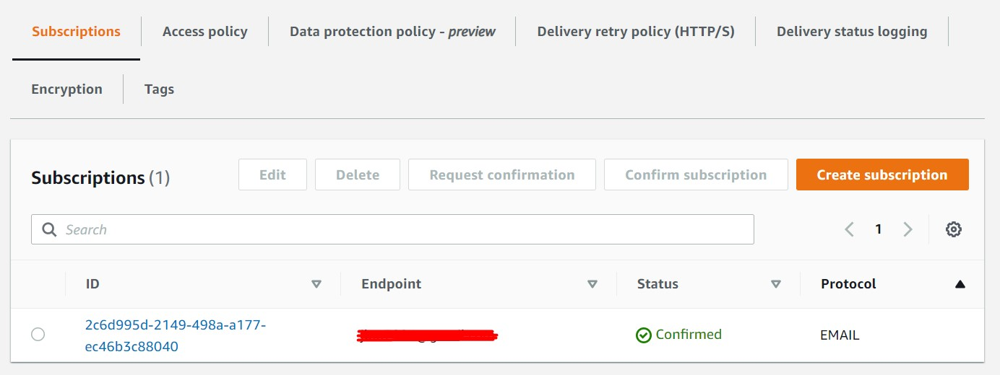

<br>

9. Desde el servicio IAM, generamos un usuario programático asociado a la política "AdministratorAccess". Guardamos las credenciales: "Access key ID" y "Secret access key"

    * User name: crypto_mining
    * Select AWS credential type: Access key - Programmatic access
    * Set permissions: Attach existing policies directly
        * Policy name: AdministratorAccess

<br>

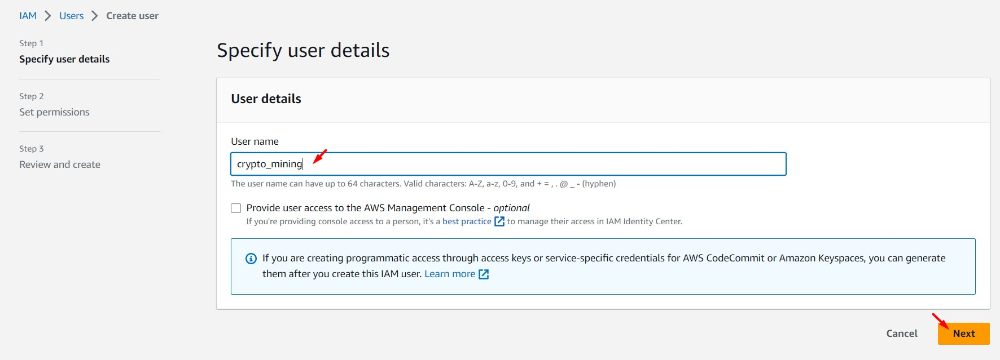

<br>    

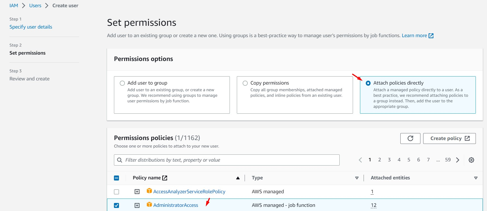

<br>    

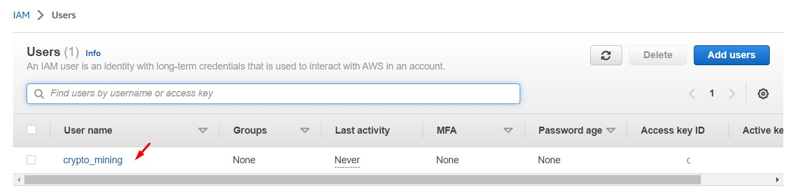

<br>    

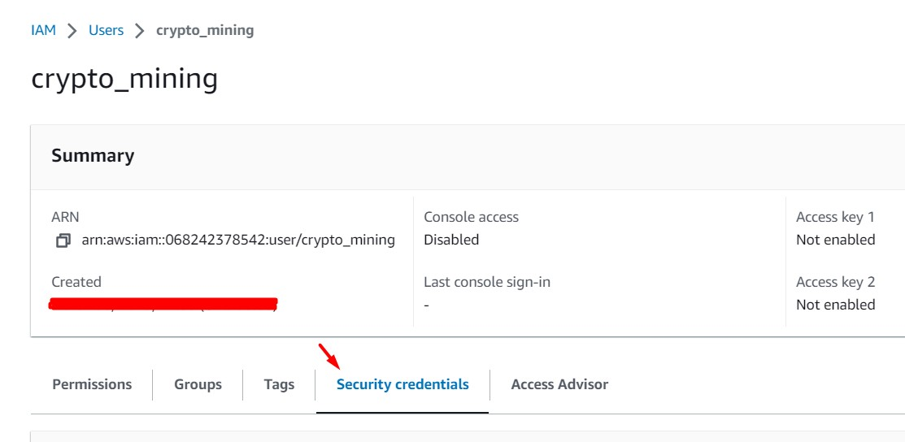

<br>    


<br>    

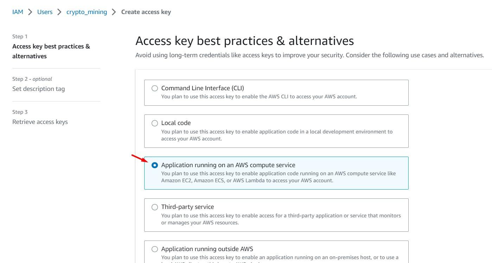

<br>    

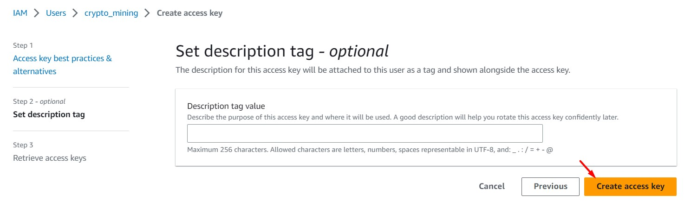

<br>    

10. Ingresamos a la instancia EC2 "EC2 Lab39 Attacker" vía "System Manager - Session Manager". Ejecutamos los siguientes comandos (01, 02, 03 y 04). En el comando 02, reemplazamos el valor de la variable $IP_EC2_VICTIM con la IP Privada de la instancia "EC2 Lab39 Victim".

```bash
#Comando 01 a Ejecutar (namp)
nmap --version

#Respuesta del comando 01
Nmap version 7.60 ( https://nmap.org )
Platform: x86_64-pc-linux-gnu
Compiled with: liblua-5.3.3 openssl-1.1.0g nmap-libssh2-1.8.0 libz-1.2.8 libpcre-8.39 libpcap-1.8.1 nmap-libdnet-1.12 ipv6
Compiled without:
Available nsock engines: epoll poll select
```
<br>

```bash
#Comando 02 a Ejecutar (nmap) reiteradamente
nmap -sT -p 1-65535 $IP_EC2_VICTIM

#Respuesta del comando 02
root@ip-172-31-7-196:/var/snap/amazon-ssm-agent/5656# nmap -sT -p 1-65535 172.31.12.217
Starting Nmap 7.60 ( https://nmap.org ) at 2022-09-15 22:24 UTC
Nmap scan report for ip-172-31-12-217.ec2.internal (172.31.12.217)
Host is up (0.0073s latency).
Not shown: 65533 closed ports
PORT   STATE SERVICE
22/tcp open  ssh
80/tcp open  http
MAC Address: 02:12:C7:EB:09:2D (Unknown)

Nmap done: 1 IP address (1 host up) scanned in 3.04 seconds
```
<br>

```bash
#Comando 03: Configuración del profile crypto_mining
aws configure --profile crypto_mining
AWS Access Key ID [None]: AAAAQ7Y4QB4XCGNLAAAA
AWS Secret Access Key [None]: AAAAZDcltk2LlMENNiT3FL4LZcr5PzapKQXHAAAA
Default region name [None]: us-east-1
Default output format [None]: 
```

<br>

```bash
#Comando 04 a Ejecutar (Criptomining)
cd /home/ubuntu
wget -L https://raw.githubusercontent.com/aws-samples/aws-incident-response-playbooks-workshop/main/playbooks/crypto_mining/simulation/simulate_crypto_mining_activity.sh 
wget -L https://raw.githubusercontent.com/aws-samples/aws-incident-response-playbooks-workshop/main/playbooks/crypto_mining/simulation/userdata.sh
chmod +x simulate_crypto_mining_activity.sh
./simulate_crypto_mining_activity.sh crypto_mining us-east-1

#Respuesta del comando 04
root@ip-172-31-7-196:/home/ubuntu# ./simulate_crypto_mining_activity.sh crypto_mining us-east-1
retrieving AMZN Linux 2 AMI id
enumerates all VPCs available
spinning instances in all subnets of VPC vpc-dd59d8a0
crypto mining started - EC2 instance i-0c1ee3163a6d01f8c in subnet subnet-29b70f18 of VPC vpc-dd59d8a0 using AMI
crypto mining started - EC2 instance i-00aa97663294ffbbd in subnet subnet-19324346 of VPC vpc-dd59d8a0 using AMI
crypto mining started - EC2 instance i-0e170250ee30fba28 in subnet subnet-5d81ae53 of VPC vpc-dd59d8a0 using AMI
crypto mining started - EC2 instance i-055afc4bf2cb9bb35 in subnet subnet-43d4a125 of VPC vpc-dd59d8a0 using AMI
resources created to be deleted after playbook is completed
EC2 instances
i-0c1ee3163a6d01f8c
i-00aa97663294ffbbd
i-0e170250ee30fba28
i-055afc4bf2cb9bb35
save the file instances.resources for future use by the bash script undo_simulate_crypto_mining_activity.sh
end of ./simulate_crypto_mining_activity.sh
```
<br>

11. El comando 04 (crypto_mining) aprovisionará 04 instancias tipo t2.nano. Estas instancias ejecutarán un UserData que contiene una simulación de "crypto_mining". El archivo "userdata.sh" se encuentra en la carpeta "code" si se desea analizar.

<br>    

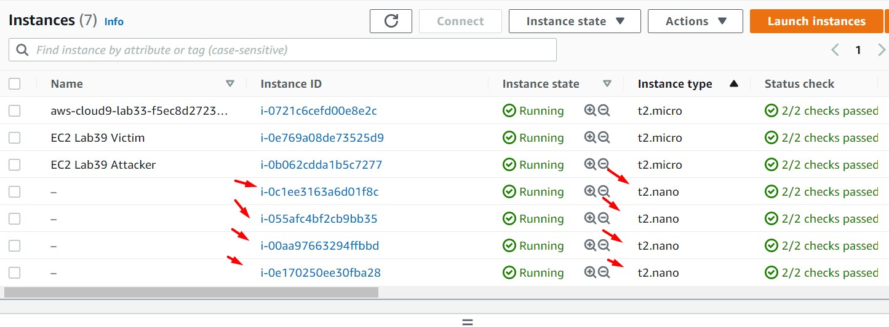

<br>    

12. Ingresamos al servicio de "Event Bridge" y damos clic en el botón "Create Rule". Ingresamos/seleccionamos los siguientes valores. Finalmente, damos clic en el botón "Create rule"

    * Name: guardduty-rule
    * Description: guardduty-rule
    * Event bus: default
    * Rule Type: Rule with an event pattern
    * Event source: AWS events or EventBridge partner events
    * Event pattern
        * Event source: AWS Services
        * AWS Services: GuardDuty
        * Event type: GuardDuty Finding
    * Target 1:
        * Target types: AWS service
        * Select a target: SNS Topic
        * Topic: prod (Recurso aprovisionado en el paso 7)


<br>    

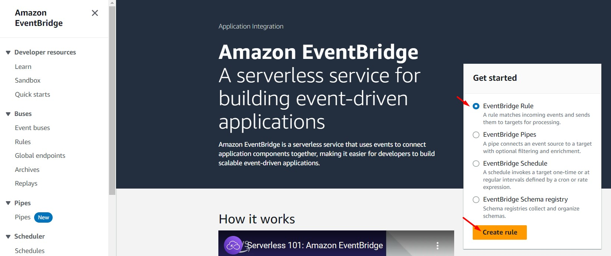

<br>   

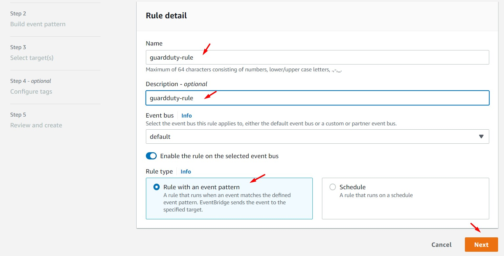

<br>   

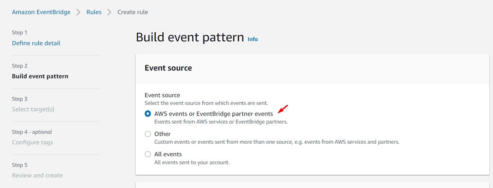

<br>   

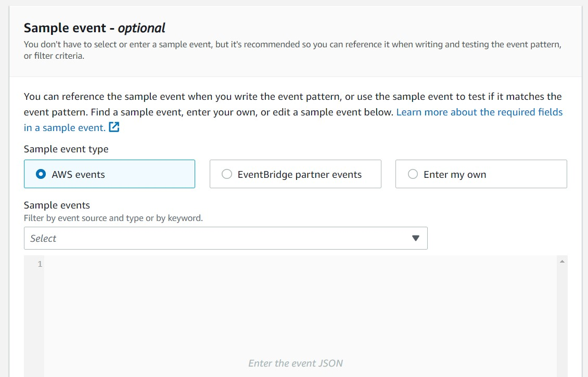

<br>   

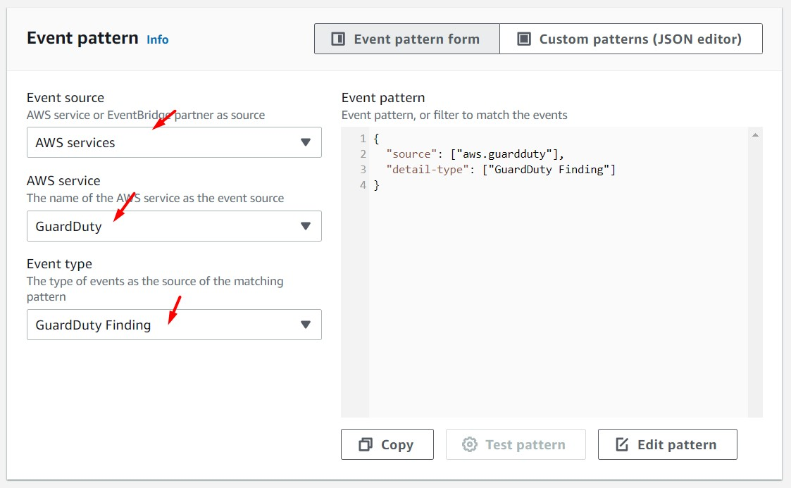

<br>   

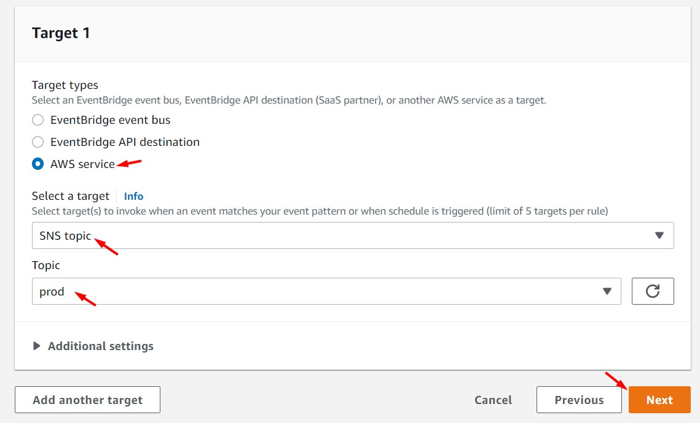

<br>   

13. Una vez generada la regla "guardduty-rule" podemos validar la creación del registro en el panel de "Rules". En esa sección también observaremos la regla creada desde "CloudWatch Event Rules" en el Laboratorio 38. Podemos observar que las reglas presentan diferente tipo: "Scheduled Standard" y "Standard".

<br>   

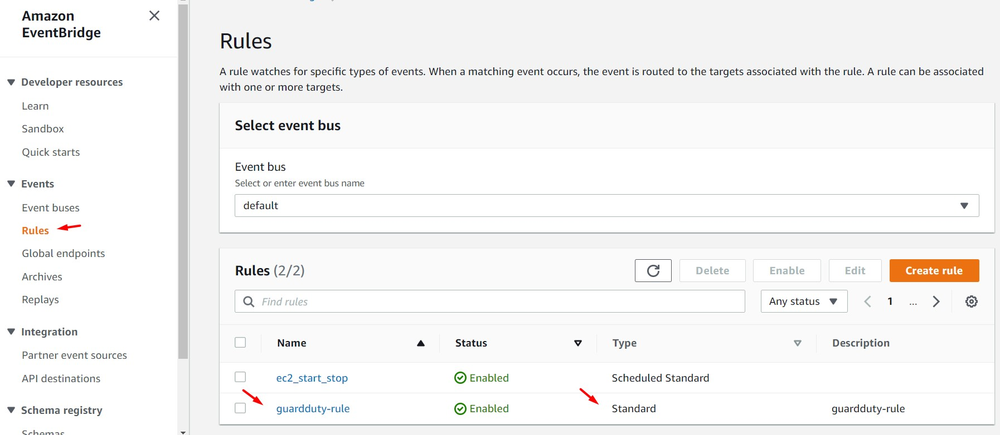

<br>   

14. Accedemos al servicio de GuardDuty, ingresamos a la sección "Findings" y podemos observar los hallazgos que GuardDuty ha encontrado. Se recomienda analizar el detalle de cada hallazgo.

<br>   

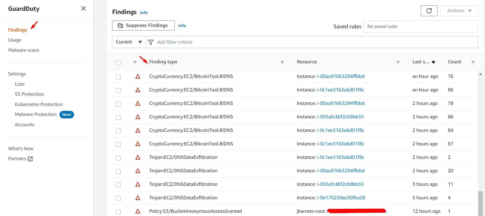

<br>   

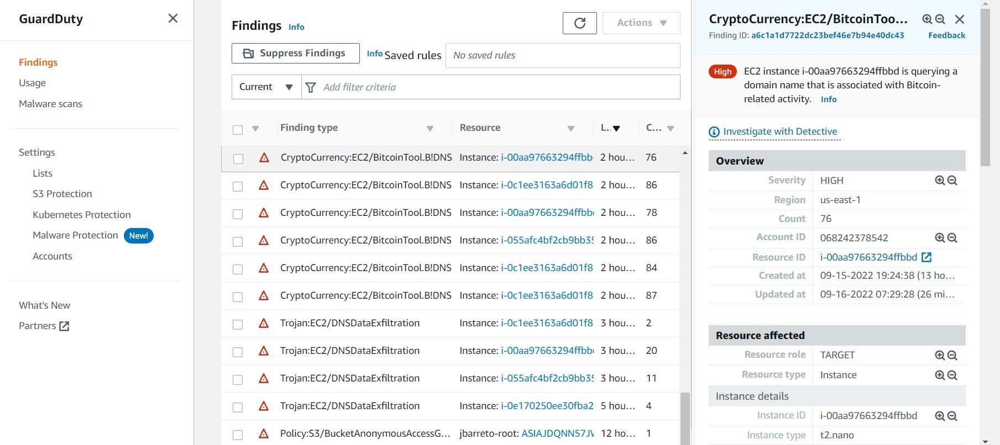

<br>   

15. A través del correo electrónico registrado como subscripción en el Tópico SNS "prod" observaremos que están llegando notificaciones de GuarDuty. Las notificaciones tendrán la siguiente estructura:

<br>   

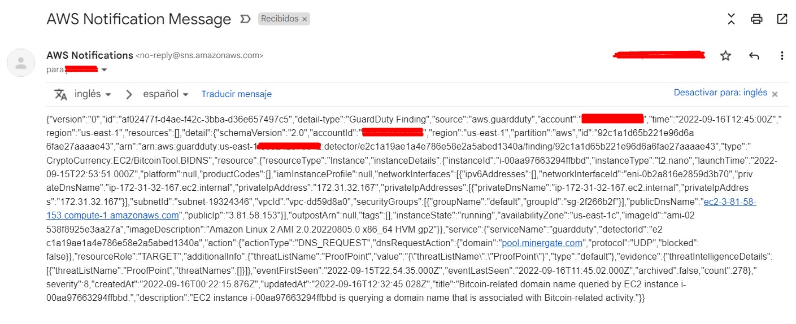

<br>  

```bash
{"version":"0","id":"af02477f-d4ae-f42c-3bba-d36e657497c5","detail-type":"GuardDuty Finding","source":"aws.guardduty","account":"XXXXXXXXXXXX","time":"XXXX-XX-XXTXX:XX:XXZ","region":"us-east-1","resources":[],"detail":{"schemaVersion":"2.0","accountId":"XXXXXXXXXXXX","region":"us-east-1","partition":"aws","id":"92c1a1d65b221e96d6a6fae27aaaae43","arn":"arn:aws:guardduty:us-east-1:XXXXXXXXXXXX:detector/e2c1a19ae1a4e786e58e2a5abed1340a/finding/92c1a1d65b221e96d6a6fae27aaaae43","type":"CryptoCurrency:EC2/BitcoinTool.B!DNS","resource":{"resourceType":"Instance","instanceDetails":{"instanceId":"i-00aa97663294ffbbd","instanceType":"t2.nano","launchTime":"XXXX-XX-XXTXX:XX:XXZ","platform":null,"productCodes":[],"iamInstanceProfile":null,"networkInterfaces":[{"ipv6Addresses":[],"networkInterfaceId":"eni-0b2a816e2859d3b70","privateDnsName":"ip-172-31-32-167.ec2.internal","privateIpAddress":"172.31.32.167","privateIpAddresses":[{"privateDnsName":"ip-172-31-32-167.ec2.internal","privateIpAddress":"172.31.32.167"}],"subnetId":"subnet-19324346","vpcId":"vpc-dd59d8a0","securityGroups":[{"groupName":"default","groupId":"sg-2f266b2f"}],"publicDnsName":"ec2-3-81-58-153.compute-1.amazonaws.com","publicIp":"3.81.58.153"}],"outpostArn":null,"tags":[],"instanceState":"running","availabilityZone":"us-east-1c","imageId":"ami-02538f8925e3aa27a","imageDescription":"Amazon Linux 2 AMI 2.0.20220805.0 x86_64 HVM gp2"}},"service":{"serviceName":"guardduty","detectorId":"e2c1a19ae1a4e786e58e2a5abed1340a","action":{"actionType":"DNS_REQUEST","dnsRequestAction":{"domain":"pool.minergate.com","protocol":"UDP","blocked":false}},"resourceRole":"TARGET","additionalInfo":{"threatListName":"ProofPoint","value":"{\"threatListName\":\"ProofPoint\"}","type":"default"},"evidence":{"threatIntelligenceDetails":[{"threatListName":"ProofPoint","threatNames":[]}]},"eventFirstSeen":"XXXX-XX-XXTXX:XX:XXZ","eventLastSeen":"XXXX-XX-XXTXX:XX:XXZ","archived":false,"count":278},"severity":8,"createdAt":"XXXX-XX-XXTXX:XX:XXZ","updatedAt":"XXXX-XX-XXTXX:XX:XXZ","title":"Bitcoin-related domain name queried by EC2 instance i-00aa97663294ffbbd.","description":"EC2 instance i-00aa97663294ffbbd is querying a domain name that is associated with Bitcoin-related activity."}}
```

<br>

16. Eliminar la plantilla de CloudFormation "1_lab39-eventbridge-guardduty-sns" no eliminará las instancias EC2 que hacen "crypto_mining". Eliminar las instancias generadas en EC2 de forma independiente. 

---

### Eliminación de recursos

<br>

```bash
aws cloudformation delete-stack --stack-name 1_lab39-eventbridge-guardduty-sns --region us-east-1
#Eliminar Instancias EC2 t2.nano
#Eliminar Tópico SNS "prod"
#Eliminar Event Bridge Rules "guardduty-rule"
```

