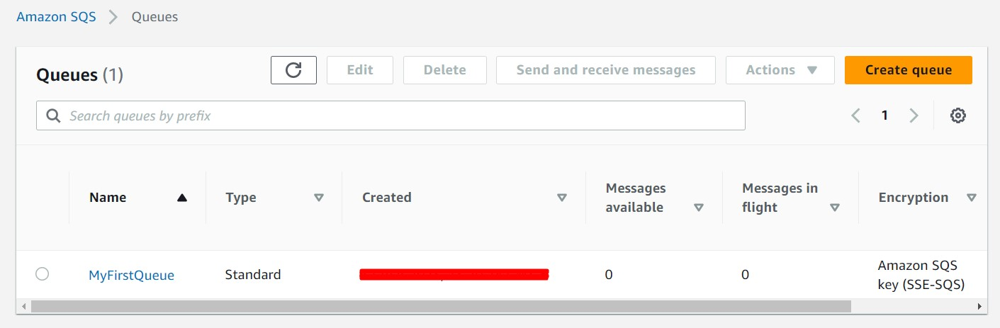
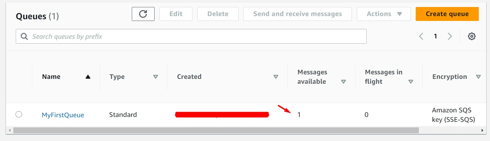
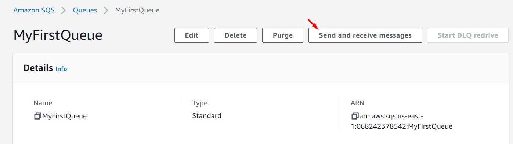
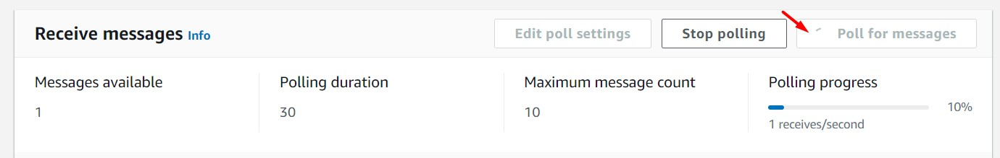
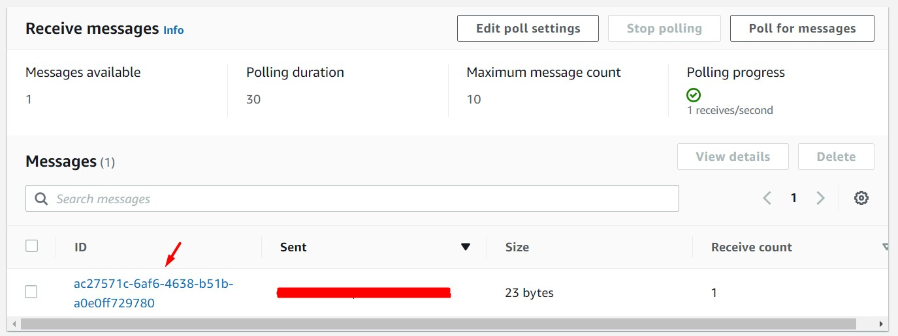
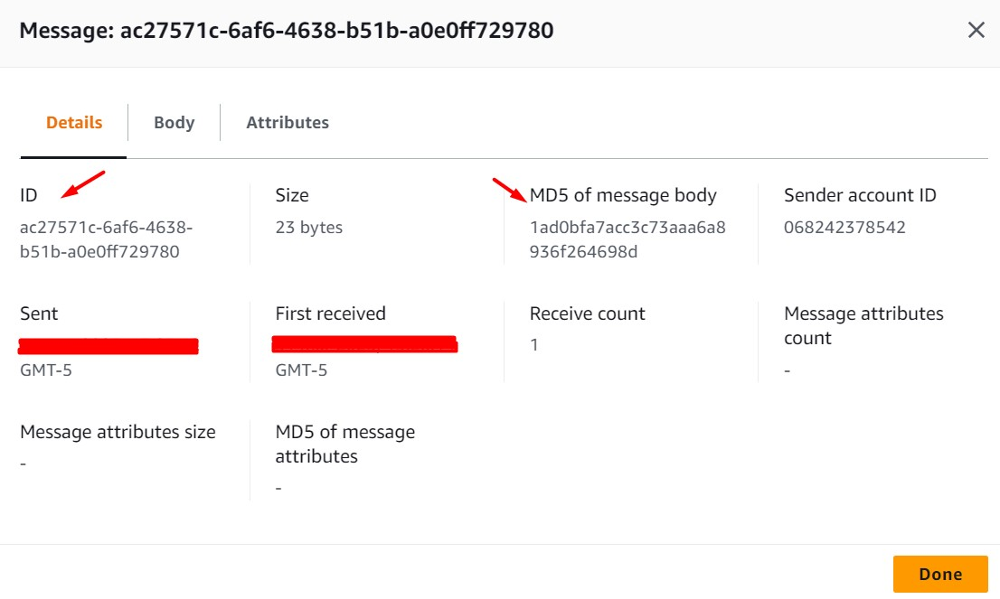
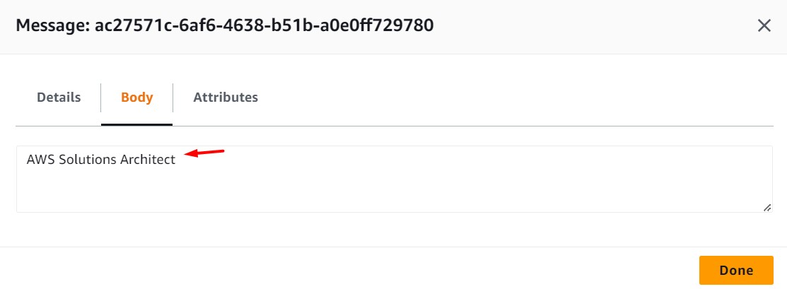
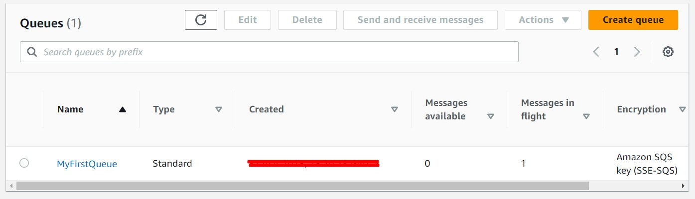
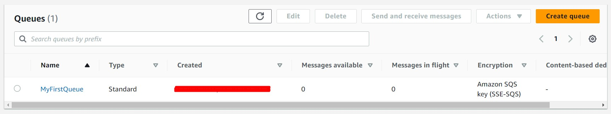

# AWS Solutions Architect Associate - Laboratorio 40

<br>

### Objetivo: 
*  Configuración y gestión a través de los métodos create, list, send, receive, y delete de una cola SQS usando el SDK de Python (boto3) 

### Tópico:
* Application Integration

### Dependencias:
* Ninguno

<br>

---

### A - Configuración y gestión a través de los métodos create, list, send, receive, y delete de una cola SQS usando el SDK de Python (boto3) 

<br>


1. Accedemos al servicio AWS Cloud9 y generar un nuevo (o encender nuestro) ambiente de trabajo (Ubuntu 18.04 LTS)

<br>

2. Ejecutamos los siguientes comandos en nuestro Cloud9. Instalaremos "boto3" el SDK de Python

```bash
#Ubuntu 18.04
sudo apt-get update
python3 --version
pip3 --version
pip3 install boto3
```

<br>

3. Ejecutamos los siguientes comandos en nuestro Cloud9. Abrimos python3, importamos boto3 y creamos una cadena de conexión hacía "SQS" usando boto3. Luego, procederemos a crear una cola SQS Standard. Revisamos la creación de nuestro recurso desde la consola de AWS.

```bash
#Comando
python3

import boto3
sqs = boto3.resource('sqs', region_name='us-east-1')
```

<br>

```bash
#Comando
queue = sqs.create_queue(QueueName='MyFirstQueue')
```

<br>



<br>


4. Ejecutamos los siguientes comandos en nuestro Cloud9. Listamos todas las colas (Standard y .FIFO) disponibles en la región.

```bash
#Comando
for queue in sqs.queues.all():
    print(queue.url)

#Response
https://queue.amazonaws.com/XXXXXXXXXXXX/MyFirstQueue
```

<br>

5. Ejecutamos los siguientes comandos en nuestro Cloud9. Enviamos un mensaje a nuestra cola SQS.

```bash
#Comando
queue = sqs.get_queue_by_name(QueueName='MyFirstQueue')
response = queue.send_message(MessageBody='AWS Solutions Architect')
print(response)
print(response.get('MessageId'))
print(response.get('MD5OfMessageBody'))

#Response

#print(response)
{'MD5OfMessageBody': '1ad0bfa7acc3c73aaa6a8936f264698d', 'MessageId': 'ac27571c-6af6-4638-b51b-a0e0ff729780', 'ResponseMetadata': {'RequestId': '16eaefa2-2c1f-586b-800f-b3030bf9275f', 'HTTPStatusCode': 200, 'HTTPHeaders': {'x-amzn-requestid': '16eaefa2-2c1f-586b-800f-b3030bf9275f', 'date': 'XXXXXXXXXXX', 'content-type': 'text/xml', 'content-length': '378'}, 'RetryAttempts': 0}}
#>>> print(response.get('MessageId'))
ac27571c-6af6-4638-b51b-a0e0ff729780
#>>> print(response.get('MD5OfMessageBody'))
1ad0bfa7acc3c73aaa6a8936f264698d
```

<br>



<br>

6. Accedemos al detalle de la cola SQS, damos clic en la opción "Send and receive messages". En la sección "Receive messages" damos clic en la opción "Poll for messages". Después de unos segundos, se habrá cargado un mensaje. Accedemos al detalle del mensaje. Analizamos los campos "ID" y "MD5 of message body"

<br>



<br>



<br>



<br>



<br>



<br>

7. Ejecutamos los siguientes comandos en nuestro Cloud9. Consumimos el mensaje de nuestra cola SQS. Desde la consola visualizamos que el campo "Messages in flight" tiene el valor de 1

```bash
#Comando
queue = sqs.get_queue_by_name(QueueName='MyFirstQueue')
for message in queue.receive_messages():
 print(message)
 print(message.body)

#Response
sqs.Message(queue_url='https://queue.amazonaws.com/068242378542/MyFirstQueue', receipt_handle='AQEBvGIY3fS+3SWpmBQiwpu4La3IVTaCtXMab1pzddDtkfadiGCE2TyFiw3lYxoqwf1+0TOddEnOdHJlTm7GWsl4HDb6XsE5D90kF8kIhhQb0A6zmm4aclK1qUgSV/6qqyKdZY8PtqFmtvuCRSfGd7wbOy87je4iy6//MCFndAaAJEDwILm66RC3pE2Ii1dw+ZAoRcNLDog82I9CU1v9hCVcjm/kyXPgMtAhWorUZwzSIzUJ5LTX49AMAPQMdSiD6QWtUN+p29wn2kGzd6aN+k/9D5LFOSLMtMVra+u9Ojm9vuNy8tTAdgq2u0hV/aLlkz2zky1j0iFFVe9OoQDlOlWNEAxce5l2ecjUNHK2Jlj33kpVAQujnNupdXm3mex40p+F1U5T41NkSY0LAmlkxx5ccg==')

AWS Solutions Architect
```

<br>



<br>

8. Ejecutamos los comandos del paso anterior dos veces más (ambos dentro de los 30 segundos)

```bash
#Comando 01
for message in queue.receive_messages():
print(message.body)

#Respuesta 01
AWS Solutions Architect

#Comando 02
for message in queue.receive_messages():
print(message.body)

#Respuesta 02
(vacio)
```

<br>


9. Ejecutamos los comandos del paso anterior dos veces más (con una diferencia de 30 segundos entre ellos)

```bash
#Comando 01
for message in queue.receive_messages():
print(message.body)

#Respuesta 01
AWS Solutions Architect

#Comando 02
for message in queue.receive_messages():
print(message.body)

#Respuesta 02
AWS Solutions Architect
```

<br>

10. Ejecutamos los siguientes comandos en nuestro Cloud9. Consumimos el mensaje de nuestra cola SQS y luego eliminamos el mensaje de la cola

```bash
#Comando
queue = sqs.get_queue_by_name(QueueName='MyFirstQueue')
for message in queue.receive_messages():
 print(message.body)
 message.delete()

#Respuesta
AWS Solutions Architect
{'ResponseMetadata': {'RequestId': '03257db8-4d98-58f5-98af-21197431ed17', 'HTTPStatusCode': 200, 'HTTPHeaders': {'x-amzn-requestid': '03257db8-4d98-58f5-98af-21197431ed17', 'date': 'XXXXXXXX', 'content-type': 'text/xml', 'content-length': '215'}, 'RetryAttempts': 0}}
```

<br>



<br>

---

### Eliminación de recursos

```bash
#Eliminar Cola SQS "MyFirstQueue"
```
