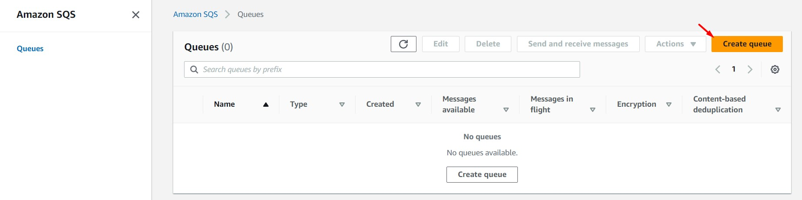
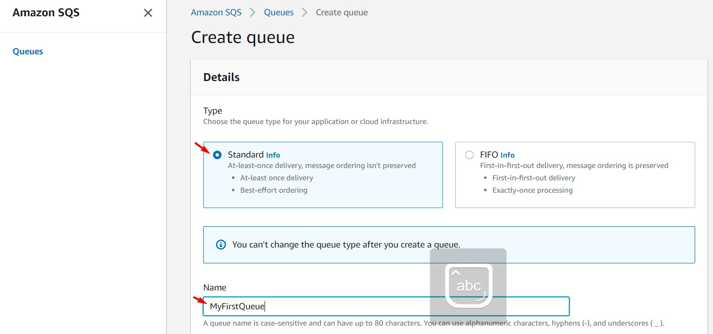
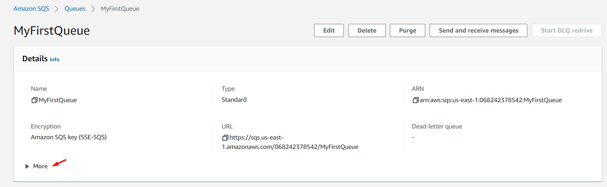
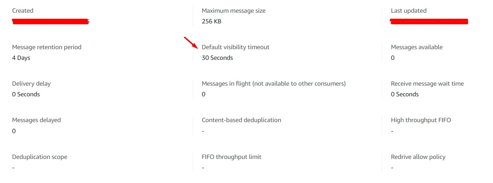
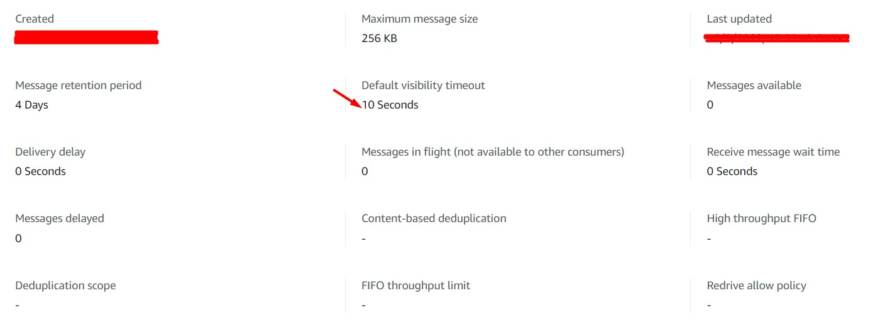
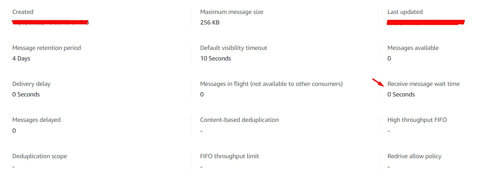
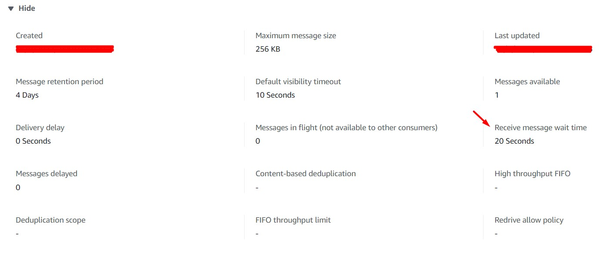

# AWS Solutions Architect Associate - Laboratorio 41

<br>

### Objetivo: 
*  Configuración de las propiedades "Visibility Timeout", "Long-polling" y "Short-polling" en una cola SQS 

### Tópico:
* Application Integration

### Dependencias:
* Ninguna

<br>


---

### A - Configuración de las propiedades "Long-polling" y "Short-polling" en una cola SQS 

<br>

1. Acceder al servicio AWS Cloud9 y generar un nuevo ambiente de trabajo (Ubuntu 18.04 LTS)

<br>

2. Ejecutar los siguientes comandos en nuestro Cloud9

```bash
#Ubuntu 18.04
sudo apt-get update
sudo apt-get install jq -y
```

<br>

3. Accedemos al servicio SQS y creamos una cola Standard SQS ingresando/seleccionando los siguientes valores. Considerar por defecto los otros valores.

    * Type: Standard
    * Name: MyFirstQueue

<br>



<br>



<br>

4. Accedemos a Cloud9 y procedemos a identificar la URL de la cola SQS aprovisionada a través del siguiente comando

```bash
#Comando
REGION=$(curl -s http://169.254.169.254/latest/meta-data/placement/availability-zone | sed 's/\(.*\)[a-z]/\1/')
aws sqs list-queues --region $REGION | jq -r '.QueueUrls[]'
QUEUE_URL=$(aws sqs list-queues --region $REGION | jq -r '.QueueUrls[]')
echo $QUEUE_URL

#Resultado
https://queue.amazonaws.com/XXXXXXXXXXXX/MyFirstQueue
```

<br>

5. Desde la consola de AWS, visualizamos el valor del campo "Default visibility timeout" en el servicio SQS. Se visualizará el valor de "30 Seconds"

<br>



<br>



<br>

6. Desde Cloud9, modificamos el valor del campo "Default visibility timeout" a través del siguiente comando.

```bash
#Comando
aws sqs set-queue-attributes --queue-url $QUEUE_URL --attributes '{"VisibilityTimeout": "10"}' --region $REGION
```

<br>

7. Desde la consola de AWS, visualizamos el nuevo valor del campo "Default visibility timeout" en el servicio de SQS. Se visualizará el valor de "10 Seconds". Es posible validar el mismo valor a través del siguiente comando de AWSCLI, visualizando el campo "VisibilityTimeout".

```bash
#Comando
aws sqs get-queue-attributes --queue-url $QUEUE_URL --region $REGION --attribute-names All

#Respuesta
{
    "Attributes": {
        "QueueArn": "arn:aws:sqs:us-east-1:XXXXXXXXXXXX:MyFirstQueue",
        "ApproximateNumberOfMessages": "0",
        "ApproximateNumberOfMessagesNotVisible": "0",
        "ApproximateNumberOfMessagesDelayed": "0",
        "CreatedTimestamp": "1663362199",
        "LastModifiedTimestamp": "1663368940",
        "VisibilityTimeout": "10",
        "MaximumMessageSize": "262144",
        "MessageRetentionPeriod": "345600",
        "DelaySeconds": "0",
        "ReceiveMessageWaitTimeSeconds": "0",
        "SqsManagedSseEnabled": "true"
    }
}
```

<br>



<br>


8. Desde la consola de AWS, visualizamos el valor del campo "Receive message wait time". Tendrá un valor de "0 Seconds" (**Short Polling**). Es posible validar el mismo valor a través del siguiente comando de AWSCLI.

```bash
#Comando
aws sqs get-queue-attributes --queue-url $QUEUE_URL --region $REGION --attribute-names All
```

<br>



<br>

9. Desde Cloud9, enviamos el mensaje "Message 1" a la cola SQS (a través del comando awscli "send-message") y consumimos el mensaje 3 veces (a través del comando "receive-message").

```bash
#Comandos
aws sqs send-message --queue-url $QUEUE_URL --message-body "Message 1" --region $REGION
aws sqs receive-message --queue-url $QUEUE_URL --region $REGION
aws sqs receive-message --queue-url $QUEUE_URL --region $REGION
aws sqs receive-message --queue-url $QUEUE_URL --region $REGION

#Respuesta
root@ip-172-31-11-147:/home/ubuntu# aws sqs send-message --queue-url $QUEUE_URL --message-body "Message 1" --region $REGION
{
    "MD5OfMessageBody": "68390233272823b7adf13a1db79b2cd7",
    "MessageId": "61ad0b67-15ff-472e-8fdb-d20432f2c25e"
}
root@ip-172-31-11-147:/home/ubuntu# aws sqs receive-message --queue-url $QUEUE_URL --region $REGION
{
    "Messages": [
        {
            "MessageId": "61ad0b67-15ff-472e-8fdb-d20432f2c25e",
            "ReceiptHandle": "AQEBk0PgUKFiELazF0BYeOW5LUPKdR22/Ch9+CEmkV1iX8LYTzEElYmYIFkYyhZrWmXbTw/mqIHP+2oUwetXBqjpCgTBz7NjMpcNKcBTtQix7iZ+KWKXLgi5hH3i8ftLkLpAo8q4gEoIuHhlyS6mzw7Rw2VvVXyj7p7v2/tAXMNXavJzq494GK36aYh3lMn0SI46inmhGH1flSi/L0jjwr1Ss8iPV33q/7DVDSyS6HWXteirEE2dp+/t1NC4VzGjjZDpPkisP46KtH5c0rKJTCziBjGBOhh/XN5AFnFhS8nKCvL1H5sj5u7Btr02LOnElxp7TK3mEPJInkXildPQA1Ly0rN1DBXAWY2ENJag999dDtx0sIMm7rSUAis9xHFSu3QayW9qYQLhfm/QzLQ3b9a/EA==",
            "MD5OfBody": "68390233272823b7adf13a1db79b2cd7",
            "Body": "Message 1"
        }
    ]
}
root@ip-172-31-11-147:/home/ubuntu# aws sqs receive-message --queue-url $QUEUE_URL --region $REGION
root@ip-172-31-11-147:/home/ubuntu# aws sqs receive-message --queue-url $QUEUE_URL --region $REGION
root@ip-172-31-11-147:/home/ubuntu#
```

<br>

10. Configuramos el campo "Receive message wait time" en "20 Seconds" a través del siguiente comando:

```bash
#Comando
aws sqs set-queue-attributes --queue-url $QUEUE_URL --region $REGION --attributes '{"ReceiveMessageWaitTimeSeconds": "20"}'
```
<br>

11. Desde la consola de AWS, validar el cambio realizado en el campo "Receive message wait time". Tendrá un valor de "20 Seconds" (**Long Polling**). Es posible validar el mismo valor a través del siguiente comando de AWSCLI (observar campo "ReceiveMessageWaitTimeSeconds").

```bash
#Comando
aws sqs get-queue-attributes --queue-url $QUEUE_URL --region $REGION --attribute-names All

#Respuesta
{
    "Attributes": {
        "QueueArn": "arn:aws:sqs:us-east-1:XXXXXXXXXXXX:MyFirstQueue",
        "ApproximateNumberOfMessages": "1",
        "ApproximateNumberOfMessagesNotVisible": "0",
        "ApproximateNumberOfMessagesDelayed": "0",
        "CreatedTimestamp": "1663362199",
        "LastModifiedTimestamp": "1663371760",
        "VisibilityTimeout": "10",
        "MaximumMessageSize": "262144",
        "MessageRetentionPeriod": "345600",
        "DelaySeconds": "0",
        "ReceiveMessageWaitTimeSeconds": "20",
        "SqsManagedSseEnabled": "true"
    }
}
```

<br>



<br>


12. Desde Cloud9, ejecutar los siguientes comandos. Analizar la respuesta de la cola SQS con esta nueva configuración

```bash
#Comando
aws sqs receive-message --queue-url $QUEUE_URL --region $REGION
aws sqs receive-message --queue-url $QUEUE_URL --region $REGION
aws sqs receive-message --queue-url $QUEUE_URL --region $REGION
aws sqs receive-message --queue-url $QUEUE_URL --region $REGION

#Respuesta
root@ip-172-31-11-147:/home/ubuntu# aws sqs receive-message --queue-url $QUEUE_URL --region $REGION
{
    "Messages": [
        {
            "MessageId": "61ad0b67-15ff-472e-8fdb-d20432f2c25e",
            "ReceiptHandle": "AQEBHdcXdOwXcjWPEHtEf618tV9xiCLkmvw/p93nidBkTJ/3DksBZVVrdGv77TwU5tz6BCb7ZrutDRpw56c5CSmC3uNBKkJkIZiXsVV2hCC1o2R7bcojf5pQDQfF0wfHSx2UKazuvrf0402oxRCUpU3Wl33ZkBBSAMPRr44DypFnbFPFmWRkqwhO8X0kXQ+h+kPA9CjpaWALsf+n6t2nPBcNrJJaTx7f0ssuy3+hDed8DMI84ry1gXWKKQROvDYRb65r2i9372RCRXQEQH4IWmAFoKzckJ5IASFCQs4FAc523YT2bbLcBwUdmF7qrlqsUG73BpeM33Ma7TxU/gwsDvgzdM++GhnsXkhO/OTIoV/QngieSUKNUVIGX2fZOht4HtivNtPSDYqsCw2YJYsbhvWrZA==",
            "MD5OfBody": "68390233272823b7adf13a1db79b2cd7",
            "Body": "Message 1"
        }
    ]
}
root@ip-172-31-11-147:/home/ubuntu# aws sqs receive-message --queue-url $QUEUE_URL --region $REGION
{
    "Messages": [
        {
            "MessageId": "61ad0b67-15ff-472e-8fdb-d20432f2c25e",
            "ReceiptHandle": "AQEBQS1f4FffxZLh926V2RLA1oNrHjxGL3LxYORe0qUvIL2lL04rNPW4Yk8puMV1JjRRemWPoZaxpXXt8OYLZiFiyvdq2KllcrNcehS5s/Hg7i43RcAKdq4cvMPy8DvBYhtexd9MmBnLL75tEFzUq3dq6JwVYD1+si+WDjT67isvTYLOUycxbmcsYYdX9lG6P97FBWRjwRaAuln5xl3A2aHXJIazLrvrl33m9qF418kpuHSJEeTOioNfasG9sQj0S4RfC+AfTGME3JVAte5uCv/6VM+BaOeVxvfqX4mPT7qkacCxnCXidAo7Fpd8AWme2C6GAquwqR6qhFH+voxu9NxUDpD58tce8ghAXOUd3BiEpSfq7GV5xlj0/AsL4dxzulUgp1awO3KvHd4KU0IhjJpDNw==",
            "MD5OfBody": "68390233272823b7adf13a1db79b2cd7",
            "Body": "Message 1"
        }
    ]
}
root@ip-172-31-11-147:/home/ubuntu# aws sqs receive-message --queue-url $QUEUE_URL --region $REGION
{
    "Messages": [
        {
            "MessageId": "61ad0b67-15ff-472e-8fdb-d20432f2c25e",
            "ReceiptHandle": "AQEB/rFzCmh+kjSkhp9G1BnYbc8ubakVrOVP4zexRHkEs/I+ubOIyYQPaCfHDD3ypZtmsvzcRd2nnZQ0m8SOjKVWpi+8RUTSrBxUnRrm3+rkIifOcCe1dZ/7ukMHmxx2B8D6auE85KPA6jBkbJ9aVLsDusJxcVEslxMqM1gbCkFxWdPn2crS0aUpMWdRWkTHPkLZFKcmvge10ixhUrXTnjBDFZyb4aotgLe6YttrZTPZX7YmOuni2cE3npLjUJtLB1N8ma5qiLRJR0tip0IichExqfZuoL3vfZAjvgiE5wKACaRwgTPGaYbFQr3ZkxK2Y9lWvWhQ+pmgtvSsg5serGKJkYRWPeu2gqcJhkCaVX3WWgOZUXFbvmqjCkp0IRST/1IQz0vbIdPAGsKVhL2ZoERV2A==",
            "MD5OfBody": "68390233272823b7adf13a1db79b2cd7",
            "Body": "Message 1"
        }
    ]
}
root@ip-172-31-11-147:/home/ubuntu# aws sqs receive-message --queue-url $QUEUE_URL --region $REGION
{
    "Messages": [
        {
            "MessageId": "61ad0b67-15ff-472e-8fdb-d20432f2c25e",
            "ReceiptHandle": "AQEBfnUAxKn8ODI9CuCp7XGKZso/FQ/PkDde38AaD4d4r/AQS/wnpDQMNDjsrpCtiCn83mZe1SOpBYiK4cQ02EE3SdmmmRXOoFKO5kip71z8zdV3T+q4d5hy7dXWBpqbs4lTnSSTiy0ijMOayhz11l8YuUVbcGGrBxjt2gZ8VYj5DnlTbwa4Jk0Wzwa03ylG20L7OPL8p1kzsPz2I+nRwOWezin1iF4rFZOwsCzJCfl2HPGydQ+aj76pQYSDTSOKxeUWgjO37DTxe22vGfbaPoGZWGKPQhX8TjXN7pVl1NDVCeiOu6+q6Rce8KCOo/pSb59uSlYFTbGK7W0MCOMUNZ97TKPN0DMgR7vhaj3Ct+ni4gdEkRV/rFgjqPhFmqFfui99B+q3aSQbnl3+WaaoQNHVyA==",
            "MD5OfBody": "68390233272823b7adf13a1db79b2cd7",
            "Body": "Message 1"
        }
    ]
}
```

<br>

13. Comparar los resultados de las configuraciones "Short Polling" and "Long Polling" en SQS

---

### Eliminación de recursos

```bash
#Eliminar Cola SQS "MyFirstQueue"
```
