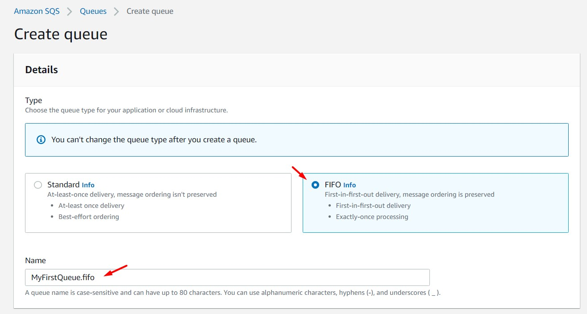
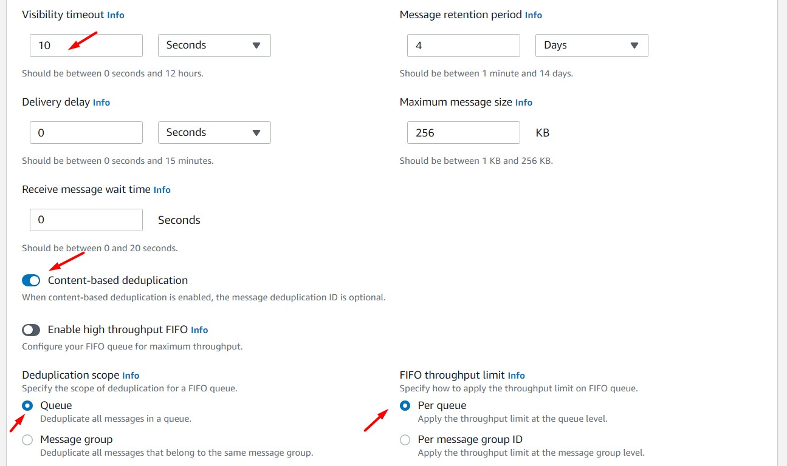

# AWS Solutions Architect Associate - Laboratorio 43

<br>

### Objetivo: 
*  Configuración de un cola SQS FIFO y visualización del orden de envío de los mensajes
*  Configuración de una cola SQS Standard y visualización del orden de envío de los mensajes

### Tópico:
* Application Integration

### Dependencias:
* Ninguno

<br>


---

### A - Configuración de un cola SQS FIFO y visualización del orden de envío de los mensajes

<br>

1. Acceder al servicio AWS Cloud9 y generar un nuevo ambiente de trabajo (Ubuntu 18.04 LTS)

<br>

2. Ejecutar los siguientes comandos en nuestro Cloud9

```bash
#Ubuntu 18.04
sudo apt-get update
sudo apt-get install jq -y
```

<br>

3. Desde la consola de SQS, crear una cola SQS FIFO. Ejecutar los siguientes pasos:

    - Dar clic en "Create SQS"
    - Type: FIFO
    - Name: MyFirstQueue.fifo
    - Configuration:
        - Visibility timeout: 10
    - Content-based deduplication: Enable
    - Deduplication scope: Queue
    - FIFO throughput limit: Per queue
    - Encryption: Por defecto
    - Access Policy: Por defecto
    - Redrive allow policy: Por defecto
    - Dead-letter queue: Por defecto
    - Dar clic en "Create SQS"

<br>



<br>



<br>

4. Desde la consola de SQS, acceder a la cola SQS "MyFirstQueue.fifo". Analizar los atributos de la cola SQS FIFO.

<br>

5. Desde Cloud9, setear las siguientes variables para la cola SQS FIFO

```bash
#Comando
REGION=$(curl -s http://169.254.169.254/latest/meta-data/placement/availability-zone | sed 's/\(.*\)[a-z]/\1/')
aws sqs list-queues --region $REGION | jq -r '.QueueUrls[]'
QUEUEFIFO_URL=$(aws sqs list-queues --region $REGION | jq -r '.QueueUrls[]' | awk 'NR==1{print $1}')
echo $QUEUEFIFO_URL

#Configuración de VisibilityTimeout en 10
aws sqs set-queue-attributes --queue-url $QUEUEFIFO_URL --attributes '{"VisibilityTimeout": "10"}' --region $REGION
```

<br>

6. Enviar los siguientes mensajes a la cola FIFO. 

```bash
#Comando
aws sqs send-message --queue-url $QUEUEFIFO_URL --message-body "Message FIFO 1" --region $REGION --message-group-id 10
aws sqs send-message --queue-url $QUEUEFIFO_URL --message-body "Message FIFO 2" --region $REGION --message-group-id 10
aws sqs send-message --queue-url $QUEUEFIFO_URL --message-body "Message FIFO 3" --region $REGION --message-group-id 10
aws sqs send-message --queue-url $QUEUEFIFO_URL --message-body "Message FIFO 4" --region $REGION --message-group-id 10

#Respuesta
{
    "MD5OfMessageBody": "6432264d145f1888f5102fd81e5d8c9b",
    "MessageId": "c8546f16-05f2-4d96-8ced-9cac7743bd61",
    "SequenceNumber": "37320280831020256512"
}

{
    "MD5OfMessageBody": "919d16d84c344376b0716759de61f725",
    "MessageId": "0a720383-d7b1-4db1-8847-7cae2cbea92e",
    "SequenceNumber": "37320280833279199232"
}

{
    "MD5OfMessageBody": "d49b371bc839ec26603b7ab48ba78771",
    "MessageId": "1a4fca92-5e50-4210-8f23-1903a7ed5d91",
    "SequenceNumber": "37320280833424095744"
}

{
    "MD5OfMessageBody": "dad94965300243f824779de320294839",
    "MessageId": "9a6b1cd1-23b8-4840-aa94-03a8564d50dc",
    "SequenceNumber": "37320280833853663232"
}
```

<br>

7. Para validar el contenido de los mensajes, ejecutar el siguiente comando. En este ejemplo, se visualiza el mensaje "Message FIFO 1" que fue el primer mensaje a entrar en la cola SQS FIFO.

```bash
#Comando
aws sqs receive-message --queue-url $QUEUEFIFO_URL --region $REGION

#Resultado
{
    "Messages": [
        {
            "MessageId": "c8546f16-05f2-4d96-8ced-9cac7743bd61",
            "ReceiptHandle": "AQEBSWXnRFBnRy+vREUXpfGcjTAS2q6dQnvMoUc9G0NP4jsrgnTjNpRbCsSH3zV/iB44vek08CC96GBl6oxeHGnl5XDcOhx6pahjPhigcV3AOu8AguGplpAvtiF2iUfATt0nTc4woIz4qFuYOOc7xRI81kxNARAs+U1UjzCq7OaLhTUCtdTSeK9gxf0MttI7LXdNsbe3ANPxdCpxz1htr3rRKo94TttAhzkkoEOV6O9UvJfQc1uZk9ZWezY8EFLqIKv9f5zMRdbssLYCSWruUm9IEfzdTrR9NQ/OOcvGOPVf8zU=",
            "MD5OfBody": "6432264d145f1888f5102fd81e5d8c9b",
            "Body": "Message FIFO 1"
        }
    ]
}
```

<br>

8. Esperar por lo menos 10 segundos (tiempo configurado en el campo "Visibility timeout"). Ejecutar los siguientes comandos. Ejecutar los siguientes comandos. Estos comandos tienen por objetivo consumir el contenido del mensaje y borrarlo de la cola. Después de ejecutar estos comandos se podrá consumir el contenido del segundo mensaje.

```bash
#Comando
RECEIPT_HANDLE=$(aws sqs receive-message --queue-url $QUEUEFIFO_URL --region $REGION | jq -r '.Messages[] | .ReceiptHandle')
echo $RECEIPT_HANDLE
aws sqs delete-message --queue-url $QUEUEFIFO_URL --region $REGION --receipt-handle $RECEIPT_HANDLE
```

<br>

9. Repetir los pasos 7 y 8. Analizar los resultados. Visualizaremos el consumo de los mensajes según su orden de ingreso: "Message FIFO 1", "Message FIFO 2", "Message FIFO 3" y "Message FIFO 4"

<br>


### B - Configuración de una cola SQS Standard y visualización del orden de envío de los mensajes

<br>

10. Acceder al servicio SQS y creamos una cola Standard SQS ingresando/seleccionando los siguientes valores. Considerar por defecto los otros valores.

    * Type: Standard
    * Name: MyFirstQueue

<br>


<br>


11. Desde Cloud9, setear las siguientes variables para la cola SQS Standard.

```bash
#Comando
REGION=$(curl -s http://169.254.169.254/latest/meta-data/placement/availability-zone | sed 's/\(.*\)[a-z]/\1/')
aws sqs list-queues --region $REGION | jq -r '.QueueUrls[]'
QUEUE_URL=$(aws sqs list-queues --region $REGION | jq -r '.QueueUrls[]' | awk 'NR==1{print $1}')
echo $QUEUE_URL

#Configuración de VisibilityTimeout en 10
aws sqs set-queue-attributes --queue-url $QUEUE_URL --attributes '{"VisibilityTimeout": "10"}' --region $REGION
```

<br>

12. Enviar los siguientes mensajes a la cola Standar. 

```bash
#Comando
aws sqs send-message --queue-url $QUEUE_URL --message-body "Message Standard 1" --region $REGION
aws sqs send-message --queue-url $QUEUE_URL --message-body "Message Standard 2" --region $REGION
aws sqs send-message --queue-url $QUEUE_URL --message-body "Message Standard 3" --region $REGION
aws sqs send-message --queue-url $QUEUE_URL --message-body "Message Standard 4" --region $REGION
```

<br>

13. Para validar el contenido de los mensajes, ejecutar el siguiente comando. En este ejemplo, se visualiza el mensaje "Message Standard 3" que fue el tercer mensaje a entrar en la cola SQS Standard.

```bash
#Comando
aws sqs receive-message --queue-url $QUEUE_URL --region $REGION

#Resultado
{
    "Messages": [
        {
            "MessageId": "90eae39b-2c4f-49db-ba0d-ebc230b25c69",
            "ReceiptHandle": "AQEBQeU4YsCpEkTY3YL/pS8qQzKQFTtrr9t8WRZl/TuuvjGMbWqg63eeeeCZvEabcbuD1ponx9ZXAjs2qCkPpy4tn3XtwLlNGLXAEg0AHiBcHignnqrEVz81hXekUmFjiimSh8B3sRtZWz9s3V9JKAYy33YvdF4WRHw5JO/51Upj8YrgkuxC1LvQTM9B+WL1A+4N4p1u9QY0jbhOhIQAjcluBFKVJrcr/F90VINsoP8Rphcxm7Q1jQCnbfDn8Ll+gzMqyMhGZ8DBpWKKE/bQUQslhqFGB0qlmGWYc11ia/iBk10E/wcWnwNUbDSigmhmo7JGUGsaA8kue23A1RXTxPJsawBTdmQazTlluOyys/CDMBTcvrX/Y//J9MVlhkzmhQ3Euk3DdON6uKhyIIKOJIVk4Q==",
            "MD5OfBody": "1780c90eda48f5cb0a7b912202dd162d",
            "Body": "Message Standard 3"
        }
    ]
}
```

<br>

14. Esperar por lo menos 10 segundos (tiempo configurado en el campo "Visibility timeout"). Ejecutar los siguientes comandos. Estos comandos tienen por objetivo consumir el contenido del mensaje y borrarlo de la cola. Después de ejecutar estos mensajes se podrá consumir el contenido del segundo mensaje.

```bash
#Comando
RECEIPT_HANDLE=$(aws sqs receive-message --queue-url $QUEUE_URL --region $REGION | jq -r '.Messages[] | .ReceiptHandle')
echo $RECEIPT_HANDLE
aws sqs delete-message --queue-url $QUEUE_URL --region $REGION --receipt-handle $RECEIPT_HANDLE
```

<br>

15. Repetir los pasos 13 y 14. Analizar los resultados. Visualizaremos el consumo de los mensajes no según su orden de ingreso (desorden). Este comportamiento es propio de las colas SQS Standard.

<br>

---

### Eliminación de recursos

```bash
#Eliminar Cola SQS "MyFirstQueue"
#Eliminar Cola SQS "MyFirstQueueDLQ"
```
