# AWS Solutions Architect Associate - Laboratorio 44

<br>

### Objetivo: 
*  Creación de un tópico SNS y suscripción de una cola SQS y una función Lambda

### Tópico:
* Application Integration
* Compute

### Dependencias:
* Ninguno

<br>


---

### A - Creación de un tópico SNS y suscripción de una cola SQS y una función Lambda

<br>

1. Desde la consola de SNS, damos clic en el botón "Create topic". Ejecutar los siguientes pasos:
 - Type: Standard
 - Name: MyFirstTopic
 - Dar clic en "Create Topic"

<br>

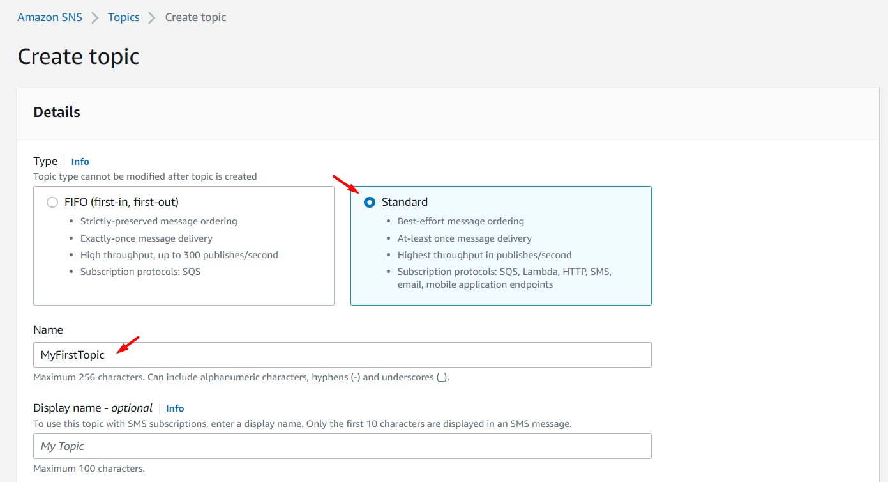

<br>

2. Desde la consola de SQS, damos clic en el botón "Create queue". Ejecutar los siguientes pasos:
 - Type: Standard
 - Name: MyQueue
 - Dar clic en "Create Queue"

<br>

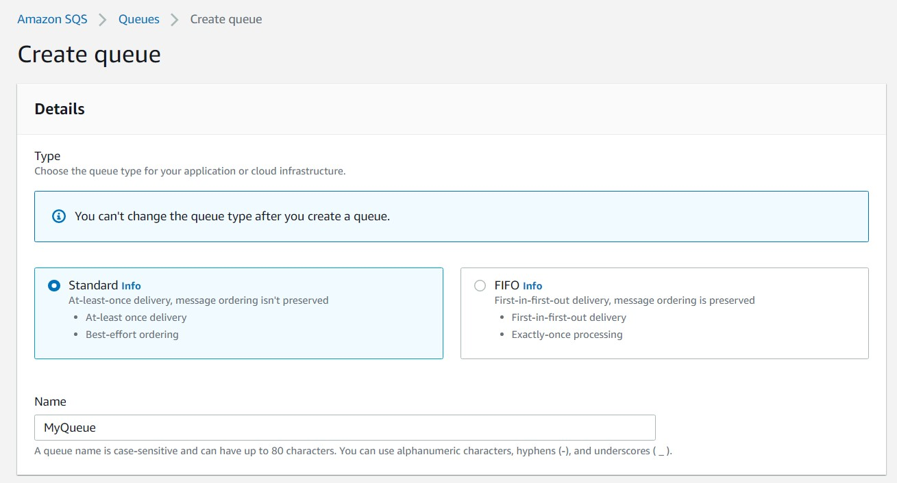

<br>

3. Ingresamos a la SQS "MyQueue" y accedemos al módulo "SNS Subscriptions". Damos clic en el botón "Subscribe to Amazon SNS Topic". Seleccionamos el tópico SNS creado previamente y damos clic en el botón "Save".

<br>

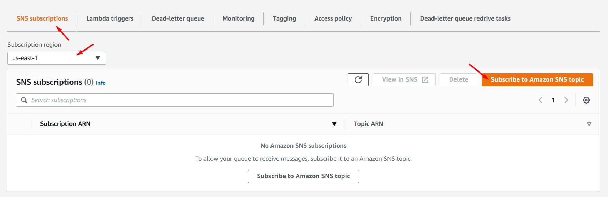

<br>

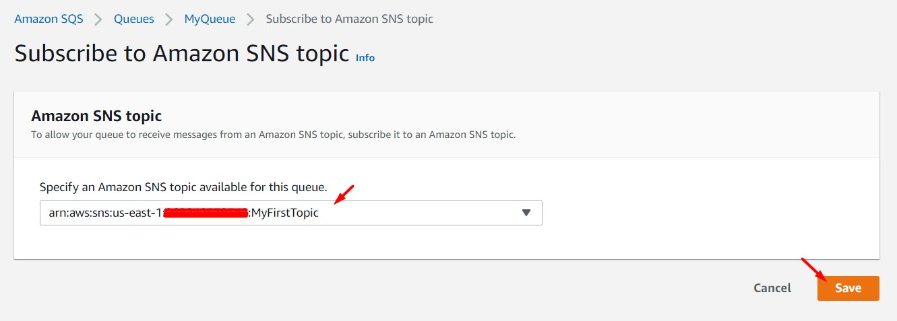

<br>

4. Desde la consola de AWS Lambda, damos clic en el botón "Create Function". Ejecutar los siguientes pasos:
 - Function name: MyLambda
 - Runtime: Python 3.9
 - Architecture: x86_64
 - Permissions: Create a new role with Lambda permissions
 - Dar clic en "Create function"

<br>

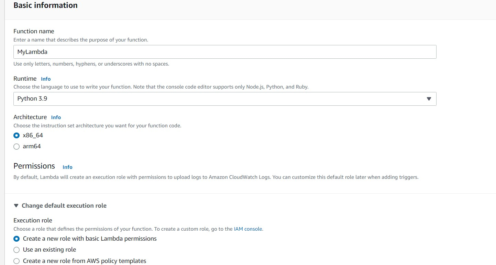

<br>

5. Nuestra función Lambda se aprovisionará con un código python por defecto, reemplazaremos ese código por el siguiente código python. Una vez realizado el cambio dar clic en el botón "Deploy"

```bash
#Código actual
import json

def lambda_handler(event, context):
    # TODO implement
    return {
        'statusCode': 200,
        'body': json.dumps('Hello from Lambda!')
    }
```

<br>

```bash
#Nuevo Código
import json

def lambda_handler(event, context):
    print(event)
    print(context)
```

<br>

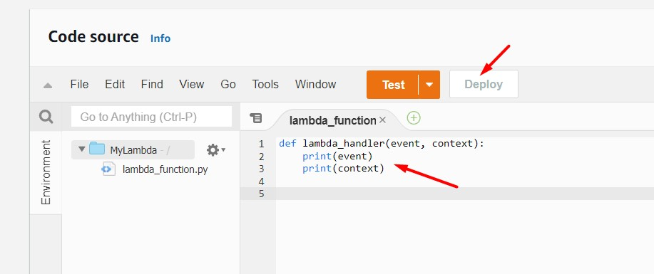

<br>

6. Luego, accedemos al módulo "Configuration" y a la opción "Triggers". Damos clic en la opción "Add trigger". Seleccionamos el servicio de SNS y el tópico SNS previamente generado. Damos clic en el botón "Add" al finalizar.

<br>

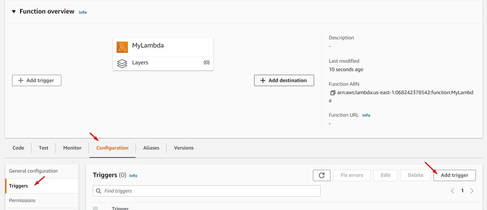

<br>

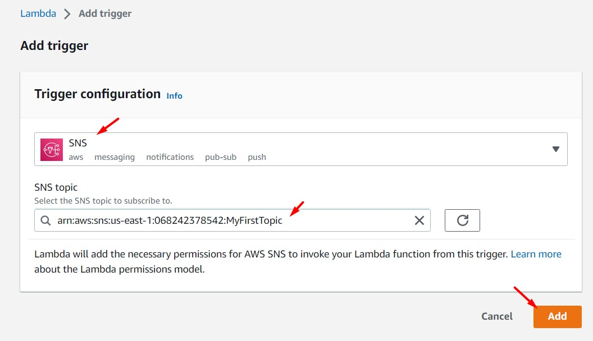

<br>

7. Accedemos a la consola de SNS, ingresamos al tópico "MyFirstTopic" y analizamos el detalle de los siguientes módulos:
 - Subscriptions
 - Access policy
 - Data protection policy
 - Delivery retry policy (HTTP/S)
 - Delivery status logging
 - Encryption
 - Tag

<br>

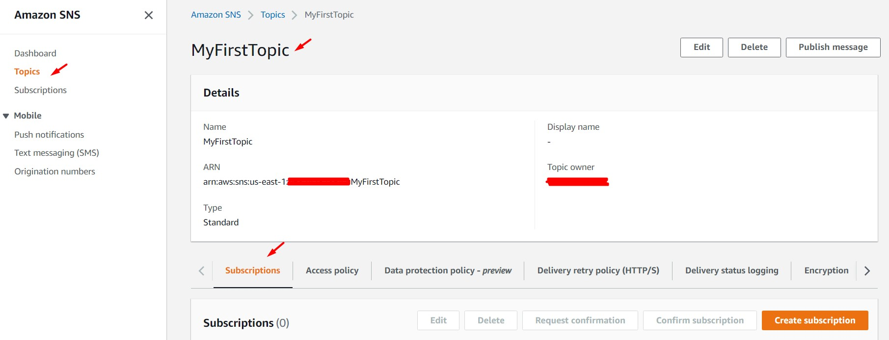

<br>

8. Accedemos a la pestaña "Subscriptions" y validamos la subscripción de los protocolos "LAMBDA" y "SQS"


<br>

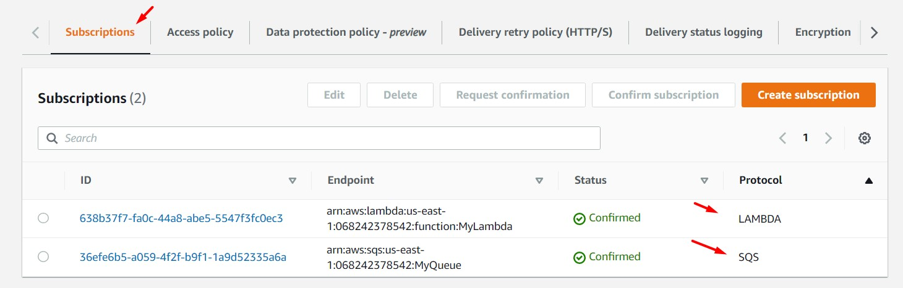

<br>

9. Desde el tópico SNS, damos clic en el botón "Publish message" e ingresamos los siguientes valores. Al finalizar damos clic en el botón "Publish message"
 - Subject - optional: Subject 01
 - Message structure: Identical payload for all delivery protocols. 
 - Message body to send to the endpoint: Message body 01

<br>

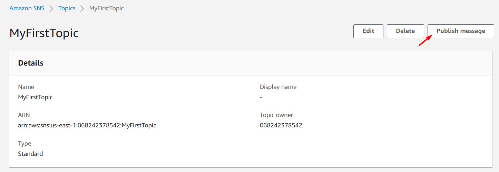

<br>

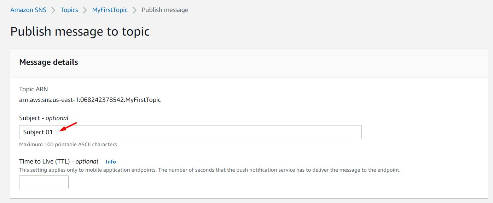

<br>

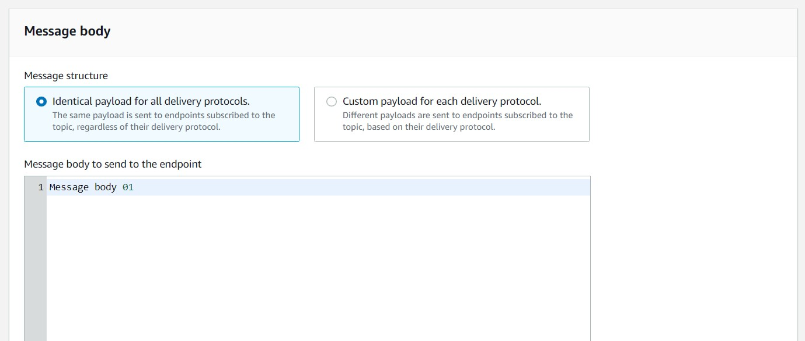

<br>

10. Ingresamos a la cola SQS creada previamente, y validamos que tenemos un mensaje disponible por consumir. Ingresamos al detalle de la cola SQS y procedemos a consumir el mensaje dando clic en el botón "Send and receive message" y luego, desde la sección "Receive messages", clic en el botón "Poll for messages". Damos clic el ID del mensaje y validamos que en el JSON mostrado se encuentre el texto ingresado en el "Subject" y "Message body" anteriormente.

<br>

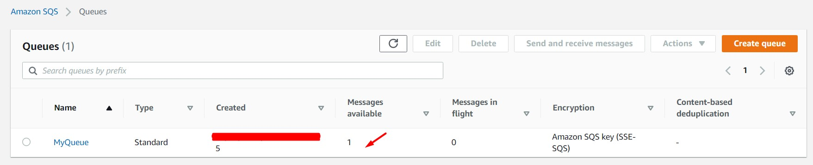

<br>

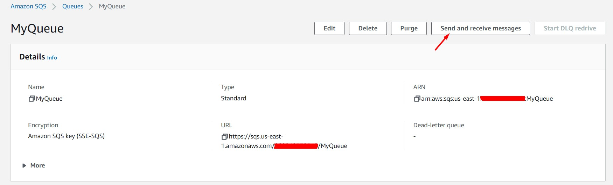

<br>

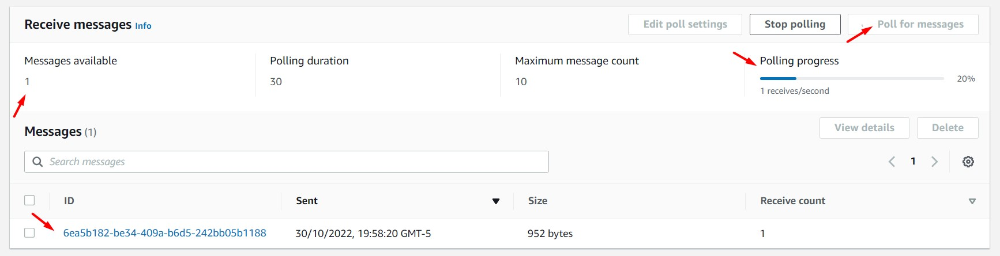

<br>

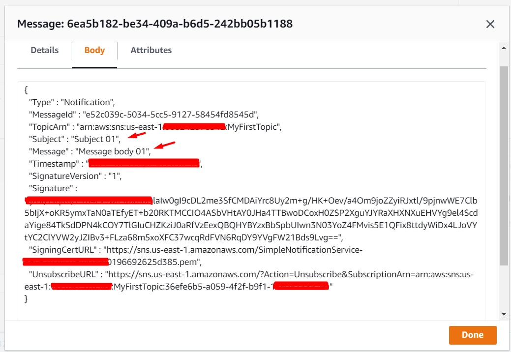

<br>

11. Ingresamos a la función Lambda creada anteriormente, accedemos al módulo "Monitor" y damos clic en el botón "View Logs in CloudWatch". En la nueva ventana, damos clic en el "Log Stream" generado. Validaremos que en el log de la función lambda se han escrito los registros del "event" y "context" declarados en nuestra función. En estos registros encontraremos el "Subject" y "Message body" creados desde el tópico SNS.

<br>

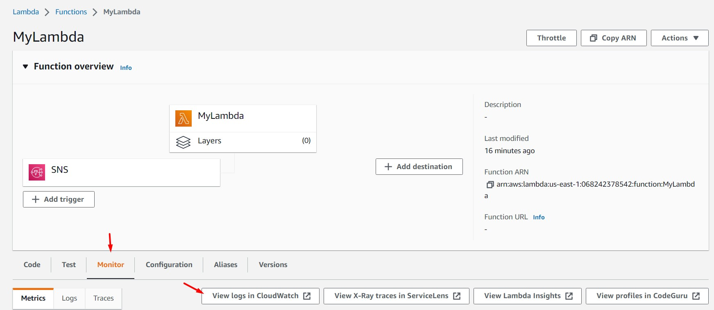

<br>


<br>

```bash
#Log del Event
{'Records': [{'EventSource': 'aws:sns', 'EventVersion': '1.0', 'EventSubscriptionArn': 'arn:aws:sns:us-east-1:XXXXXXXXXXXX:MyFirstTopic:638b37f7-fa0c-44a8-abe5-5547f3fc0ec3', 'Sns': {'Type': 'Notification', 'MessageId': 'e52c039c-5034-5cc5-9127-58454fd8545d', 'TopicArn': 'arn:aws:sns:us-east-1:XXXXXXXXXXXX:MyFirstTopic', 'Subject': 'Subject 01', 'Message': 'Message body 01', 'Timestamp': 'XXXX-XX-XXTXX:XX:XX.XXXZ', 'SignatureVersion': '1', 'Signature': 'ljfGl/fvqK0/Z1B4cvuwlrswknBQlaIw0gI9cDL2me3SfCMDAiYrc8Uy2m+g/HK+Oev/a4Om9joZZyiRJxtl/9pjnwWE7Clb5bIjX+oKR5ymxTaN0aTXXXXX+b20RKTMCCIO4ASbVHtAY0JHa4TTBwoDCoxH0ZSP2XguYJYRaXHXNXuEHVYg9el4ScdaYige84TkSdDPN4kCOY7TlGIuCHZKziJ0aRfVzEexQBQHYBYzxBbSpbUIwn3NXXXXX4FMvis5E1QFix8ttdyWiDx4LJoVYtYC2ClYVW2yJZIBv3+FLza68m5xoXFC37wcqRdFVN6RqDY9YVgFW21Bds9Lvg==', 'SigningCertUrl': 'https://sns.us-east-1.amazonaws.com/SimpleNotificationService-XXXXXXXXXXXXXXX09b0196692625d385.pem', 'UnsubscribeUrl': 'https://sns.us-east-1.amazonaws.com/?Action=Unsubscribe&SubscriptionArn=arn:aws:sns:us-east-1:XXXXXXXXXXXX:MyFirstTopic:638b37f7-fa0c-44a8-abe5-XXXXXXXXXXXX', 'MessageAttributes': {}}}]}

#Log del Context
LambdaContext([aws_request_id=dd44dd31-3123-4312-b971-c383651e77ef,log_group_name=/aws/lambda/MyLambda,log_stream_name=XXXX/XX/XX/[$LATEST]804154831df6428fbd42046ec77596bb,function_name=MyLambda,memory_limit_in_mb=128,function_version=$LATEST,invoked_function_arn=arn:aws:lambda:us-east-1:XXXXXXXXXXXX:function:MyLambda,client_context=None,identity=CognitoIdentity([cognito_identity_id=None,cognito_identity_pool_id=None])])
```

<br>

12. Validamos que el mensaje enviado desde el tópico SNS ha sido recepción tanto por la cola SQS como por la función Lambda.

<br>

---

### Eliminación de recursos

```bash
#Eliminar Tópico SNS "MyFirstTopic"
#Eliminar Cola SQS "MyQueue"
#Eliminar función Lambda "MyLambda"
```
