# AWS Solutions Architect Associate - Laboratorio 45

<br>

### Objetivo: 
*  Creación de una máquina de estado orquestando funciones Lambdas, tablas en DynamoDB e invocaciones con Amazon Rekognition

### Tópico:
* Application Integration
* Compute
* Database
* Machine Learning

### Dependencias:
* Ninguno

<br>


---

### A - Creación de una máquina de estado orquestando funciones Lambdas, tablas en DynamoDB e invocaciones con Amazon Rekognition

<br>


1. Crear un bucket de S3

  - Bucket name: lab45-aws-solutionsarchitectassociate-{ID_ACCOUNT}

<br>

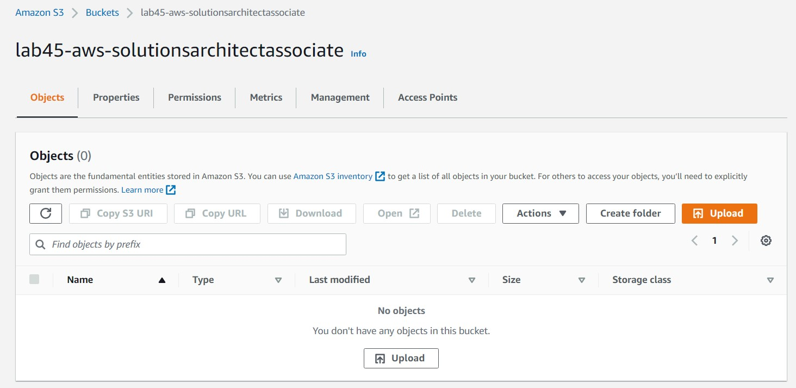

<br>

2. Ir al servicio DynamoDB y generar una tabla:

  * Ingresar al features "Tables", luego dar clic en el botón "Create table"
  * Ingresar los siguientes valores:
    * Table name: StepFunction
    * Partition Key (String): filename
  * Dar clic en el botón "Create Table"

<br>

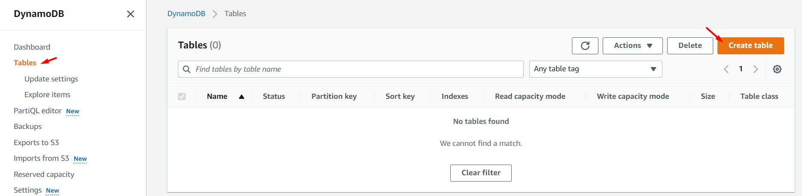

<br>

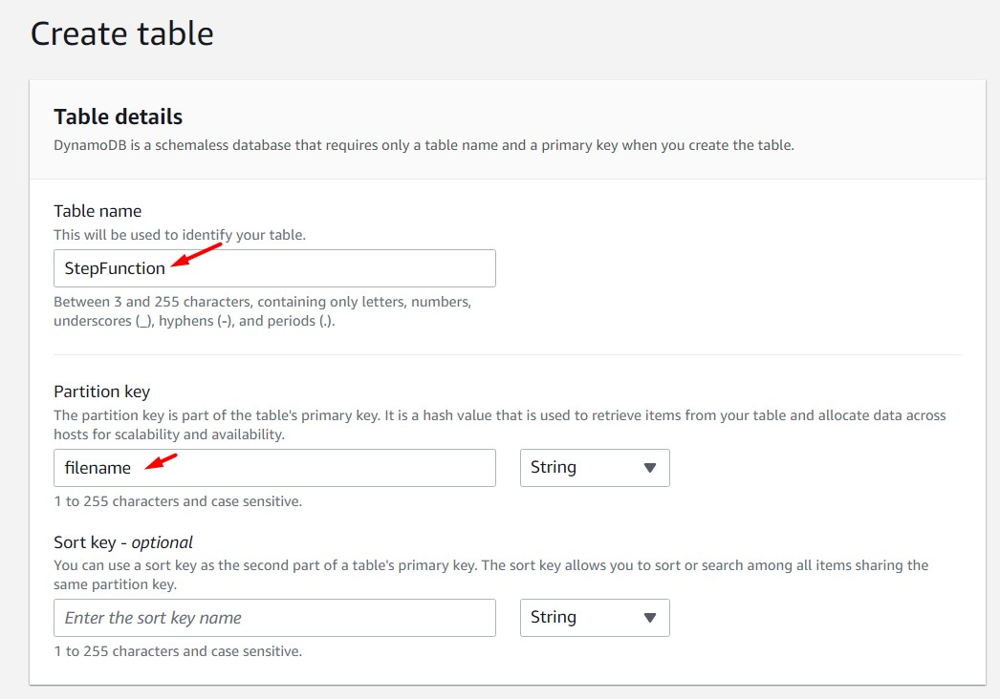

<br>

3. Ir al servicio Lambda y generar dos funciones lambda. La configuración de las funciones Lambda se detalla a continuación

  * Dar clic en la función "Create function" en la creación de cada Lambda.

<br>

4. Sobre el Lambda #01, dar clic en el botón "Create function":

  * Seguir seleccionando la opción "Author from scratch" 
  * Function name: StepFunctionMetadata
  * Runtime: Python 3.9
  * Permissions: 
    * Execution role: Create a new role from AWS policy templates
    * Role name: StepFunctionTranscodeRole
    * Policy templates:
      * Amazon S3 object read-only permissions
      * Simple microservice permissions
  * Dar clic en el botón "Create Function"
  * Copiar el siguiente código python. Reemplazar el valor del campo <REPLACE WITH YOUR TABLE NAME> por el nombre de la tabla DynamoDB creado anteriormente "StepFunction". Luego, dar clic en "Deploy"
  * Obtener el ARN del Lambda #01. P.ej.: arn:aws:lambda:us-east-1:XXXXXXXXXXXX:function:StepFunctionMetadata


<br>

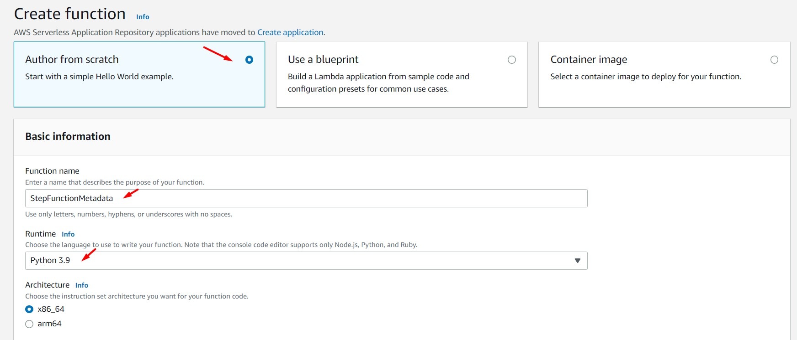

<br>

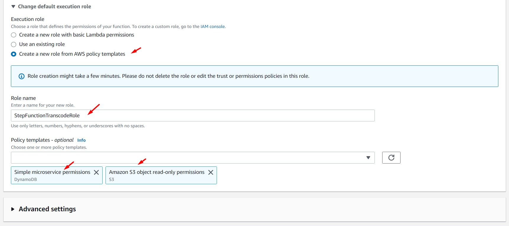

<br>

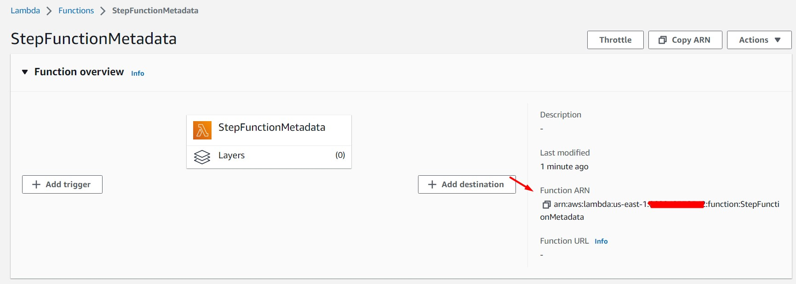

<br>

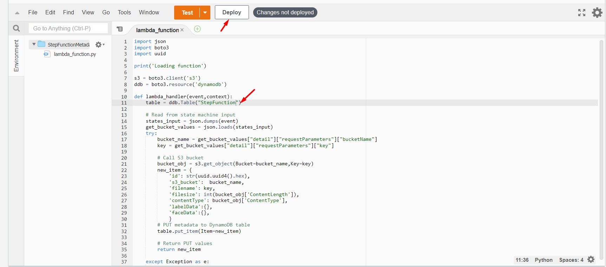

<br>


```bash
import json
import boto3
import uuid

print('Loading function')

s3 = boto3.client('s3')
ddb = boto3.resource('dynamodb')

def lambda_handler(event,context):
    table = ddb.Table("<REPLACE WITH YOUR TABLE NAME>")
    
    # Read from state machine input
    states_input = json.dumps(event)
    get_bucket_values = json.loads(states_input)
    try:
        bucket_name = get_bucket_values["detail"]["requestParameters"]["bucketName"]
        key = get_bucket_values["detail"]["requestParameters"]["key"]
        
        # Call S3 bucket
        bucket_obj = s3.get_object(Bucket=bucket_name,Key=key)
        new_item = {
            'id': str(uuid.uuid4().hex),
            's3_bucket':  bucket_name,
            'filename': key,
            'filesize': int(bucket_obj['ContentLength']),
            'contentType': bucket_obj['ContentType'],
            'labelData':{},
            'faceData':{},
            }
        # PUT metadata to DynamoDB table
        table.put_item(Item=new_item)
        
        # Return PUT values
        return new_item
        
    except Exception as e:
        raise e
```

<br>

5. Sobre el Lambda #02, dar clic en el botón "Create function":

  * Regresar a la sección "Functions" y dar clic en el botón "Create function"
  * Seguir seleccionando la opción "Author from scratch" 
  * Function name: Rekognition
  * Runtime: Python 3.9
  * Permissions: 
    * Execution role: Use an existing role
    * Role name: service-role/StepFunctionTranscodeRole
  * Dar clic en el botón "Create Function"
  * Copiar el siguiente código. Reemplazar el valor del campo <REPLACE WITH YOUR TABLE NAME> por el nombre de la tabla DynamoDB creado anteriormente "StepFunction". Dar clic en "Deploy"
  * Obtener el ARN del Lambda. P.ej.: arn:aws:lambda:us-east-1:XXXXXXXXXXXX:function:Rekognition

<br>

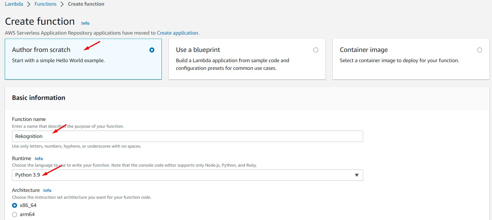

<br>

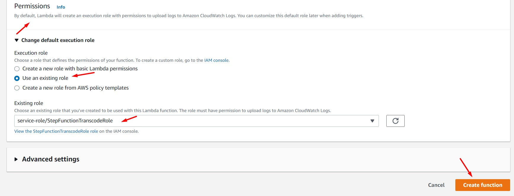

<br>

```bash
import boto3
import json
from decimal import Decimal

print('Loading function')

rekognition = boto3.client('rekognition')
s3 = boto3.client('s3')
ddb = boto3.resource('dynamodb')

# --------------- Helper Functions to call Rekognition APIs ------------------

def detect_faces(bucket, key):
    response = rekognition.detect_faces(Image={"S3Object": {"Bucket": bucket, "Name": key}})
    return response

def detect_labels(bucket, key):
    response = rekognition.detect_labels(Image={"S3Object": {"Bucket": bucket, "Name": key}})
    return response

# --------------- Main handler ------------------

def lambda_handler(event, context):
    '''
    Rekognition APIs to detect faces, labels and index faces in S3 Object.
    '''

    # DynamoDB table
    table = ddb.Table("<REPLACE WITH YOUR TABLE NAME>")
    
    # Get the object from S3
    states_input = json.dumps(event)
    get_input = json.loads(states_input)
    bucket_name = get_input["detail"]["requestParameters"]["bucketName"]
    key = get_input["detail"]["requestParameters"]["key"]
    try:
        # Calls rekognition DetectFaces API to detect faces in S3 object
        face_detect = detect_faces(bucket_name, key)
        faces_map = json.loads(json.dumps(face_detect), parse_float=Decimal)

        # Calls rekognition DetectLabels API to detect labels in S3 object
        label_detect = detect_labels(bucket_name, key)
        labels_map = json.loads(json.dumps(label_detect), parse_float=Decimal)
        
        # update table entry with image data
        table.update_item(
                    Key={
                            'filename': key,
                        },
                        UpdateExpression='set labelData = :label, faceData = :face',
                        ExpressionAttributeValues={
                            ':label': labels_map,
                            ':face':faces_map
                        },
                        ReturnValues="UPDATED_NEW"
                    )

        return faces_map
    except Exception as e:
        print(e)
        raise e
```

<br>

6. Desde el servicio IAM, agregar la política "AmazonRekognitionFullAccess" al rol "StepFunctionTranscodeRole" (creado anteriormente y usado por Lambda) 

<br>

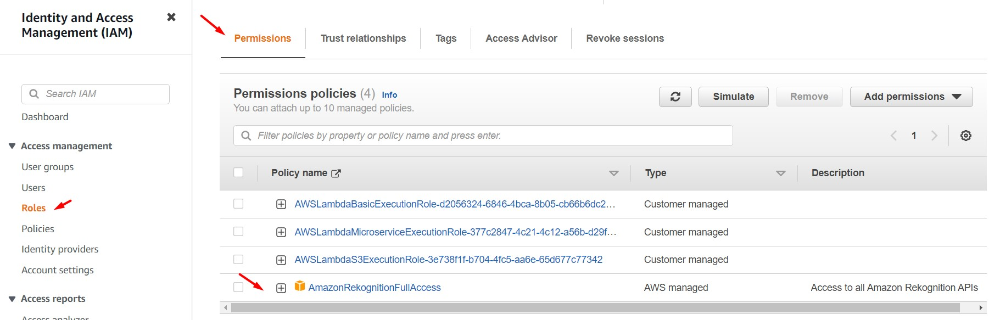

<br>

7. Ir al servicio Step Functions. Ejecutar los siguientes pasos:

  * Ir al features "State machines"
  * Dar clic en "Create state machine"
  * Define state machine: "Write your workflow in code"
  * Type: Standard
  * En la sección "Definition", reemplazar el código mostrado por el siguiente código. Reemplazar el ARN de los Lambdas respectivamente en las variables: "<LAMBDA ARN THAT EXTRACTS METADATA>" y "<LAMBDA ARN THAT CALLS REKOGNITION API>". La variable "LAMBDA ARN THAT EXTRACTS METADATA" corresponde a la función Lambda #01 ("StepFunctionMetadata") y la variable "LAMBDA ARN THAT CALLS REKOGNITION API" corresponde a la función Lambda #02 ("Rekognition")
  * Dar clic en el botón "Next"
  * Name: MyStateMachine
  * Permissions: Create new role
  * Dar clic en el botón "Create state machine"
 
<br>

```bash
{
  "Comment": "Transcode images using AWS Step functions.",
  "StartAt": "Parallel",
  "States": {
    "Parallel": {
      "Type": "Parallel",
      "End": true,
      "Branches": [
        {
          "StartAt": "Lambda-Image metadata",
          "States": {
            "Lambda-Image metadata": {
              "Type": "Task",
              "Resource":

 "<LAMBDA ARN THAT EXTRACTS METADATA>",
              "End": true
            }
          }
        },
        {
          "StartAt": "Wait 10s",
          "States": {
            "Wait 10s": {
              "Type": "Wait",
              "Seconds": 10,
              "Next": "Lambda-Rekognition"
            },
            "Lambda-Rekognition": {
              "Type": "Task",
              "Resource": 

"<LAMBDA ARN THAT CALLS REKOGNITION API>",
              "End": true
            }
          }
        }
      ]
    }
  }
}
```


<br>

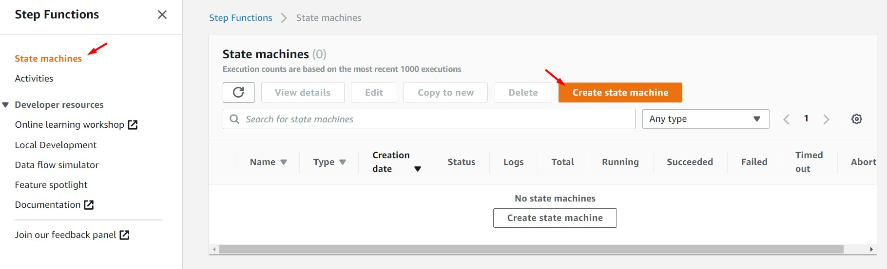

<br>

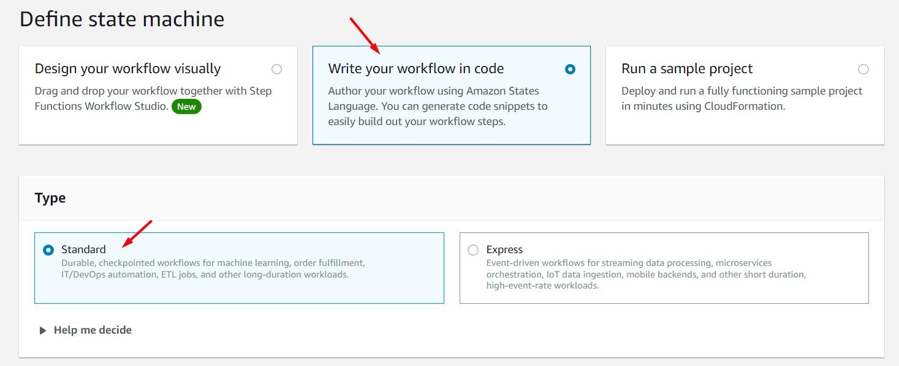

<br>

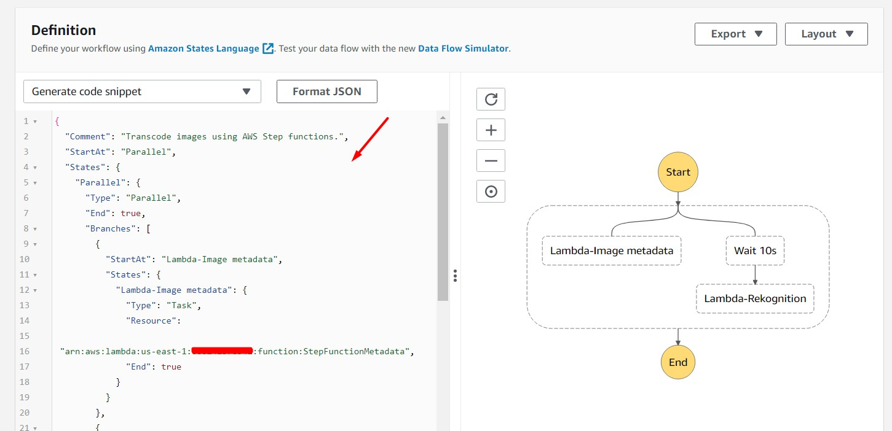

<br>

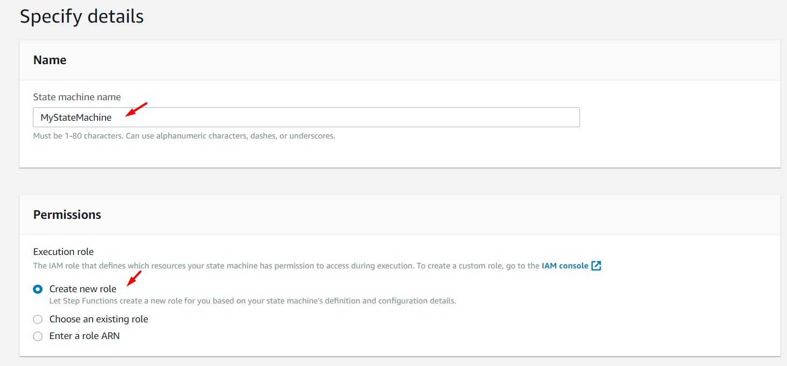

<br>

8. Ir al servicio de CloudTrail. Ejecutar los siguientes pasos:

  * Ir al features "Trails"
  * Dar clic en el botón "Create trail"
  * Ingresar los siguientes valores:
    * Trail name: trail
    * Deshabilitar "Log file SSE-KMS encryption"
    * Deshabilitar "Log file validation"
  * Dar clic en el botón "Next"
  * En la sección "Events", seleccionar la opción "Data events"
  * Dar clic en el botón "Switch to basic event selectors"
  * En la sección "Data event" - "Data event type" seleccionar el valor: S3
  * En la sección "All current and future S3 buckets", deshabilitar la opciones: "Read" y "Write"
  * Ingresar el nombre del bucket creado en el paso 1: "lab45-aws-solutionsarchitectassociate-{ID_ACCOUNT}" 
  * Dar clic en el botón "Next"
  * Dar clic en el botón "Create trail"

<br>

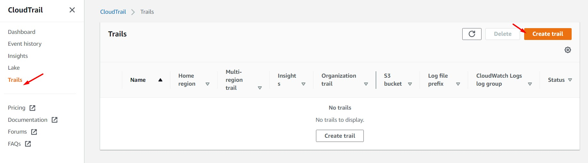

<br>

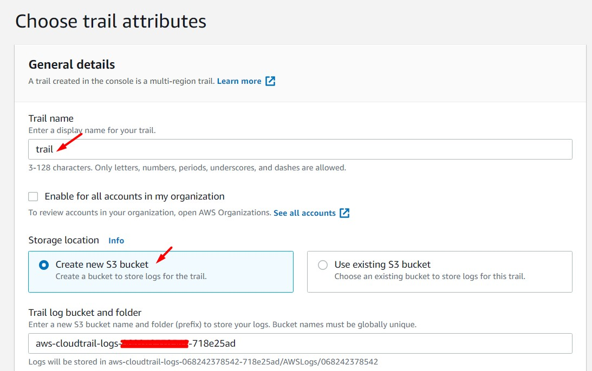

<br>

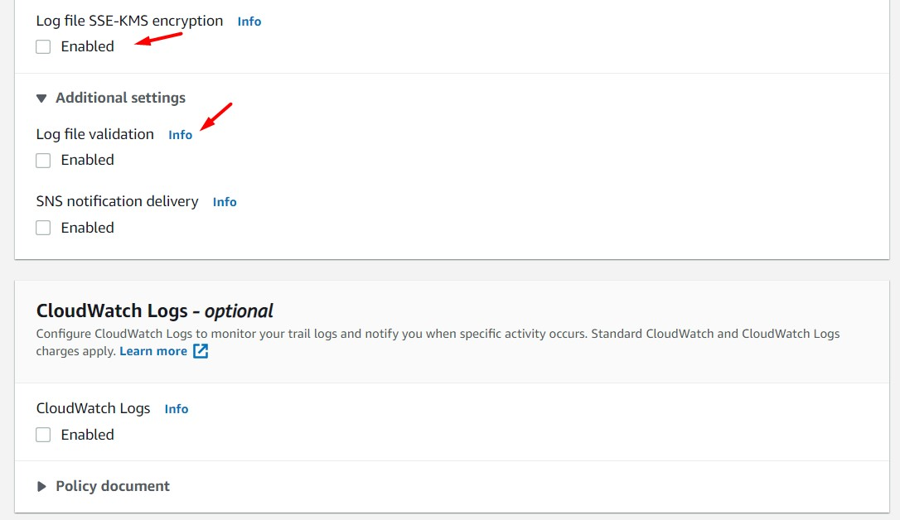

<br>

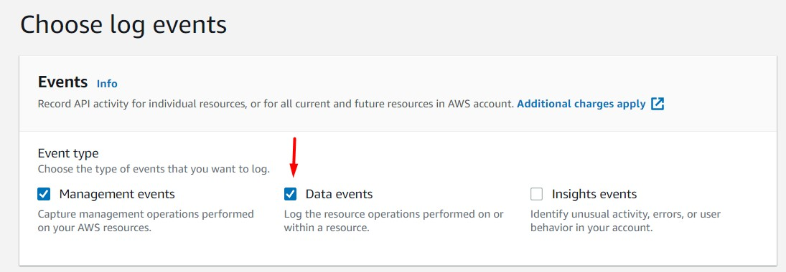

<br>

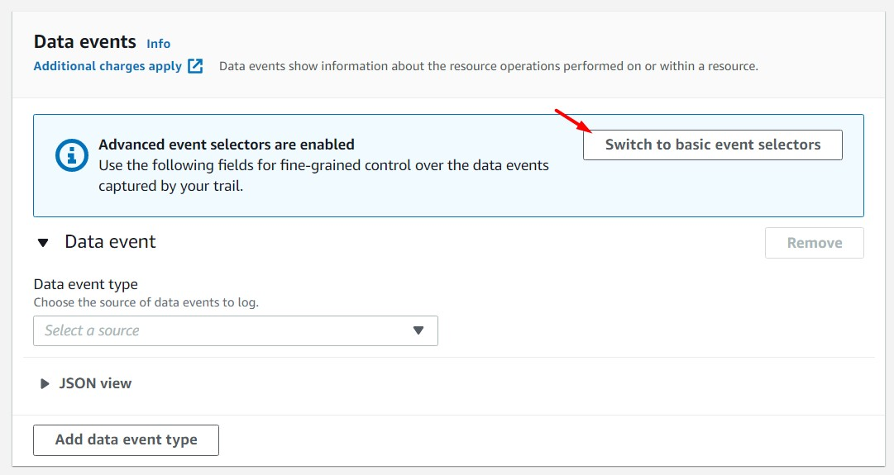

<br>

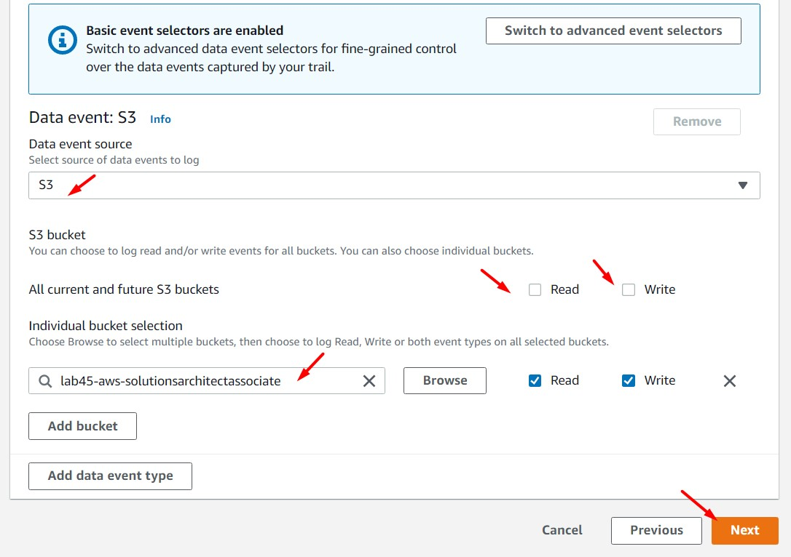

<br>

9. Ir al servicio de Event Bridge. Ejecutar los siguientes pasos:

  * Ir al features "Events" - "Rules"
  * Dar clic en "Create Rule"
  * Ingresar nombre de la regla: "S3PutObject"
  * En la sección "Rule Type", seleccionar "Rule with an event pattern"
  * Dar clic en "Next"
  * En la sección "Event Source", seleccionar:
    * Event source: AWS events or EventBridge partner events
  * En la sección "Event Pattern", seleccionar:
    * Event source: AWS Services
    * AWS Services: Simple Storage Service (S3)
    * Event Type: Object Level API Call via CloudTrail
    * Specific operation(s): Put Object
    * Specific bucket(s) by name: Ingresar nombre del bucket creado en el paso 1 ("lab45-aws-solutionsarchitectassociate-{ID_ACCOUNT}")
    * Dar clic en el botón "Next"
  * En la sección "Select Target(s)", seleccionar:
    * Target Types: "AWS Services"
    * Select a target: "Step Functions state machine"
    * State machine: MyStateMachine
    * Execution Role: "Create a new role for this specific resource"
    * Dar clic en el botón "Next"
  * Dar clic en el botón "Next"
  * Dar clic en el botón "Create rule"

<br>

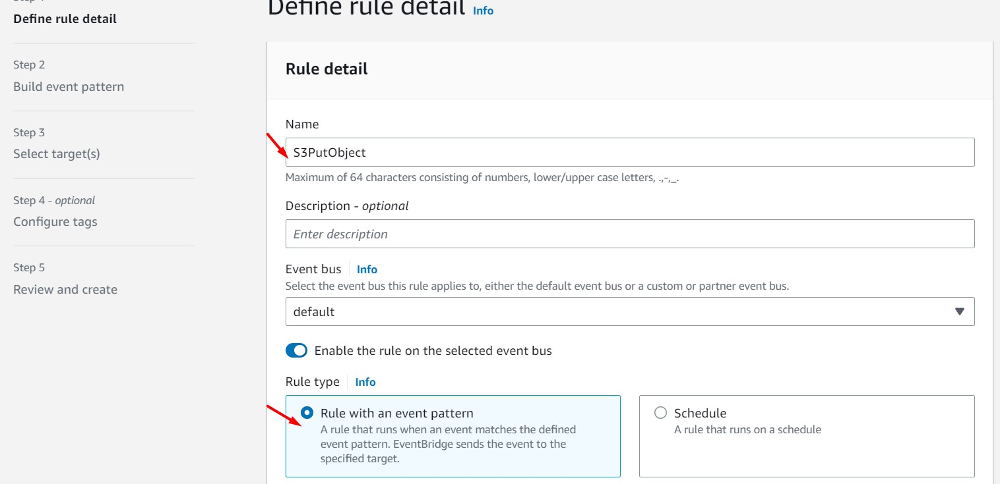

<br>

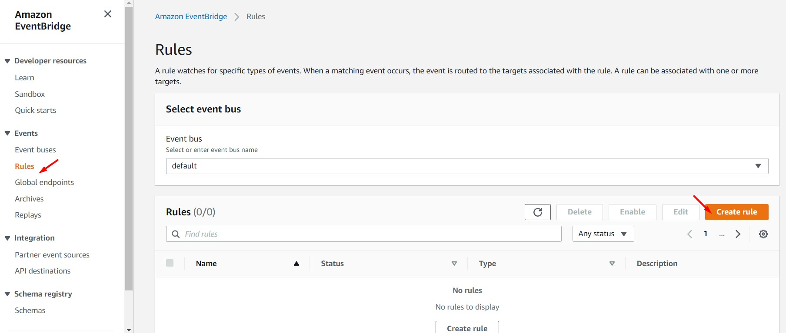

<br>


<br>

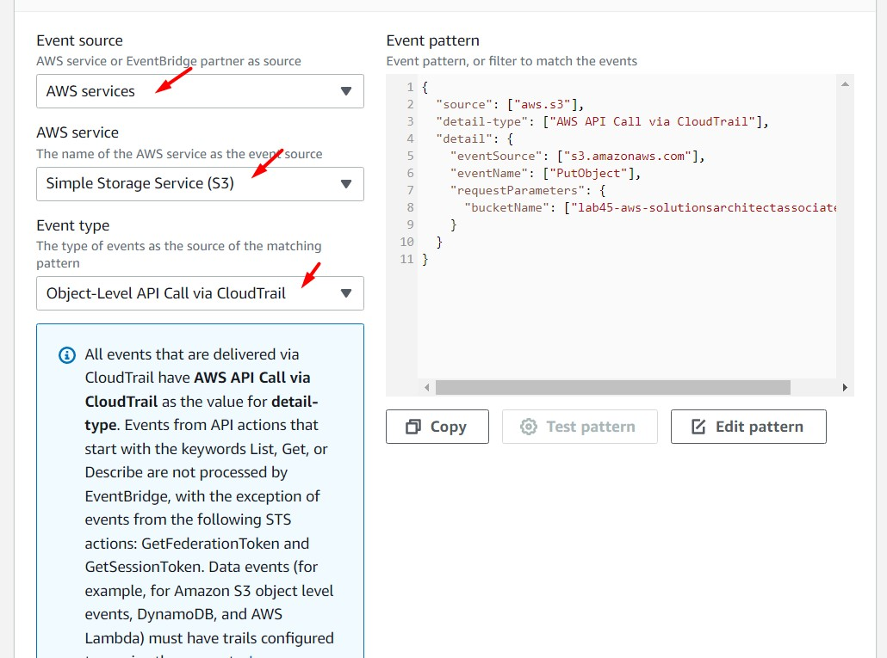

<br>

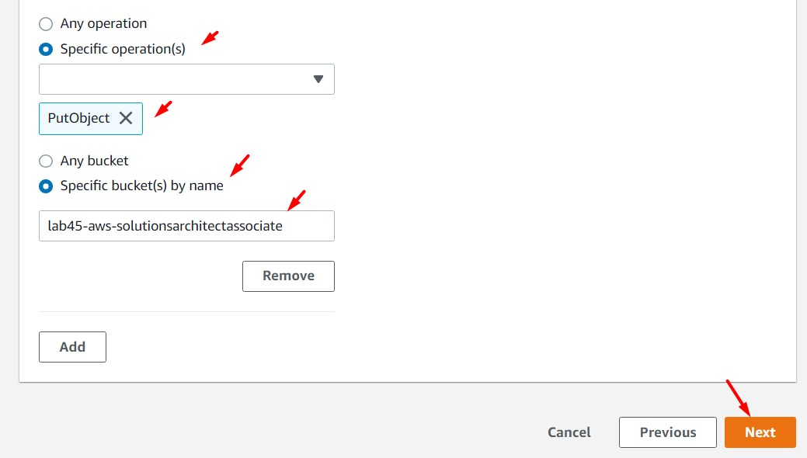

<br>

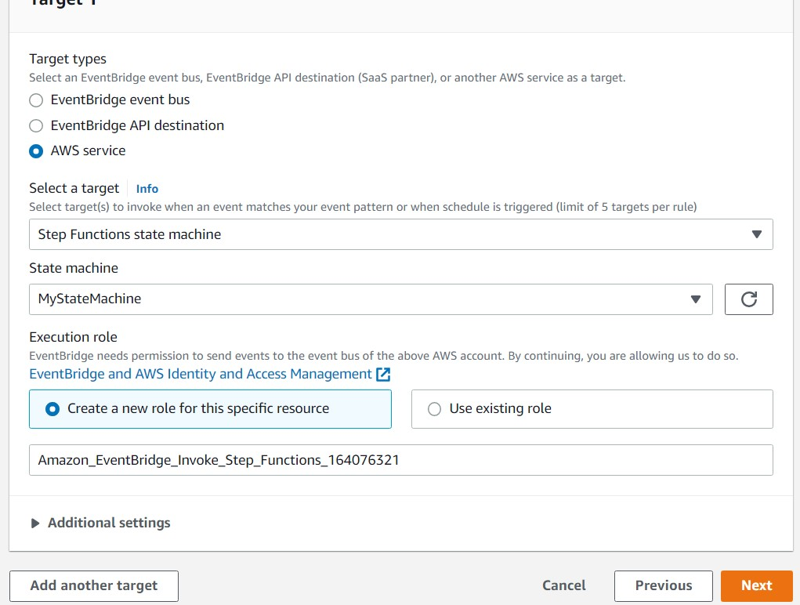

<br>

10. Subir un archivo con extensión .jpg o .png al bucket creado en el punto 1. Finalizada la carga, analizar los siguientes servicios: Step Functions y DynamoDB (Explore Item). En la carpeta "code" encontramos el archivo "test-mujer-feliz-personas-sonriendo.png", el cual podemos usar para subirlo al bucket S3. En el JSON detallado a continuación (obtenido de DynamoDB) nos muestra como resultado una confianza del "99.95947265625%" para "Thumbs Up" (pulgares hacia arriba). La imagen "test-mujer-feliz-personas-sonriendo.png" corresponde a una mujer con los pulgares arriba.

<br>

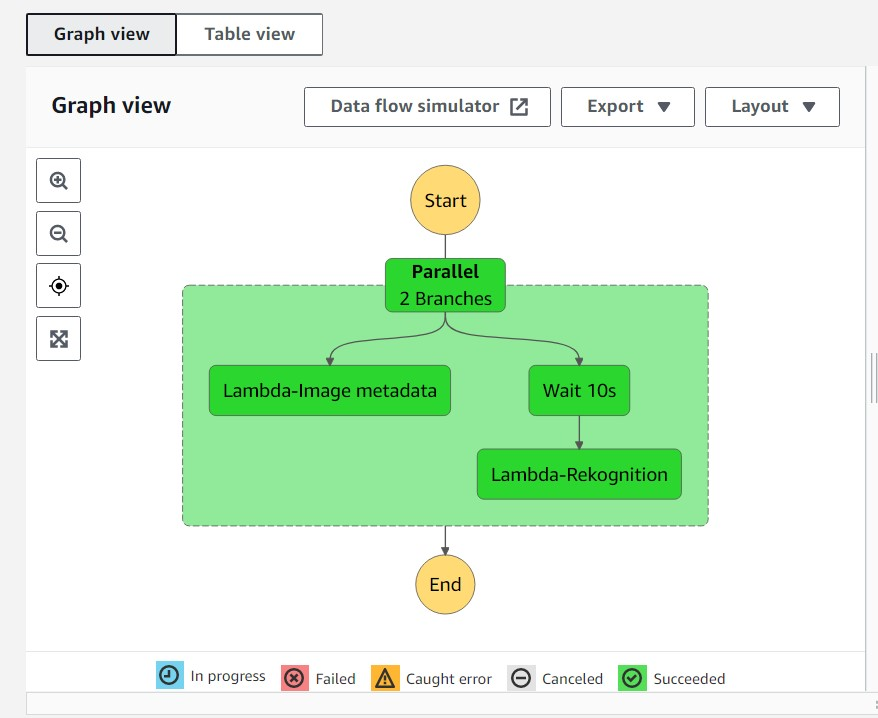

<br>

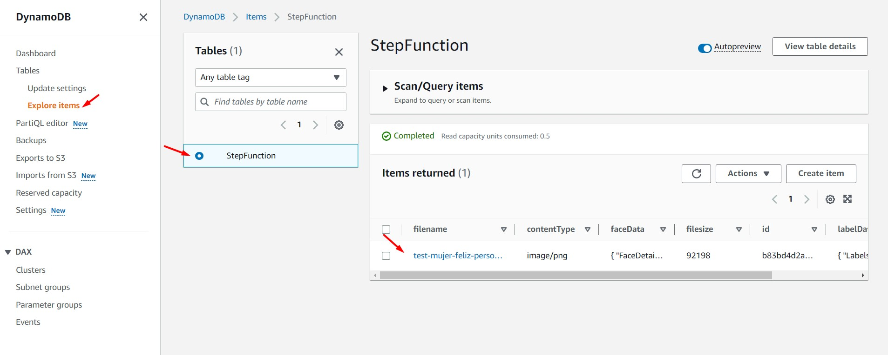

<br>

```bash
#Valor almacenado en la tabla "StepFunction" en DynamoDB
{
 "filename": "test-mujer-feliz-personas-sonriendo.png",
 "contentType": "image/png",
 "faceData": {
  "FaceDetails": [
   {
    "BoundingBox": {
     "Height": 0.35485562682151794,
     "Left": 0.43371105194091797,
     "Top": 0.168094664812088,
     "Width": 0.13004638254642487
    },
    "Confidence": 99.99934387207031,
    "Landmarks": [
     {
      "Type": "eyeLeft",
      "X": 0.4723913371562958,
      "Y": 0.2943175733089447
     },
     {
      "Type": "eyeRight",
      "X": 0.531986653804779,
      "Y": 0.30064448714256287
     },
     {
      "Type": "mouthLeft",
      "X": 0.47374483942985535,
      "Y": 0.414208322763443
     },
     {
      "Type": "mouthRight",
      "X": 0.5234954357147217,
      "Y": 0.4196329712867737
     },
     {
      "Type": "nose",
      "X": 0.5005066394805908,
      "Y": 0.3596991002559662
     }
    ],
    "Pose": {
     "Pitch": 2.481752872467041,
     "Roll": 3.1452789306640625,
     "Yaw": 1.0953201055526733
    },
    "Quality": {
     "Brightness": 81.32447814941406,
     "Sharpness": 73.32209777832031
    }
   }
  ],
  "ResponseMetadata": {
   "HTTPHeaders": {
    "content-length": "675",
    "content-type": "application/x-amz-json-1.1",
    "date": "XXXXXXXXXX",
    "x-amzn-requestid": "7ea4cfdb-b5a8-4f1f-8a75-a419f67513ec"
   },
   "HTTPStatusCode": 200,
   "RequestId": "7ea4cfdb-b5a8-4f1f-8a75-a419f67513ec",
   "RetryAttempts": 0
  }
 },
 "filesize": 92198,
 "id": "b83bd4d2a5244205b72cf11becae3db3",
 "labelData": {
  "LabelModelVersion": "2.0",
  "Labels": [
   {
    "Confidence": 99.95947265625,
    "Instances": [
    ],
    "Name": "Thumbs Up",
    "Parents": [
     {
      "Name": "Person"
     },
     {
      "Name": "Finger"
     }
    ]
   },
   {
    "Confidence": 99.95947265625,
    "Instances": [
    ],
    "Name": "Finger",
    "Parents": [
    ]
   },
   {
    "Confidence": 99.95947265625,
    "Instances": [
     {
      "BoundingBox": {
       "Height": 0.8261223435401917,
       "Left": 0.19354106485843658,
       "Top": 0.09280358254909515,
       "Width": 0.6131799221038818
      },
      "Confidence": 99.04866790771484
     }
    ],
    "Name": "Person",
    "Parents": [
    ]
   },
   {
    "Confidence": 99.95947265625,
    "Instances": [
    ],
    "Name": "Human",
    "Parents": [
    ]
   },
   {
    "Confidence": 77.9282455444336,
    "Instances": [
    ],
    "Name": "Face",
    "Parents": [
     {
      "Name": "Person"
     }
    ]
   }
  ],
  "ResponseMetadata": {
   "HTTPHeaders": {
    "content-length": "618",
    "content-type": "application/x-amz-json-1.1",
    "date": "Mon, 31 Oct 2022 03:55:41 GMT",
    "x-amzn-requestid": "20727a3f-ef34-40ac-b18d-d720bd2dc536"
   },
   "HTTPStatusCode": 200,
   "RequestId": "20727a3f-ef34-40ac-b18d-d720bd2dc536",
   "RetryAttempts": 0
  }
 },
 "s3_bucket": "lab45-aws-solutionsarchitectassociate"
}
```

---

### Eliminación de recursos

```bash
#Eliminar 02 funciones Lambda: "StepFunctionMetadata" y "Rekognition"
#Eliminar Bucket S3 "lab45-aws-solutionsarchitectassociate"
#Eliminar Step Function "MyStateMachine"
#Eliminar trail de CloudTrail
#Eliminar IAM Role "StepFunctionTranscodeRole"
#Eliminar Tabla DynamoDB "StepFunction"
#Eliminar EventBridge Rules "S3PutObject"
```
